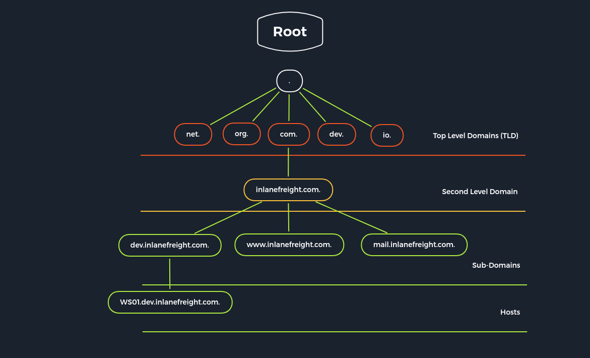

# DNS

El Sistema de Nombres de Dominio (DNS, por sus siglas en inglés) es una parte integral de Internet. A través de nombres de dominio como _academy.hackthebox.com_ o [_www.hackthebox.com_](http://www.hackthebox.com), podemos acceder a servidores web que el proveedor de hosting ha asignado a una o más direcciones IP específicas. El DNS es un sistema para resolver nombres de computadoras en direcciones IP y no tiene una base de datos central. Simplificadamente, podemos imaginarlo como una biblioteca con muchos directorios telefónicos diferentes. La información está distribuida entre miles de servidores de nombres. Los servidores DNS distribuidos globalmente traducen los nombres de dominio en direcciones IP y controlan qué servidor un usuario puede alcanzar a través de un dominio particular. Existen varios tipos de servidores DNS utilizados a nivel mundial:

* Servidor raíz DNS
* Servidor de nombres autoritativo
* Servidor de nombres no autoritativo
* Servidor de caché
* Servidor de reenvío
* Resolver

**Tipos de servidores DNS y su descripción:**

| Tipo de Servidor                      | Descripción                                                                                                                                                                                                                                                                                                                                                                                                                                                                                    |
| ------------------------------------- | ---------------------------------------------------------------------------------------------------------------------------------------------------------------------------------------------------------------------------------------------------------------------------------------------------------------------------------------------------------------------------------------------------------------------------------------------------------------------------------------------- |
| **Servidor Raíz DNS**                 | Los servidores raíz del DNS son responsables de los dominios de nivel superior (TLD). Como última instancia, solo se les solicita si el servidor de nombres no responde. Así, un servidor raíz es una interfaz central entre los usuarios y el contenido en Internet, ya que vincula dominios y direcciones IP. La Corporación de Internet para la Asignación de Nombres y Números (ICANN) coordina el trabajo de los servidores de nombres raíz. Hay 13 de estos servidores en todo el mundo. |
| **Servidor de Nombres Autorizado**    | Los servidores de nombres autoritativos tienen autoridad sobre una zona particular. Solo responden consultas dentro de su área de responsabilidad, y su información es vinculante. Si un servidor de nombres autorizado no puede responder la consulta de un cliente, el servidor raíz toma el control en ese punto.                                                                                                                                                                           |
| **Servidor de Nombres No Autorizado** | Los servidores de nombres no autorizados no son responsables de una zona DNS en particular. En su lugar, recopilan información sobre zonas DNS específicas utilizando consultas DNS recursivas o iterativas.                                                                                                                                                                                                                                                                                   |
| **Servidor de Caché DNS**             | Los servidores de caché DNS almacenan información de otros servidores de nombres durante un periodo específico. El servidor de nombres autorizado determina la duración de este almacenamiento.                                                                                                                                                                                                                                                                                                |
| **Servidor de Reenvío**               | Los servidores de reenvío solo realizan una función: reenvían consultas DNS a otro servidor DNS.                                                                                                                                                                                                                                                                                                                                                                                               |
| **Resolver**                          | Los resolvers no son servidores DNS autorizados, pero realizan la resolución de nombres localmente en la computadora o el enrutador.                                                                                                                                                                                                                                                                                                                                                           |

El DNS generalmente no está cifrado. Esto significa que dispositivos en la red local (WLAN) y proveedores de Internet pueden interceptar y espiar consultas DNS, lo cual representa un riesgo de privacidad. Por esta razón, existen soluciones para cifrar el tráfico DNS. Por defecto, los profesionales de seguridad de TI aplican **DNS sobre TLS (DoT)** o **DNS sobre HTTPS (DoH)**. Además, el protocolo de red **DNSCrypt** también cifra el tráfico entre la computadora y el servidor de nombres.

El DNS no solo vincula nombres de computadoras con direcciones IP, sino que también almacena y proporciona información adicional sobre los servicios asociados a un dominio. Por ejemplo, una consulta DNS también puede utilizarse para determinar qué computadora sirve como servidor de correo electrónico para el dominio en cuestión o cuáles son los servidores de nombres del dominio.

<figure><figcaption></figcaption></figure>

Diferentes tipos de registros DNS se utilizan para las consultas DNS, cada uno con distintas tareas. Además, existen entradas separadas para diferentes funciones, ya que podemos configurar servidores de correo y otros servidores para un dominio.

| **Registro DNS** | **Descripción**                                                                                                                                                                                                                                                                                           |
| ---------------- | --------------------------------------------------------------------------------------------------------------------------------------------------------------------------------------------------------------------------------------------------------------------------------------------------------- |
| **A**            | Devuelve una dirección IPv4 del dominio solicitado como resultado.                                                                                                                                                                                                                                        |
| **AAAA**         | Devuelve una dirección IPv6 del dominio solicitado.                                                                                                                                                                                                                                                       |
| **MX**           | Devuelve los servidores de correo responsables como resultado.                                                                                                                                                                                                                                            |
| **NS**           | Devuelve los servidores DNS (servidores de nombres) del dominio.                                                                                                                                                                                                                                          |
| **TXT**          | Este registro puede contener diversa información. Se puede usar, por ejemplo, para validar la Google Search Console o certificar certificados SSL. Además, se configuran entradas SPF y DMARC para validar el tráfico de correo y protegerlo del spam.                                                    |
| **CNAME**        | Este registro sirve como un alias para otro nombre de dominio. Si deseas que el dominio [_www.hackthebox.eu_](http://www.hackthebox.eu) apunte a la misma IP que _hackthebox.eu_, se crearía un registro A para _hackthebox.eu_ y un registro CNAME para [_www.hackthebox.eu_](http://www.hackthebox.eu). |
| **PTR**          | El registro PTR funciona de manera inversa (búsqueda inversa). Convierte direcciones IP en nombres de dominio válidos.                                                                                                                                                                                    |
| **SOA**          | Proporciona información sobre la zona DNS correspondiente y la dirección de correo electrónico del contacto administrativo.                                                                                                                                                                               |

El registro **SOA** se encuentra en el archivo de zona de un dominio y especifica quién es responsable de la operación del dominio y cómo se maneja la información DNS para dicho dominio.

**Ejemplo:**

```bash
sherlock28@htb[/htb]$ dig soa www.inlanefreight.com
```

**Respuesta:**

```bash
inlanefreight.com.      900     IN      SOA     ns-161.awsdns-20.com. awsdns-hostmaster.amazon.com. 1 7200 900 1209600 86400
```

En este ejemplo, la dirección de correo electrónico del administrador es `awsdns-hostmaster@amazon.com` (el punto `.` se reemplaza por una arroba `@`).

## Configuración DNS por Defecto

Existen muchos tipos diferentes de configuraciones DNS, pero discutiremos solo las más importantes desde un punto de vista administrativo. Todos los servidores DNS funcionan con tres tipos de archivos de configuración:

* Archivos de configuración local de DNS
* Archivos de zona
* Archivos de resolución de nombres inversos

En distribuciones basadas en Linux, el servidor DNS **Bind9** es muy utilizado. Su archivo de configuración local (**named.conf**) está dividido en dos secciones: la sección de **opciones** para configuraciones generales y las entradas de **zonas** para los dominios individuales. Los archivos de configuración locales suelen ser:

* `named.conf.local`
* `named.conf.options`
* `named.conf.log`

### **Configuración local DNS:**

```bash
root@bind9:~# cat /etc/bind/named.conf.local
zone "domain.com" {
    type master;
    file "/etc/bind/db.domain.com";
    allow-update { key rndc-key; };
};
```

En este archivo, definimos las diferentes zonas. Estas zonas están divididas en archivos individuales, generalmente para un solo dominio. Un archivo de zona es un archivo de texto que describe una zona DNS en formato BIND.

### **Archivo de zona:**

```bash
root@bind9:~# cat /etc/bind/db.domain.com
$ORIGIN domain.com
$TTL 86400
@     IN     SOA    dns1.domain.com.     hostmaster.domain.com. (
                    2001062501 ; serial
                    21600      ; refresh after 6 hours
                    3600       ; retry after 1 hour
                    604800     ; expire after 1 week
                    86400 )    ; minimum TTL of 1 day

      IN     NS     ns1.domain.com.
      IN     NS     ns2.domain.com.

      IN     MX     10     mx.domain.com.
      IN     MX     20     mx2.domain.com.

             IN     A       10.129.14.5

server1      IN     A       10.129.14.5
server2      IN     A       10.129.14.7
ns1          IN     A       10.129.14.2
ns2          IN     A       10.129.14.3

ftp          IN     CNAME   server1
mx           IN     CNAME   server1
mx2          IN     CNAME   server2
www          IN     CNAME   server2
```

Para que la dirección IP sea resuelta desde el nombre de dominio completo (**FQDN**), el servidor DNS debe tener un archivo de búsqueda inversa. Este archivo asigna el nombre del equipo (FQDN) al último octeto de la dirección IP, que corresponde al host respectivo, utilizando un registro PTR.

El registro **PTR** es responsable de la traducción inversa de direcciones IP en nombres.

### **Archivo de zona inversa:**

```bash
root@bind9:~# cat /etc/bind/db.10.129.14

;
; Archivo de datos inverso de BIND para la interfaz de loopback local
;
$ORIGIN 14.129.10.in-addr.arpa
$TTL 86400
@     IN     SOA    dns1.domain.com.     hostmaster.domain.com. (
                    2001062501 ; serial
                    21600      ; refrescar después de 6 horas
                    3600       ; reintentar después de 1 hora
                    604800     ; expirar después de 1 semana
                    86400 )    ; TTL mínimo de 1 día

      IN     NS     ns1.domain.com.
      IN     NS     ns2.domain.com.

5    IN     PTR    server1.domain.com.
7    IN     MX     mx.domain.com.
...SNIP...
```

## Configuraciones Peligrosas

Existen diversas maneras en las que un servidor DNS puede ser atacado. Por ejemplo, una lista de vulnerabilidades dirigidas al servidor BIND9 puede encontrarse en [CVEdetails](https://www.cvedetails.com/). Además, [SecurityTrails](https://securitytrails.com/) ofrece una breve lista de los ataques más comunes a los servidores DNS.

Algunas de las configuraciones que se muestran a continuación pueden llevar a estas vulnerabilidades, entre otras. El servicio DNS puede volverse muy complejo, y es fácil que se cometan errores que obliguen al administrador a implementar soluciones temporales hasta encontrar una solución definitiva. Esto a menudo lleva a que se priorice la funcionalidad sobre la seguridad, lo que ocasiona configuraciones incorrectas y vulnerabilidades.

| Opción            | Descripción                                                                                |
| ----------------- | ------------------------------------------------------------------------------------------ |
| `allow-query`     | Define qué hosts tienen permiso para enviar solicitudes al servidor DNS.                   |
| `allow-recursion` | Define qué hosts tienen permiso para enviar solicitudes recursivas al servidor DNS.        |
| `allow-transfer`  | Define qué hosts tienen permiso para recibir transferencias de zona desde el servidor DNS. |
| `zone-statistics` | Recopila datos estadísticos de las zonas.                                                  |

Estas configuraciones deben manejarse con cuidado, ya que configuraciones incorrectas pueden abrir puertas a posibles ataques o fugas de información en el sistema DNS.

## Footprinting the Service

El footprinting en servidores DNS se realiza como resultado de las solicitudes que enviamos. En primer lugar, se puede consultar al servidor DNS qué otros servidores de nombres son conocidos. Para ello, utilizamos el registro NS y la especificación del servidor DNS que queremos consultar usando el carácter `@`. Esto se debe a que, si existen otros servidores DNS, también podemos utilizarlos y consultar los registros. Sin embargo, es posible que otros servidores DNS estén configurados de manera diferente y, además, podrían ser permanentes para otras zonas.

### **Consulta NS con DIG**

```bash
sherlock28@htb[/htb]$ dig ns inlanefreight.htb @10.129.14.128

; <<>> DiG 9.16.1-Ubuntu <<>> ns inlanefreight.htb @10.129.14.128
;; global options: +cmd
;; Got answer:
;; ->>HEADER<<- opcode: QUERY, status: NOERROR, id: 45010
;; flags: qr aa rd ra; QUERY: 1, ANSWER: 1, AUTHORITY: 0, ADDITIONAL: 2

;; OPT PSEUDOSECTION:
; EDNS: version: 0, flags:; udp: 4096
; COOKIE: ce4d8681b32abaea0100000061475f73842c401c391690c7 (good)
;; QUESTION SECTION:
;inlanefreight.htb.             IN      NS

;; ANSWER SECTION:
inlanefreight.htb.      604800  IN      NS      ns.inlanefreight.htb.

;; ADDITIONAL SECTION:
ns.inlanefreight.htb.   604800  IN      A       10.129.34.136

;; Query time: 0 msec
;; SERVER: 10.129.14.128#53(10.129.14.128)
;; WHEN: Sun Sep 19 18:04:03 CEST 2021
;; MSG SIZE  rcvd: 107
```

A veces, también es posible consultar la versión de un servidor DNS utilizando una consulta de clase `CHAOS` y tipo `TXT`. Sin embargo, esta entrada debe existir en el servidor DNS. Para ello, podríamos usar el siguiente comando:

### **Consulta de Versión con DIG**

```bash
sherlock28@htb[/htb]$ dig CH TXT version.bind 10.129.120.85

; <<>> DiG 9.10.6 <<>> CH TXT version.bind
;; global options: +cmd
;; Got answer:
;; ->>HEADER<<- opcode: QUERY, status: NOERROR, id: 47786
;; flags: qr aa rd; QUERY: 1, ANSWER: 1, AUTHORITY: 0, ADDITIONAL: 1

;; ANSWER SECTION:
version.bind.       0       CH      TXT     "9.10.6-P1"

;; ADDITIONAL SECTION:
version.bind.       0       CH      TXT     "9.10.6-P1-Debian"

;; Query time: 2 msec
;; SERVER: 10.129.120.85#53(10.129.120.85)
;; WHEN: Wed Jan 05 20:23:14 UTC 2023
;; MSG SIZE  rcvd: 101
```

Podemos usar la opción `ANY` para ver todos los registros disponibles. Esto hará que el servidor nos muestre todas las entradas disponibles que esté dispuesto a divulgar. Es importante tener en cuenta que no se mostrarán todas las entradas de las zonas.

### Consulta DIG - ANY

```bash
sherlock28@htb[/htb]$ dig any inlanefreight.htb @10.129.14.128

; <<>> DiG 9.16.1-Ubuntu <<>> any inlanefreight.htb @10.129.14.128
;; global options: +cmd
;; Got answer:
;; ->>HEADER<<- opcode: QUERY, status: NOERROR, id: 7649
;; flags: qr aa rd ra; QUERY: 1, ANSWER: 5, AUTHORITY: 0, ADDITIONAL: 2

;; OPT PSEUDOSECTION:
; EDNS: version: 0, flags:; udp: 4096
; COOKIE: 064b7e1f091b95120100000061476865a6026d01f87d10ca (good)
;; QUESTION SECTION:
;inlanefreight.htb.             IN      ANY

;; ANSWER SECTION:
inlanefreight.htb.      604800  IN      TXT     "v=spf1 include:mailgun.org include:_spf.google.com include:spf.protection.outlook.com include:_spf.atlassian.net ip4:10.129.124.8 ip4:10.129.127.2 ip4:10.129.42.106 ~all"
inlanefreight.htb.      604800  IN      TXT     "atlassian-domain-verification=t1rKCy68JFszSdCKVpw64A1QksWdXuYFUeSXKU"
inlanefreight.htb.      604800  IN      TXT     "MS=ms97310371"
inlanefreight.htb.      604800  IN      SOA     inlanefreight.htb. root.inlanefreight.htb. 2 604800 86400 2419200 604800
inlanefreight.htb.      604800  IN      NS      ns.inlanefreight.htb.

;; ADDITIONAL SECTION:
ns.inlanefreight.htb.   604800  IN      A       10.129.34.136

;; Query time: 0 msec
;; SERVER: 10.129.14.128#53(10.129.14.128)
;; WHEN: Sun Sep 19 18:42:13 CEST 2021
;; MSG SIZE  rcvd: 437
```

La transferencia de zona se refiere al proceso de copiar zonas a otro servidor DNS, lo cual ocurre generalmente a través del puerto TCP 53. Este procedimiento se conoce como Transferencia de Zona Asincrónica Completa (AXFR). Dado que una falla en el DNS puede tener graves consecuencias para una empresa, el archivo de zona casi siempre se mantiene idéntico en varios servidores de nombres. Cuando se realizan cambios, se debe asegurar que todos los servidores tengan los mismos datos. La sincronización entre los servidores se realiza mediante la transferencia de zona.

El servidor que contiene los datos originales de una zona se denomina servidor de nombres primario. Para aumentar la fiabilidad o distribuir la carga, se instalan servidores adicionales llamados servidores de nombres secundarios. Algunas Top-Level Domains (TLDs) requieren que los archivos de zona estén accesibles en al menos dos servidores.

Los registros DNS generalmente se crean, modifican o eliminan en el servidor primario. Un servidor DNS que sirve como fuente para sincronizar un archivo de zona se llama **master**. Un servidor que obtiene los datos de una zona desde un master se llama **slave**. El slave consulta el registro SOA del master en intervalos regulares y compara los números de serie. Si el número de serie del SOA del master es mayor, los conjuntos de datos ya no coinciden.

### **Consulta DIG - AXFR Transferencia de Zona**

```bash
sherlock28@htb[/htb]$ dig axfr inlanefreight.htb @10.129.14.128

; <<>> DiG 9.16.1-Ubuntu <<>> axfr inlanefreight.htb @10.129.14.128
;; global options: +cmd
inlanefreight.htb.      604800  IN      SOA     inlanefreight.htb. root.inlanefreight.htb. 2 604800 86400 2419200 604800
inlanefreight.htb.      604800  IN      TXT     "MS=ms97310371"
inlanefreight.htb.      604800  IN      TXT     "atlassian-domain-verification=t1rKCy68JFszSdCKVpw64A1QksWdXuYFUeSXKU"
inlanefreight.htb.      604800  IN      TXT     "v=spf1 include:mailgun.org include:_spf.google.com include:spf.protection.outlook.com include:_spf.atlassian.net ip4:10.129.124.8 ip4:10.129.127.2 ip4:10.129.42.106 ~all"
inlanefreight.htb.      604800  IN      NS      ns.inlanefreight.htb.
app.inlanefreight.htb.  604800  IN      A       10.129.18.15
internal.inlanefreight.htb. 604800 IN   A       10.129.1.6
mail1.inlanefreight.htb. 604800 IN      A       10.129.18.201
ns.inlanefreight.htb.   604800  IN      A       10.129.34.136
inlanefreight.htb.      604800  IN      SOA     inlanefreight.htb. root.inlanefreight.htb. 2 604800 86400 2419200 604800
;; Query time: 4 msec
;; SERVER: 10.129.14.128#53(10.129.14.128)
;; WHEN: Sun Sep 19 18:51:19 CEST 2021
;; XFR size: 9 records (messages 1, bytes 520)
```

Si el administrador configuró la opción `allow-transfer` incorrectamente, cualquier persona podría consultar el archivo de zona completo. Además, se pueden consultar otras zonas que podrían mostrar direcciones IP internas y nombres de host.

### **Consulta DIG - AXFR Transferencia de Zona - Interna**

```bash
sherlock28@htb[/htb]$ dig axfr internal.inlanefreight.htb @10.129.14.128

; <<>> DiG 9.16.1-Ubuntu <<>> axfr internal.inlanefreight.htb @10.129.14.128
;; global options: +cmd
internal.inlanefreight.htb. 604800 IN   SOA     inlanefreight.htb. root.inlanefreight.htb. 2 604800 86400 2419200 604800
internal.inlanefreight.htb. 604800 IN   TXT     "MS=ms97310371"
internal.inlanefreight.htb. 604800 IN   TXT     "atlassian-domain-verification=t1rKCy68JFszSdCKVpw64A1QksWdXuYFUeSXKU"
internal.inlanefreight.htb. 604800 IN   TXT     "v=spf1 include:mailgun.org include:_spf.google.com include:spf.protection.outlook.com include:_spf.atlassian.net ip4:10.129.124.8 ip4:10.129.127.2 ip4:10.129.42.106 ~all"
internal.inlanefreight.htb. 604800 IN   NS      ns.inlanefreight.htb.
dc1.internal.inlanefreight.htb. 604800 IN A     10.129.34.16
dc2.internal.inlanefreight.htb. 604800 IN A     10.129.34.11
mail1.internal.inlanefreight.htb. 604800 IN A   10.129.18.200
ns.internal.inlanefreight.htb. 604800 IN A      10.129.34.136
vpn.internal.inlanefreight.htb. 604800 IN A     10.129.1.6
ws1.internal.inlanefreight.htb. 604800 IN A     10.129.1.34
ws2.internal.inlanefreight.htb. 604800 IN A     10.129.1.35
wsus.internal.inlanefreight.htb. 604800 IN A    10.129.18.2
internal.inlanefreight.htb. 604800 IN   SOA     inlanefreight.htb. root.inlanefreight.htb. 2 604800 86400 2419200 604800
;; Query time: 0 msec
;; SERVER: 10.129.14.128#53(10.129.14.128)
;; WHEN: Sun Sep 19 18:53:11 CEST 2021
;; XFR size: 15 records (messages 1, bytes 664)
```

Los registros A individuales con los nombres de host también se pueden descubrir mediante un ataque de fuerza bruta. Para esto, necesitamos una lista de nombres de host posibles, que podemos usar para enviar las solicitudes en orden. Estas listas están disponibles, por ejemplo, en [SecLists](https://github.com/danielmiessler/SecLists).

Una opción sería ejecutar un bucle `for` en Bash que liste estas entradas y envíe la consulta correspondiente al servidor DNS deseado.

Aquí está un ejemplo básico de cómo podría realizarse un ataque de fuerza bruta usando un script en Bash:

```bash
#!/bin/bash

# Lista de nombres de host
hosts=("www" "mail" "ftp" "admin" "test" "server")

# Dominio de destino
domain="inlanefreight.htb"

# Servidor DNS
dns_server="10.129.14.128"

# Realizar consultas para cada nombre de host en la lista
for host in "${hosts[@]}"; do
    echo "Consultando ${host}.${domain}"
    dig +short ${host}.${domain} @${dns_server}
done
```

Este script recorrerá una lista de nombres de host y realizará una consulta `dig` para cada uno. Los resultados pueden revelar nombres de host válidos y direcciones IP asociadas, ayudando en la recopilación de información sobre la infraestructura de la red objetivo.

Es importante tener en cuenta que las consultas de DNS y las transferencias de zona pueden revelar información valiosa sobre la infraestructura de una red. Los administradores deben asegurarse de que las configuraciones de su servidor DNS estén optimizadas para evitar la divulgación no deseada de datos. Esto incluye restringir las transferencias de zona, asegurar las configuraciones de acceso y mantener el software de DNS actualizado.

Si se observan configuraciones incorrectas o vulnerabilidades, es crucial corregirlas para proteger la red y prevenir posibles ataques.

### Fuerza Bruta de Subdominios

La fuerza bruta de subdominios es una técnica utilizada para descubrir subdominios de un dominio objetivo. Utiliza listas de nombres de subdominio comunes para enviar consultas al servidor DNS y ver si existen registros asociados. A continuación se presentan ejemplos de cómo realizar este proceso manualmente y utilizando herramientas especializadas.

El siguiente comando usa un archivo de lista de subdominios (`subdomains-top1million-110000.txt`) para enviar consultas a un servidor DNS específico y guarda los resultados en un archivo llamado `subdomains.txt`:

```bash
for sub in $(cat /opt/useful/SecLists/Discovery/DNS/subdomains-top1million-110000.txt); do
    dig $sub.inlanefreight.htb @10.129.14.128 | grep -v ';\|SOA' | sed -r '/^\s*$/d' | grep $sub | tee -a subdomains.txt
done
```

```css
ns.inlanefreight.htb.   604800  IN      A       10.129.34.136
mail1.inlanefreight.htb. 604800 IN      A       10.129.18.201
app.inlanefreight.htb.  604800  IN      A       10.129.18.15
```

Una herramienta popular para la enumeración de DNS es `dnsenum`. A continuación se muestra un ejemplo de cómo usar `dnsenum` para realizar una fuerza bruta de subdominios:

```bash
dnsenum --dnsserver 10.129.14.128 --enum -p 0 -s 0 -o subdomains.txt -f /opt/useful/SecLists/Discovery/DNS/subdomains-top1million-110000.txt inlanefreight.htb
```

```markdown
dnsenum VERSION:1.2.6

-----   inlanefreight.htb   -----

Host's addresses:
__________________

Name Servers:
______________

ns.inlanefreight.htb.                    604800   IN    A        10.129.34.136

Mail (MX) Servers:
___________________

Trying Zone Transfers and getting Bind Versions:
_________________________________________________

unresolvable name: ns.inlanefreight.htb at /usr/bin/dnsenum line 900 thread 1.

Trying Zone Transfer for inlanefreight.htb on ns.inlanefreight.htb ...
AXFR record query failed: no nameservers

Brute forcing with /home/cry0l1t3/Pentesting/SecLists/Discovery/DNS/subdomains-top1million-110000.txt:
_______________________________________________________________________________________________________

ns.inlanefreight.htb.                    604800   IN    A        10.129.34.136
mail1.inlanefreight.htb.                 604800   IN    A        10.129.18.201
app.inlanefreight.htb.                   604800   IN    A        10.129.18.15
ns.inlanefreight.htb.                    604800   IN    A        10.129.34.136

...SNIP...
done.
```

Estas técnicas y herramientas permiten descubrir subdominios que podrían ser valiosos para realizar un análisis más detallado o para propósitos de pentesting. Asegúrate de tener permiso antes de realizar cualquier prueba de este tipo en redes y dominios que no sean de tu propiedad.
