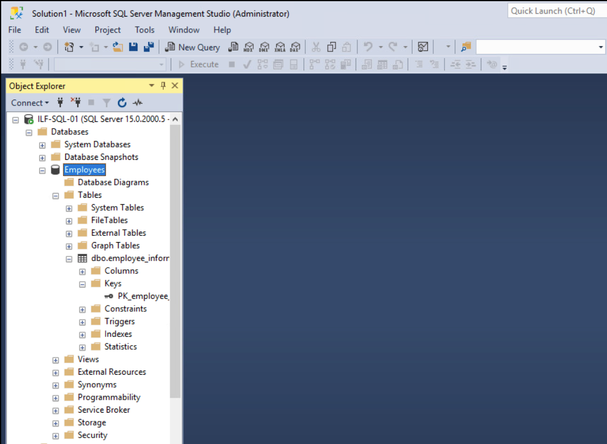
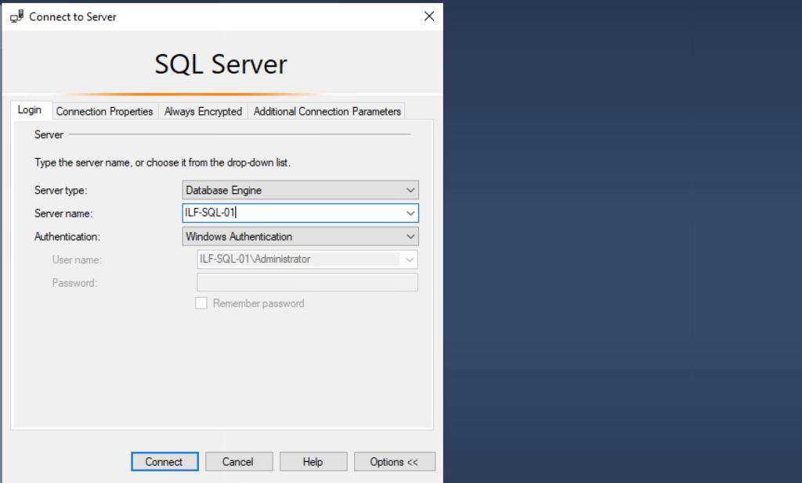

# MSSQL

Microsoft SQL (MSSQL) es el sistema de gestión de bases de datos relacionales basado en SQL de Microsoft. A diferencia de MySQL, que discutimos en la sección anterior, MSSQL es de código cerrado y fue escrito inicialmente para ejecutarse en sistemas operativos Windows. Es popular entre los administradores de bases de datos y desarrolladores cuando se construyen aplicaciones que se ejecutan en el marco .NET de Microsoft debido a su fuerte soporte nativo para .NET. Existen versiones de MSSQL que se ejecutan en Linux y macOS, pero es más probable que nos encontremos con instancias de MSSQL en objetivos que ejecutan Windows.

### Clientes de MSSQL

SQL Server Management Studio (SSMS) viene como una característica que se puede instalar con el paquete de instalación de MSSQL o se puede descargar e instalar por separado. Se instala comúnmente en el servidor para la configuración inicial y la gestión a largo plazo de bases de datos por parte de los administradores. Ten en cuenta que, dado que SSMS es una aplicación del lado del cliente, puede instalarse y utilizarse en cualquier sistema desde el que un administrador o desarrollador planee gestionar la base de datos. No solo existe en el servidor que aloja la base de datos. Esto significa que podríamos encontrarnos con un sistema vulnerable con SSMS y credenciales guardadas que nos permiten conectarnos a la base de datos. La imagen a continuación muestra SSMS en acción.

<figure><figcaption></figcaption></figure>

#### Otros Clientes de MSSQL

Se pueden usar muchos otros clientes para acceder a una base de datos que se ejecuta en MSSQL, incluyendo pero no limitándose a:

* `mssql-cli`
* `SQL Server PowerShell`
* `HeidiSQL`
* `SQLPro`
* `Impacket's mssqlclient.py`

De los clientes de MSSQL mencionados anteriormente, los pentesters pueden encontrar que `mssqlclient.py` de Impacket es el más útil debido a que el proyecto Impacket de SecureAuthCorp está presente en muchas distribuciones de pentesting al momento de la instalación. Para encontrar si y dónde se encuentra el cliente en nuestro host, podemos usar el siguiente comando:

```bash
sherlock28@htb[/htb]$ locate mssqlclient

/usr/bin/impacket-mssqlclient
/usr/share/doc/python3-impacket/examples/mssqlclient.py
```

### Bases de Datos de MSSQL

MSSQL tiene bases de datos del sistema por defecto que pueden ayudarnos a entender la estructura de todas las bases de datos que pueden estar alojadas en un servidor objetivo. Aquí están las bases de datos por defecto y una breve descripción de cada una:

| Base de Datos del Sistema | Descripción                                                                                                                                                                                                                            |
| ------------------------- | -------------------------------------------------------------------------------------------------------------------------------------------------------------------------------------------------------------------------------------- |
| `master`                  | Rastrea toda la información del sistema para una instancia de SQL Server.                                                                                                                                                              |
| `model`                   | Base de datos plantilla que actúa como estructura para cada nueva base de datos creada. Cualquier ajuste realizado en la base de datos `model` se reflejará en cualquier nueva base de datos creada después de los cambios en `model`. |
| `msdb`                    | El SQL Server Agent utiliza esta base de datos para programar trabajos y alertas.                                                                                                                                                      |
| `tempdb`                  | Almacena objetos temporales.                                                                                                                                                                                                           |
| `resource`                | Base de datos de solo lectura que contiene objetos del sistema incluidos con SQL Server.                                                                                                                                               |

Fuente de la tabla: Documentación de Bases de Datos del Sistema de Microsoft.

### Configuración Predeterminada

Cuando un administrador instala y configura inicialmente MSSQL para que sea accesible a través de la red, es probable que el servicio SQL se ejecute como `NT SERVICE\MSSQLSERVER`. La conexión desde el lado del cliente es posible a través de la Autenticación de Windows, y por defecto, la encriptación no se aplica al intentar conectar.

<figure><figcaption></figcaption></figure>

La configuración de autenticación en **Autenticación de Windows** significa que el sistema operativo Windows subyacente procesará la solicitud de inicio de sesión y utilizará ya sea la base de datos SAM local o el controlador de dominio (que aloja Active Directory) antes de permitir la conectividad con el sistema de gestión de bases de datos. Utilizar Active Directory puede ser ideal para auditar actividades y controlar el acceso en un entorno Windows, pero si una cuenta se ve comprometida, podría llevar a la escalada de privilegios y movimiento lateral a través de un entorno de dominio Windows. Al igual que con cualquier sistema operativo, servicio, rol de servidor o aplicación, puede ser beneficioso configurarlo en una máquina virtual desde la instalación hasta la configuración para entender todas las configuraciones predeterminadas y posibles errores que el administrador podría cometer.

### Configuraciones Peligrosas

Puede ser beneficioso ponernos en la perspectiva de un administrador de TI cuando estamos en una tarea de evaluación. Esta mentalidad puede ayudarnos a recordar buscar varias configuraciones que pueden haber sido mal configuradas o configuradas de manera peligrosa por un administrador. Un día de trabajo en TI puede ser bastante ocupado, con muchos proyectos diferentes ocurriendo simultáneamente y la presión para realizar con rapidez y precisión siendo una realidad en muchas organizaciones; los errores pueden ocurrir fácilmente. Solo se necesita una pequeña mala configuración que podría comprometer un servidor o servicio crítico en la red. Esto se aplica a casi todos los servicios de red y roles de servidor que se pueden configurar, incluyendo MSSQL.

Esta no es una lista exhaustiva porque hay innumerables formas en que las bases de datos MSSQL pueden ser configuradas por los administradores según las necesidades de sus respectivas organizaciones. Puede ser beneficioso investigar lo siguiente:

* Clientes de MSSQL que no usan encriptación para conectarse al servidor MSSQL.
* Uso de certificados autofirmados cuando se utiliza encriptación. Es posible suplantar certificados autofirmados.
* Uso de tuberías con nombre (named pipes).
* Credenciales de `sa` débiles o predeterminadas. Los administradores pueden olvidar desactivar esta cuenta.

## Recopilación de Información del Servicio

Existen varias maneras de abordar la recopilación de información sobre el servicio MSSQL. Cuanto más específicos seamos con nuestros escaneos, más información útil podremos obtener. NMAP dispone de scripts predeterminados para MSSQL que se pueden utilizar para apuntar al puerto TCP 1433 en el que MSSQL escucha.

El escaneo de NMAP con scripts proporcionado a continuación nos brinda información útil. Podemos ver el nombre del host, el nombre de la instancia de la base de datos, la versión del software de MSSQL y que las tuberías con nombre están habilitadas. Debemos agregar estos descubrimientos a nuestras notas.

### Escaneo de NMAP con Scripts MSSQL

```bash
sherlock28@htb[/htb]$ sudo nmap --script ms-sql-info,ms-sql-empty-password,ms-sql-xp-cmdshell,ms-sql-config,ms-sql-ntlm-info,ms-sql-tables,ms-sql-hasdbaccess,ms-sql-dac,ms-sql-dump-hashes --script-args mssql.instance-port=1433,mssql.username=sa,mssql.password=,mssql.instance-name=MSSQLSERVER -sV -p 1433 10.129.201.248
```

```yaml
Starting Nmap 7.91 ( https://nmap.org ) at 2021-11-08 09:40 EST
Nmap scan report for 10.129.201.248
Host is up (0.15s latency).

PORT     STATE SERVICE  VERSION
1433/tcp open  ms-sql-s Microsoft SQL Server 2019 15.00.2000.00; RTM
| ms-sql-ntlm-info: 
|   Target_Name: SQL-01
|   NetBIOS_Domain_Name: SQL-01
|   NetBIOS_Computer_Name: SQL-01
|   DNS_Domain_Name: SQL-01
|   DNS_Computer_Name: SQL-01
|_  Product_Version: 10.0.17763

Host script results:
| ms-sql-dac: 
|_  Instance: MSSQLSERVER; DAC port: 1434 (connection failed)
| ms-sql-info: 
|   Windows server name: SQL-01
|   10.129.201.248\MSSQLSERVER: 
|     Instance name: MSSQLSERVER
|     Version: 
|       name: Microsoft SQL Server 2019 RTM
|       number: 15.00.2000.00
|       Product: Microsoft SQL Server 2019
|       Service pack level: RTM
|       Post-SP patches applied: false
|     TCP port: 1433
|     Named pipe: \\10.129.201.248\pipe\sql\query
|_    Clustered: false

Service detection performed. Please report any incorrect results at https://nmap.org/submit/ .
Nmap done: 1 IP address (1 host up) scanned in 8.52 seconds
```

También podemos usar Metasploit para ejecutar un escáner auxiliar llamado `mssql_ping` que escaneará el servicio MSSQL y proporcionará información útil en nuestro proceso de recopilación de datos.

### MSSQL Ping en Metasploit

```bash
msf6 auxiliary(scanner/mssql/mssql_ping) > set rhosts 10.129.201.248

rhosts => 10.129.201.248

msf6 auxiliary(scanner/mssql/mssql_ping) > run

[*] 10.129.201.248:       - SQL Server information for 10.129.201.248:
[+] 10.129.201.248:       -    ServerName      = SQL-01
[+] 10.129.201.248:       -    InstanceName    = MSSQLSERVER
[+] 10.129.201.248:       -    IsClustered     = No
[+] 10.129.201.248:       -    Version         = 15.0.2000.5
[+] 10.129.201.248:       -    tcp             = 1433
[+] 10.129.201.248:       -    np              = \\SQL-01\pipe\sql\query
[*] 10.129.201.248:       - Scanned 1 of 1 hosts (100% complete)
[*] Auxiliary module execution completed
```

### Conexión con `mssqlclient.py`

Si podemos adivinar o obtener acceso a credenciales, esto nos permitirá conectarnos remotamente al servidor MSSQL y comenzar a interactuar con bases de datos utilizando T-SQL (Transact-SQL). Autenticarse con MSSQL nos permitirá interactuar directamente con las bases de datos a través del Motor de Bases de Datos SQL. Desde Pwnbox o un host de ataque personal, podemos usar `mssqlclient.py` de Impacket para conectarnos, como se muestra en la salida a continuación. Una vez conectados al servidor, puede ser útil conocer el entorno y listar las bases de datos presentes en el sistema.

#### Conexión con `mssqlclient.py`

```bash
sherlock28@htb[/htb]$ python3 mssqlclient.py Administrator@10.129.201.248 -windows-auth

Impacket v0.9.22 - Copyright 2020 SecureAuth Corporation

Password:
[*] Encryption required, switching to TLS
[*] ENVCHANGE(DATABASE): Old Value: master, New Value: master
[*] ENVCHANGE(LANGUAGE): Old Value: , New Value: us_english
[*] ENVCHANGE(PACKETSIZE): Old Value: 4096, New Value: 16192
[*] INFO(SQL-01): Line 1: Changed database context to 'master'.
[*] INFO(SQL-01): Line 1: Changed language setting to us_english.
[*] ACK: Result: 1 - Microsoft SQL Server (150 7208) 
[!] Press help for extra shell commands

SQL> select name from sys.databases

name                                                                                                                               

--------------------------------------------------------------------------------------

master                                                                                                                             

tempdb                                                                                                                             

model                                                                                                                              

msdb                                       
```
