# Crawling

**Crawling** (o "arañamiento") es el proceso automatizado de navegar sistemáticamente por la Web. De manera similar a como una araña recorre su telaraña, un rastreador web sigue enlaces de una página a otra, recopilando información. Estos rastreadores son esencialmente bots que utilizan algoritmos predefinidos para descubrir e indexar páginas web, haciéndolas accesibles a través de motores de búsqueda u otros fines como el análisis de datos y la investigación web.

## **Cómo Funcionan los Rastreadores Web**

La operación básica de un rastreador web es simple pero poderosa. Comienza con una URL inicial, que es la página web inicial a rastrear. El rastreador recupera esta página, analiza su contenido y extrae todos sus enlaces. Luego agrega estos enlaces a una cola y los rastrea, repitiendo el proceso de manera iterativa. Dependiendo de su alcance y configuración, el rastreador puede explorar un sitio web entero o incluso una vasta porción de la web.

**Ejemplo:**

1.  **Página de inicio:** Comienzas con la página de inicio que contiene `enlace1`, `enlace2` y `enlace3`.

    ```plaintext
    Página de inicio
    ├── enlace1
    ├── enlace2
    └── enlace3
    ```
2.  **Visitando enlace1:** Al visitar `enlace1`, se muestra la página de inicio, `enlace2`, y también `enlace4` y `enlace5`.

    ```plaintext
    Página de enlace1
    ├── Página de inicio
    ├── enlace2
    ├── enlace4
    └── enlace5
    ```
3. **Continuando el Rastreo:** El rastreador continúa siguiendo estos enlaces de manera sistemática, recopilando todas las páginas accesibles y sus enlaces.

Este ejemplo ilustra cómo un rastreador web descubre y recopila información siguiendo enlaces de manera sistemática, a diferencia de **fuzzing**, que implica adivinar posibles enlaces.

### **Rastreo en Anchura (Breadth-First Crawling)**

El rastreo en anchura prioriza explorar el ancho de un sitio web antes de profundizar. Comienza rastreando todos los enlaces en la página inicial, luego pasa a los enlaces en esas páginas, y así sucesivamente. Esto es útil para obtener una visión general del contenido y la estructura de un sitio web.

<figure><figcaption></figcaption></figure>

### **Rastreo en Profundidad (Depth-First Crawling)**

En contraste, el rastreo en profundidad prioriza la profundidad sobre el ancho. Sigue un único camino de enlaces tan lejos como sea posible antes de retroceder y explorar otros caminos. Esto puede ser útil para encontrar contenido específico o adentrarse profundamente en la estructura de un sitio web.

La elección de la estrategia depende de los objetivos específicos del proceso de rastreo.

<figure><figcaption></figcaption></figure>

## **Extracción de Información Valiosa**

Los rastreadores pueden extraer una variedad diversa de datos, cada uno sirviendo a un propósito específico en el proceso de reconocimiento:

* **Enlaces (Internos y Externos):** Estos son los bloques fundamentales de la web, conectando páginas dentro de un sitio web (enlaces internos) y a otros sitios web (enlaces externos). Los rastreadores recopilan meticulosamente estos enlaces, lo que te permite mapear la estructura de un sitio web, descubrir páginas ocultas e identificar relaciones con recursos externos.
* **Comentarios:** Las secciones de comentarios en blogs, foros u otras páginas interactivas pueden ser una mina de oro de información. Los usuarios a menudo revelan detalles sensibles, procesos internos o pistas de vulnerabilidades en sus comentarios, a veces sin darse cuenta.
* **Metadatos:** Los metadatos se refieren a datos sobre los datos. En el contexto de las páginas web, incluyen información como títulos de páginas, descripciones, palabras clave, nombres de autores y fechas. Estos metadatos pueden proporcionar un contexto valioso sobre el contenido de una página, su propósito y relevancia para tus objetivos de reconocimiento.
* **Archivos Sensibles:** Los rastreadores web pueden configurarse para buscar activamente archivos sensibles que puedan estar expuestos inadvertidamente en un sitio web. Esto incluye archivos de respaldo (por ejemplo, `.bak`, `.old`), archivos de configuración (por ejemplo, `web.config`, `settings.php`), archivos de registro (por ejemplo, `error_log`, `access_log`) y otros archivos que contienen contraseñas, claves API u otra información confidencial. Examinar cuidadosamente los archivos extraídos, especialmente los de respaldo y configuración, puede revelar una gran cantidad de información sensible, como credenciales de base de datos, claves de cifrado o incluso fragmentos de código fuente.

### **La Importancia del Contexto**

Comprender el contexto que rodea los datos extraídos es primordial.

Una sola pieza de información, como un comentario que menciona una versión específica del software, podría no parecer significativa por sí sola. Sin embargo, cuando se combina con otros hallazgos—como una versión desactualizada listada en los metadatos o un archivo de configuración potencialmente vulnerable descubierto a través del rastreo—puede convertirse en un indicador crítico de una posible vulnerabilidad.

El verdadero valor de los datos extraídos radica en conectar los puntos y construir una imagen integral del panorama digital del objetivo.

Por ejemplo, una lista de enlaces extraídos podría parecer inicialmente mundana. Pero, al examinarla más de cerca, notas un patrón: varias URLs apuntan a un directorio llamado `/files/`. Esto despierta tu curiosidad y decides visitar el directorio manualmente. Para tu sorpresa, descubres que la navegación de directorios está habilitada, exponiendo una serie de archivos, incluidos archivos de respaldo, documentos internos y datos potencialmente sensibles. Este hallazgo no habría sido posible al observar enlaces individuales en aislamiento; el análisis contextual te llevó a este descubrimiento crítico.

De manera similar, comentarios aparentemente inofensivos pueden adquirir importancia cuando se correlacionan con otros descubrimientos. Un comentario que menciona un "servidor de archivos" podría no levantar banderas rojas inicialmente. Sin embargo, cuando se combina con el descubrimiento mencionado del directorio `/files/`, refuerza la posibilidad de que el servidor de archivos esté accesible públicamente, exponiendo potencialmente información sensible o datos confidenciales.

Por lo tanto, es esencial abordar el análisis de datos de manera holística, considerando las relaciones entre diferentes puntos de datos y sus posibles implicaciones para tus objetivos de reconocimiento.
