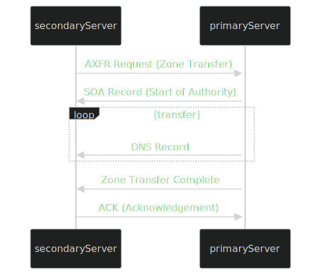

# DNS Zone Transfers

Una transferencia de zona DNS es esencialmente una copia completa de todos los registros DNS dentro de una zona (un dominio y sus subdominios) de un servidor a otro. Este proceso es crucial para mantener la coherencia y redundancia entre los servidores DNS. Sin embargo, si no está adecuadamente protegido, los actores no autorizados pueden descargar el archivo de zona completo, revelando una lista de subdominios, sus direcciones IP asociadas y otros datos sensibles.

<figure><figcaption></figcaption></figure>

## **Cómo Funciona una Transferencia de Zona**

1. **Solicitud de Transferencia de Zona (AXFR)**: El servidor DNS secundario inicia el proceso enviando una solicitud de transferencia de zona al servidor primario. Esta solicitud generalmente usa el tipo AXFR (Transferencia de Zona Completa).
2. **Transferencia del Registro SOA**: El servidor primario responde enviando su registro SOA (Start of Authority), que contiene información vital sobre la zona, incluyendo el número de serie.
3. **Transmisión de Registros DNS**: El servidor primario transfiere todos los registros DNS de la zona al servidor secundario, uno por uno. Esto incluye registros como A, AAAA, MX, CNAME, NS, y otros.
4. **Transferencia Completa**: Cuando todos los registros han sido transmitidos, el servidor primario indica el fin de la transferencia.
5. **Confirmación (ACK)**: El servidor secundario envía un mensaje de confirmación al servidor primario, completando el proceso.

## **La Vulnerabilidad de la Transferencia de Zona**

Si un servidor DNS no está correctamente configurado, cualquiera puede solicitar una transferencia de zona y obtener una lista completa de subdominios, direcciones IP, y otros registros, lo que puede ser extremadamente valioso para un atacante.

### Remediación

La mayoría de los servidores DNS modernos están configurados para permitir transferencias de zona solo a servidores secundarios confiables. Sin embargo, pueden ocurrir configuraciones incorrectas debido a errores humanos o prácticas desactualizadas. Por lo tanto, intentar una transferencia de zona sigue siendo una técnica útil en la fase de reconocimiento de seguridad.

### Cómo Explorar las Transferencias de Zona

Puedes usar el comando **dig** para intentar una transferencia de zona:

```bash
dig axfr @nsztm1.digi.ninja zonetransfer.me
```

Este comando instruye a **dig** para solicitar una transferencia de zona completa (AXFR) del servidor DNS responsable de **zonetransfer.me**. Si el servidor está mal configurado y permite la transferencia, recibirás una lista completa de los registros DNS del dominio, incluyendo todos los subdominios.

#### Ejemplo:

```bash
sherlock28@htb[/htb]$ dig axfr @nsztm1.digi.ninja zonetransfer.me

; <<>> DiG 9.18.12-1~bpo11+1-Debian <<>> axfr @nsztm1.digi.ninja zonetransfer.me
; (1 server found)
;; global options: +cmd
zonetransfer.me.	7200	IN	SOA	nsztm1.digi.ninja. robin.digi.ninja. 2019100801 172800 900 1209600 3600
zonetransfer.me.	300	IN	HINFO	"Casio fx-700G" "Windows XP"
zonetransfer.me.	301	IN	TXT	"google-site-verification=tyP28J7JAUHA9fw2sHXMgcCC0I6XBmmoVi04VlMewxA"
zonetransfer.me.	7200	IN	MX	0 ASPMX.L.GOOGLE.COM.
...
zonetransfer.me.	7200	IN	A	5.196.105.14
zonetransfer.me.	7200	IN	NS	nsztm1.digi.ninja.
zonetransfer.me.	7200	IN	NS	nsztm2.digi.ninja.
...
;; Query time: 10 msec
;; SERVER: 81.4.108.41#53(nsztm1.digi.ninja) (TCP)
;; WHEN: Mon May 27 18:31:35 BST 2024
;; XFR size: 50 records (messages 1, bytes 2085)
```

Este ejemplo muestra cómo una mala configuración puede exponer una cantidad significativa de información sensible sobre los subdominios y su infraestructura asociada.
