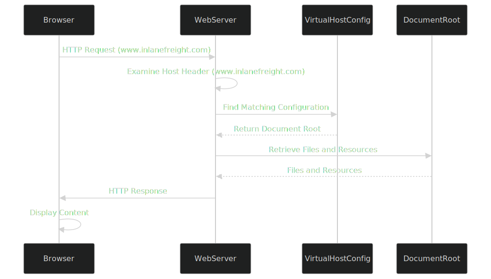

# Virtual Hosts

En el núcleo del hosting virtual está la capacidad de los servidores web para distinguir entre múltiples sitios web o aplicaciones que comparten la misma dirección IP. Esto se logra aprovechando el encabezado HTTP _Host_, una pieza de información incluida en cada solicitud HTTP enviada por un navegador web.

## **Diferencias clave entre VHosts y Subdominios**

1. **Subdominios**: Son extensiones de un nombre de dominio principal (por ejemplo, `blog.example.com` es un subdominio de `example.com`). Los subdominios suelen tener sus propios registros DNS, que apuntan a la misma dirección IP que el dominio principal o a una diferente. Se utilizan para organizar diferentes secciones o servicios de un sitio web.
2. **Hosts Virtuales (VHosts)**: Son configuraciones dentro de un servidor web que permiten alojar múltiples sitios web o aplicaciones en un solo servidor. Pueden estar asociados con dominios de nivel superior (como `example.com`) o subdominios (como `dev.example.com`). Cada host virtual puede tener su propia configuración separada, lo que permite un control preciso sobre cómo se manejan las solicitudes.

Si un host virtual no tiene un registro DNS, aún se puede acceder a él modificando el archivo _hosts_ en tu máquina local. El archivo _hosts_ permite asignar un nombre de dominio a una dirección IP de forma manual, evitando la resolución DNS.

**Fuzzing de VHosts**

Los sitios web a menudo tienen subdominios que no son públicos y no aparecen en los registros DNS. Estos subdominios solo son accesibles internamente o mediante configuraciones específicas. El _fuzzing_ de VHost es una técnica para descubrir subdominios públicos y no públicos, así como VHosts, probando varios nombres de host contra una dirección IP conocida.

**Ejemplo de Configuración de Virtual Hosts**

Los hosts virtuales también se pueden configurar para usar diferentes dominios, no solo subdominios. Por ejemplo, en Apache:

```apache
# Ejemplo de configuración de host virtual basada en nombre en Apache
<VirtualHost *:80>
    ServerName www.example1.com
    DocumentRoot /var/www/example1
</VirtualHost>

<VirtualHost *:80>
    ServerName www.example2.org
    DocumentRoot /var/www/example2
</VirtualHost>

<VirtualHost *:80>
    ServerName www.another-example.net
    DocumentRoot /var/www/another-example
</VirtualHost>
```

En este caso, `example1.com`, `example2.org` y `another-example.net` son dominios distintos alojados en el mismo servidor. El servidor web usa el encabezado _Host_ para servir el contenido adecuado según el nombre de dominio solicitado.

### **Proceso de Búsqueda del VHost en el Servidor**

<figure><figcaption></figcaption></figure>

1. **El navegador solicita un sitio web**: Al ingresar un nombre de dominio (por ejemplo, `www.inlanefreight.com`) en tu navegador, este inicia una solicitud HTTP al servidor web asociado con la dirección IP de ese dominio.
2. **El encabezado Host revela el dominio**: El navegador incluye el nombre del dominio en el encabezado _Host_ de la solicitud, que actúa como una etiqueta para informar al servidor web qué sitio web se está solicitando.
3. **El servidor web determina el host virtual**: El servidor web recibe la solicitud, examina el encabezado _Host_ y consulta su configuración de host virtual para encontrar una entrada que coincida con el nombre de dominio solicitado.
4. **Servidor del contenido correcto**: Al identificar la configuración de host virtual correcta, el servidor web recupera los archivos y recursos correspondientes a ese sitio web desde su directorio raíz y los envía de vuelta al navegador como respuesta HTTP.

En resumen, el encabezado _Host_ funciona como un interruptor que permite al servidor web determinar dinámicamente qué sitio web debe servir según el dominio solicitado por el navegador.

## Herramientas de Descubrimiento de Hosts Virtuales

Aunque el análisis manual de encabezados HTTP y las búsquedas DNS inversas pueden ser efectivos, las herramientas especializadas para el descubrimiento de hosts virtuales automatizan y agilizan el proceso, haciéndolo más eficiente y completo. Estas herramientas emplean diversas técnicas para sondear el servidor objetivo y descubrir posibles hosts virtuales.

**Varias herramientas disponibles para ayudar en el descubrimiento de hosts virtuales:**

| Herramienta     | Descripción                                                                                                                                                         | Características                                                                       |
| --------------- | ------------------------------------------------------------------------------------------------------------------------------------------------------------------- | ------------------------------------------------------------------------------------- |
| **gobuster**    | Herramienta multifuncional utilizada frecuentemente para el brute-forcing de directorios/archivos, pero también efectiva para el descubrimiento de hosts virtuales. | Rápida, soporta múltiples métodos HTTP, puede usar listas de palabras personalizadas. |
| **Feroxbuster** | Similar a Gobuster, pero con una implementación basada en Rust, conocida por su velocidad y flexibilidad.                                                           | Soporta recursión, descubrimiento de comodines y varios filtros.                      |
| **ffuf**        | Otro fuzzer web rápido que puede usarse para el descubrimiento de hosts virtuales al hacer fuzzing del encabezado Host.                                             | Entrada de listas de palabras personalizables y opciones de filtrado.                 |

### **Gobuster**

Gobuster es una herramienta versátil comúnmente utilizada para el brute-forcing de directorios y archivos, pero también destaca en el descubrimiento de hosts virtuales. Envía sistemáticamente solicitudes HTTP con diferentes encabezados Host a una dirección IP de destino y luego analiza las respuestas para identificar hosts virtuales válidos.

**Preparación para el Brute-Forcing de Encabezados Host:**

1. **Identificación del Objetivo**: Primero, identifica la dirección IP del servidor web de destino. Esto se puede hacer a través de búsquedas DNS u otras técnicas de reconocimiento.
2. **Preparación de la Lista de Palabras**: Prepara una lista de palabras que contenga posibles nombres de hosts virtuales. Puedes usar una lista precompilada, como SecLists, o crear una personalizada basada en la industria del objetivo, convenciones de nombres u otra información relevante.

**Comando de Gobuster para Brute-Forcing de VHosts**

El comando de Gobuster para realizar el brute-forcing de hosts virtuales generalmente se ve así:

```bash
gobuster vhost -u http://<dirección_IP_del_objetivo> -w <archivo_lista_de_palabras> --append-domain
```

* **-u**: Especifica la URL de destino (reemplaza `<dirección_IP_del_objetivo>` con la IP real).
* **-w**: Especifica el archivo de lista de palabras (reemplaza `<archivo_lista_de_palabras>` con la ruta a tu lista de palabras).
* **--append-domain**: Añade el dominio base a cada palabra en la lista de palabras.

> En versiones más recientes de Gobuster, se requiere el flag `--append-domain` para añadir el dominio base a cada palabra en la lista cuando se realiza el descubrimiento de hosts virtuales. Este flag asegura que Gobuster construya correctamente los nombres completos de los hosts virtuales, lo que es esencial para una enumeración precisa de posibles subdominios. En versiones anteriores de Gobuster, esta funcionalidad se manejaba de manera diferente, y el flag `--append-domain` no era necesario. Los usuarios de versiones antiguas pueden no encontrar disponible o necesario este flag, ya que la herramienta añadía el dominio base por defecto o empleaba un mecanismo diferente para la generación de hosts virtuales.

Gobuster mostrará los posibles hosts virtuales a medida que los descubre. Analiza los resultados cuidadosamente, anotando cualquier hallazgo inusual o interesante. Puede ser necesaria una investigación adicional para confirmar la existencia y funcionalidad de los hosts virtuales descubiertos.

**Otros Argumentos Útiles**

* Considera usar el flag **-t** para aumentar el número de hilos para un escaneo más rápido.
* El flag **-k** puede ignorar errores de certificados SSL/TLS.
* Puedes usar el flag **-o** para guardar la salida en un archivo para un análisis posterior.

**Ejemplo de Comando de Gobuster**

```bash
gobuster vhost -u http://inlanefreight.htb:81 -w /usr/share/seclists/Discovery/DNS/subdomains-top1million-110000.txt --append-domain
```

```less
===============================================================
Gobuster v3.6
by OJ Reeves (@TheColonial) & Christian Mehlmauer (@firefart)
===============================================================
[+] URL:             http://inlanefreight.htb:81
[+] Método:          GET
[+] Hilos:           10
[+] Lista de Palabras: /usr/share/seclists/Discovery/DNS/subdomains-top1million-110000.txt
[+] Agente de Usuario: gobuster/3.6
[+] Tiempo de Espera: 10s
[+] Añadir Dominio:   true
===============================================================
Iniciando gobuster en modo de enumeración VHOST
===============================================================
Encontrado: forum.inlanefreight.htb:81 Status: 200 [Tamaño: 100]
[...]
Progreso: 114441 / 114442 (100.00%)
===============================================================
Terminado
===============================================================
```
