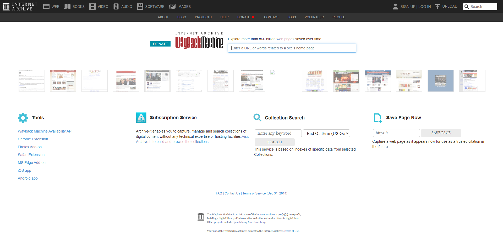
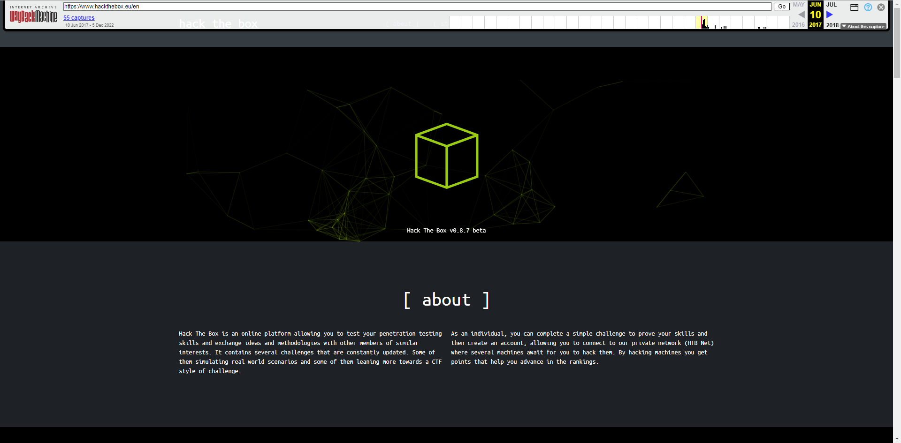

# Web Archives

## ¿Qué es la Wayback Machine?

<figure><figcaption></figcaption></figure>

La Wayback Machine es un archivo digital de la World Wide Web y otra información en Internet. Fundada por el Internet Archive, una organización sin fines de lucro, ha estado archivando sitios web desde 1996.

Permite a los usuarios "retroceder en el tiempo" y ver instantáneas de sitios web tal como aparecieron en varios puntos de su historia. Estas instantáneas, conocidas como capturas o archivos, proporcionan una visión de las versiones pasadas de un sitio web, incluyendo su diseño, contenido y funcionalidad.

## ¿Cómo Funciona la Wayback Machine?

La Wayback Machine opera utilizando rastreadores web para capturar instantáneas de sitios web a intervalos regulares de manera automática. Estos rastreadores navegan por la web, siguiendo enlaces e indexando páginas, de manera similar a cómo lo hacen los rastreadores de los motores de búsqueda. Sin embargo, en lugar de simplemente indexar la información para fines de búsqueda, la Wayback Machine almacena el contenido completo de las páginas, incluyendo HTML, CSS, JavaScript, imágenes y otros recursos.

<figure><figcaption></figcaption></figure>

El funcionamiento de la Wayback Machine se puede visualizar en tres pasos:

1. **Rastreo:** La Wayback Machine emplea rastreadores web automatizados, a menudo llamados "bots," para navegar sistemáticamente por Internet. Estos bots siguen enlaces de una página web a otra, como tú harías al hacer clic en hipervínculos para explorar un sitio web. Sin embargo, en lugar de solo leer el contenido, estos bots descargan copias de las páginas web que encuentran.
2. **Archivado:** Las páginas web descargadas, junto con sus recursos asociados como imágenes, hojas de estilo y scripts, se almacenan en el vasto archivo de la Wayback Machine. Cada página web capturada está vinculada a una fecha y hora específica, creando una instantánea histórica del sitio web en ese momento. Este proceso de archivado ocurre a intervalos regulares, a veces diarios, semanales o mensuales, dependiendo de la popularidad del sitio web y la frecuencia de actualizaciones.
3. **Acceso:** Los usuarios pueden acceder a estas instantáneas archivadas a través de la interfaz de la Wayback Machine. Al ingresar la URL de un sitio web y seleccionar una fecha, puedes ver cómo lucía el sitio web en ese punto específico. La Wayback Machine te permite navegar por páginas individuales y proporciona herramientas para buscar términos específicos dentro del contenido archivado o descargar sitios web completos para análisis fuera de línea.

La frecuencia con la que la Wayback Machine archiva un sitio web varía. Algunos sitios web pueden ser archivados varias veces al día, mientras que otros pueden tener solo unas pocas instantáneas repartidas a lo largo de varios años. Los factores que influyen en esta frecuencia incluyen la popularidad del sitio web, su tasa de cambio y los recursos disponibles para el Internet Archive.

Es importante tener en cuenta que la Wayback Machine no captura cada página web en línea. Prioriza sitios web considerados de valor cultural, histórico o de investigación. Además, los propietarios de sitios web pueden solicitar que su contenido sea excluido de la Wayback Machine, aunque esto no siempre está garantizado.

## Por Qué la Wayback Machine es Importante para el Reconocimiento Web

La Wayback Machine es un tesoro para el reconocimiento web, ofreciendo información que puede ser fundamental en diversos escenarios. Su importancia radica en su capacidad para desvelar el pasado de un sitio web, proporcionando información valiosa que puede no ser evidente en su estado actual:

* **Descubrimiento de Activos y Vulnerabilidades Ocultos:** La Wayback Machine te permite descubrir páginas web antiguas, directorios, archivos o subdominios que podrían no ser accesibles en el sitio web actual, exponiendo potencialmente información sensible o fallos de seguridad.
* **Seguimiento de Cambios e Identificación de Patrones:** Al comparar instantáneas históricas, puedes observar cómo ha evolucionado el sitio web, revelando cambios en la estructura, el contenido, las tecnologías y posibles vulnerabilidades.
* **Recopilación de Inteligencia:** El contenido archivado puede ser una fuente valiosa de OSINT, proporcionando información sobre las actividades pasadas del objetivo, estrategias de marketing, empleados y elecciones tecnológicas.
* **Reconocimiento Discreto:** Acceder a instantáneas archivadas es una actividad pasiva que no interactúa directamente con la infraestructura del objetivo, lo que lo convierte en una forma menos detectable de recopilar información.

## Ir a Wayback en HackTheBox

Podemos ver la primera versión archivada de HackTheBox ingresando la página que estamos buscando en la Wayback Machine y seleccionando la fecha de captura más antigua disponible, siendo el 10 de junio de 2017 a las 04:23:01.

<figure><figcaption></figcaption></figure>
