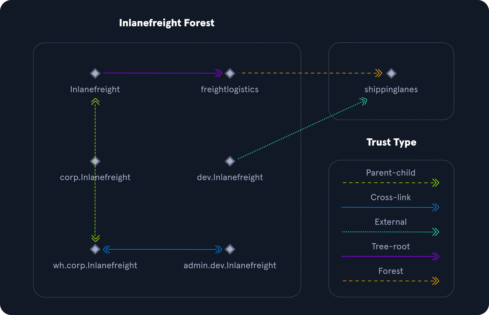

# Introduction Active Directory



<figure><figcaption></figcaption></figure>

## Estructura de Active Directory

Active Directory (AD) es un servicio de directorio para entornos de red Windows. Es una estructura distribuida y jerárquica que permite la administración centralizada de los recursos de una organización, incluidos usuarios, computadoras, grupos, dispositivos de red y recursos compartidos, directivas de grupo, servidores y estaciones de trabajo, y relaciones de confianza (trusts).

AD proporciona funciones de **autenticación y autorización** dentro de un entorno de dominio Windows. Un servicio de directorio, como **Active Directory Domain Services (AD DS)**, ofrece a una organización formas de almacenar datos de directorio y hacerlos accesibles tanto a usuarios estándar como a administradores en la misma red. AD DS almacena información como nombres de usuario y contraseñas, y gestiona los permisos necesarios para que los usuarios autorizados accedan a esta información.

Se lanzó por primera vez con Windows Server 2000; en los últimos años ha sido objeto de ataques cada vez más sofisticados. Está diseñado para ser compatible hacia atrás, y muchas de sus funciones no son **"seguras por defecto"**. Su correcta administración puede ser difícil, especialmente en entornos grandes donde es fácil cometer errores de configuración.

Las vulnerabilidades y configuraciones incorrectas en Active Directory suelen aprovecharse para conseguir un **punto de apoyo** (acceso interno), moverse lateral o verticalmente dentro de la red y obtener acceso no autorizado a recursos protegidos como bases de datos, recursos compartidos, código fuente y más.

En esencia, AD es una gran base de datos accesible para todos los usuarios del dominio, independientemente de su nivel de privilegio. Una cuenta básica de usuario de AD sin privilegios adicionales puede usarse para enumerar la mayoría de los objetos contenidos en AD, entre ellos:

* Computadoras del dominio
* Usuarios del dominio
* Información de grupos del dominio
* Unidades organizativas (OUs)
* Directiva predeterminada del dominio
* Niveles funcionales del dominio
* Política de contraseñas
* Objetos de directiva de grupo (GPOs)
* Relaciones de confianza del dominio
* Listas de control de acceso (ACLs)

Por esta razón, debemos entender cómo está configurado Active Directory y los fundamentos de su administración antes de intentar atacarlo. Siempre es más fácil **“romper”** algo si ya sabemos cómo construirlo.

### Jerarquía de Active Directory

Active Directory se organiza en una estructura jerárquica en forma de árbol, con un **bosque (forest)** en la parte superior que contiene uno o más dominios, los cuales pueden tener subdominios anidados.

* Un **forest** es el límite de seguridad dentro del cual todos los objetos están bajo control administrativo.
* Un forest puede contener múltiples dominios.
* Un **domain** es la estructura en la que se encuentran objetos (usuarios, computadoras y grupos) accesibles.

Los dominios tienen muchas **Unidades Organizativas (OUs)** integradas, como **Domain Controllers**, **Users**, **Computers**, y pueden crearse nuevas OUs según sea necesario. Las OUs pueden contener objetos y sub-OUs, lo que permite asignar distintas políticas de grupo.

#### Ejemplo de estructura de AD (a nivel muy básico):

```plaintext
INLANEFREIGHT.LOCAL/
├── ADMIN.INLANEFREIGHT.LOCAL
│   ├── GPOs
│   └── OU
│       └── EMPLOYEES
│           ├── COMPUTERS
│           │   └── FILE01
│           ├── GROUPS
│           │   └── HQ Staff
│           └── USERS
│               └── barbara.jones
├── CORP.INLANEFREIGHT.LOCAL
└── DEV.INLANEFREIGHT.LOCAL
```

En este ejemplo:

* **INLANEFREIGHT.LOCAL** es el **dominio raíz** que contiene los subdominios (ya sean dominios hijos o dominios raíz de árbol):
  * **ADMIN.INLANEFREIGHT.LOCAL**
  * **CORP.INLANEFREIGHT.LOCAL**
  * **DEV.INLANEFREIGHT.LOCAL**

También incluye otros objetos que componen un dominio, como usuarios, grupos y computadoras.

Es común ver **múltiples dominios (o bosques) vinculados mediante relaciones de confianza** en organizaciones que realizan muchas adquisiciones. A menudo es más rápido y sencillo crear una relación de confianza con otro dominio/forest que recrear todos los usuarios en el dominio actual.

Sin embargo, como veremos más adelante, **las relaciones de confianza pueden introducir muchos problemas de seguridad si no se administran correctamente.**

### Ejemplo de diagrama de bosques y dominios

<figure><figcaption></figcaption></figure>

El siguiente gráfico conceptual describe dos bosques:

* **INLANEFREIGHT.LOCAL**
* **FREIGHTLOGISTICS.LOCAL**

El doble sentido de la flecha indica una **relación de confianza bidireccional** entre los dos bosques, lo que significa que los usuarios de INLANEFREIGHT.LOCAL pueden acceder a recursos en FREIGHTLOGISTICS.LOCAL y viceversa.

También se pueden ver múltiples dominios hijos bajo cada dominio raíz.

En este ejemplo:

* El **dominio raíz** confía en sus dominios hijos.
* Pero **los dominios hijos de un bosque no necesariamente tienen confianza establecida con los dominios hijos del otro bosque**.

Esto significa que un usuario de **admin.dev.freightlogistics.local** **NO** podría autenticarse en máquinas de **wh.corp.inlanefreight.local** de forma predeterminada, a pesar de la relación de confianza bidireccional entre los dominios raíz.

Para permitir esa comunicación directa, habría que configurar otra **relación de confianza**.

## Terminología de Active Directory

Antes de profundizar más, vamos a dar un paso atrás y definir algunos términos clave que se usarán en este módulo y en general al trabajar con Active Directory.

### Objeto

Un **objeto** es **cualquier recurso presente en un entorno de Active Directory**, como OUs, impresoras, usuarios, controladores de dominio, etc.

### Atributos

Cada objeto en Active Directory tiene un conjunto de **atributos** asociados que definen sus características.\
Por ejemplo, un objeto de computadora tiene atributos como el nombre del host y el nombre DNS.\
Todos los atributos en AD tienen un nombre LDAP asociado que se usa en consultas LDAP, como `displayName` para el nombre completo o `givenName` para el primer nombre.

### Esquema (Schema)

El **esquema de Active Directory** es el plano o blueprint de todo el entorno.\
Define qué tipos de objetos pueden existir en la base de datos de AD y sus atributos asociados.

* Por ejemplo, los usuarios pertenecen a la clase **"user"** y las computadoras a **"computer"**.
* Cada objeto tiene información obligatoria u opcional almacenada en atributos.
* Cuando se crea un objeto a partir de una clase, se llama **instanciación** y ese objeto es una **instancia** de la clase.

Ejemplo: la computadora **RDS01** es una instancia de la clase **computer**.

### Dominio

Un **dominio** es un **grupo lógico de objetos** como computadoras, usuarios, OUs, grupos, etc.\
Podemos pensarlo como **una ciudad** dentro de un estado o país.\
Los dominios pueden funcionar de forma independiente o conectarse mediante relaciones de confianza (**trusts**).

### Bosque (Forest)

Un **bosque** es un **conjunto de dominios de Active Directory**.\
Es el **contenedor de más alto nivel** que contiene todos los objetos de AD: dominios, usuarios, grupos, computadoras, GPOs, etc.

Un bosque puede contener uno o más dominios y puede pensarse como un **estado** (en EE.UU.) o un **país** (en la UE).\
Cada bosque opera de forma independiente, pero puede establecer relaciones de confianza con otros bosques.

### Árbol (Tree)

Un **árbol** es un **conjunto de dominios** de AD que comienzan en un dominio raíz único.\
Un bosque es un conjunto de **árboles** de AD.

* Los dominios en un árbol comparten un límite de confianza padre-hijo.
* Dos árboles en el mismo bosque no pueden compartir el mismo namespace.

**Ejemplo:**

* Árbol 1: `inlanefreight.local` → hijo: `corp.inlanefreight.local`
* Árbol 2: `ilfreight.local` → hijo: `corp.ilfreight.local`

Todos los dominios en un árbol comparten un **Global Catalog**.

### Contenedor (Container)

Los **objetos contenedor** almacenan otros objetos y tienen una ubicación definida en la jerarquía del subárbol del directorio.

### Hoja (Leaf)

Los **objetos hoja** **no contienen** otros objetos y se encuentran **al final de la jerarquía** del subárbol.

### Identificador Único Global (GUID)

Un **GUID** es un **valor único de 128 bits** asignado cuando se crea un usuario o grupo en el dominio.

* Es único en toda la empresa, como una dirección MAC.
* Todos los objetos de AD tienen un GUID almacenado en el atributo **ObjectGUID**.

Buscar por **GUID** es la forma más precisa de encontrar un objeto en AD.\
El **ObjectGUID** nunca cambia mientras el objeto exista.

### Principales de seguridad (Security Principals)

Son **entidades que el sistema operativo puede autenticar**, como:

* Cuentas de usuario
* Cuentas de computadora
* Procesos o servicios ejecutándose bajo cuentas del dominio

En AD, estos objetos pueden **controlar el acceso** a recursos dentro del dominio.\
También existen cuentas locales (no gestionadas por AD) controladas por **Security Accounts Manager (SAM)**.

### Identificador de seguridad (SID)

El **SID** es un identificador único para un principal o grupo de seguridad.

* Es asignado por el controlador de dominio.
* Un SID se usa **una sola vez**.
* Cuando un usuario inicia sesión, se genera un **token de acceso** con su SID y los SIDs de sus grupos.
* Existen SIDs bien conocidos, como el del grupo **Everyone**.

### Distinguished Name (DN)

El **DN** describe la **ruta completa** a un objeto en AD.\
Ejemplo:

```
cn=bjones, ou=IT, ou=Employees, dc=inlanefreight, dc=local
```

Indica que **bjones** trabaja en IT y su cuenta está en la OU **Employees**.

### Relative Distinguished Name (RDN)

El **RDN** es **un solo componente** del DN.

* Identifica al objeto de forma única en su nivel de jerarquía.
* Ejemplo: **bjones** es el RDN en el DN anterior.
* No pueden existir dos objetos con el mismo RDN en el mismo contenedor padre.

### sAMAccountName

El **sAMAccountName** es el **nombre de inicio de sesión** del usuario.

* Debe ser único y tener **20 caracteres o menos**.
* Ejemplo: **bjones**.

### userPrincipalName

El **userPrincipalName (UPN)** es otro formato para identificar usuarios en AD:

```
bjones@inlanefreight.local
```

* No es obligatorio.
* Tiene formato de correo electrónico.

### Roles FSMO

Para evitar conflictos entre controladores de dominio (DC):

* Microsoft creó las **Flexible Single Master Operations (FSMO)**.
* Dividen funciones críticas entre varios DCs.

Cinco roles FSMO:

* **Schema Master** (uno por bosque)
* **Domain Naming Master** (uno por bosque)
* **RID Master** (uno por dominio)
* **PDC Emulator** (uno por dominio)
* **Infrastructure Master** (uno por dominio)

Estos roles aseguran **replicación correcta** y **operaciones críticas**.

### Catálogo Global (Global Catalog)

Un **Global Catalog (GC)** es un DC que:

* Guarda **copias completas** de su dominio.
* Guarda **copias parciales** de objetos de otros dominios en el bosque.

Permite:

* **Autenticación** (incluye todos los grupos de un usuario).
* **Búsquedas** en todo el bosque desde un solo punto.

### Read-Only Domain Controller (RODC)

Un **RODC** tiene:

* **Base de datos AD de solo lectura**.
* No almacena contraseñas (excepto su propia cuenta).
* Evita modificaciones replicadas.
* Incluye DNS de solo lectura.
* Reduce tráfico de replicación.
* Permite separación de roles administrativos.

### Replicación

La **replicación** sincroniza cambios entre DCs.

* Gestionada por el servicio **Knowledge Consistency Checker (KCC)**.
* Garantiza consistencia y respaldo en caso de fallos.

### Service Principal Name (SPN)

Un **SPN** identifica de forma única una instancia de servicio.

* Usado en autenticación Kerberos.
* Permite a las aplicaciones solicitar servicios sin conocer el nombre de cuenta.

### Group Policy Object (GPO)

Los **GPOs** son **colecciones virtuales** de configuraciones de política.

* Cada GPO tiene un **GUID único**.
* Se aplican a **usuarios y computadoras** en el dominio o en OUs específicas.

### Access Control List (ACL)

Una **ACL** es una colección **ordenada** de **Access Control Entries (ACEs)** que se aplican a un objeto.

### Access Control Entry (ACE)

Cada **ACE**:

* Identifica un **trustee** (usuario, grupo o sesión).
* Define derechos **permitidos**, **denegados** o **auditados**.

### Discretionary Access Control List (DACL)

La **DACL**:

* Define qué principales de seguridad tienen **permitido o denegado** el acceso a un objeto.
* Si no existe DACL → **acceso total** para todos.
* Si existe pero está vacía → **acceso denegado** para todos.
* Las ACEs se revisan en orden hasta encontrar un match.

### System Access Control List (SACL)

La **SACL** permite a los administradores **auditar intentos de acceso** a objetos protegidos.

* Las ACEs en la SACL definen **qué intentos se registran** en el Event Log.

### Fully Qualified Domain Name (FQDN)

El **FQDN** es el **nombre completo** de un host.

* Formato: `[nombre_host].[dominio].[tld]`.
* Permite ubicar objetos en la jerarquía DNS.

Ejemplo:

```
DC01.INLANEFREIGHT.LOCAL
```

### Tombstone

Un **tombstone** es un **objeto contenedor** para objetos eliminados en AD.

* El atributo **isDeleted** se establece en **TRUE**.
* Después del **Tombstone Lifetime** (60-180 días), se elimina por completo.
* Sin AD Recycle Bin → el objeto se convierte en **tombstone** y pierde la mayoría de sus atributos.

### AD Recycle Bin

Introducido en **Windows Server 2008 R2**.

* Permite recuperar objetos eliminados sin restaurar desde backup.
* Conserva la mayoría de los atributos.
* Por defecto → 60 días de retención.
* Facilita la restauración completa de objetos.

### SYSVOL

El **SYSVOL** almacena:

* Archivos públicos del dominio.
* Políticas de sistema, GPOs.
* Scripts de inicio/cierre de sesión.

Se replica entre DCs usando **File Replication Services (FRS)**.

### AdminSDHolder

El **AdminSDHolder**:

* Administra las **ACLs** de grupos **protegidos** en AD.
* Contiene el **Security Descriptor** aplicado a miembros de grupos privilegiados.
* El proceso **SDProp** se ejecuta cada hora por defecto para aplicar estos permisos.

### dsHeuristics

El atributo **dsHeuristics**:

* Es un **string** en el objeto Directory Service.
* Define configuraciones a nivel de bosque.
* Puede excluir grupos integrados de la lista de grupos protegidos.

### adminCount

El atributo **adminCount**:

* Determina si el proceso **SDProp** protege a un usuario.
* Valor **0** o no establecido → no protegido.
* Valor **1** → protegido.

### Active Directory Users and Computers (ADUC)

**ADUC** es la consola **GUI** para:

* Administrar usuarios, grupos, computadoras y contactos en AD.
* También puede hacerse vía **PowerShell**.

### ADSI Edit

**ADSI Edit** es una herramienta **GUI** más avanzada.

* Permite acceder y modificar cualquier atributo de un objeto.
* Debe usarse con precaución para evitar problemas graves en AD.

### sIDHistory

El atributo **sIDHistory**:

* Guarda SIDs anteriores de un objeto.
* Usado en migraciones para mantener permisos.
* Mal configurado → posible vector de ataque.

### NTDS.DIT

El archivo **NTDS.DIT**:

* Es el **corazón** de Active Directory.
* Almacena datos como usuarios, grupos, membresías y hashes de contraseñas.
* Ubicación: `C:\Windows\NTDS\`.
* Puede extraerse para ataques **pass-the-hash** o cracking offline.

### MSBROWSE

**MSBROWSE**:

* Protocolo antiguo de Microsoft para **servicios de exploración** en redes LAN.
* Mantenía listas de recursos compartidos.
* Hoy está **obsoleto**.

En versiones antiguas:

* `nbtstat -A ip-address` → identificar el Master Browser.
* `nltest` → consultar nombres de Domain Controllers.

Hoy se usa **SMB/CIFS**.

## Active Directory Objects

## Users

Estos son los **usuarios** dentro del entorno de Active Directory (AD) de la organización.

* Son **objetos hoja (leaf objects)**, lo que significa que **no pueden contener otros objetos**.
* Otro ejemplo de objeto hoja sería un buzón de correo en Microsoft Exchange.
* Un **usuario** es un **security principal** y tiene un **Security Identifier (SID)** y un **Global Unique Identifier (GUID)**.

Los objetos de usuario tienen muchos atributos posibles, como:

* Nombre para mostrar (display name)
* Último inicio de sesión
* Fecha del último cambio de contraseña
* Correo electrónico
* Descripción de cuenta
* Jefe (manager)
* Dirección

En entornos AD grandes, puede haber **más de 800 atributos posibles** para un usuario, aunque la mayoría no se usan en configuraciones estándar. Esto refleja la **complejidad y escala de AD**.

> Son un objetivo clave para los atacantes: incluso acceder a un usuario con pocos privilegios puede permitir enumerar todo el dominio (o bosque) y acceder a muchos recursos.

### Contacts

Un **contact** es un objeto usado generalmente para **representar a un usuario externo**.

* Contiene atributos como nombre, apellido, correo electrónico, número de teléfono, etc.
* Es un **objeto hoja** y **NO es un security principal**, por lo que **no tiene SID**, solo **GUID**.

**Ejemplo:**

* Tarjeta de contacto para un proveedor externo o un cliente.

### Printers

Un **printer object** apunta a una impresora accesible en la red de AD.

* Es un **objeto hoja**, **no es un security principal**, solo tiene **GUID**.
* Atributos: nombre de la impresora, información del driver, número de puerto, etc.

### Computers

Un **computer object** representa **cualquier equipo unido al dominio** (estación de trabajo o servidor).

* Son **objetos hoja** (no contienen otros objetos).
* Son **security principals**: tienen **SID** y **GUID**.
* Son objetivos atractivos para atacantes, ya que obtener acceso administrativo total (como **NT AUTHORITY\SYSTEM**) otorga permisos equivalentes a un usuario de dominio y permite realizar muchas tareas de enumeración.

### Shared Folders

Un **shared folder object** apunta a una carpeta compartida en el equipo donde reside.

* Puede tener controles de acceso muy estrictos:
  * Acceso para todos (incluso sin cuenta de AD)
  * Solo usuarios autenticados (incluso cuentas de computadora)
  * Restringido a ciertos usuarios o grupos
* **No es un security principal**, solo tiene **GUID**.
* Atributos: nombre, ubicación en el sistema, derechos de acceso.

### Groups

Un **grupo** es un **objeto contenedor** porque **puede contener otros objetos**:

* Usuarios
* Computadoras
* Incluso otros grupos (grupos anidados)

Es un **security principal**: tiene **SID** y **GUID**.

En AD, los grupos permiten **gestionar permisos de forma centralizada**.

* Ejemplo: para dar acceso a 20 usuarios de Help Desk a un servidor, en vez de añadirlos uno a uno, se añade el grupo.

**Grupos anidados:**

* Un grupo como miembro de otro grupo.
* Puede generar **accesos no previstos**.
* Herramientas como **BloodHound** ayudan a descubrir rutas de ataque gracias a membresías anidadas.

Atributos comunes:

* Nombre
* Descripción
* Miembros
* Grupos a los que pertenece

### Organizational Units (OUs)

Una **Organizational Unit (OU)** es un **contenedor** usado para **organizar objetos similares** y facilitar la administración.

Permiten **delegar tareas administrativas** sin dar permisos de administrador completo.

* Ejemplo:
  * OU de nivel superior: **Employees**
  * OUs hijas: **Marketing**, **HR**, **Finance**, **Help Desk**

**Delegación de tareas:**

* Reseteo de contraseñas
* Crear/eliminar usuarios
* Modificar membresías de grupo
* Administrar vínculos de GPO

**Uso en Group Policy:**

* Definir políticas específicas para subconjuntos de usuarios/grupos.
* Ejemplo: política de contraseñas más estricta para cuentas de servicio.

Atributos comunes:

* Nombre
* Miembros
* Configuración de seguridad

### Domain

Un **domain** es la estructura central de una red AD.

* Contiene objetos como **usuarios** y **computadoras**, organizados en **grupos** y **OUs**.
* Cada dominio tiene su **propia base de datos** y **conjunto de políticas**.

**Ejemplos de políticas:**

* Política de contraseñas del dominio (por defecto o personalizada)
* Bloquear acceso a cmd.exe para usuarios no administradores
* Mapear unidades de red en el inicio de sesión

### Domain Controllers

Los **Domain Controllers (DCs)** son **el cerebro** de una red AD.

* Manejan solicitudes de autenticación.
* Verifican usuarios en la red.
* Controlan el acceso a recursos del dominio.
* Validan solicitudes de acceso privilegiado según roles asignados.
* Aplican políticas de seguridad y almacenan información de todos los objetos del dominio.

### Sites

Un **site** en AD es un **conjunto de computadoras en una o más subredes** conectadas por enlaces de alta velocidad.

* Optimiza la **replicación** entre controladores de dominio.

### Built-in

**Built-in** es un **contenedor** en AD que almacena **grupos predeterminados** creados al establecer un dominio AD.

### Foreign Security Principals (FSP)

Un **Foreign Security Principal (FSP)** es un objeto creado en AD para **representar un security principal externo** de un bosque de confianza.

* Se crea automáticamente cuando se agrega un usuario, grupo o computadora de otro bosque a un grupo en el dominio actual.
* Es un **placeholder** que guarda el **SID** del objeto externo.
* Windows usa este SID para resolver el nombre del objeto a través de la relación de confianza.

**Ubicación típica:**

```
cn=ForeignSecurityPrincipals,dc=inlanefreight,dc=local
```

## Funcionalidad de Active Directory

Como se mencionó antes, existen **cinco roles de Flexible Single Master Operation (FSMO)**.\
Se definen así:

| Rol                          | Descripción                                                                                                                                                                                        |
| ---------------------------- | -------------------------------------------------------------------------------------------------------------------------------------------------------------------------------------------------- |
| **Schema Master**            | Administra la copia de lectura/escritura del esquema de AD, que define todos los atributos que pueden aplicarse a un objeto en AD.                                                                 |
| **Domain Naming Master**     | Administra nombres de dominio y evita que se creen dos dominios con el mismo nombre en el mismo bosque.                                                                                            |
| **Relative ID (RID) Master** | Asigna bloques de RIDs a otros DCs dentro del dominio para usarlos en nuevos objetos. Ayuda a garantizar que no se asignen SIDs duplicados. El SID de un objeto es el SID del dominio + RID único. |
| **PDC Emulator**             | Es el DC **autoritativo** en el dominio. Responde solicitudes de autenticación, cambios de contraseña y gestiona GPOs. También mantiene la hora del dominio.                                       |
| **Infrastructure Master**    | Traduce GUIDs, SIDs y DNs entre dominios en un bosque con múltiples dominios. Si falla, las ACLs mostrarán SIDs en lugar de nombres resueltos.                                                     |

> Dependiendo de la organización, estos roles pueden asignarse a DCs específicos o dejarse en los valores predeterminados al agregar un nuevo DC.\
> Problemas con los roles FSMO pueden provocar dificultades de autenticación y autorización en el dominio.

### Niveles funcionales de dominio y bosque

Microsoft introdujo los **niveles funcionales** para determinar características y capacidades disponibles en **Active Directory Domain Services (AD DS)** a nivel de dominio y bosque.

* También definen **qué versiones de Windows Server** pueden funcionar como DCs en ese dominio o bosque.
* A continuación, un **resumen** de los niveles funcionales de dominio y sus características.

#### Niveles funcionales de dominio

| Nivel Funcional            | Características disponibles                                                                                                        | Sistemas Operativos Soportados                    |
| -------------------------- | ---------------------------------------------------------------------------------------------------------------------------------- | ------------------------------------------------- |
| **Windows 2000 native**    | Grupos universales, anidamiento de grupos, conversión entre grupos de seguridad/distribución, SID history.                         | WS 2008 R2, WS 2008, WS 2003, WS 2000             |
| **Windows Server 2003**    | Herramienta netdom.exe, atributo lastLogonTimestamp, contenedores bien conocidos, delegación restringida, autenticación selectiva. | WS 2012 R2, WS 2012, WS 2008 R2, WS 2008, WS 2003 |
| **Windows Server 2008**    | Soporte de replicación DFS, soporte AES (128/256) para Kerberos, políticas de contraseñas de grano fino.                           | WS 2012 R2, WS 2012, WS 2008 R2, WS 2008          |
| **Windows Server 2008 R2** | Authentication mechanism assurance, Managed Service Accounts.                                                                      | WS 2012 R2, WS 2012, WS 2008 R2                   |
| **Windows Server 2012**    | Soporte KDC para claims, autenticación compuesta, Kerberos armoring.                                                               | WS 2012 R2, WS 2012                               |
| **Windows Server 2012 R2** | Protecciones extra para Protected Users, Authentication Policies, Authentication Policy Silos.                                     | WS 2012 R2                                        |
| **Windows Server 2016**    | Tarjeta inteligente obligatoria para inicio de sesión interactivo, nuevas funciones de Kerberos y protección de credenciales.      | WS 2019, WS 2016                                  |

**Nota importante:**

* No se añadió un nuevo nivel funcional con **Windows Server 2019**.
* Para añadir DCs 2019 se requiere mínimo nivel funcional **Windows Server 2008** y uso de **DFS-R** para replicación de SYSVOL.

#### Niveles funcionales de bosque

| Versión                    | Capacidades introducidas                                                                                              |
| -------------------------- | --------------------------------------------------------------------------------------------------------------------- |
| **Windows Server 2003**    | Introducción de **forest trusts**, cambio de nombre de dominio, controladores de dominio de solo lectura (RODC), etc. |
| **Windows Server 2008**    | Los nuevos dominios en el bosque por defecto usan nivel funcional 2008. Sin características nuevas adicionales.       |
| **Windows Server 2008 R2** | Introducción de **Active Directory Recycle Bin** para restaurar objetos eliminados.                                   |
| **Windows Server 2012**    | Nuevos dominios creados por defecto en nivel funcional 2012. Sin características nuevas adicionales.                  |
| **Windows Server 2012 R2** | Nuevos dominios creados por defecto en nivel funcional 2012 R2. Sin características nuevas adicionales.               |
| **Windows Server 2016**    | **Privileged Access Management (PAM)** usando **Microsoft Identity Manager (MIM)**.                                   |

### Trusts (Relaciones de Confianza)

Una **trust** establece **autenticación entre dominios o bosques**, permitiendo que usuarios accedan a recursos en otro dominio (o incluso administrarlos).

* Crea un **vínculo entre sistemas de autenticación** de dos dominios.

#### Tipos de Trust

| Tipo de Trust    | Descripción                                                                                                                                                    |
| ---------------- | -------------------------------------------------------------------------------------------------------------------------------------------------------------- |
| **Parent-child** | Entre dominios del mismo bosque. El dominio hijo tiene trust bidireccional y transitivo con el dominio padre.                                                  |
| **Cross-link**   | Trust entre dominios hijos para **acelerar autenticación**.                                                                                                    |
| **External**     | Trust **no transitivo** entre dominios en **bosques separados** que no tienen un forest trust. Usa **SID filtering**.                                          |
| **Tree-root**    | Trust bidireccional y transitivo entre el **dominio raíz del bosque** y un **nuevo dominio raíz de árbol**. Se crea al configurar un nuevo árbol en el bosque. |
| **Forest**       | Trust **transitivo** entre los dominios raíz de dos bosques.                                                                                                   |

***

#### Ejemplo de Trust

<figure><figcaption></figcaption></figure>

#### Transitividad y Dirección

* **Transitiva:** la confianza **se extiende** a objetos que confía el dominio hijo.
* **No transitiva:** solo confía en el dominio hijo, no se extiende más allá.
* **Bidireccional:** usuarios de ambos dominios pueden acceder a recursos del otro.
* **Unidireccional:** solo usuarios del **dominio confiado** pueden acceder al **dominio confiador**.

> La dirección de **trust** es **opuesta** a la dirección de acceso.

#### Riesgos

* Las **trusts** mal configuradas pueden crear **rutas de ataque no intencionadas**.
* Relaciones creadas por **fusiones/adquisiciones** pueden resultar en **trusts bidireccionales** que aumentan el riesgo.
* Ejemplo de ataque: **Kerberoasting** contra un dominio externo y obtener credenciales con acceso administrativo en el dominio principal.
