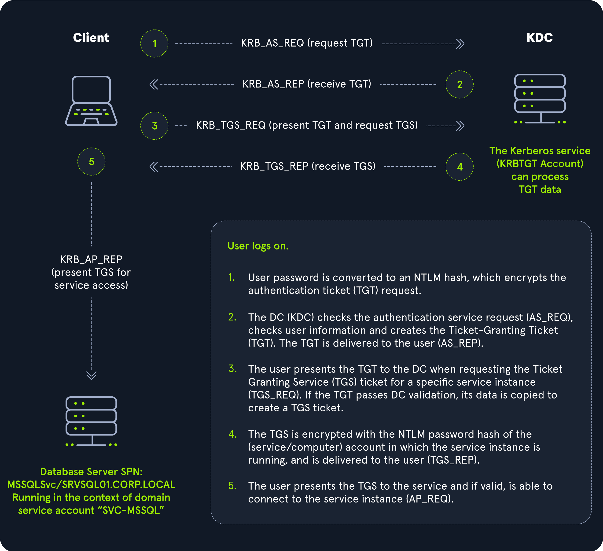
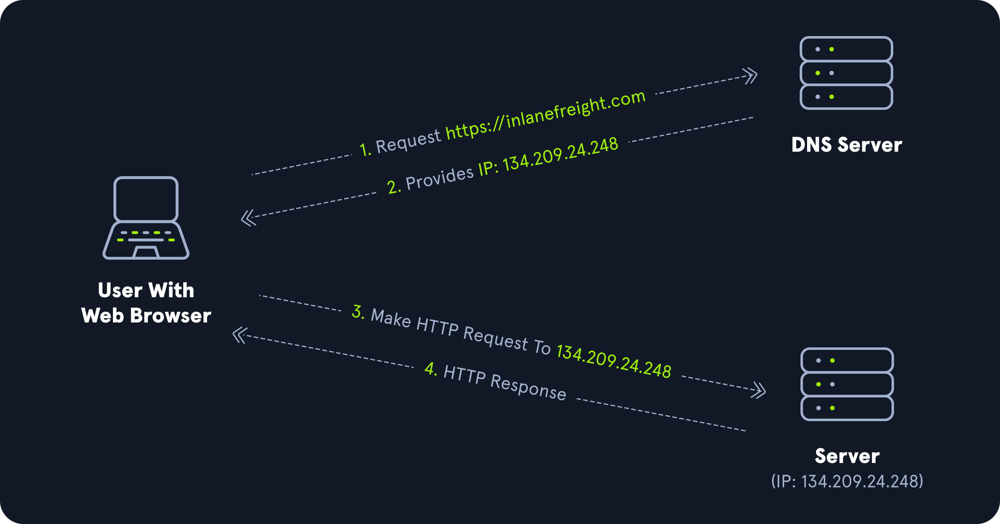
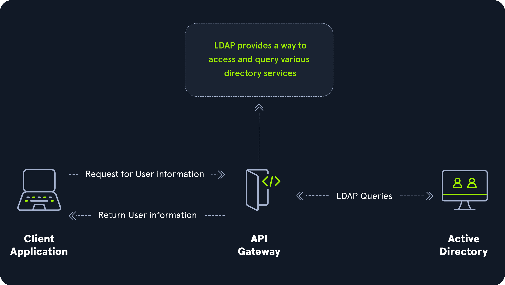

# Active Directory Protocols

## Kerberos, DNS, LDAP, MSRPC

Los sistemas operativos Windows usan muchos protocolos para comunicarse, pero **Active Directory** depende de forma específica de:

* **LDAP (Lightweight Directory Access Protocol)**
* La versión de **Kerberos** de Microsoft
* **DNS** para autenticación y comunicación
* **MSRPC**, la implementación de Microsoft de **Remote Procedure Call (RPC)**, que es una técnica de comunicación entre procesos usada en aplicaciones basadas en el modelo cliente-servidor.

### Kerberos

Kerberos es el **protocolo de autenticación predeterminado** para cuentas de dominio desde Windows 2000.

* Es un **estándar abierto** que permite interoperabilidad con otros sistemas.
* Permite **autenticación mutua**: tanto el usuario como el servidor verifican su identidad.
* Es **sin estado** y **basado en tickets**: nunca transmite la contraseña del usuario por la red.

**Kerberos en AD:**

* Los Controladores de Dominio (DCs) tienen un **Key Distribution Center (KDC)**.
* Cuando un usuario inicia sesión, el cliente solicita un ticket al KDC cifrando la solicitud con la contraseña del usuario.
* Si el KDC puede descifrarla (AS-REQ), emite un **Ticket Granting Ticket (TGT)**.
* El usuario usa el TGT para pedir un **Ticket Granting Service (TGS)** para el servicio deseado.
* Finalmente, el usuario presenta el TGS al servicio, que lo descifra y otorga acceso.

**Resumen del proceso de autenticación Kerberos:**

1. El usuario cifra un timestamp con su contraseña y lo envía al KDC. El KDC lo valida y emite un **TGT** cifrado con la clave secreta de la cuenta **krbtgt**.
2. El usuario recibe el TGT.
3. El usuario presenta el TGT al DC para pedir un **TGS** para un servicio específico (**TGS-REQ**).
4. El TGS se cifra con el hash NTLM del servicio o cuenta de computadora y se devuelve al usuario (**TGS\_REP**).
5. El usuario presenta el TGS al servicio (AP\_REQ) y, si es válido, se le permite el acceso.

> El **puerto estándar de Kerberos** es **88 TCP/UDP**.\
> Durante la enumeración, es común localizar DCs escaneando el puerto 88 con herramientas como **Nmap**.

<figure><figcaption></figcaption></figure>

### DNS

**Active Directory Domain Services (AD DS)** usa **DNS** para:

* Permitir que clientes localicen Controladores de Dominio.
* Facilitar la comunicación entre DCs.
* Resolver nombres de host a direcciones IP.

<figure><figcaption></figcaption></figure>

**Características clave:**

* Usa **SRV records** para permitir a clientes localizar servicios (servidores de archivos, impresoras, DCs).
* **Dynamic DNS** actualiza automáticamente registros si cambia la IP de un sistema.
* Si el DNS no tiene la IP correcta, los clientes no podrán localizar ni comunicarse con él.

**Proceso típico:**

* El cliente consulta DNS por un SRV record del DC.
* Recupera el hostname del DC.
* Resuelve el hostname a la IP del DC.

> **Puertos:**
>
> * UDP 53 (predeterminado)
> * TCP 53 (usado cuando los mensajes superan 512 bytes o UDP falla)

#### Ejemplos con `nslookup`

**Búsqueda directa:**

```
PS C:\htb> nslookup INLANEFREIGHT.LOCAL
Server:  172.16.6.5
Address:  172.16.6.5
Name:    INLANEFREIGHT.LOCAL
Address: 172.16.6.5
```

**Búsqueda inversa:**

```
PS C:\htb> nslookup 172.16.6.5
Server:  172.16.6.5
Address:  172.16.6.5
Name:    ACADEMY-EA-DC01.INLANEFREIGHT.LOCAL
Address: 172.16.6.5
```

**Obtener IP de un host:**

```
PS C:\htb> nslookup ACADEMY-EA-DC01
Server:  172.16.6.5
Address:  172.16.6.5
Name:    ACADEMY-EA-DC01.INLANEFREIGHT.LOCAL
Address: 172.16.6.5
```

> Para más detalles sobre DNS, puedes consultar módulos de **DNS Enumeration Using Python** o la sección **DNS** de **Information Gathering - Web Edition**.

### LDAP

**Active Directory** usa **Lightweight Directory Access Protocol (LDAP)** para consultas de directorio.

* Es un protocolo abierto y multiplataforma.
* La versión más reciente es LDAPv3 (RFC 4511).
* Es **esencial** para admins y pentesters entender su funcionamiento en AD.
* LDAP usa **puerto 389** y LDAPS (con SSL/TLS) usa **puerto 636**.

**Funcionalidad LDAP en AD:**

* Almacena información de cuentas y seguridad.
* Permite compartir esta información con otros dispositivos en la red.
* Es el "lenguaje" usado para que aplicaciones se comuniquen con AD.
* Un **Domain Controller** escucha solicitudes LDAP.

**Analogia:**

> AD : LDAP = Apache : HTTP

**Nota:** Algunas organizaciones usan LDAP sin AD, con servidores como **OpenLDAP**.

#### Autenticación LDAP

LDAP usa la operación **BIND** para establecer el estado de autenticación.

**Tipos de autenticación LDAP:**

* **Autenticación Simple:**
  * Anónima, no autenticada, usuario/contraseña.
  * Usuario y contraseña se usan en la solicitud BIND.
* **Autenticación SASL (Simple Authentication and Security Layer):**
  * Usa servicios externos como **Kerberos** para autenticarse.
  * LDAP envía mensajes de desafío/respuesta hasta autenticar.
  * Más seguro al separar métodos de autenticación del protocolo de aplicación.

> LDAP envía mensajes **en texto claro por defecto**.\
> Se recomienda usar **TLS/SSL** para proteger la información en tránsito.

<figure><figcaption></figcaption></figure>

### MSRPC

**MSRPC** es la implementación de Microsoft de **Remote Procedure Call (RPC)**.

* Usada para comunicación cliente-servidor.
* Windows la usa para acceder a sistemas en AD mediante interfaces RPC clave.

#### Interfaces RPC en AD

| Nombre de Interfaz | Descripción                                                                                                                                                                                                                               |
| ------------------ | ----------------------------------------------------------------------------------------------------------------------------------------------------------------------------------------------------------------------------------------- |
| **lsarpc**         | Llamadas RPC al **Local Security Authority (LSA)** para gestionar política de seguridad local, control de auditoría y autenticación interactiva.                                                                                          |
| **netlogon**       | Proceso de Windows que **autentica usuarios y servicios** en el dominio. Servicio en segundo plano.                                                                                                                                       |
| **samr**           | Remote SAM. Gestiona la **base de datos de cuentas del dominio** (usuarios y grupos). Permite a admins CRUD de objetos. Atacantes lo usan para **reconocimiento** del dominio. Puede limitarse a administradores con cambios de registro. |
| **drsuapi**        | API para **Directory Replication Service (DRS)**. Gestiona replicación entre DCs. Atacantes pueden usarlo para replicar **NTDS.dit**, extraer hashes y realizar **Pass-the-Hash** o cracking offline.                                     |

> **samr** es particularmente peligroso porque, por defecto, **todos los usuarios autenticados** pueden consultar mucha información del dominio.\
> Organizaciones pueden protegerse limitando estas consultas solo a **administradores**.

## Autenticación NTLM

Además de **Kerberos** y **LDAP**, Active Directory usa varios otros métodos de autenticación que pueden (y suelen) ser **abusados** por aplicaciones y servicios en AD.

Entre estos se incluyen: **LM, NTLM, NTLMv1 y NTLMv2**.

* **LM y NTLM** son nombres de hashes.
* **NTLMv1 y NTLMv2** son protocolos de autenticación que usan el hash LM o NT.

Aunque ninguno es perfecto, **Kerberos** suele ser el protocolo de elección siempre que sea posible.

Es esencial entender la diferencia entre los **tipos de hash** y los **protocolos** que los usan.

### Comparación de Hash y Protocolo

| Hash/Protocolo | Técnica criptográfica               | Autenticación mutua | Tipo de mensaje                | Tercero de confianza                              |
| -------------- | ----------------------------------- | ------------------- | ------------------------------ | ------------------------------------------------- |
| NTLM           | Criptografía de clave simétrica     | No                  | Número aleatorio               | Domain Controller                                 |
| NTLMv1         | Criptografía de clave simétrica     | No                  | Hash MD4, número aleatorio     | Domain Controller                                 |
| NTLMv2         | Criptografía de clave simétrica     | No                  | Hash MD4, número aleatorio     | Domain Controller                                 |
| Kerberos       | Criptografía simétrica y asimétrica | Sí                  | Ticket cifrado usando DES, MD5 | Domain Controller / Key Distribution Center (KDC) |

### LM

**LAN Manager (LM o LANMAN)** es el mecanismo más antiguo para almacenamiento de contraseñas en Windows.

* Debutó en **1987** en OS/2.
* Si está habilitado, se guarda en **SAM** en un host Windows y en **NTDS.DIT** en un Domain Controller.
* **Deshabilitado por defecto** desde **Windows Vista / Server 2008** por sus debilidades.
* Aún se encuentra en entornos grandes con sistemas antiguos.

**Limitaciones:**

* Contraseñas limitadas a **14 caracteres**.
* **No distingue mayúsculas/minúsculas**.
* Convertidas a mayúsculas antes de hashearse, reduciendo el keyspace.
* Fácil de crackear con herramientas como **Hashcat**.

**Proceso de creación del hash LM:**

* Contraseña → dos bloques de 7 caracteres.
* Si <14 caracteres, se rellena con NULL.
* Cada bloque → clave DES.
* Se cifran con la cadena **KGS!@#$%**.
* Resultado: dos valores concatenados de 8 bytes.

**Observación:**

* Para contraseñas ≤7 caracteres, la segunda mitad del hash LM es siempre la misma.
* Hash LM típico:

```
299bd128c1101fd6
```

> Windows hasta **Vista / Server 2008** almacenaba por defecto tanto LM como NTLM.

### NTHash (NTLM)

**NT LAN Manager (NTLM)** es el protocolo moderno en Windows.

* Usa un **protocolo challenge-response** con tres mensajes:
  1. **NEGOTIATE\_MESSAGE** → del cliente al servidor.
  2. **CHALLENGE\_MESSAGE** → respuesta del servidor.
  3. **AUTHENTICATE\_MESSAGE** → del cliente al servidor.
* Hashes almacenados en **SAM** o **NTDS.DIT**.

**Algoritmo del NT Hash:**

```
MD4(UTF-16-LE(password))
```

**Ejemplo de NT Hash:**

```
b4b9b02e6f09a9bd760f388b67351e2b
```

**Formato completo del hash NTLM:**

```
Rachel:500:aad3c435b514a4eeaad3b935b51304fe:e46b9e548fa0d122de7f59fb6d48eaa2:::
```

**Partes del hash:**

* **Rachel** → nombre de usuario.
* **500** → RID (Administrador).
* **LM hash** → puede ser inutilizable si está deshabilitado.
* **NT hash** → usado para cracking o pass-the-hash.

**Ejemplo de ataque pass-the-hash con CrackMapExec:**

```
crackmapexec smb 10.129.41.19 -u rachel -H e46b9e548fa0d122de7f59fb6d48eaa2
```

> NTLM no usa **salt**.\
> NT hashes soportan todo Unicode (65,536 caracteres).\
> Pueden crackearse offline con **Hashcat**, incluso contraseñas largas con ataques de diccionario + reglas.

### NTLMv1 (Net-NTLMv1)

* **NTLMv1** → challenge-response usando el NT hash.
* Usa **LM** y **NT hash**, lo que facilita su cracking offline tras captura (p.ej., con **Responder** o **NTLM relay**).
* No soporta pass-the-hash.
* Protocolo para autenticación de red.

**Algoritmo:**

```
C = desafío de 8 bytes (aleatorio)
K1 | K2 | K3 = LM/NT-hash | 5-bytes-0
response = DES(K1,C) | DES(K2,C) | DES(K3,C)
```

**Ejemplo de hash NTLMv1 completo:**

```
u4-netntlm::kNS:338d08f8e26de93300000000000000000000000000000000:9526fb8c23a90751cdd619b6cea564742e1e4bf33006ba41:cb8086049ec4736c
```

> NTLMv1 fue la base para versiones modernas pero tiene **vulnerabilidades conocidas**.

### NTLMv2 (Net-NTLMv2)

Introducido en **Windows NT 4.0 SP4** como alternativa más segura.

* Default desde **Windows Server 2000**.
* Más robusto contra ataques de spoofing.
* En respuesta al desafío de 8 bytes del servidor, el cliente envía **dos respuestas**.

**Algoritmo:**

```
SC = server challenge (8 bytes)
CC = client challenge (8 bytes)
CC* = (X, tiempo, CC2, nombre de dominio)
v2-Hash = HMAC-MD5(NT-Hash, user name, domain name)
LMv2 = HMAC-MD5(v2-Hash, SC, CC)
NTv2 = HMAC-MD5(v2-Hash, SC, CC*)
response = LMv2 | CC | NTv2 | CC*
```

**Ejemplo de hash NTLMv2:**

```
admin::N46iSNekpT:08ca45b7d7ea58ee:88dcbe4446168966a153a0064958dac6:5c7830315c7830310000000000000b45c67103d07d7b95acd12ffa11230e0000000052920b85f78d013c31cdb3b92f5d765c783030
```

> NTLMv2 endurece la seguridad respecto a v1, dificultando ataques de cracking y relay.

### Domain Cached Credentials (MSCache2)

Para cuando un host no puede comunicarse con el DC (p.ej., por un corte de red):

* Windows implementa **MS Cache v1/v2** (Domain Cached Credentials - DCC).
* Guarda los últimos **10 hashes** de usuarios de dominio que iniciaron sesión en el equipo.
* Almacenados en:

```
HKEY_LOCAL_MACHINE\SECURITY\Cache
```

**Características:**

* No sirven para **pass-the-hash**.
* Muy lentos de crackear incluso con GPUs potentes.
* Los ataques necesitan ser **muy dirigidos** o aprovechar contraseñas débiles.

**Formato de hash DCC2:**

```
$DCC2$10240#bjones#e4e938d12fe5974dc42a90120bd9c90f
```

> Como pentesters es vital entender **qué tipos de hashes podemos encontrar en AD**, sus **fortalezas**, **debilidades**, **formas de abuso** (cracking, pass-the-hash, relay) y **cuándo un ataque es inviable** (como perder días intentando romper DCCs).

