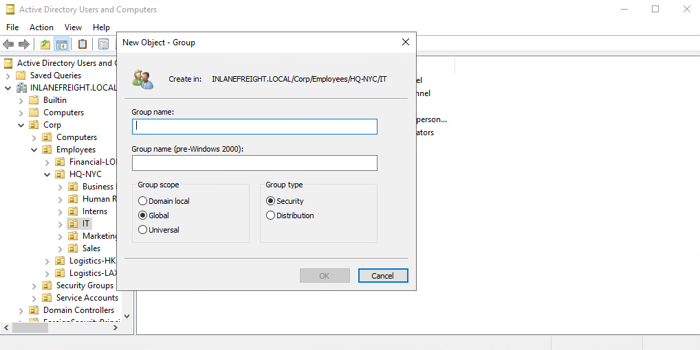
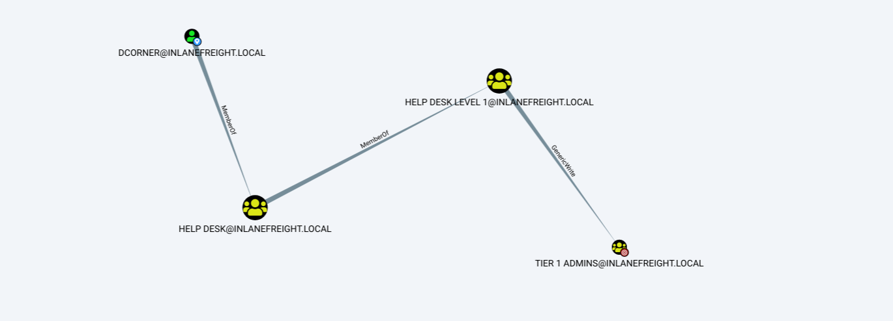

# All About Users

## Cuentas de Usuario y de Máquina

Las **cuentas de usuario** se crean tanto en sistemas locales (no unidos a AD) como en **Active Directory** para permitir que una persona o un programa (como un servicio del sistema) inicie sesión en un equipo y acceda a recursos según sus permisos.

Cuando un usuario inicia sesión:

* El sistema **verifica su contraseña**.
* Se crea un **token de acceso**.
* Este token describe la identidad de seguridad y la pertenencia a grupos.

El token se presenta cada vez que el usuario interactúa con un proceso.

**Usos típicos de cuentas de usuario:**

* Permitir que empleados o contratistas inicien sesión y accedan a recursos.
* Ejecutar programas o servicios bajo un contexto de seguridad específico.
* Gestionar el acceso a objetos como recursos compartidos, archivos o aplicaciones.

**Grupos:**

* Permiten contener varios usuarios.
* Facilitan la asignación de permisos de forma centralizada (se otorgan al grupo y todos los miembros heredan).
* Simplifican la administración y revocación de derechos.

<figure><figcaption></figcaption></figure>

### Gestión de Cuentas en Active Directory

* Una de las funciones **centrales** de AD es la **provisión y gestión de cuentas de usuario**.
* Típicamente, cada empleado tendrá **al menos una cuenta** en AD.
* Usuarios con roles específicos (IT admin, Help Desk) pueden tener **dos o más cuentas**.
* Además de cuentas estándar, existen **service accounts** para ejecutar aplicaciones o servicios en segundo plano.

> En una empresa de 1000 empleados puede haber **1200+ cuentas activas**.

**Cuentas deshabilitadas:**

* Empleados anteriores, temporales, internos, etc.
* Por requisitos de auditoría, se suelen **desactivar** (idealmente quitando todos los privilegios) en lugar de eliminarlas.
* Es común tener una OU como **FORMER EMPLOYEES** para contenerlas.

### Ejemplo de consola ADUC

La interfaz **Active Directory Users and Computers (ADUC)** muestra OUs y grupos de seguridad como:

* Employees
* Security Groups
* Service Accounts

### Derechos de las cuentas de usuario en AD

* Pueden ir desde **lectura básica** (Domain User) hasta **Enterprise Admin** (control total).
* Gran variedad de combinaciones intermedias.
* La flexibilidad → riesgo de **errores de configuración** y otorgar **accesos no intencionados**.
* **Superficie de ataque importante** en pentesting.

> Los usuarios suelen ser **el eslabón más débil** de la seguridad organizacional.

**Riesgos comunes:**

* Contraseñas débiles o compartidas.
* Software no autorizado.
* Errores de admins al gestionar permisos.

**Recomendación:**

* Políticas y procedimientos claros.
* **Defensa en profundidad** para mitigar riesgos inherentes de las cuentas de usuario.j

### Cuentas Locales

* Almacenadas **localmente** en un servidor o estación de trabajo.
* Los permisos se aplican **solo en ese host**.
* Son **security principals**, pero solo controlan acceso local.

#### Cuentas locales predeterminadas en Windows

* **Administrator:**
  * SID: `S-1-5-domain-500`.
  * Primera cuenta al instalar Windows.
  * Control total.
  * No puede borrarse o bloquearse, pero puede deshabilitarse o renombrarse.
  * En Windows 10/Server 2016 está **deshabilitada por defecto**.
* **Guest:**
  * Deshabilitada por defecto.
  * Permite acceso temporal con derechos limitados.
  * Contraseña en blanco por defecto.
  * Recomendado mantenerla **deshabilitada**.
* **SYSTEM:**
  * Cuenta **NT AUTHORITY\SYSTEM**.
  * Usada por el sistema operativo.
  * Sin perfil de usuario.
  * Permisos sobre casi todo el sistema.
  * No aparece en User Manager ni puede agregarse a grupos.
  * Equivalente al nivel **root** en Windows.
* **Network Service:**
  * Cuenta local predeterminada.
  * Usada por **Service Control Manager (SCM)**.
  * Presenta **credenciales a servicios remotos**.
* **Local Service:**
  * También usada por el **SCM**.
  * Privilegios mínimos en el equipo.
  * Presenta **credenciales anónimas** en red.

> Recomendación: revisar la documentación oficial de Microsoft para entender las diferencias y usos.

### Usuarios de Dominio

Diferencias clave con usuarios locales:

* Derechos otorgados **por el dominio**.
* Acceso a recursos como **servidores de archivos, impresoras, hosts de intranet**, etc.
* Pueden iniciar sesión en **cualquier host del dominio**.

**Cuenta importante:**

* **KRBTGT**
  * Cuenta de servicio **integrada** en AD.
  * Administra el **Key Distribution Service** para Kerberos.
  * Objetivo frecuente de atacantes.
  * Compromiso → acceso **sin restricciones** al dominio.
  * Usado en ataques como **Golden Ticket**.

### Atributos de Nombres de Usuario

Mejoran la seguridad y ayudan a identificar objetos de usuario.

| Atributo                    | Descripción                                                                              |
| --------------------------- | ---------------------------------------------------------------------------------------- |
| **UserPrincipalName (UPN)** | Nombre principal de inicio de sesión. Usualmente el **email** del usuario.               |
| **ObjectGUID**              | Identificador único del objeto. Nunca cambia, incluso si se elimina el usuario.          |
| **SAMAccountName**          | Nombre de inicio de sesión compatible con versiones antiguas de Windows.                 |
| **objectSID**               | Identificador de seguridad del usuario. Identifica al usuario y su pertenencia a grupos. |
| **sIDHistory**              | Contiene SIDs anteriores del usuario (usado en migraciones de dominio).                  |

#### Ejemplo de atributos de usuario

```
PS C:\htb> Get-ADUser -Identity htb-student

DistinguishedName : CN=htb student,CN=Users,DC=INLANEFREIGHT,DC=LOCAL
Enabled           : True
GivenName         : htb
Name              : htb student
ObjectClass       : user
ObjectGUID        : aa799587-c641-4c23-a2f7-75850b4dd7e3
SamAccountName    : htb-student
SID               : S-1-5-21-3842939050-3880317879-2865463114-1111
Surname           : student
UserPrincipalName : htb-student@INLANEFREIGHT.LOCAL
```

> Existen **muchos otros atributos**. Algunos irrelevantes para seguridad, otros clave para descubrir datos sensibles o planear ataques.

### Máquinas unidas o no al dominio

#### Domain-joined

* Mayor facilidad para **compartir información** en la empresa.
* Punto de gestión centralizado (DC).
* Aplicación de **Group Policy** para configuraciones.
* Usuarios pueden acceder a recursos desde **cualquier host** del dominio.

**Típica en entornos empresariales.**

#### Non-domain-joined

* No gestionadas por políticas de dominio.
* Compartir recursos **más complicado** fuera de la red local.
* Adecuado para **uso doméstico** o **pequeñas empresas**.
* Cada cuenta de usuario existe solo **localmente** en el host.
* No se migran perfiles entre hosts.

### Importancia del Acceso SYSTEM en Máquinas del Dominio

* Una cuenta de máquina (**NT AUTHORITY\SYSTEM**) en AD tiene **permisos similares a un usuario de dominio estándar**.
* No siempre necesitamos credenciales de usuario válidas para empezar a **enumerar** y atacar un dominio.
* Podemos conseguir acceso SYSTEM mediante:
  * **Remote Code Execution**.
  * **Privilege Escalation** local.

**Acceso SYSTEM no solo sirve para:**

* Robar datos sensibles locales (contraseñas, claves SSH, archivos).

**También permite:**

* Leer muchos datos del dominio.
* Punto de partida para ataques más complejos en AD.

## Grupos de Active Directory

Después de los usuarios, **los grupos** son otro objeto fundamental en Active Directory.

* Permiten **agrupar usuarios similares** y asignar **derechos y accesos en masa**.
* Son un objetivo clave para **atacantes** y **pentesters** porque los derechos conferidos pueden no ser evidentes y otorgar **privilegios excesivos o no intencionados** si no se configuran correctamente.

**AD incluye muchos grupos predeterminados**, y la mayoría de las organizaciones crean **grupos personalizados** para definir derechos y gestionar el acceso en el dominio.

> El número de grupos puede **crecer rápidamente** y volverse difícil de gestionar, generando acceso no deseado si no se audita regularmente.

**Recomendación:**

* Auditar periódicamente **qué grupos existen**, **qué privilegios otorgan** y **quiénes son sus miembros**.

### Diferencia entre Grupos y OUs

* **Organizational Units (OUs):**
  * Agrupan usuarios, grupos y computadoras para **facilitar la administración** y **aplicar GPOs**.
  * Permiten **delegar tareas administrativas** (p.ej., resetear contraseñas) sin dar más privilegios.
* **Grupos:**
  * Usados **principalmente para asignar permisos de acceso a recursos**.
  * Facilitan la administración de **derechos y accesos**.

### Tipos de Grupos

En términos simples, **los grupos** organizan **usuarios, computadoras y contactos** en unidades de gestión para:

* Asignar **permisos de forma sencilla**.
* Facilitar la **asignación de recursos** (impresoras, carpetas compartidas, etc.).

**Ejemplo práctico:**

* En lugar de añadir **50 usuarios individualmente** a un recurso compartido, se crea/usa un grupo.
* Al otorgar permisos al **grupo**, todos los miembros heredan el acceso.
* Para revocar acceso → basta con **quitar al usuario del grupo**.

### Características Fundamentales

1. **Tipo de grupo (Group Type):**
   * Define el **propósito** del grupo.
2. **Ámbito (Group Scope):**
   * Define **cómo puede usarse** dentro del dominio o bosque.

### Tipos de Grupo

* **Security Groups:**
  * Para **asignar permisos y derechos**.
  * Todos los miembros heredan permisos.
  * Facilita la **gestión** y reduce errores.
* **Distribution Groups:**
  * Usados por aplicaciones de **correo electrónico** (como Exchange).
  * Funcionan como **listas de correo**.
  * **No** pueden asignar permisos de acceso a recursos.

### Scopes de Grupo

Al crear un grupo, se elige su **scope**. Existen **tres** scopes:

#### 1- Domain Local Group

* Gestiona permisos **solo en su dominio**.
* Puede contener **usuarios de otros dominios**.
* Puede anidarse en **otros grupos locales**.
* **No** puede anidarse en **grupos globales**.

#### 2- Global Group

* Otorga acceso **en otros dominios**.
* Solo puede contener **cuentas de su dominio**.
* Puede añadirse a **grupos globales** y **locales**.

#### 3- Universal Group

* Gestiona recursos **en varios dominios** dentro del mismo bosque.
* Puede contener **usuarios de cualquier dominio**.
* Almacenados en el **Global Catalog (GC)**.
* Añadir/quitar miembros → **replicación a todo el bosque**.

> Recomendación:\
> Mantener **grupos globales** como miembros de **grupos universales** para minimizar replicación innecesaria.

<figure><figcaption></figcaption></figure>

### Ejemplo de Scopes en AD

```
PS C:\htb> Get-ADGroup -Filter * | select samaccountname,groupscope

samaccountname                    groupscope
--------------                    ----------
Administrators                    DomainLocal
Users                             DomainLocal
Guests                            DomainLocal
...
Domain Computers                  Global
Domain Controllers                Global
Schema Admins                     Universal
Enterprise Admins                 Universal
...
```

### Reglas para Cambiar Scopes

* **Global → Universal:** solo si **no es miembro de otro grupo global**.
* **Domain Local → Universal:** solo si **no contiene otros Domain Local Groups**.
* **Universal → Domain Local:** **sin restricciones**.
* **Universal → Global:** solo si **no contiene otros Universal Groups**.

### Built-in vs Custom Groups

* **Built-in Groups:**
  * Creados por defecto al crear un dominio.
  * Scope → **Domain Local**.
  * Usados para **tareas administrativas específicas**.
  * Solo aceptan **usuarios** (no se permite nesting).
  * Ejemplo: **Domain Admins** es un **Global Security Group**.
* **Custom Groups:**
  * Creados por la organización para sus **propósitos específicos**.
  * AD también puede crear grupos al instalar **servicios adicionales** (p.ej., Exchange).

> Algunos grupos creados por aplicaciones pueden ser **altamente privilegiados**.

<figure><figcaption></figcaption></figure>

### Nested Group Membership

**Concepto clave:**

* Un **Domain Local Group** puede ser **miembro de otro** Domain Local Group.
* Los usuarios pueden **heredar privilegios indirectos**.
* Puede ser **difícil de detectar** sin análisis profundo.

**Ejemplo:**

* El usuario DCORNER no es miembro directo de **Helpdesk Level 1**, pero al estar en **Help Desk**, hereda los mismos permisos.
* Puede conseguir permisos para agregar miembros al grupo **Tier 1 Admins** (GenericWrite).
* → Posible escalada de privilegios.

**Herramienta útil:**

* **BloodHound** → descubre **caminos de ataque** a través de memberships anidados.

### Atributos Importantes de Grupos

* **cn:** Nombre común del grupo.
* **member:** Miembros del grupo (usuarios, grupos, contactos).
* **groupType:** Tipo y scope del grupo.
* **memberOf:** Grupos que contienen este grupo.
* **objectSid:** SID único del grupo (security principal).

**Conclusión:**\
Los grupos son **objetos fundamentales** en AD para:

* Organizar otros objetos.
* Gestionar derechos y accesos de forma eficiente.

> Conocer **tipos, scopes y memberships anidados** es vital para:
>
> * Administrar AD correctamente.
> * Realizar **recon** durante pentesting.
> * Comprender cómo se pueden **aprovechar trusts** y **realizar ataques** en el dominio o entre dominios.

## Derechos y Privilegios en Active Directory

Los **derechos y privilegios** son **fundamentales** en la administración de Active Directory.\
Si se **administran mal**, pueden ser **abusados** fácilmente por atacantes o pentesters.

Es esencial **diferenciar** estos conceptos:

* **Derechos (Rights):**
  * Asignados a **usuarios o grupos**.
  * Definen permisos para **acceder a un objeto** (por ejemplo, un archivo).
* **Privilegios (Privileges):**
  * Permiten **realizar una acción** (ejecutar un programa, apagar un sistema, resetear contraseñas).
  * Pueden asignarse **individualmente** o mediante **pertenencia a grupos**.

**User Rights Assignment** en Windows:

* Aunque se les llama _rights_, son en realidad **privilegios** que se pueden otorgar a un usuario.
* Se pueden configurar mediante **Group Policy Objects (GPOs)**.

> Comprender la diferencia y cómo se aplican en un entorno AD es esencial para la seguridad.

***

### Grupos Integrados en Active Directory

AD tiene **grupos de seguridad integrados** con privilegios importantes.

* Mal gestionados, pueden permitir **escaladas de privilegios** hasta **Domain Admin** o **SYSTEM** en un **Domain Controller (DC)**.
* La membresía debe **gestionarse estrictamente**.

### Ejemplos de Grupos Integrados

| Nombre del Grupo                       | Descripción                                                                                                                                                                            |
| -------------------------------------- | -------------------------------------------------------------------------------------------------------------------------------------------------------------------------------------- |
| **Account Operators**                  | Crear y modificar la mayoría de cuentas (usuarios, grupos locales y globales). No pueden gestionar cuentas administrativas ni ciertos grupos. Pueden iniciar sesión localmente en DCs. |
| **Administrators**                     | Acceso completo a un equipo o dominio (en DCs).                                                                                                                                        |
| **Backup Operators**                   | Respaldar/restaurar todos los archivos, independientemente de permisos. Pueden iniciar sesión y apagar el equipo. En DCs, pueden extraer la base SAM/NTDS.                             |
| **DnsAdmins**                          | Acceso a información DNS de red. Solo existe si se instaló el rol DNS en un DC.                                                                                                        |
| **Domain Admins**                      | Administración completa del dominio. Miembros del grupo local Administrators en todos los equipos unidos al dominio.                                                                   |
| **Domain Computers**                   | Incluye computadoras unidas al dominio (excepto DCs).                                                                                                                                  |
| **Domain Controllers**                 | Contiene todos los DCs del dominio.                                                                                                                                                    |
| **Domain Guests**                      | Incluye la cuenta Guest del dominio. Perfil creado al iniciar sesión como invitado.                                                                                                    |
| **Domain Users**                       | Incluye todas las cuentas de usuario del dominio.                                                                                                                                      |
| **Enterprise Admins**                  | Configuración completa en el bosque. Solo existe en el dominio raíz. Puede crear dominios hijos o trusts.                                                                              |
| **Event Log Readers**                  | Leer logs de eventos. Solo existe en DCs.                                                                                                                                              |
| **Group Policy Creator Owners**        | Crear, editar o eliminar GPOs.                                                                                                                                                         |
| **Hyper-V Administrators**             | Acceso total a Hyper-V. Virtual DCs administrados por ellos → nivel Domain Admin.                                                                                                      |
| **IIS\_IUSRS**                         | Usado por Internet Information Services (IIS).                                                                                                                                         |
| **Pre–Windows 2000 Compatible Access** | Compatibilidad con NT 4.0 y anteriores. Puede permitir lectura no autorizada en AD.                                                                                                    |
| **Print Operators**                    | Gestionar impresoras conectadas a DCs. Pueden cargar drivers maliciosos para escalar privilegios.                                                                                      |
| **Protected Users**                    | Protección adicional contra robo de credenciales.                                                                                                                                      |
| **Read-only Domain Controllers**       | Todos los DCs de solo lectura.                                                                                                                                                         |
| **Remote Desktop Users**               | Permiso para conectarse vía RDP. No se puede renombrar, eliminar o mover.                                                                                                              |
| **Remote Management Users**            | Acceso remoto vía WinRM.                                                                                                                                                               |
| **Schema Admins**                      | Modificar el esquema de AD. Solo en el dominio raíz.                                                                                                                                   |
| **Server Operators**                   | Gestionar servicios, acceder a shares, respaldar archivos en DCs. Por defecto, sin miembros.                                                                                           |

### Ejemplo: Detalles del Grupo Server Operators

```powershell
Get-ADGroup -Identity "Server Operators" -Properties *
```

**Salida resumida:**

* `GroupScope`: DomainLocal
* `Description`: Members can administer domain servers
* **Sin miembros por defecto**.

### Ejemplo: Detalles del Grupo Domain Admins

```powershell
Get-ADGroup -Identity "Domain Admins" -Properties * | select DistinguishedName,GroupCategory,GroupScope,Name,Members
```

**Salida resumida:**

* `GroupScope`: Global
* `Members`: varios usuarios y cuentas de servicio.

> **Cuidado**: cualquier usuario en Domain Admins tiene las **llaves del dominio**.

### User Rights Assignment

* Los **derechos/privilegios** dependen de:
  * Pertenencia a grupos.
  * Configuración vía **Group Policy (GPO)**.
* **Ejemplo de abuso:**
  * Obtener acceso de escritura a un GPO.
  * Usar **SharpGPOAbuse** para asignar privilegios a una cuenta.

### Ejemplos de Privilegios Peligrosos

| Privilegio                        | Descripción                                                                        |
| --------------------------------- | ---------------------------------------------------------------------------------- |
| **SeRemoteInteractiveLogonRight** | Permite iniciar sesión vía RDP.                                                    |
| **SeBackupPrivilege**             | Crear backups → extraer SAM, SYSTEM, NTDS.dit.                                     |
| **SeDebugPrivilege**              | Leer memoria de procesos como LSASS (usando Mimikatz).                             |
| **SeImpersonatePrivilege**        | Impersonar tokens privilegiados (exploits: JuicyPotato, RogueWinRM, PrintSpoofer). |
| **SeLoadDriverPrivilege**         | Cargar drivers → posible escalada.                                                 |
| **SeTakeOwnershipPrivilege**      | Tomar propiedad de objetos (p.ej., archivos compartidos).                          |

> Un solo error de configuración puede comprometer **todo el dominio**.

### Ver Privilegios de un Usuario

En un host:

```powershell
whoami /priv
```

**Nota:** Algunos derechos solo aparecen/elevan en sesión **elevada** (CMD/PowerShell como Admin).

#### Ejemplo: Usuario de Dominio Estándar

```powershell
PS> whoami /priv

SeChangeNotifyPrivilege       Enabled
SeIncreaseWorkingSetPrivilege Disabled
```

* Derechos **muy limitados**.

#### Ejemplo: Domain Admin (No Elevado)

```powershell
PS> whoami /priv

SeShutdownPrivilege           Disabled
SeChangeNotifyPrivilege       Enabled
SeUndockPrivilege             Disabled
SeIncreaseWorkingSetPrivilege Disabled
SeTimeZonePrivilege           Disabled
```

> Windows restringe derechos por defecto usando **UAC**.

#### Ejemplo: Domain Admin (Elevado)

```powershell
PS> whoami /priv

SeIncreaseQuotaPrivilege                  Disabled
SeBackupPrivilege                         Disabled
SeDebugPrivilege                          Enabled
SeImpersonatePrivilege                    Enabled
...
```

> Muestra **todos los privilegios** disponibles en contexto **elevado**.

#### Ejemplo: Backup Operators

```powershell
PS> whoami /priv

SeShutdownPrivilege           Disabled
SeChangeNotifyPrivilege       Enabled
SeIncreaseWorkingSetPrivilege Disabled
```

* Aunque limitado, **SeShutdownPrivilege** permite apagar un DC.
