# Digging in Deeper

## Seguridad en Active Directory

A lo largo de este módulo hemos explorado muchas características y funcionalidades de Active Directory (AD).\
Todas ellas se diseñaron con la **gestión centralizada** y la **compartición rápida de información** en mente.

Sin embargo, **AD es inherentemente inseguro por diseño**.

* Una instalación por defecto carece de muchas medidas de **endurecimiento** (hardening).
* Es fácil de desplegar, pero **difícil de proteger** si no se toman precauciones.

En ciberseguridad, siempre hablamos del **Triángulo CIA**:

* **Confidencialidad (Confidentiality)**
* **Integridad (Integrity)**
* **Disponibilidad (Availability)**

AD está diseñado para priorizar **Disponibilidad** y **Confidencialidad**, muchas veces a costa de la **Integridad**.

### Triángulo CIA

**Confidencialidad:** Control de acceso adecuado.\
**Integridad:** Garantizar que los datos no sean modificados sin autorización.\
**Disponibilidad:** Asegurar el acceso a recursos cuando sea necesario.

> **Objetivo:** Balancear estas propiedades usando herramientas y configuraciones que **endurezcan AD**.

<figure>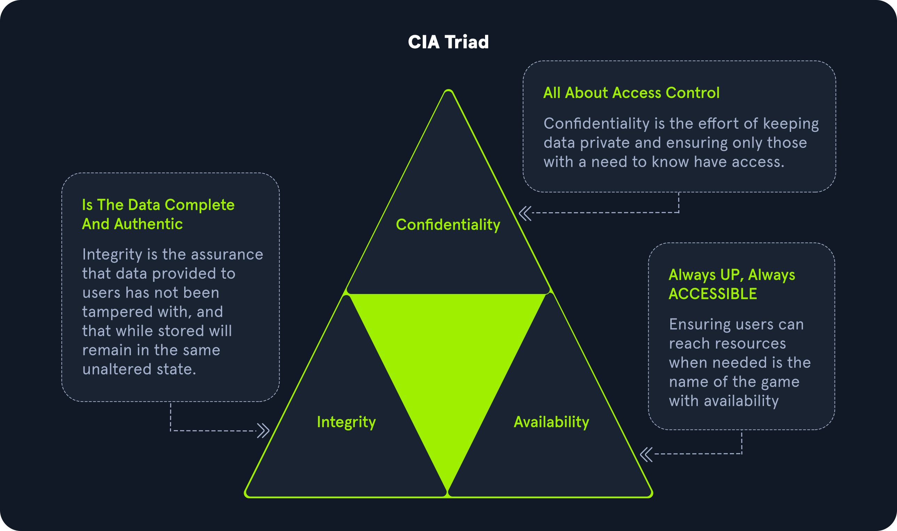<figcaption></figcaption></figure>

### Medidas Generales de Hardening para Active Directory

> No es una lista exhaustiva, sino un **mínimo recomendado** para cualquier organización.

#### Microsoft Local Administrator Password Solution (LAPS)

* Randomiza y rota automáticamente las **contraseñas de administradores locales** en equipos Windows.
* Previene **movimiento lateral** tras el compromiso de un host.
* Contraseñas se rotan en intervalos definidos (12h, 24h, etc.).
* Gratuita y fácil de implementar.

> No sustituye otras prácticas, pero es **muy efectiva** como parte de una estrategia de defensa en profundidad.

#### Configuración de Políticas de Auditoría (Logging y Monitoreo)

* **Vital** para detectar y reaccionar ante cambios inesperados.
* Detecta:
  * Creación/modificación de usuarios o computadoras.
  * Cambios de contraseñas.
  * Accesos no autorizados.
  * Ataques como **password spraying** o ataques avanzados como **Kerberos abuse**.

#### Configuración de Seguridad via Group Policy Objects (GPOs)

* Aplicadas a **usuarios, grupos y computadoras** en OUs específicas.
* Ayudan a **endurecer AD** mediante múltiples políticas.

**Ejemplos de políticas:**

* **Account Policies:** Contraseñas, lockout, parámetros de Kerberos.
* **Local Policies:** Auditoría, derechos de usuario, controles de seguridad locales.
* **Software Restriction Policies:** Controlar qué software puede ejecutarse.
* **Application Control Policies (AppLocker):** Restringir aplicaciones para ciertos usuarios/grupos.
* **Advanced Audit Policy Configuration:** Auditar acceso a archivos, cambios de políticas, uso de privilegios.

> AppLocker y restricciones similares **no son infalibles**, pero son parte esencial de una estrategia **defense in depth**.

<figure>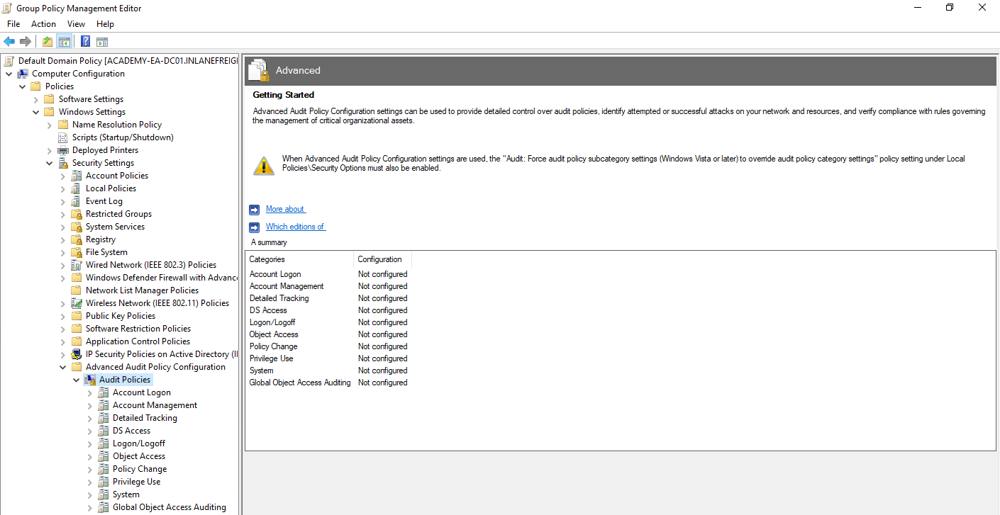<figcaption></figcaption></figure>

#### Gestión de Actualizaciones (SCCM/WSUS)

* **WSUS:** Servicio para automatizar parches en sistemas Windows.
* **SCCM:** Solución de pago que amplía funcionalidades sobre WSUS.

> La gestión manual de parches → Riesgo alto de hosts desactualizados y vulnerables.

#### Group Managed Service Accounts (gMSA)

* Cuentas **gestionadas por el dominio** para servicios/aplicaciones no interactivas.
* Contraseñas de 120 caracteres generadas automáticamente.
* Cambio automático de contraseña a intervalos regulares.
* Nadie necesita conocer la contraseña.

#### Grupos de Seguridad

* Facilitan asignación de permisos de acceso a recursos.
* Evitan gestión **usuario por usuario**.
* Usados para: shares, carpetas, impresoras, documentos.

**Ejemplos de grupos integrados:**

* Account Operators
* Administrators
* Backup Operators
* Domain Admins
* Domain Users

> Asigna **permisos granulares** en masa → Administración más sencilla y segura.

<figure>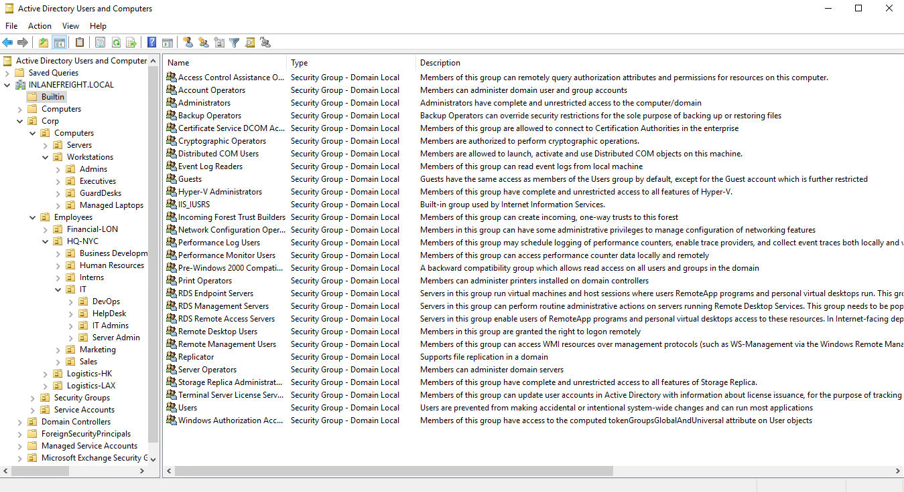<figcaption></figcaption></figure>

#### Separación de Cuentas Administrativas

* Administradores deben tener **dos cuentas**:
  * Una para tareas diarias (correo, ofimática).
  * Otra para tareas administrativas.

**Ejemplo:**

* `sjones` (usuario normal).
* `sjones_adm` (administrador).

> Evita que el compromiso de una máquina resulte en el **robo de credenciales privilegiadas**.

#### Políticas de Contraseñas: Complejidad, Passphrases y 2FA

* Contraseñas de 7-8 caracteres son **fáciles de romper** con herramientas como Hashcat.
* Usar **passphrases** o contraseñas largas generadas aleatoriamente.
* Evitar palabras comunes o el nombre de la empresa.
* **Longitud mínima recomendada:**
  * Usuarios estándar: 12 caracteres.
  * Administradores/servicios: más aún.
* **MFA/2FA** para acceso vía RDP → Impide movimiento lateral fácil.

#### Limitar el Uso de Cuentas Domain Admin

* Deben **usarse solo en Domain Controllers**.
* No usarlas en estaciones de trabajo, jump hosts, web servers.
* Reduce el riesgo de **exposición de contraseñas** en memoria.

#### Auditoría y Eliminación de Cuentas Obsoletas

* Revisar periódicamente cuentas **no usadas**.
* Desactivar o eliminar cuentas antiguas (servicios, ex empleados).
* Evitar **puntos de entrada fáciles** con contraseñas viejas o débiles.

#### Auditoría de Permisos y Accesos

* Verificar:
  * Derechos de administrador local.
  * Número de Domain Admins y Enterprise Admins.
  * Acceso a shares y recursos.
  * Membresía en grupos privilegiados.

> Menos es más → **Reducir la superficie de ataque**.

#### Políticas de Auditoría y Logging

* Imprescindible para **visibilidad del dominio**.
* Detectar:
  * Intentos de login fallidos masivos (**password spraying**).
  * Intentos de Kerberoasting.
  * Enumeración de AD.

> Usar las **recomendaciones de Microsoft** sobre auditoría para maximizar efectividad.

#### Uso de Restricted Groups

* Configurar membresía de grupos críticos vía GPO.
* Controlar quién está en **Administrators**, **Domain Admins**, **Enterprise Admins**, etc.
* Ejemplo: restringir **Administrators locales** solo al Admin local y Domain Admins.

#### Limitar Roles en Servidores Críticos

* Evitar roles innecesarios en **Domain Controllers**.
* Ejemplo: **NO instalar IIS** en un DC.
* Separar roles:
  * Web Servers ≠ Exchange ≠ DCs ≠ Database Servers.
* Reduce superficie de ataque y facilita contención.

#### Limitar Derechos de Admin Local y Acceso RDP

* Controlar **quién es admin local** en qué máquinas.
* Usar **Restricted Groups** para administración.
* Evitar dar admin local a **Domain Users** en cualquier host.
* Controlar **quién puede hacer RDP**.
* Menos accesos → Menor riesgo de robo de credenciales en memoria.

## Examinando las Directivas de Grupo (Group Policy)

**Group Policy** es una característica de Windows que brinda a los administradores un **conjunto avanzado de configuraciones** aplicables a cuentas de usuario y equipos en un entorno Windows.

Cada host Windows tiene un **Editor de Directiva de Grupo Local** para administrar configuraciones locales.\
**Pero aquí nos enfocaremos en su uso en un contexto de dominio** para gestionar usuarios y equipos en Active Directory.

Group Policy es:

* Una herramienta poderosa para **configurar y administrar sistemas operativos, usuarios y aplicaciones**.
* Un componente **clave de la seguridad** en un dominio.

> AD no es seguro "out of the box" → Group Policy es crucial para una **estrategia de defensa en profundidad**.

### Abuso por atacantes

Aunque Group Policy es excelente para seguridad, también puede ser **abusada por atacantes**.\
Si un atacante obtiene derechos sobre un **GPO**, podría:

* Moverse lateralmente en la red.
* Escalar privilegios.
* Comprometer completamente el dominio.
* Mantener persistencia (backdoors).

> Entender cómo funciona Group Policy nos da **ventaja defensiva y ofensiva**.

### ¿Qué es un Group Policy Object (GPO)?

Un **GPO** es **una colección virtual de configuraciones** aplicables a usuarios o equipos.

**Ejemplos de políticas en un GPO:**

* Timeout de bloqueo de pantalla.
* Deshabilitar puertos USB.
* Enforzar políticas de contraseñas personalizadas.
* Instalar software.
* Administrar aplicaciones.
* Configurar acceso remoto.

**Características clave de un GPO:**

* Nombre único y **GUID único**.
* Puede vincularse a **OUs, dominios o sitios**.
* Puede aplicarse a múltiples contenedores.
* Un contenedor puede tener **múltiples GPOs**.

### Ejemplos de uso de GPOs

* Diferentes políticas de contraseña para cuentas de servicio, admins y usuarios.
* Bloquear el uso de medios extraíbles (USBs).
* Enforzar protector de pantalla con contraseña.
* Restringir el uso de cmd.exe y PowerShell a usuarios estándar.
* Configurar políticas de auditoría y logging.
* Bloquear programas o scripts no autorizados.
* Desplegar software en toda la organización.
* Bloquear instalación de software no aprobado.
* Mostrar banners de advertencia al iniciar sesión.
* Deshabilitar uso de LM hashes.
* Ejecutar scripts en inicio, apagado, login y logout.

> **Ejemplo:** En Windows Server 2008, la política de contraseñas por defecto exige:
>
> * Mínimo 7 caracteres.
> * Al menos 3 de 4 categorías: mayúsculas, minúsculas, números, caracteres especiales.

<figure>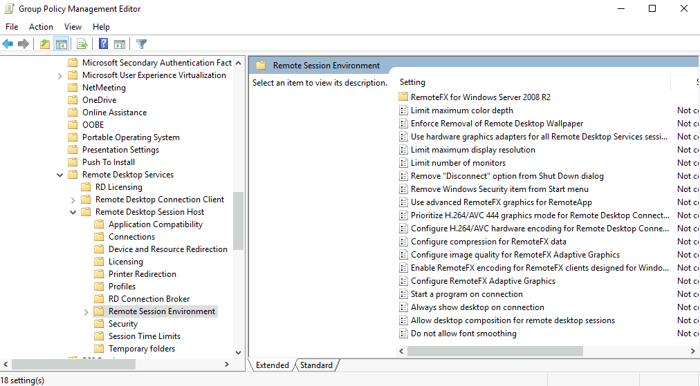<figcaption></figcaption></figure>

### Estructura jerárquica de aplicación de GPOs

GPOs se aplican siguiendo un **orden jerárquico** en AD:

| Nivel                        | Descripción                                                                                                                                                                                                |
| ---------------------------- | ---------------------------------------------------------------------------------------------------------------------------------------------------------------------------------------------------------- |
| **Local Group Policy**       | Configuraciones definidas localmente en el host. Se sobrescriben si hay una configuración similar en niveles superiores.                                                                                   |
| **Site Policy**              | Políticas específicas para un sitio en la empresa. Ideal para entornos con múltiples ubicaciones. Por ejemplo, aplicar controles más estrictos en un edificio donde se realiza investigación confidencial. |
| **Domain-wide Policy**       | Políticas aplicables a **todo el dominio**. Ejemplo: nivel de complejidad de contraseña, fondo de escritorio, banner de uso autorizado.                                                                    |
| **Organizational Unit (OU)** | Políticas específicas para usuarios y computadoras en ciertas OUs. Ejemplo: mapping de drives solo para RRHH, habilitar PowerShell solo para IT.                                                           |
| **OUs anidadas**             | Políticas aún más específicas. Ejemplo: dar a Analistas de Seguridad configuraciones de Applocker distintas a IT general.                                                                                  |

### Consola de Administración de Directivas de Grupo (GPMC)

* Herramienta gráfica para administrar GPOs en un DC.
* También se pueden gestionar con **PowerShell (módulo GroupPolicy)**.
* GPOs predeterminados:
  * **Default Domain Policy**: se aplica por defecto a todo el dominio.
  * **Default Domain Controllers Policy**: configura seguridad y auditoría base para DCs.

> ⚠️ **Best Practice:** usar el **Default Domain Policy** para ajustes globales del dominio.

### Orden de precedencia de GPOs

* Los GPOs se **procesan de arriba hacia abajo** en la jerarquía.
* Un GPO **más específico (OU)** anula al más general (Dominio).
* **Computer Configuration** tiene más prioridad que **User Configuration** para la misma configuración.

**Ejemplo visual:**

1. Local Policy
2. Site Policy
3. Domain Policy
4. Parent OU Policy
5. Child OU Policy

> Un GPO en un **Child OU** se procesa al final → **mayor precedencia**.

<figure>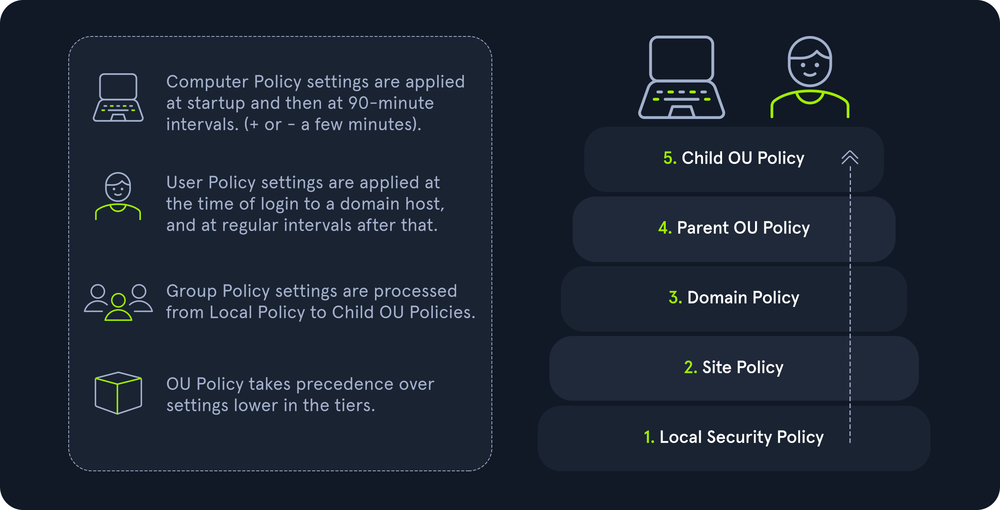<figcaption></figcaption></figure>

### Link Order en un OU

* Cuando varios GPOs están enlazados a un OU → se procesan por **Link Order**.
* **Link Order 1** = mayor precedencia.

**Ejemplo:**

* GPO con Link Order 1 se procesa al final y anula configuraciones de los otros.

<figure>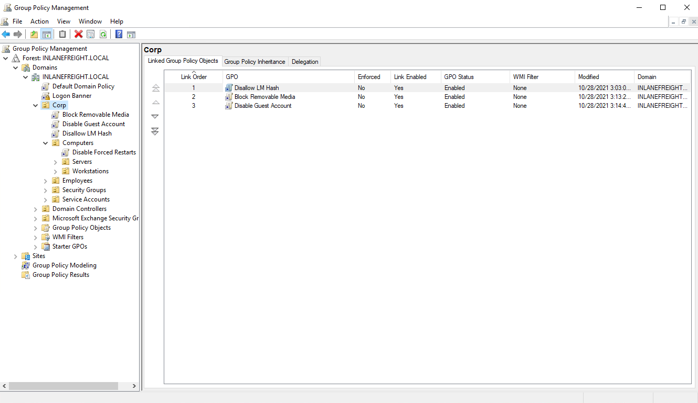<figcaption></figcaption></figure>

### Enforced y Block Inheritance

#### Enforced

* Evita que un GPO sea **anulado por políticas más abajo** en la jerarquía.
* Si está activado a nivel de dominio → se aplica a todas las OUs.

> Antes se llamaba **No Override**.

<figure>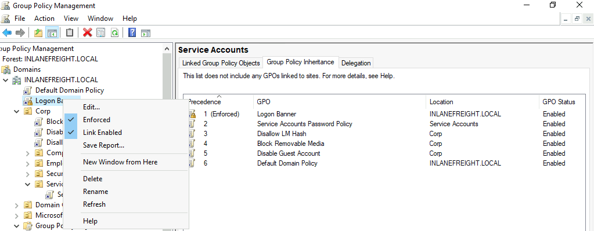<figcaption></figcaption></figure>

<figure>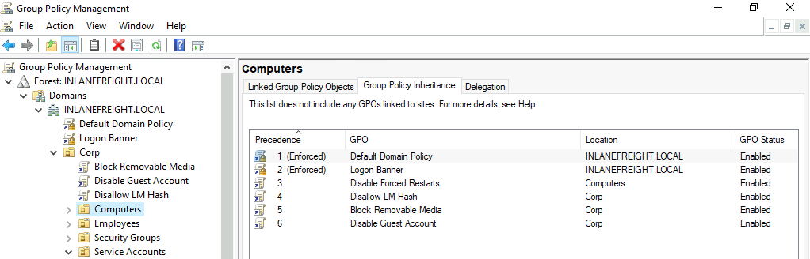<figcaption></figcaption></figure>

<figure>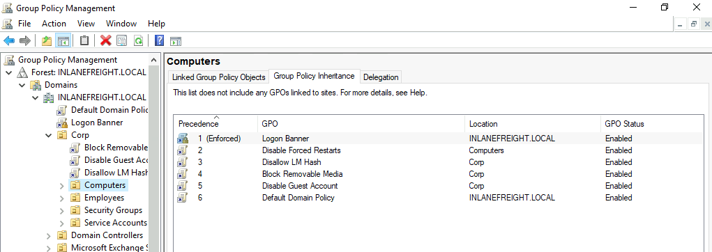<figcaption></figcaption></figure>

#### Block Inheritance

* Evita heredar GPOs definidos **arriba en la jerarquía**.
* Útil para excluir ciertas OUs de políticas generales.

Si un GPO está marcado como **Enforced**, anula el **Block Inheritance**.

<figure>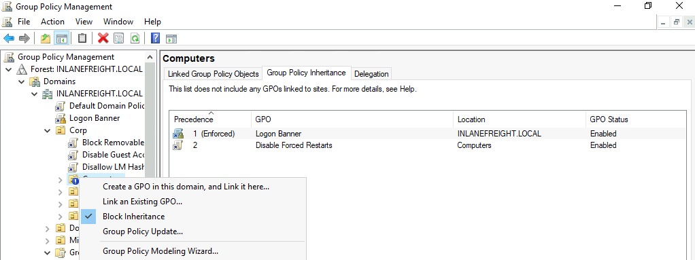<figcaption></figcaption></figure>

### Frecuencia de Actualización de GPOs

* No se aplican **instantáneamente**.
* Intervalo por defecto:
  * **Usuarios/Computadoras:** cada 90 min (+/- 30 min aleatorio).
  * **Domain Controllers:** cada 5 min.

> Evita sobrecarga de DCs.

*   Se puede forzar con:

    ```powershell
    gpupdate /force
    ```
* Puede ajustarse en:\
  `Computer Configuration → Policies → Administrative Templates → System → Group Policy`

Configuraciones demasiado frecuentes → congestión de red.

<figure>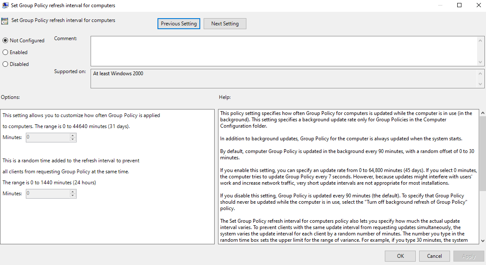<figcaption></figcaption></figure>

### Consideraciones de Seguridad

* Los atacantes pueden **abusar de GPOs**:
  * Añadir usuarios a administradores locales.
  * Ejecutar comandos maliciosos.
  * Crear tareas programadas para mantener persistencia.
  * Instalar malware en todo el dominio.

> Riesgo alto si **cualquier usuario** puede modificar un GPO vinculado a un OU **crítico**.

<figure>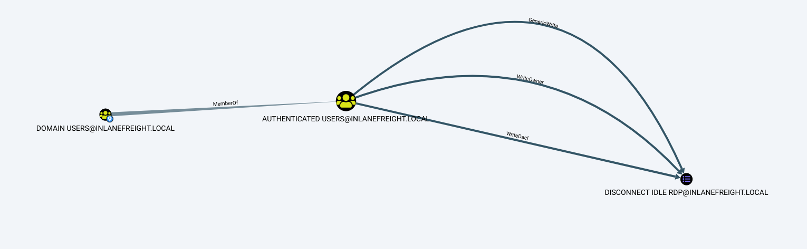<figcaption></figcaption></figure>

### Ejemplo de Ataque con BloodHound

* BloodHound puede identificar **paths de ataque**.
* Ejemplo: **Domain Users** → derecho de **GenericWrite** sobre un GPO llamado **Disconnect Idle RDP**.
* Si este GPO se aplica a equipos críticos o cuentas privilegiadas → posibilidad de **privilege escalation** y **lateral movement**.

> Entender GPOs es **clave** para detectar y mitigar estos ataques.
