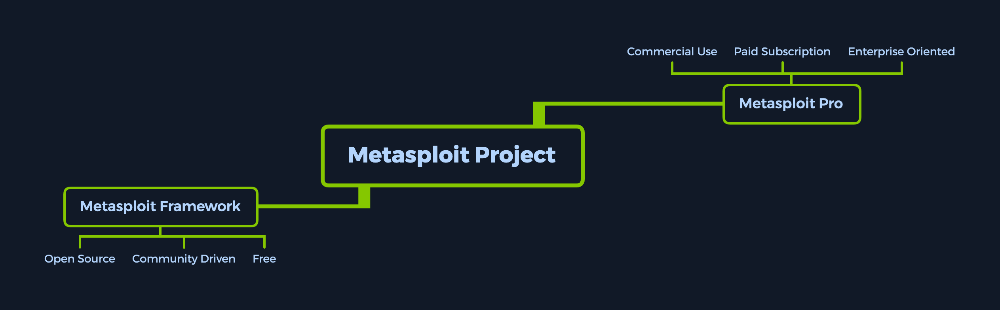

# Metasploit



## Introducción a Metasploit

El Proyecto Metasploit es una plataforma de pruebas de penetración modular basada en Ruby, que permite escribir, probar y ejecutar código de explotación. Este código puede ser personalizado por el usuario o tomado de una base de datos que contiene los exploits más recientes y ya modularizados. El **Framework de Metasploit** incluye un conjunto de herramientas que puedes usar para probar vulnerabilidades de seguridad, enumerar redes, ejecutar ataques y evadir detección. En su núcleo, el Proyecto Metasploit es una colección de herramientas comúnmente utilizadas que proporcionan un entorno completo para pruebas de penetración y desarrollo de exploits.

<figure><figcaption></figcaption></figure>

Los módulos mencionados son exploits ya desarrollados y probados en el entorno real, e integrados en el framework para ofrecer a los pentesters un acceso sencillo a diferentes vectores de ataque para diversas plataformas y servicios. Metasploit no es una herramienta que lo hace todo, pero es un "cuchillo suizo" con suficientes herramientas para superar las vulnerabilidades no parchadas más comunes.

Su punto fuerte es que proporciona una gran cantidad de objetivos y versiones vulnerables, todo a unos pocos comandos de distancia de un acceso exitoso. Estos, combinados con un exploit diseñado específicamente para esas versiones vulnerables y un payload que se envía después del exploit, nos permiten obtener acceso al sistema de forma automatizada, facilitando el cambio entre conexiones de objetivo durante nuestras acciones de post-explotación.

## Metasploit Pro

Metasploit como producto se divide en dos versiones. La versión **Metasploit Pro** es diferente del **Framework de Metasploit** y ofrece algunas características adicionales:

* Cadenas de tareas
* Ingeniería social
* Validación de vulnerabilidades
* Interfaz gráfica (GUI)
* Asistentes de inicio rápido
* Integración con Nexpose

Si prefieres usar la línea de comandos y disfrutas de las características adicionales, la versión Pro también contiene su propia consola, similar a msfconsole.

Para tener una idea general de lo que las últimas características de Metasploit Pro pueden lograr, echa un vistazo a la siguiente lista:

| Infiltrar                      | Recopilar Datos                | Remediar                        |
| ------------------------------ | ------------------------------ | ------------------------------- |
| Explotación manual             | Importar y escanear datos      | Fuerza bruta                    |
| Evasión de antivirus           | Escaneos de descubrimiento     | Cadenas de tareas               |
| Evasión de IPS/IDS             | Meta-módulos                   | Flujo de trabajo de explotación |
| Pivote de proxy                | Integración de escaneo Nexpose | Reejecución de sesión           |
| Post-explotación               |                                | Reproducción de tareas          |
| Limpieza de sesiones           | Integración con Project Sonar  |                                 |
| Reutilización de credenciales  | Gestión de credenciales        |                                 |
| Ingeniería social              | Colaboración en equipo         |                                 |
| Generador de payloads          | Interfaz web                   |                                 |
| Testeo rápido de penetración   | Exportación de datos           |                                 |
| Pivote de VPN                  | Recopilación de evidencia      |                                 |
| Validación de vulnerabilidades | Pruebas de aplicaciones web    |                                 |
| Asistente de phishing          | Generación de informes         |                                 |
| Sesiones persistentes          | Etiquetado de datos            |                                 |

## Consola del Metasploit Framework

La **msfconsole** es probablemente la interfaz más popular del Metasploit Framework (MSF). Proporciona una consola centralizada que permite acceso eficiente a casi todas las opciones disponibles en MSF. Puede parecer intimidante al principio, pero una vez que aprendas la sintaxis de los comandos, apreciarás el poder de utilizar esta interfaz.

Las características que generalmente trae msfconsole son las siguientes:

* Es la única forma soportada de acceder a la mayoría de las funciones dentro de Metasploit.
* Proporciona una interfaz basada en consola al Framework.
* Contiene la mayoría de las características y es la interfaz de MSF más estable.
* Soporte completo para autocompletar, tabulación y "readline".
* Ejecución de comandos externos dentro de msfconsole.

Ambos productos mencionados anteriormente vienen con una base de datos extensa de módulos disponibles para usar en nuestras evaluaciones. Estos, combinados con el uso de comandos externos como escáneres, kits de herramientas de ingeniería social y generadores de payloads, pueden convertir nuestro entorno en una máquina lista para atacar, permitiendo controlar y manipular vulnerabilidades con el uso de sesiones y trabajos, de la misma manera que usamos pestañas en un navegador de Internet.

El término clave aquí es **usabilidad**—experiencia de usuario. La facilidad con la que podemos controlar la consola puede mejorar nuestra experiencia de aprendizaje. Por lo tanto, profundicemos en los detalles.

## Entendiendo la Arquitectura

Para operar completamente cualquier herramienta que estemos utilizando, primero debemos mirar debajo del capó. Es una buena práctica, y puede ofrecer una mejor visión de lo que estará sucediendo durante nuestras evaluaciones de seguridad cuando usemos esa herramienta. Es esencial no dejar cabos sueltos que puedan dejar expuesto a ti o a tu cliente a brechas de seguridad.

Por defecto, todos los archivos base relacionados con el Framework de Metasploit se pueden encontrar en `/usr/share/metasploit-framework` en nuestra distribución de **ParrotOS Security**.

### Archivos Base: Data, Documentation, Lib

Estos son los archivos base del Framework. Los directorios **Data** y **Lib** son las partes funcionales de la interfaz de msfconsole, mientras que la carpeta **Documentation** contiene todos los detalles técnicos sobre el proyecto.

### Módulos

Los módulos detallados anteriormente están divididos en categorías separadas en esta carpeta. Los veremos en detalle en las próximas secciones. Se encuentran en las siguientes carpetas:

```bash
sherlock28@htb[/htb]$ ls /usr/share/metasploit-framework/modules
```

```bash
auxiliary  encoders  evasion  exploits  nops  payloads  post
```

### Plugins

Los plugins ofrecen más flexibilidad al pentester cuando utiliza msfconsole, ya que pueden cargarse fácilmente de forma manual o automática según sea necesario para proporcionar funcionalidad adicional y automatización durante nuestras evaluaciones.

```bash
sherlock28@htb[/htb]$ ls /usr/share/metasploit-framework/plugins/
```

```bash
aggregator.rb      ips_filter.rb  openvas.rb           sounds.rb
alias.rb           komand.rb      pcap_log.rb          sqlmap.rb
auto_add_route.rb  lab.rb         request.rb           thread.rb
...
```

### Scripts

Funcionalidad de **Meterpreter** y otros scripts útiles.

```bash
sherlock28@htb[/htb]$ ls /usr/share/metasploit-framework/scripts/
```

```bash
meterpreter  ps  resource  shell
```

### Herramientas

Utilidades de línea de comandos que pueden llamarse directamente desde el menú de msfconsole.

```bash
sherlock28@htb[/htb]$ ls /usr/share/metasploit-framework/tools/
```

```bash
context  docs     hardware  modules   payloads
dev      exploit  memdump   password  recon
```
