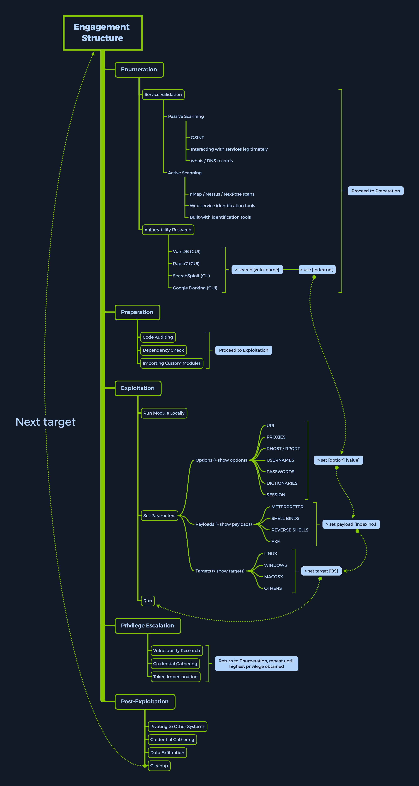

# MSFConsole

## Introducción a MSFconsole

Para empezar a interactuar con el **Metasploit Framework**, debemos escribir `msfconsole` en la terminal de nuestra elección. Muchas distribuciones orientadas a la seguridad, como **Parrot Security** y **Kali Linux**, vienen con msfconsole preinstalado. Al igual que otras herramientas de línea de comandos, podemos usar varias opciones al lanzar el script, que varían desde interruptores/opciones de visualización gráfica hasta opciones procedimentales.

## Preparación

Al iniciar msfconsole, veremos su icónica **splash art** y el prompt de línea de comandos, esperando nuestro primer comando.

### **Lanzar MSFconsole**

```bash
sherlock28@htb[/htb]$ msfconsole
```

````plaintext
plaintextCopiar código                                                  
                                              `:oDFo:`                            
                                           ./ymM0dayMmy/.                          
                                        -+dHJ5aGFyZGVyIQ==+-                     
                                    `:sm⏣~~Destroy.No.Data~~s:`                
                                 -+h2~~Maintain.No.Persistence~~h+-               
                             `:odNo2~~Above.All.Else.Do.No.Harm~~Ndo:`          
                          ./etc/shadow.0days-Data'%20OR%201=1--.No.0MN8'/.      
                       -++SecKCoin++e.AMd`       `.-://///+hbove.913.ElsMNh+-    
                      -~/.ssh/id_rsa.Des-                  `htN01UserWroteMe!-  
                      :dopeAW.No<nano>o                     :is:TЯiKC.sudo-.A:  
                      :we're.all.alike'`                     The.PFYroy.No.D7:  
                      :PLACEDRINKHERE!:                      yxp_cmdshell.Ab0:    
                      :msf>exploit -j.                       :Ns.BOB&ALICEes7:    
                      :---srwxrwx:-.`                        `MS146.52.No.Per:    
                      :<script>.Ac816/                        sENbove3101.404:    
                      :NT_AUTHORITY.Do                        `T:/shSYSTEM-.N:    
                      :09.14.2011.raid                       /STFU|wall.No.Pr:    
                      :hevnsntSurb025N.                      dNVRGOING2GIVUUP:    
                      :#OUTHOUSE-  -s:                       /corykennedyData:    
                      :$nmap -oS                              SSo.6178306Ence:    
                      :Awsm.da:                            /shMTl#beats3o.No.:    
                      :Ring0:                             `dDestRoyREXKC3ta/M:    
                      :23d:                               sSETEC.ASTRONOMYist:    
                       /-                        /yo-    .ence.N:(){ :|: & };:    
                                                 `:Shall.We.Play.A.Game?tron/    
                                                 ```-ooy.if1ghtf0r+ehUser5`    
                                               ..th3.H1V3.U2VjRFNN.jMh+.`          
                                              `MjM~~WE.ARE.se~~MMjMs               
                                               +~KANSAS.CITY's~-`                   
                                                J~HAKCERS~./.`                    
                                                .esc:wq!:`                        
                                                 +++ATH`                             
                                                  `

       =[ metasploit v6.1.9-dev                           ]
+ -- --=[ 2169 exploits - 1149 auxiliary - 398 post       ]
+ -- --=[ 592 payloads - 45 encoders - 10 nops            ]
+ -- --=[ 9 evasion                                       ]

Metasploit tip: Use sessions -1 to interact with the last opened session

msf6 >
````

Si prefieres evitar la pantalla de bienvenida, puedes usar la opción `-q`, que no muestra el banner:

```bash
sherlock28@htb[/htb]$ msfconsole -q
```

```bash
msf6 >
```

Para ver todos los comandos disponibles, podemos escribir el comando `help`.

Una de las primeras cosas que necesitamos hacer es asegurarnos de que los módulos que componen el framework estén actualizados. En versiones anteriores, esto se hacía ejecutando `msfupdate` en la terminal (fuera de msfconsole). Sin embargo, el **gestor de paquetes apt** puede manejar la actualización de módulos y características sin problemas.

### **Instalación de MSF**

```bash
sherlock28@htb[/htb]$ sudo apt update && sudo apt install metasploit-framework
```

```plaintext
<SNIP>
(Reading database ... 414458 files and directories currently installed.)
Preparing to unpack .../metasploit-framework_6.0.2-0parrot1_amd64.deb ...
Unpacking metasploit-framework (6.0.2-0parrot1) over (5.0.88-0kali1) ...
Setting up metasploit-framework (6.0.2-0parrot1) ...
Processing triggers for man-db (2.9.1-1) ...
Scanning application launchers
Removing duplicate launchers from Debian
Launchers are updated
```

#### Proceso de Enumeración

Uno de los primeros pasos que cubriremos es buscar un exploit adecuado para nuestro objetivo. Sin embargo, antes de intentar cualquier explotación, necesitamos tener una perspectiva detallada del objetivo, lo cual se realiza a través del proceso de **Enumeración**.

Durante la **Enumeración**, debemos identificar qué servicios públicos están corriendo en el objetivo. Por ejemplo: ¿es un servidor HTTP? ¿Es un servidor FTP? ¿Es una base de datos SQL? Estos diferentes tipos de objetivos varían considerablemente en el mundo real.

Debemos comenzar con un escaneo exhaustivo de la dirección IP del objetivo para determinar qué servicio está ejecutándose y qué versión está instalada para cada servicio.

#### Estructura de Metasploit (MSF)

La estructura del compromiso en MSF se divide en cinco categorías principales:

1. **Enumeración**
2. **Preparación**
3. **Explotación**
4. **Escalada de privilegios**
5. **Post-explotación**

Esta división facilita encontrar y seleccionar las funciones apropiadas de MSF de manera más estructurada y trabajar con ellas en consecuencia. Cada categoría tiene diferentes subcategorías, como la **Validación de Servicios** y la **Investigación de Vulnerabilidades**.

<figure><figcaption></figcaption></figure>

Es crucial que nos familiaricemos con esta estructura y sus componentes. Experimentar con las diferentes funciones es parte integral de aprender una nueva herramienta o habilidad. Por lo tanto, se recomienda probar todas las funciones imaginables en los laboratorios y analizar los resultados por cuenta propia.
