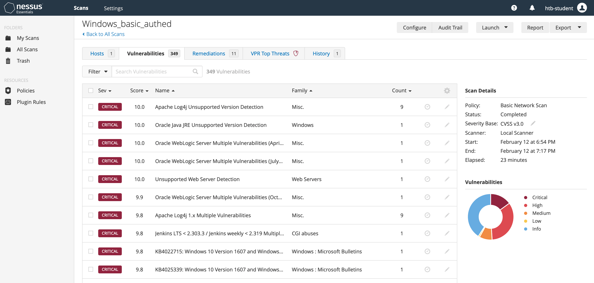
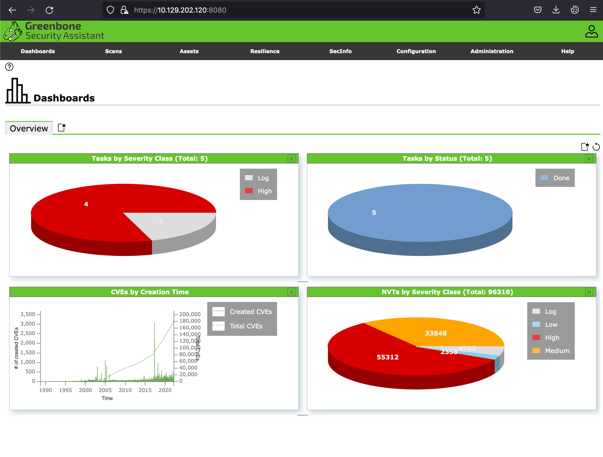

# Nessus

## Descripción General del Escaneo de Vulnerabilidades

El escaneo de vulnerabilidades se realiza para identificar posibles vulnerabilidades en dispositivos de red como routers, firewalls, switches, así como en servidores, estaciones de trabajo y aplicaciones. El escaneo es automatizado y se enfoca en encontrar vulnerabilidades potenciales o conocidas a nivel de red o de aplicaciones. Los escáneres de vulnerabilidades, en general, no explotan vulnerabilidades (con algunas excepciones) y requieren de una validación manual por parte de una persona para determinar si un problema detectado es real y necesita ser solucionado, o si es un falso positivo que puede ser ignorado y excluido de futuros escaneos en el mismo objetivo.

El escaneo de vulnerabilidades a menudo forma parte de una prueba de penetración estándar, aunque no son lo mismo. Un escaneo de vulnerabilidades puede ayudar a aumentar la cobertura durante una prueba de penetración o acelerar las pruebas del proyecto cuando hay restricciones de tiempo. Sin embargo, una prueba de penetración incluye mucho más que solo un escaneo.

El tipo de escaneo varía de una herramienta a otra, pero la mayoría combina pruebas dinámicas y estáticas, dependiendo del objetivo y la vulnerabilidad. Una prueba estática detectaría una vulnerabilidad si la versión identificada de un activo tiene un CVE público. Sin embargo, esto no siempre es preciso, ya que puede haberse aplicado un parche o el objetivo puede no ser vulnerable específicamente a ese CVE. Por otro lado, una prueba dinámica intenta utilizar cargas útiles específicas (generalmente benignas), como credenciales débiles, inyección SQL o inyección de comandos en el objetivo (por ejemplo, una aplicación web). Si alguna carga útil da resultado, hay una buena probabilidad de que sea vulnerable.

#### Escaneos Autenticados y No Autenticados

Las organizaciones deben ejecutar tanto escaneos no autenticados como autenticados de forma continua para asegurar que los activos estén parchados a medida que se descubren nuevas vulnerabilidades y que cualquier nuevo activo añadido a la red no presente parches faltantes u otros problemas de configuración o seguridad. El escaneo de vulnerabilidades debe integrarse en el programa de gestión de parches de la organización.

#### Herramientas Populares de Escaneo de Vulnerabilidades

* **Nessus**, **Nexpose** y **Qualys** son plataformas conocidas de escaneo de vulnerabilidades que también ofrecen ediciones gratuitas para la comunidad.
* También hay alternativas de código abierto, como **OpenVAS**.

## **Vista General de Nessus**

**Nessus Essentials** de Tenable es la versión gratuita del escáner oficial de vulnerabilidades Nessus. Los usuarios pueden acceder a Nessus Essentials para comenzar a entender el escáner de vulnerabilidades de Tenable. La limitación es que solo puede ser utilizado para hasta 16 hosts. Las características de la versión gratuita son limitadas, pero son perfectas para aquellos que desean comenzar con Nessus. El escáner gratuito intentará identificar vulnerabilidades en un entorno.

<figure><figcaption></figcaption></figure>

## **Vista General de OpenVAS**

**OpenVAS** de Greenbone Networks es un escáner de vulnerabilidades de código abierto y disponible públicamente. OpenVAS puede realizar escaneos de red, incluyendo pruebas autenticadas y no autenticadas.

<figure><figcaption></figcaption></figure>
