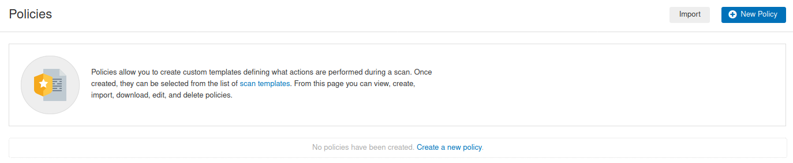
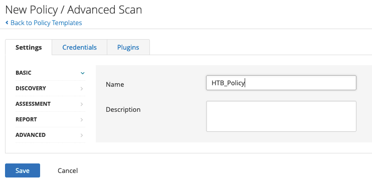
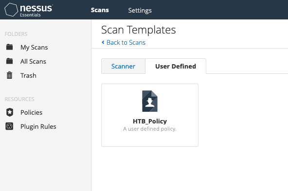
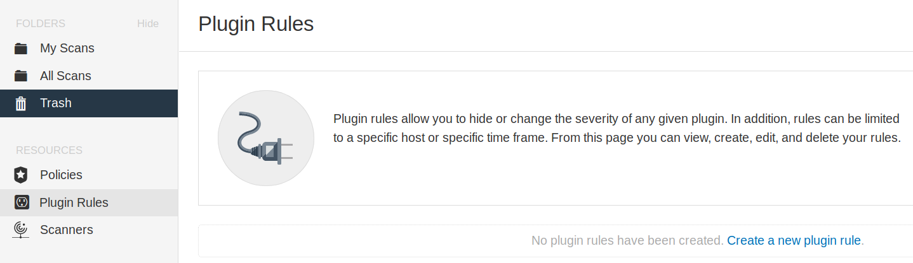
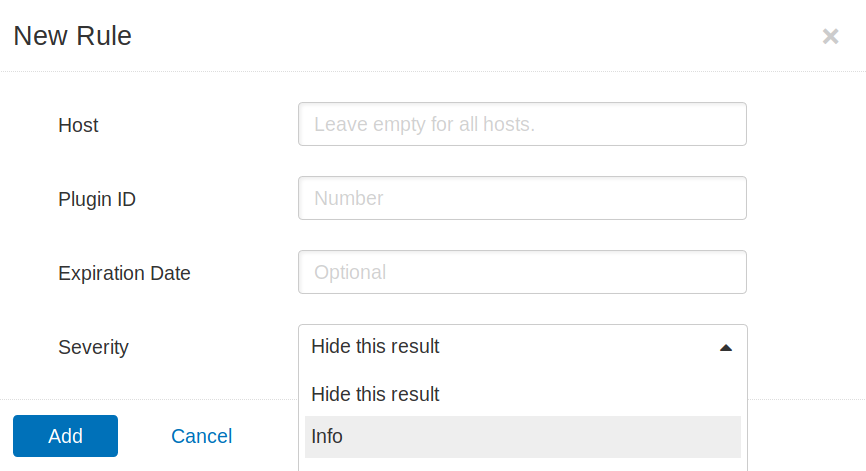
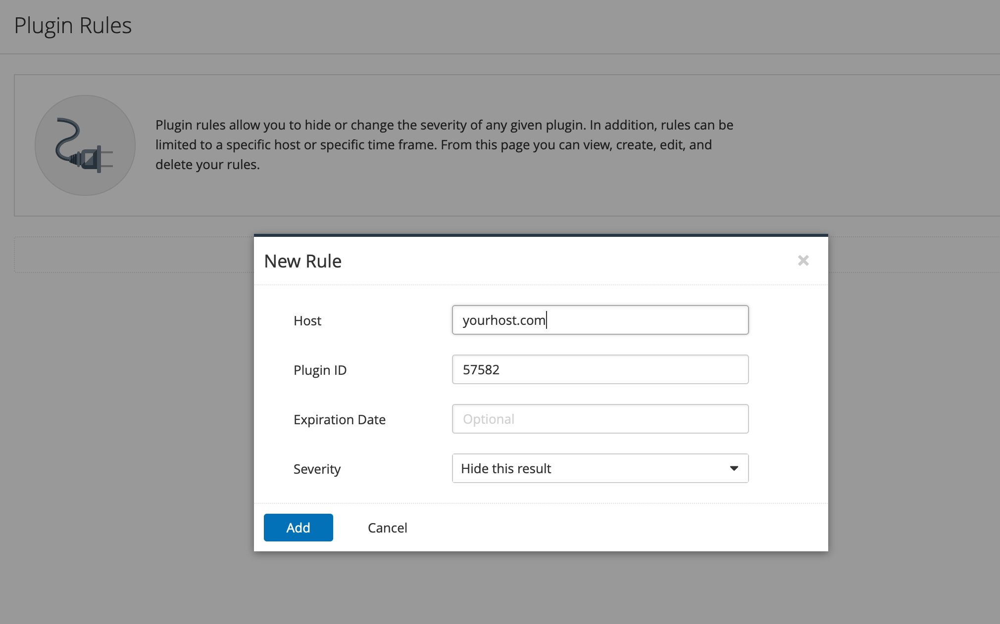
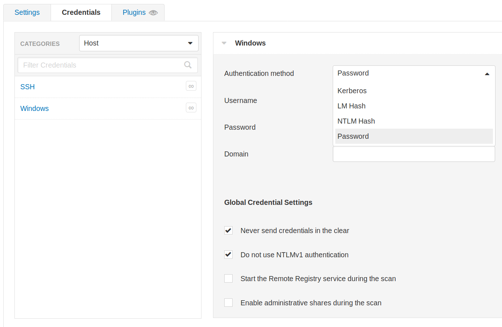
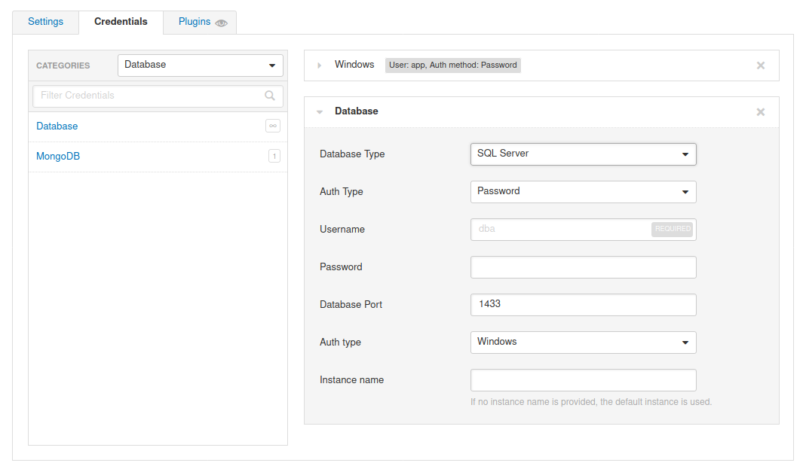
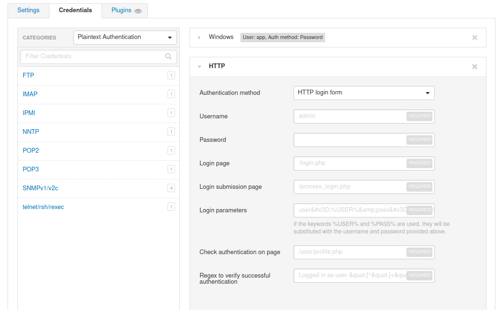
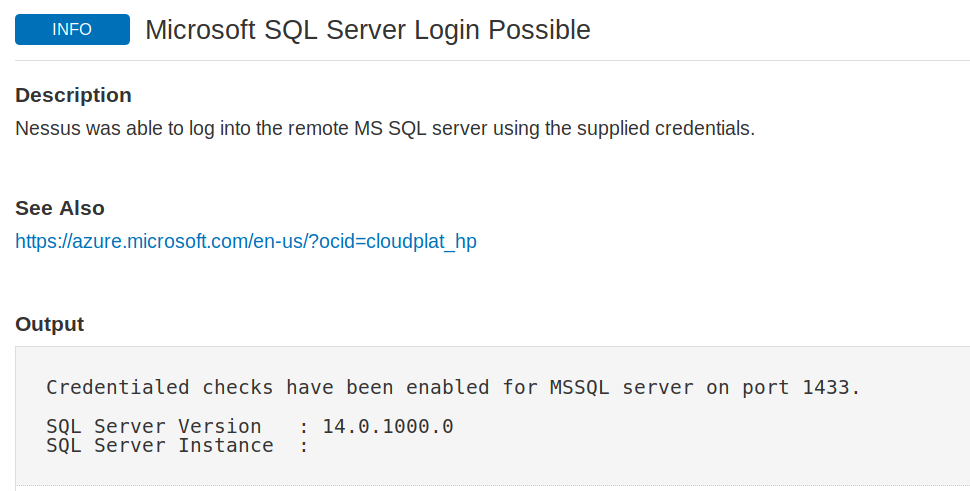

# Advanced Settings

Podemos configurar una serie de configuraciones avanzadas para Nessus y sus escaneos, como políticas de escaneo, plugins y credenciales, todo lo cual cubriremos en esta sección.

## Políticas de Escaneo

Nessus nos da la opción de crear políticas de escaneo. Esencialmente, estas son escaneos personalizados que nos permiten definir opciones específicas de escaneo, guardar la configuración de la política y tenerlas disponibles bajo **Plantillas de Escaneo** al crear un nuevo escaneo. Esto nos da la capacidad de crear escaneos dirigidos para varios escenarios, como un escaneo más lento y evasivo, un escaneo enfocado en la web, o un escaneo para un cliente particular utilizando uno o varios conjuntos de credenciales. Las políticas de escaneo se pueden importar desde otros escáneres Nessus o exportar para ser posteriormente importadas en otro escáner Nessus.

<figure><figcaption></figcaption></figure>

## Creando una Política de Escaneo

Para crear una política de escaneo, podemos hacer clic en el botón **Nueva Política** en la parte superior derecha, y se nos presentará la lista de escaneos preconfigurados. Podemos elegir un escaneo, como el **Escaneo de Red Básico**, luego personalizarlo, o podemos crear el nuestro propio. Elegiremos **Escaneo Avanzado** para crear un escaneo completamente personalizado sin recomendaciones preconfiguradas incorporadas.

Después de elegir el tipo de escaneo como nuestra base, podemos darle un nombre y una descripción a la política de escaneo si es necesario:

<figure><figcaption></figcaption></figure>

Desde aquí, podemos configurar los ajustes, agregar las credenciales necesarias y especificar cualquier estándar de cumplimiento para ejecutar el escaneo. También podemos elegir habilitar o deshabilitar familias de plugins enteras o plugins individuales.

Una vez que hayamos terminado de personalizar el escaneo, podemos hacer clic en **Guardar**, y la política recién creada aparecerá en la lista de políticas. A partir de ahora, cuando vayamos a crear un nuevo escaneo, habrá una nueva pestaña llamada **Definido por el Usuario** bajo **Plantillas de Escaneo** que mostrará todas nuestras políticas de escaneo personalizadas:

<figure><figcaption></figcaption></figure>

## Plugins de Nessus

Nessus trabaja con plugins escritos en el **Lenguaje de Scripting de Ataque de Nessus (NASL)** y puede dirigirse a nuevas vulnerabilidades y CVEs. Estos plugins contienen información como el nombre de la vulnerabilidad, el impacto, la remediación y una forma de probar la presencia de un problema particular.

Los plugins están clasificados por nivel de severidad: **Crítico**, **Alto**, **Medio**, **Bajo**, **Información**. En el momento de escribir esto, Tenable ha publicado 145,973 plugins que cubren 58,391 IDs de CVE y 30,696 IDs de Bugtraq. Una base de datos buscable de todos los plugins publicados está disponible en el sitio web de Tenable.

La pestaña de **Plugins** proporciona más información sobre una detección particular, incluida la mitigación. Al realizar escaneos recurrentes, puede haber una vulnerabilidad/detección que, tras un examen más detallado, no se considera un problema. Por ejemplo, Microsoft DirectAccess (una tecnología que proporciona conectividad de red interna a clientes a través de Internet) permite suites de cifrado inseguras y nulas. El siguiente escaneo realizado con **sslscan** muestra un ejemplo de suites de cifrado inseguras y nulas:

```bash
sherlock28@htb[/htb]$ sslscan example.com

<SNIP>

Preferred TLSv1.0  128 bits  ECDHE-RSA-AES128-SHA          Curve 25519 DHE 253
Accepted  TLSv1.0  256 bits  ECDHE-RSA-AES256-SHA          Curve 25519 DHE 253
Accepted  TLSv1.0  128 bits  DHE-RSA-AES128-SHA            DHE 2048 bits
Accepted  TLSv1.0  256 bits  DHE-RSA-AES256-SHA            DHE 2048 bits
Accepted  TLSv1.0  128 bits  AES128-SHA                   
Accepted  TLSv1.0  256 bits  AES256-SHA                    
<SNIP>
```

<figure><figcaption></figcaption></figure>

<figure><figcaption></figcaption></figure>

<figure><figcaption></figcaption></figure>

## Escaneo con Credenciales

Nessus también admite escaneos con credenciales y ofrece mucha flexibilidad al soportar hashes LM/NTLM, autenticación Kerberos y autenticación por contraseña.

Las credenciales se pueden configurar para autenticación basada en host a través de SSH con una contraseña, clave pública, certificado o autenticación basada en Kerberos. También se puede configurar para la autenticación basada en host de Windows con una contraseña, Kerberos, hash LM o hash NTLM:

<figure><figcaption></figcaption></figure>

Nessus también admite autenticación para una variedad de tipos de bases de datos, incluyendo Oracle, PostgreSQL, DB2, MySQL, SQL Server, MongoDB y Sybase:

<figure><figcaption></figcaption></figure>

> **Nota:** Para ejecutar un escaneo con credenciales en el objetivo, utiliza las siguientes credenciales: `htb-student_adm:HTB_@cademy_student!` para Linux, y `administrator:Academy_VA_adm1!` para Windows. Estos escaneos ya han sido configurados en el objetivo de Nessus para ahorrarte tiempo.

Además de esto, Nessus puede realizar autenticación en texto plano a servicios como FTP, HTTP, IMAP, IPMI, Telnet, y más:

<figure><figcaption></figcaption></figure>

Finalmente, podemos verificar la salida de Nessus para confirmar si la autenticación en la aplicación o servicio objetivo con las credenciales proporcionadas fue exitosa:

<figure><figcaption></figcaption></figure>
