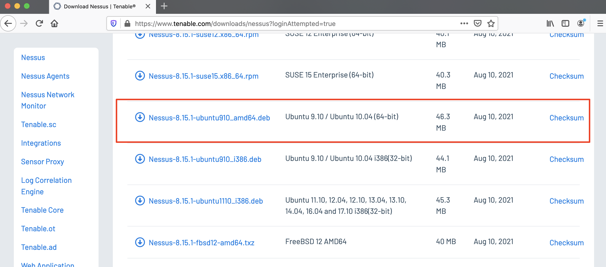
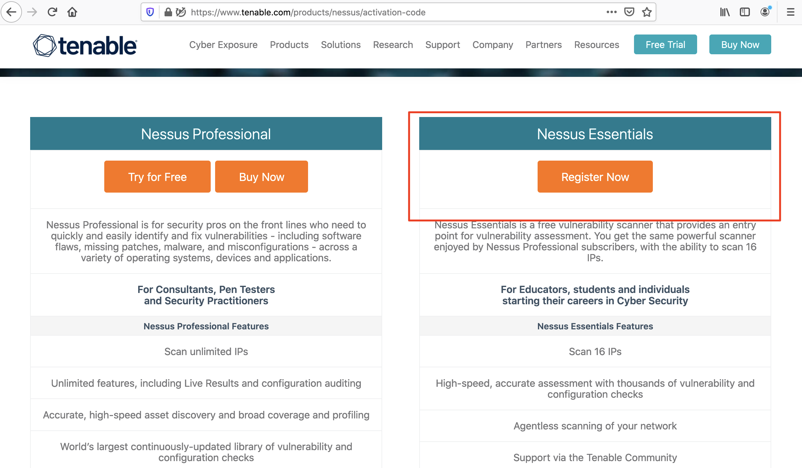
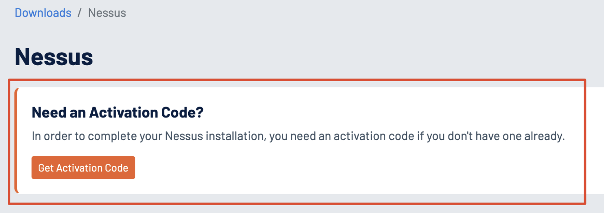
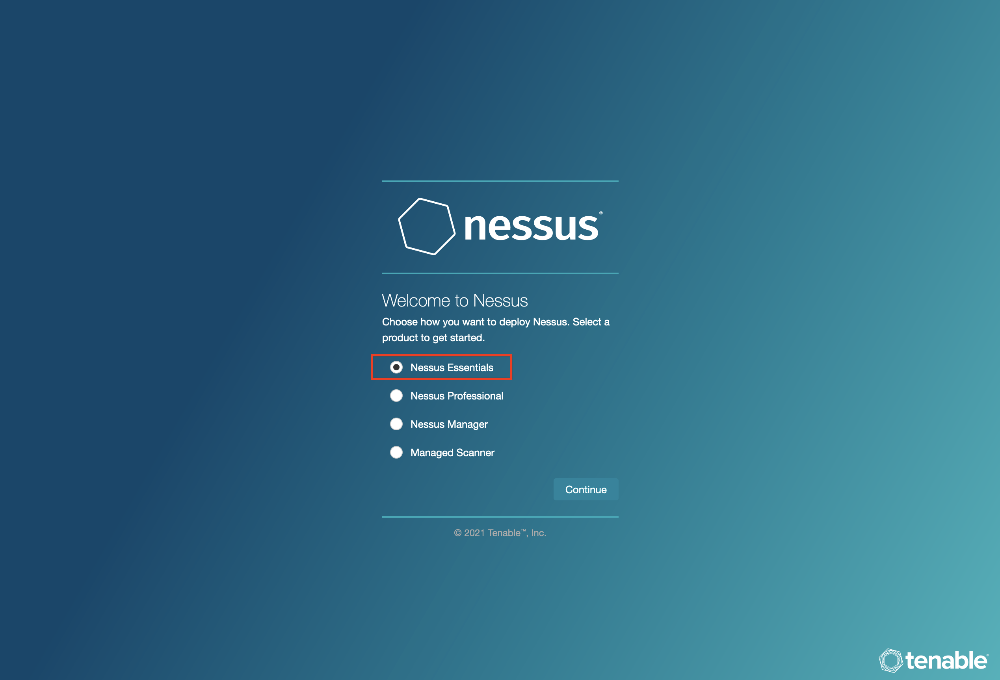
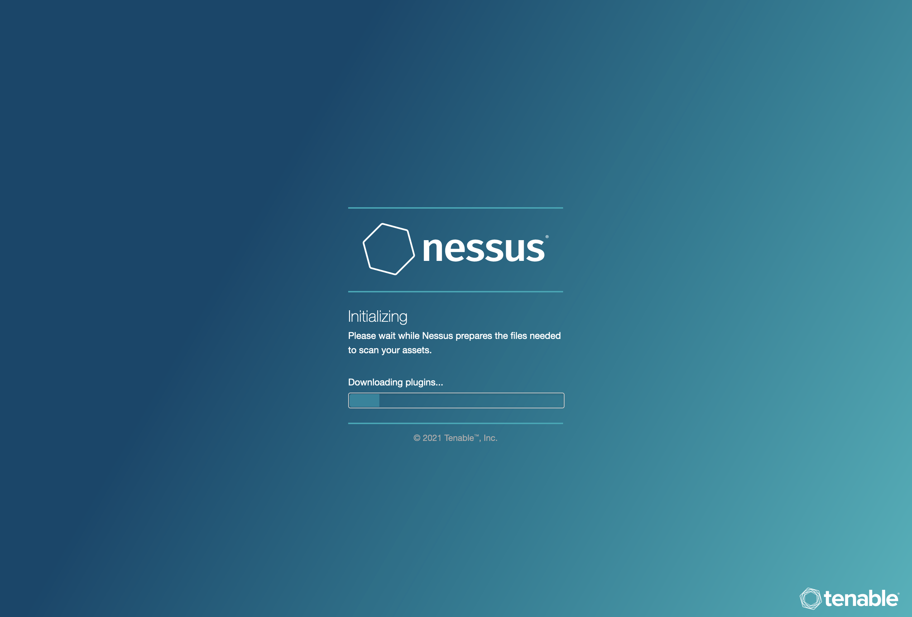
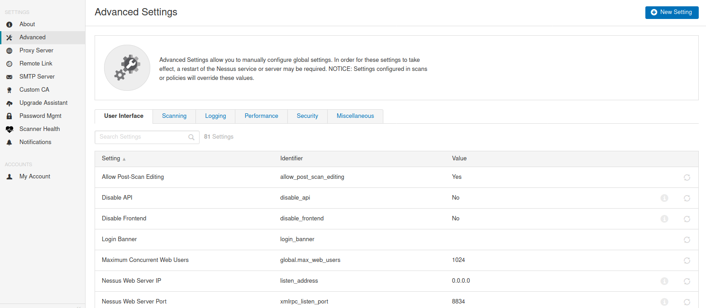

# Getting Started with Nessus

## Descargar e Instalar Nessus

Para comenzar a usar Nessus, es necesario descargar el archivo binario adecuado y seguir un proceso sencillo de instalación y configuración. A continuación se muestra un resumen paso a paso.

### **1. Descargar Nessus**

Primero, debemos navegar a la Página de Descarga de Nessus para obtener el binario correcto para nuestro sistema. En este tutorial, descargaremos el paquete **Debian** para Ubuntu.

<figure><figcaption></figcaption></figure>

### **2. Solicitar una Licencia Gratuita**

Para obtener una licencia gratuita, podemos visitar la Página de Código de Activación de Nessus, donde solicitaremos un código de activación necesario para usar la versión gratuita de Nessus.

<figure><figcaption></figcaption></figure>

<figure><figcaption></figcaption></figure>

### **3. Instalar el Paquete**

Con el binario descargado y el código de activación en mano, podemos proceder a instalar el paquete de Nessus. Usaremos el siguiente comando para instalarlo:

```bash
sherlock28@htb[/htb]$ dpkg -i Nessus-8.15.1-ubuntu910_amd64.deb
```

Salida esperada del comando:

```bash
Selecting previously unselected package nessus.
(Reading database ... 132030 files and directories currently installed.)
Preparing to unpack Nessus-8.15.1-ubuntu910_amd64.deb ...
Unpacking nessus (8.15.1) ...
Setting up nessus (8.15.1) ...
Unpacking Nessus Scanner Core Components...
Created symlink /etc/systemd/system/nessusd.service → /lib/systemd/system/nessusd.service.
Created symlink /etc/systemd/system/multi-user.target.wants/nessusd.service → /lib/systemd/system/nessusd.service.
```

### **4. Iniciar Nessus**

Una vez instalado Nessus, podemos iniciar el servicio con el siguiente comando:

```bash
sherlock28@htb[/htb]$ sudo systemctl start nessusd.service
```

### **5. Acceder a Nessus**

Para acceder a la interfaz de Nessus, debemos abrir un navegador web y navegar a `https://localhost:8834`. En la página de configuración, seleccionamos **Nessus Essentials** para usar la versión gratuita e ingresamos nuestro código de activación.

<figure><figcaption></figcaption></figure>

<figure><figcaption></figcaption></figure>

### **6. Configurar un Usuario y Contraseña**

Después de ingresar el código de activación, debemos configurar un usuario y una contraseña segura para nuestra cuenta de Nessus. Una vez completado este paso, comenzará la compilación de los plugins.

### **7. Acceso a la VM de Laboratorio**

En la sección **Nessus Skills Assessment**, se proporciona una máquina virtual (VM) con Nessus preinstalado y los objetivos ya en ejecución. Podemos iniciar esta VM y usar Nessus a través de `https://<IP>:8834`. Las credenciales para Nessus son:

* Usuario: `htb-student`
* Contraseña: `HTB_@cademy_student!`

Estas mismas credenciales también se pueden usar para acceder vía SSH a la VM y configurar Nessus.

### **8. Configuración y Creación de Escaneos**

Una vez que la configuración esté completa, podemos comenzar a crear escaneos, políticas de escaneo, reglas de plugins y personalizar la configuración. La página de **Configuración** ofrece muchas opciones, como configurar un servidor proxy, servidor SMTP, gestión de cuentas y ajustes avanzados para personalizar la interfaz de usuario, los escaneos, los registros, el rendimiento y las opciones de seguridad.

<figure><figcaption></figcaption></figure>
