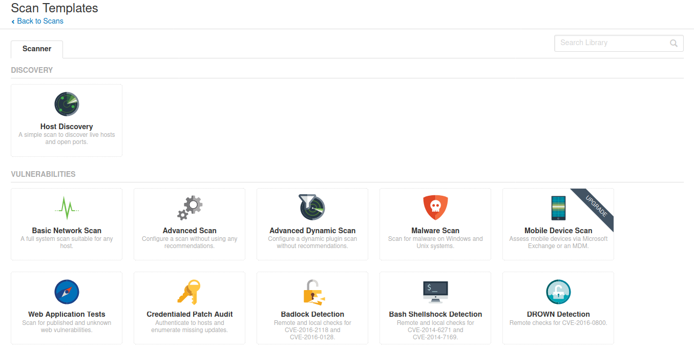
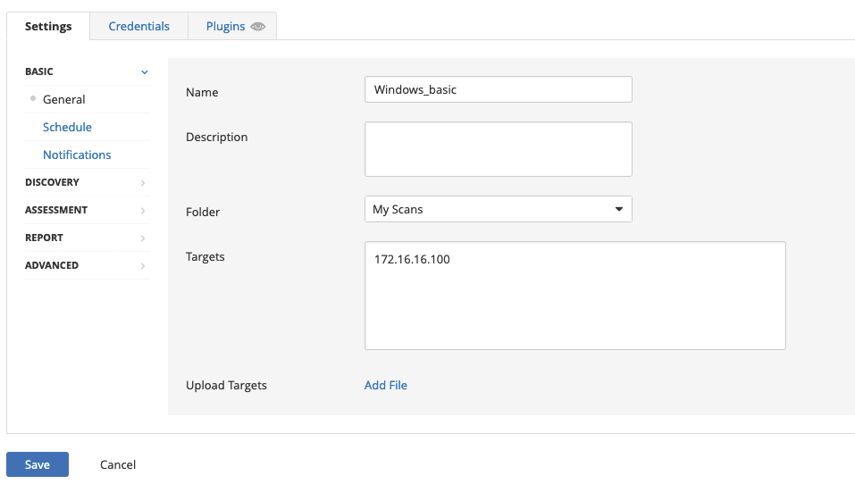
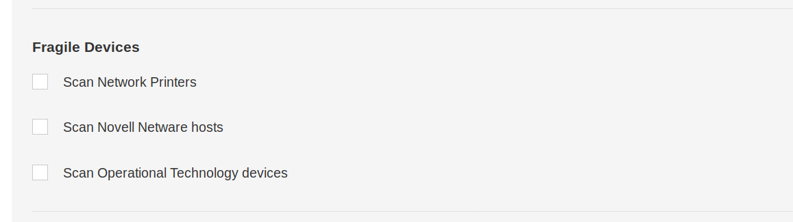
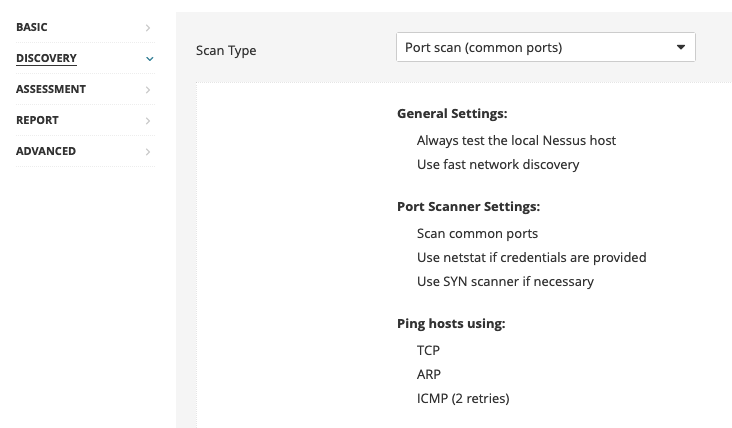
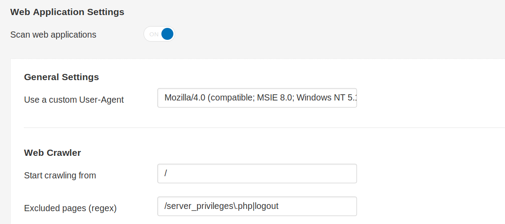
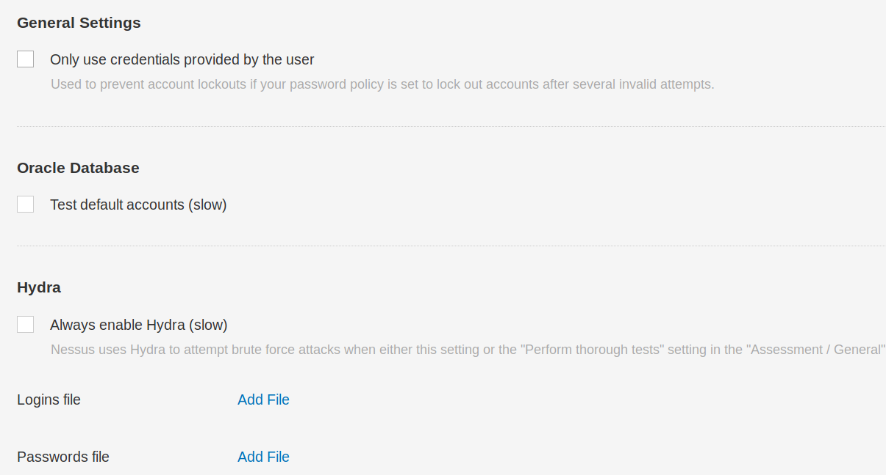
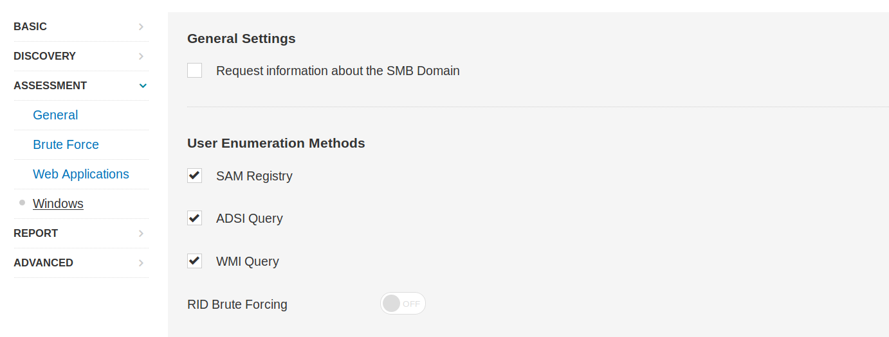
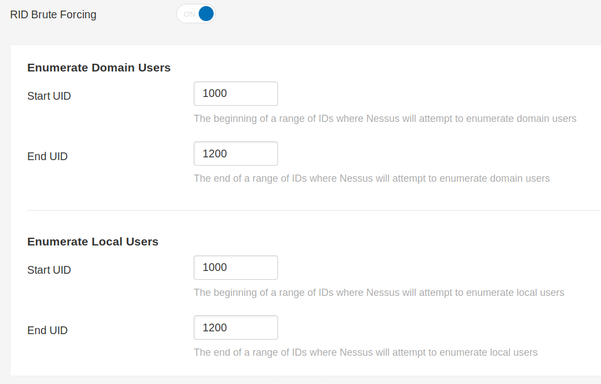
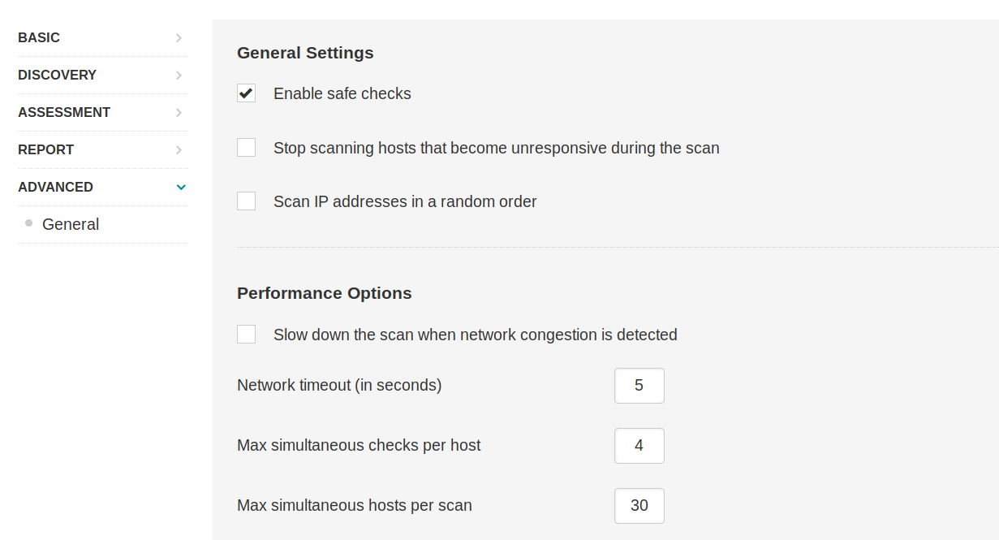

# Nessus Scan

Se puede configurar un nuevo escaneo de Nessus haciendo clic en **Nuevo Escaneo** y seleccionando un tipo de escaneo. Las plantillas de escaneo se dividen en tres categorías: **Descubrimiento**, **Vulnerabilidades** y **Cumplimiento**.

> **Nota:** Los escaneos mostrados en esta sección ya se han ejecutado previamente para ahorrarte el tiempo de esperar a que terminen. Si vuelves a ejecutar el escaneo, es mejor revisar las vulnerabilidades a medida que aparecen, en lugar de esperar a que termine, ya que pueden tardar de 1 a 2 horas en finalizar.

## Nuevo Escaneo

Aquí tenemos opciones para un escaneo básico de **Descubrimiento de Hosts** para identificar hosts/vulnerabilidades abiertas, o una variedad de tipos de escaneo como el **Escaneo de Red Básico**, **Escaneo Avanzado**, **Escaneo de Malware**, **Pruebas de Aplicaciones Web**, así como escaneos dirigidos a CVEs específicos y estándares de auditoría y cumplimiento. Se puede encontrar una descripción de cada tipo de escaneo aquí.

<figure><figcaption></figcaption></figure>

Para los propósitos de este ejercicio, elegiremos la opción de **Escaneo de Red Básico** y podemos ingresar nuestros objetivos:

<figure><figcaption></figcaption></figure>

> **Nota:** Para este módulo, el objetivo de Windows será `172.16.16.100` y el objetivo de Linux será `172.16.16.160`.

## Descubrimiento

En la sección de **Descubrimiento**, bajo **Descubrimiento de Hosts**, se nos presenta la opción de habilitar el escaneo de dispositivos frágiles. Escanear dispositivos como impresoras de red a menudo resulta en que imprimen grandes cantidades de papel con texto basura, dejando los dispositivos inutilizables. Podemos dejar esta configuración desactivada.

<figure><figcaption></figcaption></figure>

En **Escaneo de Puertos**, podemos elegir si escanear puertos comunes, todos los puertos o un rango definido por el usuario, según nuestras necesidades.

<figure><figcaption></figcaption></figure>

Dentro de la subsección de **Descubrimiento de Servicios**, la opción **Probar todos los puertos para encontrar servicios** está seleccionada por defecto. Es posible que una aplicación o servicio mal diseñado pueda colapsar como resultado de este sondeo, pero la mayoría de las aplicaciones deberían ser lo suficientemente robustas para manejarlo. Buscar servicios SSL/TLS también está habilitado por defecto en un escaneo personalizado, y Nessus puede ser instruido además para identificar certificados que están a punto de caducar o revocados.

## Evaluación

Bajo la categoría de **Evaluación**, se puede habilitar el escaneo de aplicaciones web si es necesario, y se puede especificar un **User Agent** personalizado y varias otras opciones de escaneo de aplicaciones web (por ejemplo, una URL para pruebas de **Remote File Inclusion (RFI)**).

<figure><figcaption></figcaption></figure>

Si se desea, Nessus puede intentar autenticar contra las aplicaciones y servicios descubiertos usando las credenciales proporcionadas (si se está ejecutando un escaneo con credenciales), o de lo contrario puede realizar un ataque de fuerza bruta con las listas de nombres de usuario y contraseñas proporcionadas.

<figure><figcaption></figcaption></figure>

También se puede realizar enumeración de usuarios utilizando varias técnicas, como **RID Brute Forcing**. Si optamos por realizar **RID Brute Forcing**, podemos establecer los UIDs inicial y final tanto para cuentas de usuario de dominio como locales.

<figure><figcaption></figcaption></figure>

<figure><figcaption></figcaption></figure>

## Avanzado

En la pestaña **Avanzado**, las verificaciones seguras están habilitadas por defecto. Esto previene que Nessus ejecute verificaciones que puedan afectar negativamente al dispositivo o red objetivo. También podemos elegir ralentizar o limitar el escaneo si Nessus detecta congestión en la red, dejar de intentar escanear cualquier host que se vuelva inactivo, e incluso elegir que Nessus escanee nuestra lista de IPs objetivo en orden aleatorio.

<figure><figcaption></figcaption></figure>
