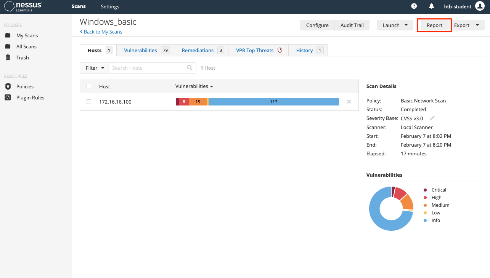

# Working with Nessus Scan Output

Nessus nos ofrece la opción de exportar los resultados de los escaneos en una variedad de formatos de informes, así como la posibilidad de exportar los resultados crudos de los escaneos de Nessus para importarlos en otras herramientas, archivarlos o pasarlos a otras soluciones como **EyeWitness**, que se puede utilizar para tomar capturas de pantalla de todas las aplicaciones web identificadas por Nessus, ayudándonos enormemente a trabajar con los resultados y encontrar más valor en ellos.

## **Informes de Nessus**

Una vez que un escaneo se ha completado, podemos optar por exportar un informe en formatos como `.pdf`, `.html` o `.csv`. Los informes en `.pdf` y `.html` ofrecen la opción de elegir entre un **Resumen Ejecutivo** o un **informe personalizado**. El informe de Resumen Ejecutivo proporciona una lista de hosts, el número total de vulnerabilidades descubiertas por host y una opción de "Mostrar Detalles" para ver la gravedad, la puntuación CVSS, el número del plugin y el nombre de cada problema identificado. El número del plugin contiene un enlace al informe completo del plugin en la base de datos de plugins de Tenable. La opción en PDF proporciona los resultados del escaneo en un formato más fácil de compartir.

La opción de exportar en formato `.csv` nos permite seleccionar qué columnas queremos exportar, lo cual es especialmente útil si importamos los resultados del escaneo en otra herramienta, como **Splunk**, si necesitamos compartir un documento con varios responsables internos que gestionan la remediación de los activos escaneados o para realizar análisis de datos sobre los resultados del escaneo.

<figure><figcaption></figcaption></figure>

> **Nota:** Estos informes de escaneo deben compartirse solo como un apéndice o datos complementarios a un informe personalizado de prueba de penetración o evaluación de vulnerabilidades. No deben ser entregados al cliente como el entregable final de ningún tipo de evaluación.

Un ejemplo del informe en formato HTML se muestra a continuación:

<figure><figcaption></figcaption></figure>

Es recomendable agrupar siempre las vulnerabilidades para una comprensión clara de cada problema y de los activos afectados.

## **Exportación de Escaneos en Nessus**

Nessus también ofrece la opción de exportar escaneos en dos formatos: **Nessus** (`scan.nessus`) o **Nessus DB** (`scan.db`). El archivo `.nessus` es un archivo `.xml` que incluye una copia de la configuración del escaneo y los resultados de los plugins. El archivo `.db` contiene el archivo `.nessus`, la base de conocimiento (KB) del escaneo, el rastro de auditoría de los plugins (Audit Trail) y cualquier archivo adjunto del escaneo. Más información sobre la base de conocimiento (KB) y el rastro de auditoría se puede encontrar aquí.

Se pueden usar scripts como el **nessus-report-downloader** para descargar rápidamente los resultados de los escaneos en todos los formatos disponibles desde la línea de comandos utilizando la API REST de Nessus:

```bash
sherlock28@htb[/htb]$ ./nessus_downloader.rb 

Nessus 6 Report Downloader 1.0

Enter the Nessus Server IP: 127.0.0.1
Enter the Nessus Server Port [8834]: 8834
Enter your Nessus Username: admin
Enter your Nessus Password (will not echo): 

Getting report list...
Scan ID Name                                               Last Modified                  Status         
------- ----                                               -------------                  ------         
1     Windows_basic                                Aug 22, 2020 22:07 +00:00      completed      

Enter the report(s) your want to download (comma separate list) or 'all': 1

Choose File Type(s) to Download: 
[0] Nessus (No chapter selection)
[1] HTML
[2] PDF
[3] CSV (No chapter selection)
[4] DB (No chapter selection)
Enter the file type(s) you want to download (comma separate list) or 'all': 3

Path to save reports to (without trailing slash): /assessment_data/inlanefreight/scans/nessus

Downloading report(s). Please wait...

[+] Exporting scan report, scan id: 1, type: csv
[+] Checking export status...
[+] Report ready for download...
[+] Downloading report to: /assessment_data/inlanefreight/scans/nessus/inlanefreight_basic_5y3hxp.csv

Report Download Completed!
```

También podemos escribir nuestros propios scripts para automatizar muchas de las funciones de Nessus.
