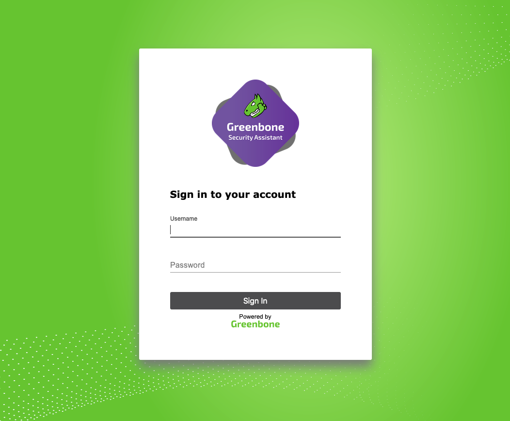
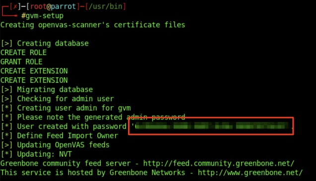
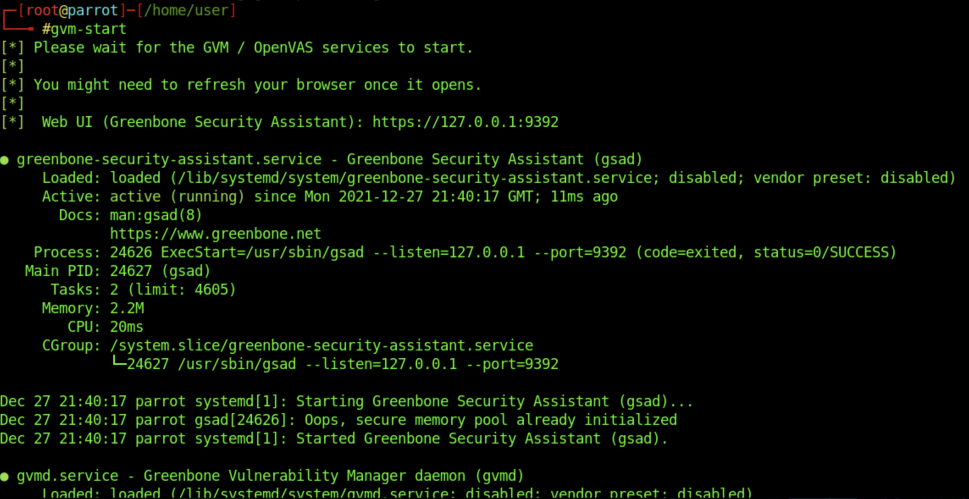

# OpenVAS

**OpenVAS**, desarrollado por Greenbone Networks, es un escáner de vulnerabilidades de código abierto. Forma parte del **Greenbone Vulnerability Manager** (GVM), que también es público y gratuito. OpenVAS tiene capacidades para realizar escaneos de red, incluyendo pruebas autenticadas y no autenticadas.

<figure><figcaption></figcaption></figure>

## **Instalación en Parrot Security**

Para empezar a usar OpenVAS, sigue las instrucciones de instalación a continuación para **Parrot Security**. La herramienta viene preinstalada en el host que se proporciona en una sección posterior.

1.  **Actualización del Sistema**

    Comienza actualizando tu sistema con los siguientes comandos:

    ```bash
    sherlock28@htb[/htb]$ sudo apt-get update && apt-get -y full-upgrade
    ```
2.  **Instalación de OpenVAS**

    Después, instala OpenVAS y GVM con el siguiente comando:

    ```bash
    sherlock28@htb[/htb]$ sudo apt-get install gvm && openvas
    ```
3.  **Configuración Inicial**

    Para comenzar el proceso de instalación y configuración, ejecuta:

    ```bash
    sherlock28@htb[/htb]$ gvm-setup
    ```

    Este proceso puede tardar hasta **30 minutos**.

<figure><figcaption></figcaption></figure>

## **Iniciar OpenVAS**

Una vez que la configuración haya terminado, puedes iniciar OpenVAS con el siguiente comando:

```bash
sherlock28@htb[/htb]$ gvm-start
```

<figure><figcaption></figcaption></figure>

**Acceso a OpenVAS**

En la sección del módulo llamada "OpenVAS Skills Assessment", se proporciona una máquina virtual (VM) con **OpenVAS preinstalado** y los objetivos ya ejecutándose. Puedes acceder a la interfaz de OpenVAS en la dirección `https://<IP>:8080`.

* **Credenciales de OpenVAS:**
  * **Usuario:** htb-student
  * **Contraseña:** HTB\_@cademy\_student!

También puedes usar estas credenciales para hacer SSH en la VM de destino y configurar OpenVAS según sea necesario.
