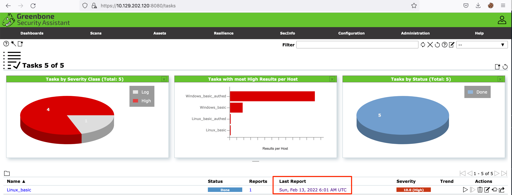
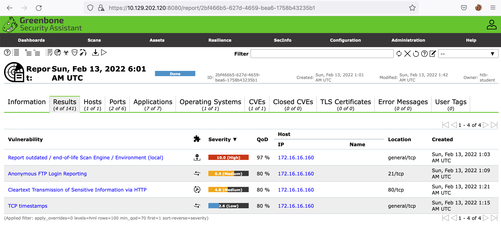
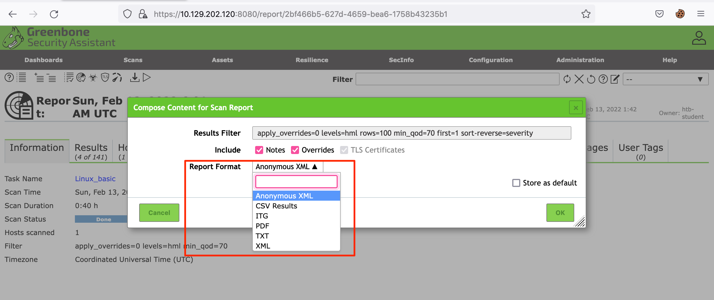
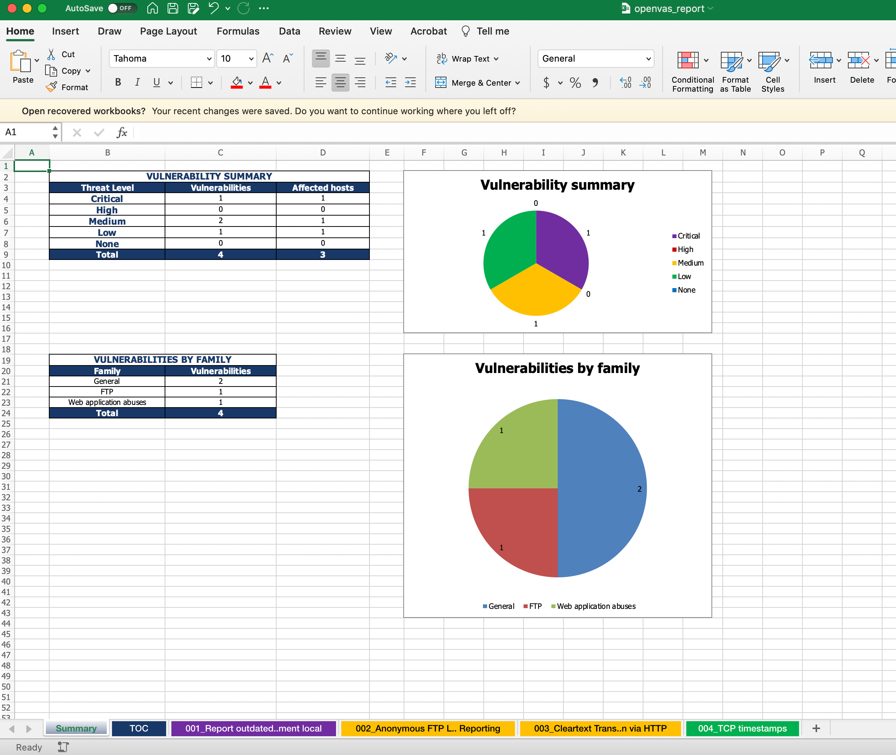
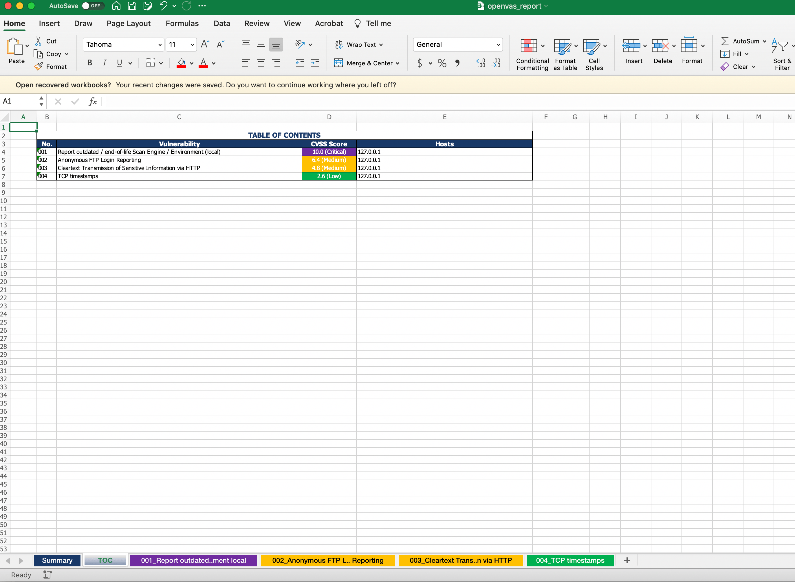

# Exporting The Results

OpenVAS proporciona los resultados del escaneo en un informe que se puede acceder desde la página de **Escaneos**, como se muestra a continuación.

<figure><figcaption></figcaption></figure>

Al hacer clic en el informe, podrás ver los resultados del escaneo, incluyendo información del sistema operativo, puertos abiertos, servicios, etc., en otras pestañas dentro del informe.

<figure><figcaption></figcaption></figure>

## **Formatos de Exportación**

OpenVAS ofrece varios formatos de exportación con fines de generación de informes, como **XML**, **CSV**, **PDF**, **ITG** y **TXT**. Si eliges exportar tu informe en **XML**, puedes utilizar varios analizadores XML para visualizar los datos en un formato más legible.

<figure><figcaption></figcaption></figure>

Vamos a exportar nuestros resultados en **XML** y utilizar la herramienta **openvasreporting** desarrollada por **TheGroundZero**. Esta herramienta ofrece varias opciones para generar la salida. En este caso, usaremos la opción estándar para generar un archivo **Excel** con el informe.

**Exportación de los Resultados**

Ejecuta el siguiente comando para generar un documento de Excel:

```bash
sherlock28@htb[/htb]$ python3 -m openvasreporting -i report-2bf466b5-627d-4659-bea6-1758b43235b1.xml -f xlsx
```

Este comando generará un documento de Excel similar al siguiente:

<figure><figcaption></figcaption></figure>

<figure><figcaption></figcaption></figure>
