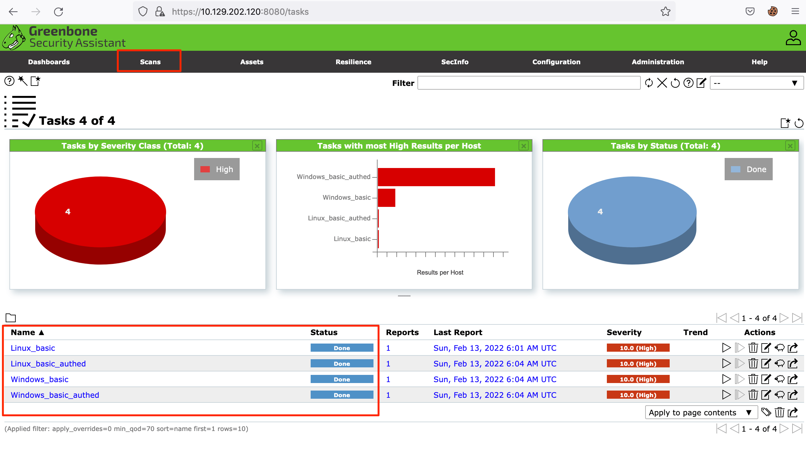
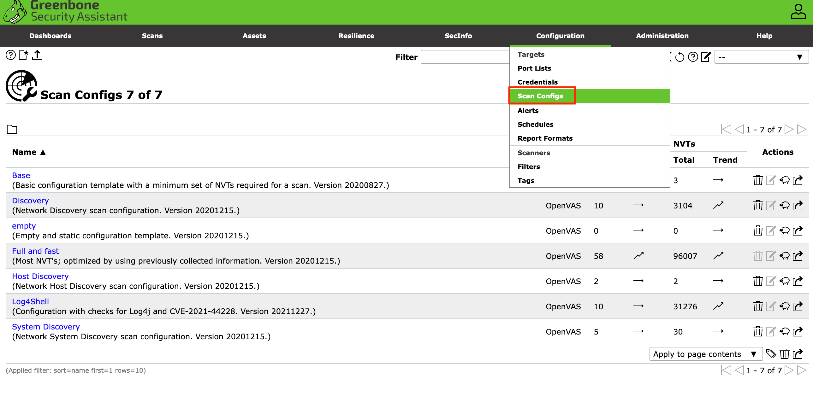
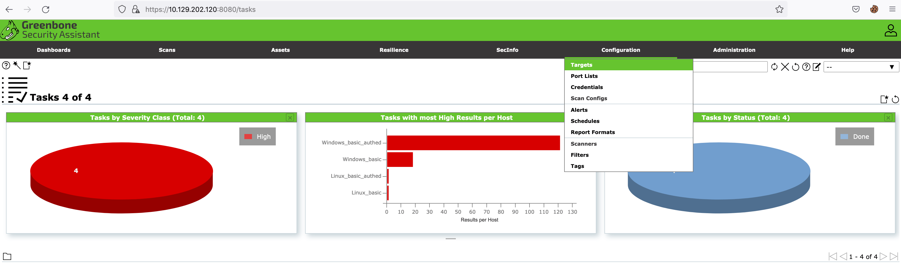

# OpenVAS Scan

La aplicación **Greenbone Security Assistant** de OpenVAS ofrece varias pestañas con las que puedes interactuar. En esta sección, profundizaremos en la pestaña de **Escaneos**. Al navegar a esta pestaña, podrás ver los escaneos que se han ejecutado en el pasado, así como crear nuevas tareas para ejecutar escaneos. Las tareas se basan en las configuraciones de escaneo que el usuario establece.

> **Nota:** Los escaneos en esta sección ya han sido preejecutados para ahorrarte el tiempo de espera. Si vuelves a ejecutar el escaneo, es recomendable revisar las vulnerabilidades a medida que aparecen, ya que los escaneos pueden tardar entre 1 y 2 horas en completarse.

<figure><figcaption></figcaption></figure>

**Escaneos Preconfigurados**

Para este módulo, los objetivos son:

* **Windows**: 172.16.16.100
* **Linux**: 172.16.16.160

<figure><figcaption></figcaption></figure>

## **Configuración**

Antes de configurar cualquier escaneo, es importante definir los **objetivos**. Navega a la pestaña **Configuraciones** y selecciona **Targets**. Aquí verás los objetivos que ya han sido añadidos a la aplicación.

<figure><figcaption></figcaption></figure>

Para agregar un nuevo objetivo, haz clic en el icono resaltado y añade un objetivo individual o una lista de hosts. También puedes configurar otras opciones como los puertos, autenticación y métodos para identificar si el host es alcanzable. Para la prueba de "Alive", la opción **Scan Config Default** de OpenVAS utiliza el NVT **Ping Host** de la familia NVT. Puedes aprender más sobre la **familia NVT** [aquí](https://www.greenbone.net).

Un escaneo autenticado generalmente utiliza un usuario con privilegios altos, como **root** o **Administrador**. Dependiendo del nivel de permisos, si tienes el nivel más alto, recuperarás la mayor cantidad de información sobre las vulnerabilidades presentes en el host.

> **Credenciales para escaneos autenticados:**
>
> * **Linux**: `htb-student_adm:HTB_@cademy_student!`
> * **Windows**: `administrator:Academy_VA_adm1!`

Una vez que hayas agregado tu objetivo, aparecerá en la lista de abajo.

## **Configuraciones de Escaneo**

OpenVAS utiliza familias de **Pruebas de Vulnerabilidad de Red (NVT)** que abarcan distintas categorías de vulnerabilidades, como las de **Windows**, **Linux** y **Aplicaciones Web**. Puedes ver algunas de estas familias a continuación.

Te recomendamos usar las siguientes configuraciones de escaneo, ya que otras opciones podrían causar interrupciones en la red:

* **Base**: Configuración para enumerar información sobre el estado del host y el sistema operativo. No verifica vulnerabilidades.
* **Discovery**: Enumeración del sistema, identificando servicios, hardware, puertos accesibles y software en uso. Tampoco verifica vulnerabilidades.
* **Host Discovery**: Solo prueba si el host está activo y qué dispositivos están en la red. No verifica vulnerabilidades.
* **System Discovery**: Realiza una enumeración más profunda del host que el escaneo de descubrimiento, intentando identificar el sistema operativo y hardware asociados.
* **Full and Fast**: Recomendado por OpenVAS como la opción más segura, utiliza inteligencia para seleccionar las mejores pruebas NVT según los puertos accesibles.

### **Creación de un Escaneo**

Para crear tu propio escaneo, navega a la pestaña **Scans** y haz clic en el icono del asistente (wizard).

Al hacer clic en el icono, aparecerá un panel donde podrás configurar tu escaneo.

Configura el escaneo con las siguientes opciones para el objetivo **172.16.16.160** (Linux) y ejecuta el escaneo. Este proceso puede tardar entre **30-60 minutos**.
