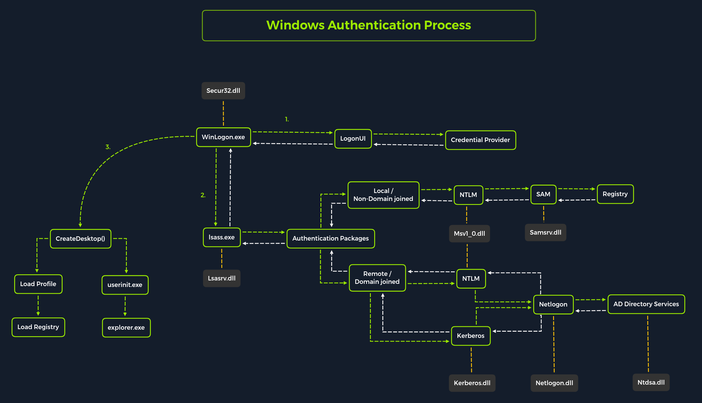
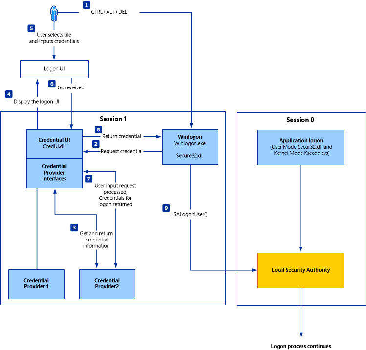

# Password Attacks



## Almacenamiento de Credenciales

Cada aplicación que admite mecanismos de autenticación compara las credenciales ingresadas con bases de datos locales o remotas. En el caso de bases de datos locales, estas credenciales se almacenan localmente en el sistema. Las aplicaciones web a menudo son vulnerables a inyecciones SQL, lo que puede llevar al peor de los casos donde los atacantes pueden ver la totalidad de los datos de una organización en texto plano.

Existen muchas listas de palabras que contienen las contraseñas más comúnmente usadas. Un ejemplo de una de estas listas es _rockyou.txt_. Esta lista incluye aproximadamente 14 millones de contraseñas únicas y se creó después de una filtración de datos de la empresa RockYou, que contenía un total de 32 millones de cuentas de usuario. La empresa RockYou almacenaba todas las credenciales en texto plano en su base de datos, las cuales los atacantes pudieron ver tras un exitoso ataque de inyección SQL.

Sabemos que todos los sistemas operativos admiten estos tipos de mecanismos de autenticación. Por lo tanto, las credenciales almacenadas se guardan localmente. Veamos cómo se crean, almacenan y gestionan en más detalle en sistemas basados en Windows y Linux.

## Linux

Como ya sabemos, los sistemas basados en Linux manejan todo en forma de archivos. Por lo tanto, las contraseñas también se almacenan cifradas en un archivo. Este archivo se llama el archivo _shadow_ y se encuentra en `/etc/shadow`, que es parte del sistema de gestión de usuarios de Linux. Además, estas contraseñas se almacenan comúnmente en forma de _hashes_. Un ejemplo puede verse así:

### Archivo Shadow

```bash
root@htb:~# cat /etc/shadow
...SNIP...
htb-student:$y$j9T$3QSBB6CbHEu...SNIP...f8Ms:18955:0:99999:7:::
```

El archivo `/etc/shadow` tiene un formato único en el que las entradas se registran y guardan cuando se crean nuevos usuarios.

```plaintext
htb-student:    $y$j9T$3QSBB6CbHEu...SNIP...f8Ms:    18955:    0:    99999:    7:    :    :    :
<nombre de usuario>:    <contraseña cifrada>:    <día del último cambio>:    <edad mínima>:    <edad máxima>:    <período de advertencia>:    <período de inactividad>:    <fecha de expiración>:    <campo reservado>
```

El cifrado de la contraseña en este archivo está formateado de la siguiente manera:

```plaintext
$ <id>    $ <salt>    $ <hash>
$ y       $ j9T       $ 3QSBB6CbHEu...SNIP...f8Ms
```

El tipo (_id_) es el método de hash criptográfico utilizado para cifrar la contraseña. Muchos métodos criptográficos de hash se han utilizado en el pasado y algunos sistemas todavía los usan hoy en día.

| ID     | Algoritmo de Hash Criptográfico |
| ------ | ------------------------------- |
| $1$    | MD5                             |
| $2a$   | Blowfish                        |
| $5$    | SHA-256                         |
| $6$    | SHA-512                         |
| $sha1$ | SHA1crypt                       |
| $y$    | Yescrypt                        |
| $gy$   | Gost-yescrypt                   |
| $7$    | Scrypt                          |

Sin embargo, hay unos pocos archivos más que pertenecen al sistema de gestión de usuarios de Linux. Los otros dos archivos son `/etc/passwd` y `/etc/group`. En el pasado, la contraseña cifrada se almacenaba junto con el nombre de usuario en el archivo `/etc/passwd`, pero esto fue cada vez más reconocido como un problema de seguridad, ya que el archivo puede ser visto por todos los usuarios en el sistema y debe ser legible. El archivo `/etc/shadow` solo puede ser leído por el usuario root.

### Archivo Passwd

```bash
sherlock28@htb[/htb]$ cat /etc/passwd
...SNIP...
htb-student:x:1000:1000:,,,:/home/htb-student:/bin/bash
```

```plaintext
htb-student:    x:    1000:    1000:    ,,,,:    /home/htb-student:    /bin/bash
<nombre de usuario>:    <contraseña>:    <uid>:    <gid>:    <comentario>:    <directorio de inicio>:    <comando ejecutado después de iniciar sesión>
```

La _x_ en el campo de la contraseña indica que la contraseña cifrada está en el archivo `/etc/shadow`. Sin embargo, la redirección al archivo `/etc/shadow` no hace que los usuarios en el sistema sean invulnerables, ya que si los permisos de este archivo están configurados incorrectamente, el archivo puede ser manipulado para que el usuario _root_ no necesite escribir una contraseña para iniciar sesión. Por lo tanto, un campo vacío significa que podemos iniciar sesión con el nombre de usuario sin ingresar una contraseña.

## Proceso de Autenticación en Windows

El proceso de autenticación de clientes de Windows puede ser a menudo más complicado que en los sistemas Linux y consta de muchos módulos diferentes que realizan los procesos completos de inicio de sesión, recuperación y verificación. Además, hay muchos procedimientos de autenticación diferentes y complejos en el sistema Windows, como la autenticación Kerberos.

La _Autoridad de Seguridad Local_ (_LSA_, por sus siglas en inglés) es un subsistema protegido que autentica a los usuarios e inicia su sesión en el equipo local. Además, la LSA mantiene información sobre todos los aspectos de la seguridad local en un equipo. También proporciona varios servicios para la traducción entre nombres y _IDs de seguridad_ (SIDs, por sus siglas en inglés).

El subsistema de seguridad realiza un seguimiento de las políticas de seguridad y cuentas que residen en un sistema informático. En el caso de un _Controlador de Dominio_, estas políticas y cuentas se aplican al dominio donde se encuentra el Controlador de Dominio. Estas políticas y cuentas se almacenan en Active Directory. Además, el subsistema LSA proporciona servicios para verificar el acceso a objetos, revisar los permisos de los usuarios y generar mensajes de monitoreo.

<figure><figcaption></figcaption></figure>

El inicio de sesión interactivo local se realiza mediante la interacción entre el proceso de inicio de sesión (WinLogon), el proceso de la interfaz de usuario de inicio de sesión (LogonUI), los proveedores de credenciales, LSASS, uno o más paquetes de autenticación, y SAM o Active Directory. Los paquetes de autenticación, en este caso, son bibliotecas de enlace dinámico (DLLs) que realizan verificaciones de autenticación. Por ejemplo, para inicios de sesión interactivos en máquinas no unidas a un dominio, se utiliza el paquete de autenticación _Msv1\_0.dll_.

Winlogon es un proceso confiable responsable de gestionar las interacciones de seguridad relacionadas con los usuarios. Estas incluyen:

* Lanzar LogonUI para ingresar contraseñas en el inicio de sesión.
* Cambiar contraseñas.
* Bloquear y desbloquear la estación de trabajo.

Winlogon se basa en los proveedores de credenciales instalados en el sistema para obtener el nombre de cuenta o contraseña del usuario. Los proveedores de credenciales son objetos COM ubicados en DLLs.

Winlogon es el único proceso que intercepta las solicitudes de inicio de sesión desde el teclado enviadas a través de un mensaje RPC desde _Win32k.sys_. Inmediatamente después, lanza la aplicación LogonUI en el inicio de sesión para mostrar la interfaz de usuario para el inicio de sesión. Después de obtener el nombre de usuario y la contraseña de los proveedores de credenciales, Winlogon llama a _LSASS_ para autenticar al usuario que intenta iniciar sesión.

### LSASS

_Local Security Authority Subsystem Service_ (LSASS) es una colección de muchos módulos y tiene acceso a todos los procesos de autenticación que se pueden encontrar en `%SystemRoot%\System32\Lsass.exe`. Este servicio es responsable de la política de seguridad del sistema local, la autenticación de usuarios y el envío de registros de auditoría de seguridad al registro de eventos. En otras palabras, es la bóveda para los sistemas operativos basados en Windows.

**Paquetes de Autenticación**

| Paquete de Autenticación | Descripción                                                                                                                                                                                                                                                      |
| ------------------------ | ---------------------------------------------------------------------------------------------------------------------------------------------------------------------------------------------------------------------------------------------------------------- |
| Lsasrv.dll               | El servicio del servidor LSA aplica políticas de seguridad y actúa como el administrador de paquetes de seguridad para la LSA. LSA contiene la función Negotiate, que selecciona el protocolo NTLM o Kerberos dependiendo de cuál se determine que tendrá éxito. |
| Msv1\_0.dll              | Paquete de autenticación para inicios de sesión en la máquina local que no requieren autenticación personalizada.                                                                                                                                                |
| Samsrv.dll               | El _Security Accounts Manager_ (SAM) almacena cuentas de seguridad locales, aplica políticas almacenadas localmente y soporta APIs.                                                                                                                              |
| Kerberos.dll             | Paquete de seguridad cargado por la LSA para la autenticación basada en Kerberos en una máquina.                                                                                                                                                                 |
| Netlogon.dll             | Servicio de inicio de sesión basado en red.                                                                                                                                                                                                                      |
| Ntdsa.dll                | Biblioteca usada para crear nuevos registros y carpetas en el registro de Windows.                                                                                                                                                                               |

Cada sesión de inicio de sesión interactiva crea una instancia separada del servicio Winlogon. La arquitectura de _Graphical Identification and Authentication_ (GINA) se carga en el área de proceso utilizada por Winlogon, recibe y procesa las credenciales, e invoca las interfaces de autenticación a través de la función _LSALogonUser_.

### Base de Datos SAM

El _Security Account Manager_ (SAM) es un archivo de base de datos en los sistemas operativos Windows que almacena las contraseñas de los usuarios. Puede utilizarse para autenticar usuarios locales y remotos. SAM utiliza medidas criptográficas para evitar que usuarios no autenticados accedan al sistema. Las contraseñas de los usuarios se almacenan en un formato de hash en una estructura de registro, ya sea como un hash LM o NTLM. Este archivo se encuentra en `%SystemRoot%/system32/config/SAM` y está montado en `HKLM/SAM`. Se requieren permisos de nivel _SYSTEM_ para verlo.

Los sistemas Windows pueden asignarse a un grupo de trabajo o dominio durante la configuración. Si el sistema ha sido asignado a un grupo de trabajo, maneja la base de datos SAM localmente y almacena todos los usuarios existentes en esta base de datos. Sin embargo, si el sistema se ha unido a un dominio, el _Controlador de Dominio_ (DC) debe validar las credenciales desde la base de datos de Active Directory (_ntds.dit_), que se almacena en `%SystemRoot%\ntds.dit`.

Microsoft introdujo una característica de seguridad en Windows NT 4.0 para mejorar la seguridad de la base de datos SAM contra ataques fuera de línea. Esta es la característica SYSKEY (_syskey.exe_), que cuando está habilitada, cifra parcialmente la copia en disco duro del archivo SAM para que los valores hash de las contraseñas de todas las cuentas locales almacenadas en SAM estén cifrados con una clave.

### Administrador de Credenciales

El _Administrador de Credenciales_ es una función incorporada en todos los sistemas operativos Windows que permite a los usuarios guardar las credenciales que utilizan para acceder a varios recursos de red y sitios web. Las credenciales guardadas se almacenan en función de los perfiles de usuario en el _Credential Locker_ de cada usuario. Las credenciales se cifran y se almacenan en la siguiente ubicación:

```plaintext
PS C:\Users\[Username]\AppData\Local\Microsoft\[Vault/Credentials]\
```

<figure><figcaption></figcaption></figure>

Existen varios métodos para descifrar las credenciales guardadas utilizando el Administrador de Credenciales. Practicaremos algunos de estos métodos en este módulo.

### NTDS

Es muy común encontrar entornos de red donde los sistemas Windows están unidos a un dominio de Windows. Esto es común porque facilita a los administradores la gestión de todos los sistemas de las organizaciones respectivas (gestión centralizada). En estos casos, los sistemas Windows enviarán todas las solicitudes de inicio de sesión a los Controladores de Dominio que pertenecen al mismo bosque de Active Directory. Cada Controlador de Dominio aloja un archivo llamado _NTDS.dit_ que se mantiene sincronizado entre todos los Controladores de Dominio, con la excepción de los Controladores de Dominio de Solo Lectura. _NTDS.dit_ es un archivo de base de datos que almacena los datos en Active Directory, incluyendo pero no limitado a:

* Cuentas de usuario (nombre de usuario y hash de la contraseña)
* Cuentas de grupo
* Cuentas de equipo
* Objetos de política de grupo

Más adelante en este módulo practicaremos métodos que nos permitan extraer credenciales del archivo _NTDS.dit_.

Ahora que hemos cubierto los conceptos de almacenamiento de credenciales, estudiemos los diversos ataques que podemos realizar para extraer credenciales y avanzar en nuestras evaluaciones.
