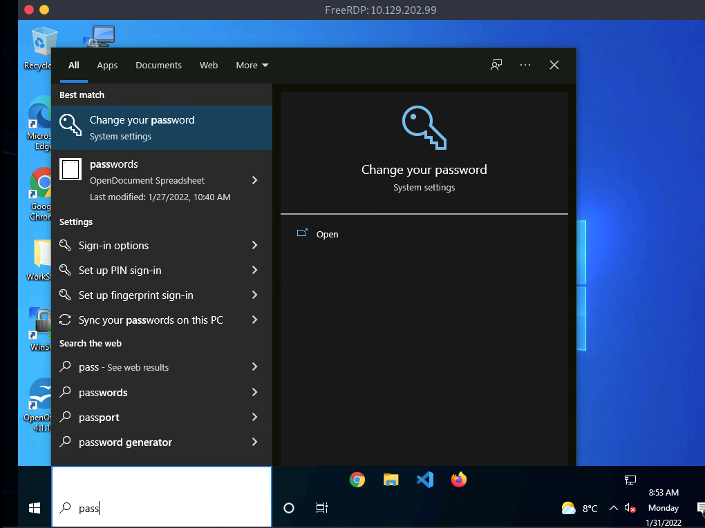

# Credential Hunting in Windows

Una vez que tenemos acceso a una máquina Windows de un objetivo a través de la GUI o CLI, podemos beneficiarnos significativamente de incorporar la **búsqueda de credenciales** en nuestro enfoque. La búsqueda de credenciales es el proceso de realizar búsquedas detalladas a lo largo del sistema de archivos y a través de varias aplicaciones para descubrir credenciales. Para entender este concepto, coloquémonos en un escenario donde hemos accedido a la estación de trabajo de un administrador de TI en Windows 10 mediante RDP.

## **Búsqueda Centrada**

Muchas de las herramientas disponibles en Windows tienen funcionalidad de búsqueda. En estos días, hay funciones centradas en la búsqueda incorporadas en la mayoría de las aplicaciones y sistemas operativos, por lo que podemos aprovechar esto en una tarea de penetración. Un usuario puede haber documentado sus contraseñas en algún lugar del sistema. Incluso puede haber credenciales predeterminadas que se pueden encontrar en varios archivos. Sería prudente basar nuestra búsqueda de credenciales en lo que sabemos sobre cómo se utiliza el sistema objetivo. En este caso, sabemos que tenemos acceso a la estación de trabajo de un administrador de TI.

**¿Qué podría estar haciendo un administrador de TI en su día a día y cuáles de esas tareas pueden requerir credenciales?**

Podemos usar esta pregunta y consideración para refinar nuestra búsqueda, reduciendo la necesidad de hacer conjeturas al azar lo más posible.

### **Términos Clave para Buscar**

Tanto si accedemos a la GUI como a la CLI, sabemos que tendremos algunas herramientas para realizar búsquedas. Sin embargo, de igual importancia es **qué estamos buscando exactamente**. A continuación, algunos términos clave útiles que podemos utilizar para descubrir credenciales:

| Términos en inglés | Traducción aproximada |
| ------------------ | --------------------- |
| Passwords          | Contraseñas           |
| Passphrases        | Frases de contraseña  |
| Keys               | Claves                |
| Username           | Nombre de usuario     |
| User account       | Cuenta de usuario     |
| Creds              | Credenciales          |
| Users              | Usuarios              |
| Passkeys           | Llaves de paso        |
| Configuration      | Configuración         |
| dbcredential       | Credenciales de BD    |
| dbpassword         | Contraseña de BD      |
| pwd                | Contraseña            |
| Login              | Inicio de sesión      |
| Credentials        | Credenciales          |

Vamos a usar algunos de estos términos clave para buscar en la estación de trabajo del administrador de TI.

## **Herramientas de Búsqueda**

Con acceso a la GUI, vale la pena intentar usar **Windows Search** para encontrar archivos en el objetivo usando algunas de las palabras clave mencionadas anteriormente.

<figure><figcaption></figcaption></figure>

**Windows Search**

De manera predeterminada, buscará varios ajustes del sistema operativo y el sistema de archivos en busca de archivos y aplicaciones que contengan los términos clave introducidos en la barra de búsqueda.

### **Herramientas de Terceros**

También podemos aprovechar herramientas de terceros como **Lazagne** para descubrir rápidamente credenciales que los navegadores web u otras aplicaciones instaladas puedan almacenar de forma insegura. Sería beneficioso mantener una copia independiente de **Lazagne** en nuestro equipo de ataque para poder transferirla rápidamente al objetivo. Podemos usar nuestro cliente RDP para copiar el archivo al objetivo desde nuestro host de ataque. Si estamos usando **xfreerdp**, solo debemos copiar y pegar en la sesión RDP establecida.

Una vez que **Lazagne.exe** esté en el objetivo, podemos abrir el **Command Prompt** o **PowerShell**, navegar al directorio donde subimos el archivo y ejecutar el siguiente comando:

```bash
C:\Users\bob\Desktop> start lazagne.exe all
```

Esto ejecutará Lazagne y ejecutará todos los módulos incluidos. Podemos incluir la opción `-vv` para estudiar qué está haciendo en segundo plano. Una vez que presionamos Enter, abrirá otra ventana y mostrará los resultados.

### **Salida de Lazagne**

```plaintext
====================================================================
|                        The LaZagne Project                         |
|                          ! BANG BANG !                             |
====================================================================

########## User: bob ##########

------------------- Winscp passwords -----------------

[+] Password found !!!
URL: 10.129.202.51
Login: admin
Password: SteveisReallyCool123
Port: 22
```

Si usamos la opción `-vv`, veremos intentos de obtener contraseñas de todo el software que Lazagne soporta. Podemos consultar la página de GitHub de Lazagne para ver todas las aplicaciones compatibles. Puede ser un tanto impactante ver lo fácil que es obtener credenciales en texto claro. Esto se debe, en gran medida, a la forma insegura en que muchas aplicaciones almacenan credenciales.

### **Usando `findstr`**

También podemos usar **findstr** para buscar patrones en muchos tipos de archivos. Teniendo en cuenta los términos clave comunes, podemos usar variaciones de este comando para descubrir credenciales en un objetivo Windows:

```bash
C:\> findstr /SIM /C:"password" *.txt *.ini *.cfg *.config *.xml *.git *.ps1 *.yml
```

## **Consideraciones Adicionales**

Existen miles de herramientas y términos clave que podríamos usar para buscar credenciales en sistemas operativos Windows. Saber cuáles elegir depende principalmente de la función de la computadora. Si llegamos a un sistema operativo Windows Server, podemos usar un enfoque diferente al de un escritorio de Windows. Siempre debemos tener en cuenta cómo se está utilizando el sistema, y esto nos ayudará a saber dónde buscar. A veces incluso podremos encontrar credenciales navegando y listando directorios en el sistema de archivos mientras nuestras herramientas están ejecutándose.

**Otros Lugares a Tener en Cuenta:**

* Contraseñas en las políticas de grupo en la carpeta SYSVOL
* Contraseñas en scripts en la carpeta SYSVOL
* Contraseñas en scripts en recursos compartidos de IT
* Contraseñas en archivos web.config en máquinas de desarrollo y recursos compartidos de IT
* **unattend.xml**
* Contraseñas en campos de descripción de usuarios o computadoras en Active Directory
* Bases de datos de KeePass --> extraer hash, crackear y obtener acceso.
* Encontradas en sistemas de usuarios y recursos compartidos
* Archivos como `pass.txt`, `passwords.docx`, `passwords.xlsx` encontrados en sistemas de usuarios, recursos compartidos, SharePoint
