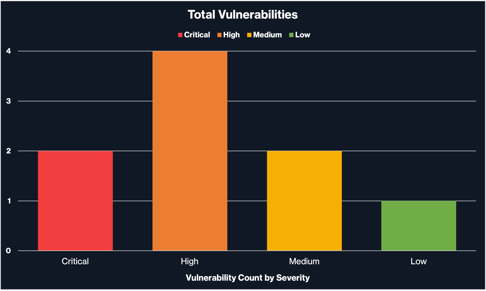

# Reporting

Las habilidades blandas en seguridad de la información son esenciales para tener éxito en tu rol. Aunque las herramientas de escaneo de vulnerabilidades aprovechan la automatización, aún es necesario transferir la información a un informe listo para el cliente. Este informe debe ser comprensible tanto para personas técnicas como no técnicas. Un informe sólido incluye las siguientes secciones:

* **Resumen Ejecutivo**
* **Descripción General de la Evaluación**
* **Alcance**
* **Vulnerabilidades y Recomendaciones**

## **Resumen Ejecutivo**

El Resumen Ejecutivo de un informe de evaluación de vulnerabilidades está diseñado para ser leído por un ejecutivo que necesita una visión general de alto nivel sobre los detalles y los aspectos más importantes a corregir de inmediato, según su gravedad. Esta sección permite al ejecutivo priorizar las remediaciones basándose en el resumen.

También puedes incluir una vista gráfica del número de vulnerabilidades según su gravedad, similar al gráfico siguiente:

<figure><figcaption></figcaption></figure>

## **Descripción General de la Evaluación**

La **Descripción General de la Evaluación** debe incluir cualquier metodología utilizada durante la evaluación. Esta sección debe detallar la ejecución de la evaluación durante el período de pruebas, como describir el proceso y las herramientas utilizadas para el proyecto (por ejemplo, Nessus).

## **Alcance y Duración**

La sección de **Alcance y Duración** debe incluir todo lo que el cliente haya autorizado para la evaluación, incluyendo el alcance objetivo y el período de pruebas.

## **Vulnerabilidades y Recomendaciones**

La sección de **Vulnerabilidades y Recomendaciones** debe detallar los hallazgos descubiertos durante la evaluación de vulnerabilidades, una vez eliminados los falsos positivos mediante pruebas manuales. Lo ideal es agrupar los hallazgos relacionados según el tipo de problema o su gravedad.

Cada problema debe incluir los siguientes elementos:

* Nombre de la Vulnerabilidad
* CVE
* CVSS
* Descripción del Problema
* Referencias
* Pasos de Remediación
* Prueba de Concepto
* Sistemas Afectados

## **Cierre**

La elaboración del informe es la parte más crucial de cualquier proyecto de evaluación. Asegúrate de redactar tus informes de manera que cualquier audiencia pueda comprenderlos. Al discutir información técnica, siempre proporciona referencias claras para que el lector pueda entender o reproducir lo que describes. Además, las oraciones deben ser claras y concisas, con una gramática adecuada. Los informes más fuertes son precisos y fáciles de leer para el público.
