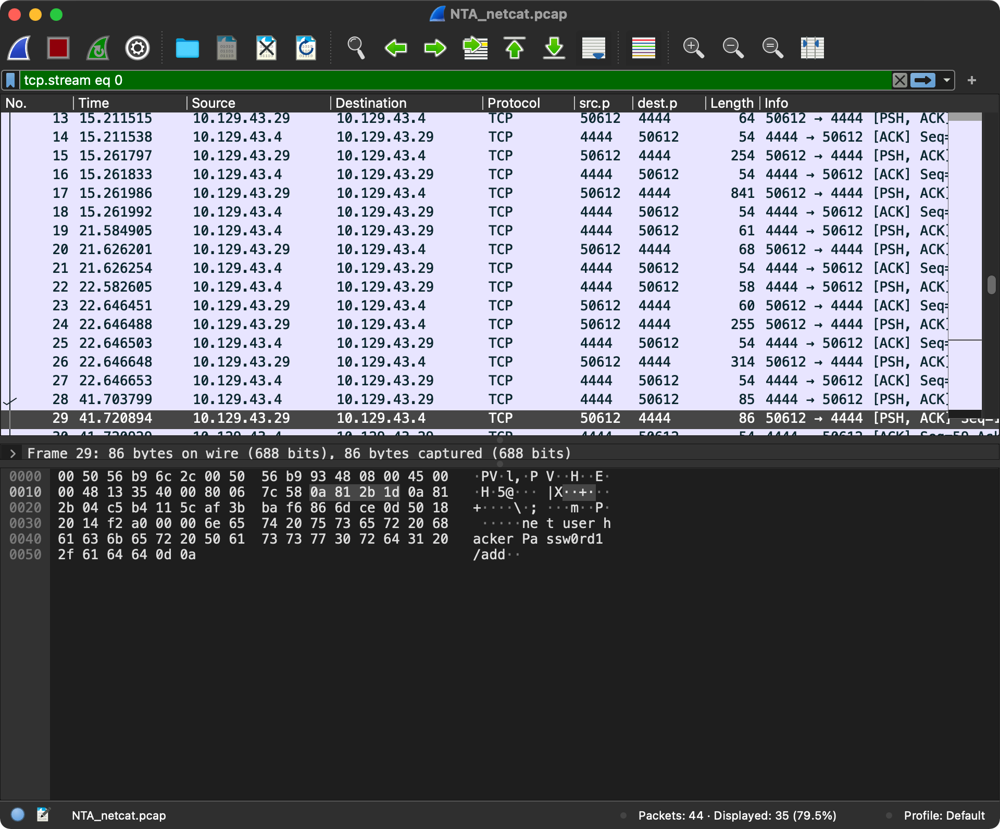
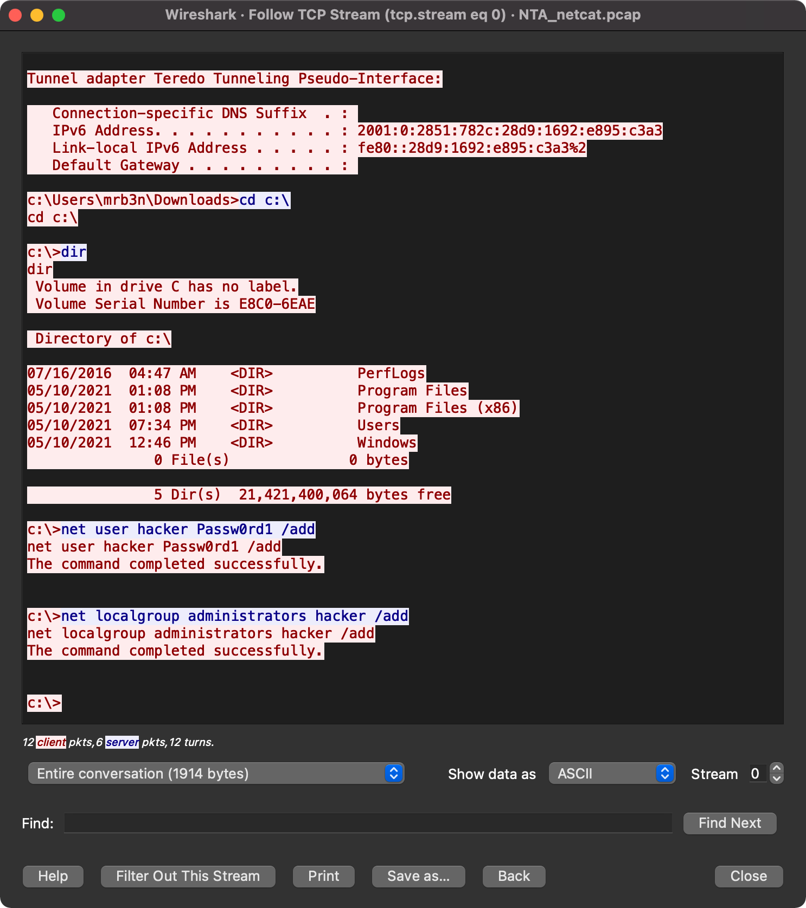

# Detection & Prevention

Tomemos un descanso de nuestras actividades de infiltración de hosts para explorar el lado defensivo. En esta sección, veremos cómo detectar shells activos, buscar cargas útiles en un host y en el tráfico de red, y cómo se pueden ofuscar estos ataques para evadir nuestras defensas.

## Monitoreo

Cuando se trata de buscar e identificar **shells activos**, entrega de cargas útiles y ejecución, o intentos de subvertir nuestras defensas, tenemos muchas opciones para detectar y responder a estos eventos. Antes de hablar sobre las fuentes de datos y herramientas, tomemos un momento para revisar el **Marco ATT\&CK de MITRE** y definir las técnicas y tácticas que usan los atacantes. El Marco ATT\&CK, como lo define MITRE, es una "base de conocimiento globalmente accesible de tácticas y técnicas adversarias basada en observaciones del mundo real".

### **Marco ATT\&CK**

<figure><figcaption></figcaption></figure>

### Tácticas y Técnicas Notables de MITRE ATT\&CK:

| **Táctica / Técnica**      | **Descripción**                                                                                                                                                                                                                                                                                                                                                   |
| -------------------------- | ----------------------------------------------------------------------------------------------------------------------------------------------------------------------------------------------------------------------------------------------------------------------------------------------------------------------------------------------------------------- |
| **Acceso Inicial**         | Los atacantes intentan obtener acceso inicial comprometiendo un host o servicio expuesto públicamente, como aplicaciones web, servicios mal configurados como SMB o protocolos de autenticación, o bugs en un host público que introducen una vulnerabilidad. A menudo se realiza en un host bastión, lo que proporciona al atacante un punto de apoyo en la red. |
| **Ejecución**              | Esta técnica depende de que el código proporcionado por un atacante se ejecute en el host víctima. Los shells y cargas útiles son el enfoque principal aquí. Esto incluye la ejecución de comandos en un navegador web, PowerShell a través de PsExec, o la explotación de vulnerabilidades mediante frameworks como Metasploit.                                  |
| **Comando y Control (C2)** | C2 es el objetivo final de nuestros esfuerzos: obtener acceso continuo a un host para ejecutar comandos y realizar acciones en la red objetivo. El uso de puertos y protocolos comunes facilita ocultar el tráfico malicioso.                                                                                                                                     |

## Eventos a Vigilar:

* **Subidas de archivos:** En las aplicaciones web, subir archivos es un método común para obtener un shell en un host. Monitorea los registros de la aplicación para detectar cualquier archivo potencialmente malicioso.
* **Acciones sospechosas de usuarios no administradores:** Los usuarios emitiendo comandos como `whoami` o accediendo a recursos compartidos inusuales pueden ser indicadores de compromiso.
* **Sesiones de red anómalas:** El tráfico inusual o conexiones a puertos sospechosos como el 4444 (usado por Meterpreter) pueden ser señales de explotación.

## Establecer Visibilidad de la Red

Para detectar y prevenir ataques, es crucial tener una comprensión detallada de los sistemas y el entorno de red que se intenta proteger. Mantener diagramas topológicos de red actualizados ayuda a visualizar el tráfico. Herramientas como **NetBrain** combinan diagramación visual, documentación y gestión remota, facilitando la administración de redes en constante crecimiento.

Algunos proveedores de dispositivos de red como **Cisco Meraki**, **Ubiquiti**, **Check Point**, y **Palo Alto Networks** están incorporando visibilidad de capa 7 en sus dispositivos, moviendo las capacidades de administración a controladores en la nube. Esto facilita la creación de un **dashboard visual** que proporciona una línea base del tráfico, protocolos y aplicaciones, permitiendo detectar cualquier desviación de lo normal.

Cuando un payload se ejecuta con éxito, necesitará comunicarse a través de la red, por lo que tener **visibilidad de red** es crucial. Los **dispositivos de seguridad de red** capaces de realizar inspección profunda de paquetes pueden actuar como un antivirus de red. Algunos payloads, como los mencionados anteriormente, podrían ser detectados y bloqueados a nivel de red, especialmente si el tráfico no está cifrado.

Cuando usamos **Netcat** en las secciones de shells inversos y shells enlazados, el tráfico entre el origen y el destino no estaba cifrado. Si alguien captura ese tráfico, puede ver cada comando enviado entre nuestra máquina de ataque y el objetivo.

### Tráfico Sospechoso en Texto Claro

En este ejemplo, podemos ver el tráfico de NetFlow entre dos hosts en un puerto sospechoso (4444). Al expandir ese tráfico, podemos ver que alguien está usando comandos `net` para crear un nuevo usuario en el host.

<figure><figcaption></figcaption></figure>

### Siguiendo el Tráfico

<figure><figcaption></figcaption></figure>

Este es un excelente ejemplo de acceso básico y ejecución de comandos para obtener persistencia mediante la adición de un usuario al host. Independientemente del nombre "hacker" que se use, si el registro de comandos está habilitado junto con los datos de NetFlow, podemos ver rápidamente que el usuario está realizando acciones potencialmente maliciosas y analizar este evento para determinar si ha ocurrido un incidente o si simplemente es un administrador jugando. Un dispositivo de seguridad moderno puede detectar, alertar y prevenir más comunicaciones de red desde ese host mediante la inspección profunda de paquetes.

Hablando de antivirus, discutamos un poco la **detección y protección de dispositivos finales**.

## Protección de Dispositivos Finales

Los dispositivos finales son aquellos que se conectan en el "extremo" de una red, ya sea como origen o destino de la transmisión de datos. Algunos ejemplos de dispositivos finales incluyen:

* Computadoras de trabajo
* Servidores
* Impresoras
* Almacenamiento conectado a la red (NAS)
* Cámaras
* Televisores inteligentes
* Altavoces inteligentes

Debemos priorizar la protección de estos dispositivos, especialmente aquellos que ejecutan un sistema operativo con una interfaz de línea de comandos (CLI) que puede ser accedida remotamente. La misma interfaz que facilita la administración de un dispositivo lo convierte en un buen objetivo para los atacantes. Aunque parece simple, tener un antivirus instalado y habilitado es un buen comienzo. El vector de ataque más común después de las configuraciones incorrectas es el elemento humano. Un solo clic en un enlace o archivo puede comprometer el sistema. Tener monitoreo y alertas en tus dispositivos finales puede ayudar a detectar y prevenir problemas antes de que ocurran.

***

En sistemas **Windows**, **Windows Defender** (también conocido como Microsoft Defender) está presente desde la instalación y debe mantenerse habilitado. También es importante que el **Firewall de Defender** esté habilitado con todos los perfiles (Dominio, Privado y Público) activos. Solo se deben hacer excepciones para aplicaciones aprobadas según un proceso de gestión de cambios. Además, asegúrate de tener una **estrategia de gestión de parches** para garantizar que todos los hosts reciban actualizaciones poco después de que Microsoft las libere. Esto también aplica a los servidores que alojan recursos compartidos y sitios web. Aunque puede ralentizar el rendimiento, el antivirus en un servidor puede prevenir la ejecución de una carga útil y el establecimiento de una sesión shell maliciosa.

## Posibles Mitigaciones:

Considera las siguientes implementaciones para mitigar muchos de estos vectores o exploits:

* **Sandboxing de aplicaciones**: Al aislar tus aplicaciones expuestas al mundo, puedes limitar el alcance del daño que un atacante puede realizar si encuentra una vulnerabilidad o una configuración incorrecta en la aplicación.
* **Políticas de permisos de mínimo privilegio**: Limitar los permisos que tienen los usuarios puede detener el acceso no autorizado. ¿Necesita un usuario común acceso administrativo para realizar sus tareas diarias? ¿Qué hay de un administrador de dominio? Asegurar que las políticas de seguridad y permisos estén en su lugar dificultará o incluso detendrá un ataque.
* **Segmentación y endurecimiento de hosts**: Endurecer adecuadamente los hosts y segmentar aquellos que requieren exposición a Internet puede evitar que un atacante se mueva lateralmente en tu red si obtiene acceso a un host en la frontera. Seguir las guías de endurecimiento (STIG) y colocar servidores web, servidores VPN, etc., en una DMZ o red 'cuarentenada' impedirá ese tipo de movimiento lateral.
* **Firewalls físicos y de capa de aplicación**: Los firewalls pueden ser herramientas poderosas si se implementan correctamente. Reglas de entrada y salida que solo permitan tráfico desde dentro de tu red, en puertos aprobados para tus aplicaciones, y negando tráfico desde direcciones IP prohibidas pueden detener muchos shells inversos y enlazados. Implementaciones como la traducción de direcciones de red (NAT) pueden romper la funcionalidad de una carga útil si no se toma en cuenta.

## Resumen

Estas protecciones y mitigaciones no son una solución definitiva para detener ataques. En la actualidad, se requiere una estrategia de seguridad sólida y adaptable. Adoptar un enfoque de **defensa en profundidad** ayudará a dificultar las acciones de los atacantes y garantizará que los puntos más vulnerables no sean explotados fácilmente.
