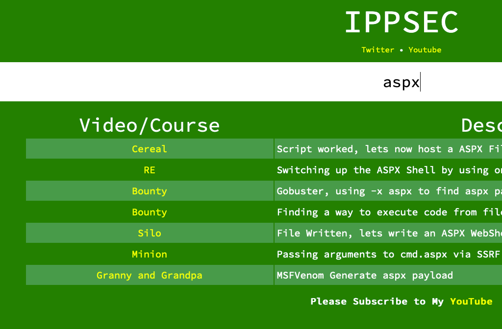
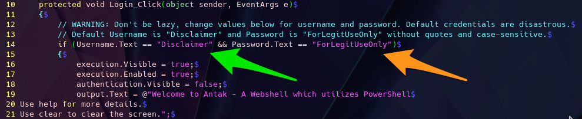
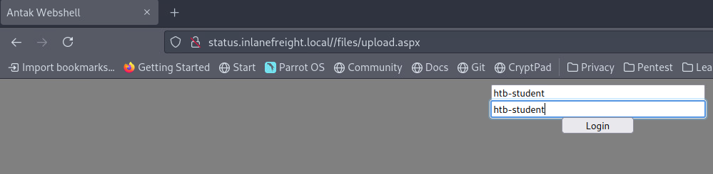
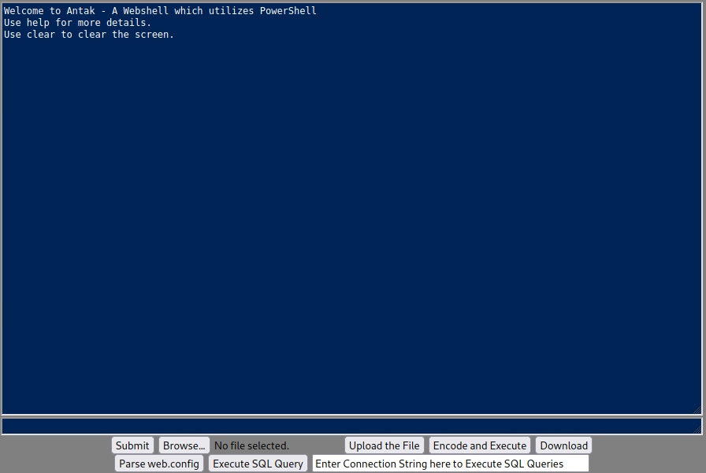
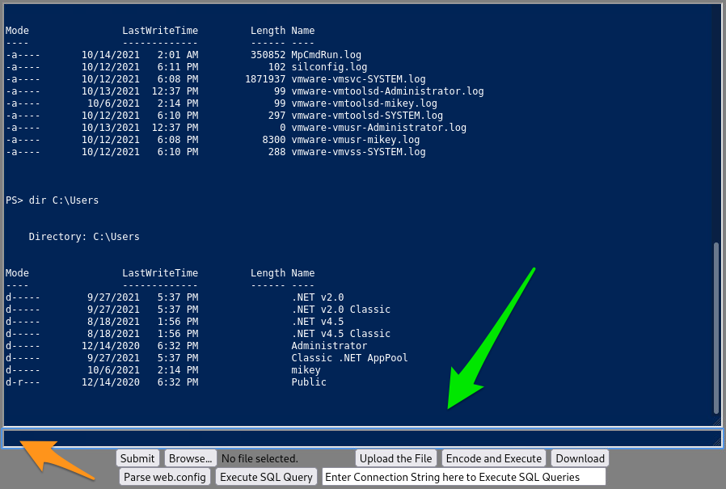

# Antak Webshell

## ASPX y un Consejo para Aprender Rápido

Antes de profundizar en los conceptos y ejercicios de shells ASPX, es importante cubrir un recurso de aprendizaje que puede ayudar a reforzar la mayoría de los conceptos tratados en HTB Academy. A veces puede ser difícil visualizar un concepto utilizando solo un método de aprendizaje. Es útil complementar la lectura con ver demostraciones y realizar ejercicios prácticos, como hemos estado haciendo hasta ahora. Los videos explicativos son una excelente manera de aprender conceptos, además de que pueden consumirse de manera casual (mientras se almuerza, en la cama, en el sofá, etc.). Un gran recurso para aprender es el blog de IPPSEC en [ippsec.rocks](https://ippsec.rocks). Este sitio es una poderosa herramienta de aprendizaje.

Por ejemplo, podemos buscar el concepto de shells web utilizando su sitio, escribiendo “aspx”.

<figure><figcaption></figcaption></figure>

Su sitio rastrea las descripciones de cada uno de los videos que ha publicado en YouTube y recomienda una marca de tiempo asociada con esa palabra clave. Al hacer clic en uno de los enlaces, nos llevará a esa sección del video donde se demuestra el concepto. Es como un motor de búsqueda para aprender habilidades de hacking. Para obtener una comprensión básica de lo que es un shell web ASPX, podemos ver una breve porción de la demostración de IPPSEC en la máquina retirada "Cereal". El enlace debería comenzar en el minuto 1:17. Ve desde el minuto 1:17 hasta el minuto 1:20.

Observaremos que subió el archivo a través de HTTP y luego navegó hacia el archivo usando el navegador web. Esto le dio la capacidad de enviar comandos y recibir respuestas del sistema operativo Windows subyacente.

#### ¿Cómo funciona ASPX?

## **ASPX Explicado**

ASPX (Active Server Page Extended) es un tipo de archivo/extensión escrito para el Framework ASP.NET de Microsoft. En un servidor web que ejecuta el framework ASP.NET, se pueden generar páginas de formularios web para que los usuarios ingresen datos. En el servidor, la información se convierte en HTML. Podemos aprovechar esto utilizando un shell web basado en ASPX para controlar el sistema operativo Windows subyacente. Vamos a verlo de primera mano utilizando el shell web **Antak**.

## **Shell Web Antak**

Antak es un shell web construido en ASP.Net, incluido dentro del proyecto Nishang. Nishang es un conjunto de herramientas ofensivas en PowerShell que ofrece opciones para cualquier parte de una prueba de penetración. Como estamos enfocados en aplicaciones web por el momento, vamos a centrarnos en Antak. Antak utiliza PowerShell para interactuar con el host, lo que lo hace ideal para obtener un shell web en un servidor Windows. La interfaz de usuario incluso tiene el tema de PowerShell. Es hora de sumergirse y experimentar con Antak.

## Trabajando con Antak

Los archivos de Antak se encuentran en el directorio `/usr/share/nishang/Antak-WebShell`.

```bash
sherlock28@htb[/htb]$ ls /usr/share/nishang/Antak-WebShell

antak.aspx  Readme.md
```

El shell web Antak funciona como una consola de PowerShell. Sin embargo, ejecuta cada comando como un nuevo proceso. También puede ejecutar scripts en memoria y codificar los comandos que envías. Como shell web, Antak es una herramienta bastante poderosa.

## Demostración de Antak

Ahora que entendemos qué es Antak y cómo funciona, vamos a probarlo contra la misma aplicación web de la sección de Laudanum. Si deseas seguir esta demostración, deberás agregar una entrada en tu archivo `/etc/hosts` en tu máquina de ataque o en Pwnbox para el host al que estamos atacando. Esa entrada debería ser:

```lua
<dirección_ip_objetivo> status.inlanefreight.local
```

Una vez hecho esto, siempre que estés en la VPN o utilizando Pwnbox, también podrás jugar y explorar esta demostración.

### Mover una Copia para Modificación

```bash
sherlock28@htb[/htb]$ cp /usr/share/nishang/Antak-WebShell/antak.aspx /home/administrator/Upload.aspx
```

Asegúrate de configurar credenciales para acceder al shell web. Modifica la línea 14, añadiendo un usuario (flecha verde) y una contraseña (flecha naranja). Esto será importante cuando navegues a tu shell web, similar a Laudanum. Esto puede ayudar a asegurar tus operaciones asegurando que personas aleatorias no puedan simplemente encontrar y utilizar el shell. Es prudente eliminar el arte ASCII y los comentarios del archivo, ya que estos elementos suelen estar firmados y pueden alertar a los defensores o sistemas antivirus sobre lo que estás haciendo.

### Modificar el Shell para su Uso

Para demostrar la herramienta, estamos subiendo el archivo al mismo portal de estado que usamos para Laudanum. Ese host era un servidor Windows, por lo que nuestro shell debería funcionar correctamente con PowerShell. Sube el archivo y navega a la página para utilizarlo. Te pedirá un usuario y una contraseña. Recuerda que en esta aplicación web, los archivos se almacenan en el directorio `\\files\`. Cuando navegues al archivo `upload.aspx`, deberías ver un mensaje como el que mostramos a continuación.

<figure><figcaption></figcaption></figure>

### **Éxito con el Shell**

Como se ve en la siguiente imagen, se nos concederá acceso si ingresamos las credenciales correctamente.

<figure><figcaption></figcaption></figure>

<figure><figcaption></figcaption></figure>

Ahora que tenemos acceso, podemos utilizar comandos de PowerShell para navegar y ejecutar acciones contra el host. Podemos emitir comandos básicos desde la ventana del shell de Antak, subir y descargar archivos, codificar y ejecutar scripts, y mucho más (flecha verde a continuación). Esta es una excelente forma de utilizar un shell web para entregarnos una conexión de vuelta a nuestra plataforma de comando y control. Podríamos subir la carga útil a través de la función de subida o usar un comando en una línea de PowerShell para descargar y ejecutar el shell por nosotros. Si no estás seguro de por dónde empezar, emite el comando `help` en la ventana del prompt (flecha naranja a continuación).

### Emisión de Comandos

<figure><figcaption></figcaption></figure>
