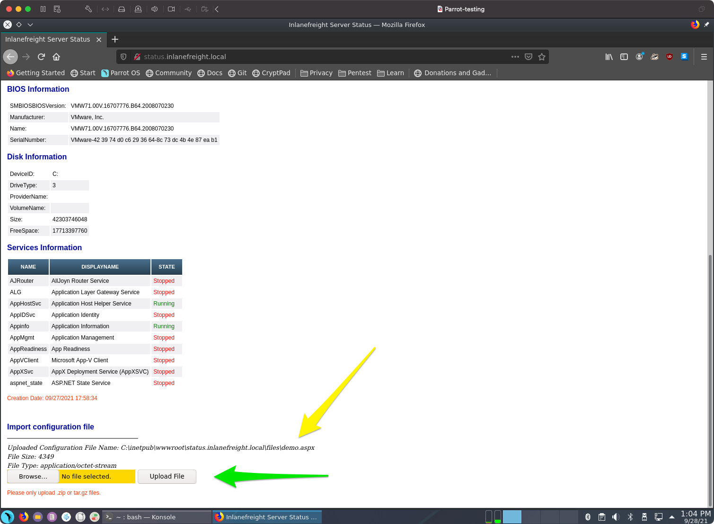
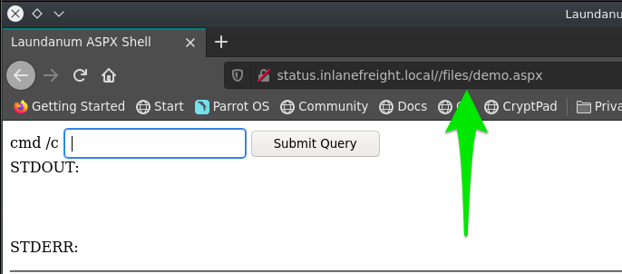
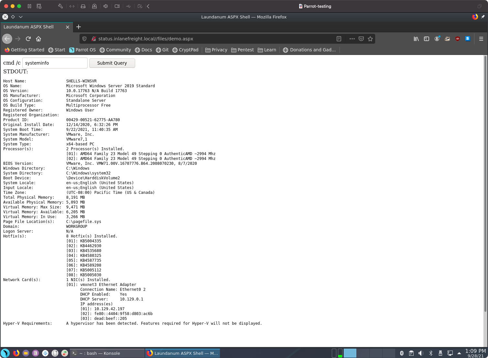

# Laudanum, One Webshell to Rule Them All

Laudanum es un repositorio de archivos listos para usar que se pueden inyectar en una víctima y recibir de vuelta acceso a través de un reverse shell, ejecutar comandos en el host víctima directamente desde el navegador, y más. El repositorio incluye archivos inyectables para muchos lenguajes diferentes de aplicaciones web, incluidos ASP, ASPX, JSP, PHP, y más. Esto es un elemento básico para tener en cualquier prueba de penetración. Si estás usando tu propia máquina virtual, Laudanum está integrado por defecto en Parrot OS y Kali. Para cualquier otra distribución, probablemente necesitarás descargar una copia para usar. Puedes conseguirlo aquí. Vamos a examinar Laudanum y ver cómo funciona.&#x20;

## Trabajando con Laudanum&#x20;

Los archivos de Laudanum se pueden encontrar en el directorio `/usr/share/laudanum`. Para la mayoría de los archivos dentro de Laudanum, puedes copiarlos tal cual y colocarlos donde los necesites en la víctima para ejecutarlos. Para archivos específicos, como los shells, debes editar el archivo primero para insertar la dirección IP de tu host atacante para asegurarte de poder acceder al web shell o recibir una llamada de retorno en el caso de que utilices un reverse shell. Antes de usar los diferentes archivos, asegúrate de leer el contenido y los comentarios para garantizar que tomas las acciones adecuadas.&#x20;

## Demostración de Laudanum&#x20;

Ahora que entendemos qué es Laudanum y cómo funciona, veamos una aplicación web que hemos encontrado en nuestro entorno de laboratorio y veamos si podemos ejecutar un web shell. Si deseas seguir esta demostración, necesitarás agregar una entrada en tu archivo `/etc/hosts` en tu máquina de ataque o dentro de Pwnbox para el host que estamos atacando. Esa entrada debería leerse: `<target ip> status.inlanefreight.local`. Una vez que esto esté hecho, puedes jugar y explorar esta demostración siempre que estés en la VPN o usando Pwnbox.&#x20;

### Mover una Copia para Modificación&#x20;

```
sherlock28@htb[/htb]$ cp /usr/share/laudanum/aspx/shell.aspx /home/tester/demo.aspx
```

Agrega tu dirección IP a la variable `allowedIps` en la línea 59. Haz cualquier otro cambio que desees. Puede ser prudente eliminar el arte ASCII y los comentarios del archivo. Estos elementos en un payload a menudo son firmados y pueden alertar a los defensores/AV sobre lo que estás haciendo.

### Modificar el Shell para Usar

Estamos aprovechando la función de carga en la parte inferior de la página de estado (Flecha Verde) para que esto funcione. Selecciona tu archivo shell y haz clic en subir. Si tiene éxito, debería imprimir la ruta a donde se guardó el archivo (Flecha Amarilla). Usa la función de carga. El éxito imprime dónde fue el archivo, navega hacia él.

<figure><figcaption></figcaption></figure>

### Aprovechar la Función de Carga

Una vez que la carga sea exitosa, necesitarás navegar hasta tu web shell para utilizar sus funciones. La imagen a continuación nos muestra cómo hacerlo. Como se ve en la última imagen, nuestro shell fue subido al directorio `\\files\` y el nombre se mantuvo igual. Esto no siempre será el caso. Puedes encontrarte con algunas implementaciones que randomizan los nombres de archivo en la carga, que no tienen un directorio de archivos público o cualquier otro número de posibles salvaguardas. Por ahora, tenemos suerte de que ese no sea el caso. Con esta aplicación web en particular, nuestro archivo fue a `status.inlanefreight.local\\files\demo.aspx` y requerirá que busquemos la carga utilizando esa `\` en la ruta en lugar de la `/` como es normal. Una vez que hagas esto, tu navegador limpiará la ventana de URL para aparecer como `status.inlanefreight.local//files/demo.aspx`.

<figure><figcaption></figcaption></figure>

### Navegar a Nuestro Shell

Ahora podemos utilizar el shell de Laudanum que subimos para emitir comandos al host. En el ejemplo, podemos ver que se ejecutó el comando `systeminfo`.

<figure><figcaption></figcaption></figure>

### Éxito del Shell

<figure><figcaption></figcaption></figure>
