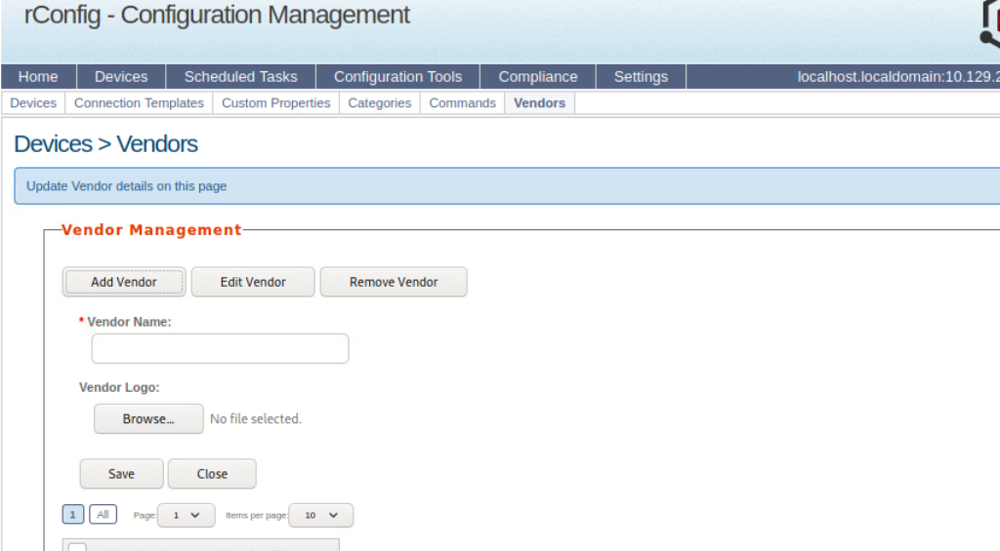
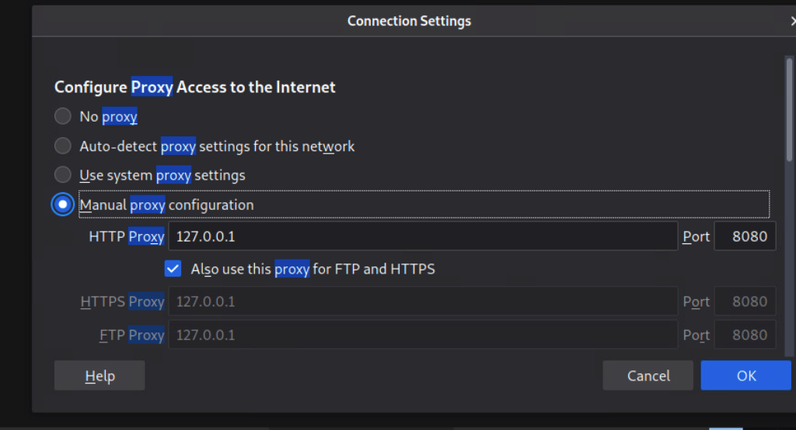
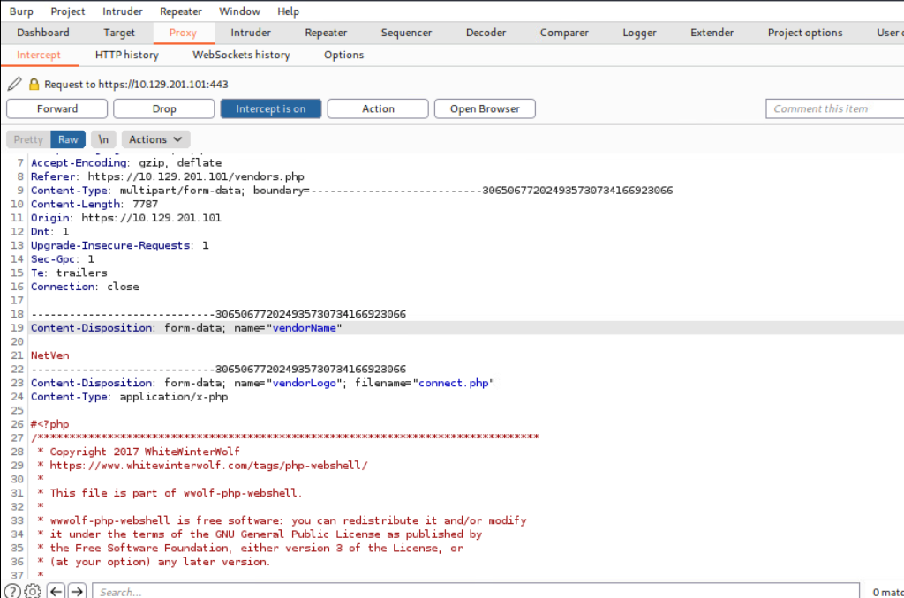
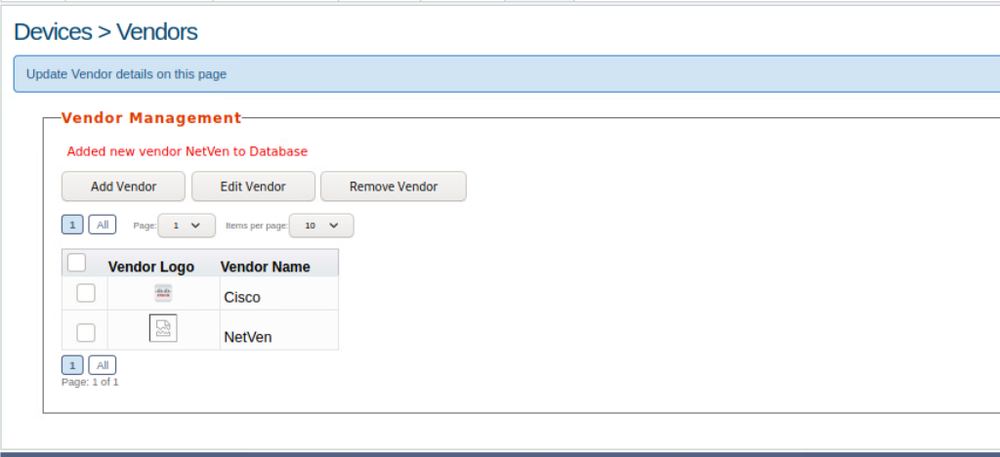
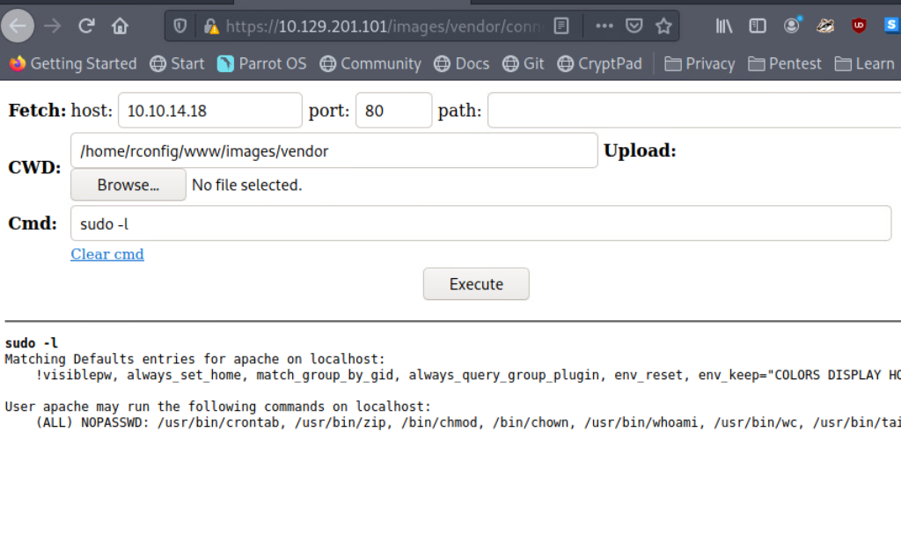

# PHP Web Shells

PHP (Hypertext Preprocessor) es un lenguaje de scripting de propósito general, de código abierto, que se utiliza típicamente como parte de una pila web para impulsar un sitio web. Al momento de escribir esto (octubre de 2021), PHP es el lenguaje de programación del lado del servidor más popular. Según una encuesta reciente realizada por W3Techs, "PHP es utilizado por el 78.6% de todos los sitios web cuyo lenguaje de programación del lado del servidor conocemos".

Consideremos un ejemplo práctico de completar los campos de cuenta de usuario y contraseña en un formulario web de inicio de sesión.

## **Página de Inicio de Sesión en PHP**

¿Recuerdas el servidor rConfig mencionado anteriormente en este módulo? Usa PHP. Podemos ver un archivo `login.php`. Entonces, cuando seleccionamos el botón de inicio de sesión después de completar los campos de Nombre de usuario y Contraseña, esa información se procesa en el servidor usando PHP. Saber que un servidor web utiliza PHP nos da, como pentesters, una pista de que podemos obtener un shell web basado en PHP en este sistema. Vamos a trabajar en este concepto de manera práctica.

<figure><figcaption></figcaption></figure>

## Trabajo Práctico con un Shell Web Basado en PHP

Dado que PHP procesa código y comandos en el lado del servidor, podemos usar cargas útiles preescritas para obtener un shell a través del navegador o iniciar una sesión de shell inverso con nuestra máquina de ataque. En este caso, aprovecharemos una vulnerabilidad en rConfig 3.9.6 para cargar manualmente un shell web PHP e interactuar con el host Linux subyacente. Además de toda la funcionalidad mencionada anteriormente, rConfig permite a los administradores agregar dispositivos de red y categorizarlos por proveedor. Inicia sesión en rConfig con las credenciales predeterminadas (admin), luego navega a **Devices > Vendors** y haz clic en **Add Vendor**.

**Pestaña de Proveedores**

Utilizaremos el shell web PHP de **WhiteWinterWolf**. Podemos descargarlo o copiar y pegar el código fuente en un archivo `.php`. Ten en cuenta que el tipo de archivo es importante, como veremos pronto. Nuestro objetivo es cargar el shell web PHP a través del botón de exploración de logotipo de proveedor. Intentar hacer esto inicialmente fallará, ya que rConfig verifica el tipo de archivo y solo permitirá la carga de tipos de archivos de imagen (.png, .jpg, .gif, etc.). Sin embargo, podemos evitar esta restricción utilizando **Burp Suite**.

<figure><figcaption></figcaption></figure>

Inicia Burp Suite, navega al menú de configuración de red del navegador y completa los ajustes del proxy. La dirección IP `127.0.0.1` irá en el campo de dirección IP, y `8080` irá en el campo del puerto para asegurarnos de que todas las solicitudes pasen a través de Burp (recuerda que Burp actúa como proxy web).

## **Configuración del Proxy**

Nuestro objetivo es cambiar el tipo de contenido para evitar la restricción del tipo de archivo al cargar archivos para que sean "presentados" como el logotipo del proveedor, de modo que podamos navegar a ese archivo y obtener nuestro shell web.

<figure><figcaption></figcaption></figure>

## Evadiendo la Restricción de Tipo de Archivo

Con **Burp Suite** abierto y la configuración del proxy de nuestro navegador web correctamente configurada, ahora podemos subir el shell web en PHP. Haz clic en el botón **Browse**, navega hasta donde esté almacenado nuestro archivo `.php` en la máquina de ataque, selecciona **Open** y luego **Save** (es posible que tengamos que aceptar el certificado de PortSwigger). Parecerá que la página web se está colgando, pero eso es porque necesitamos decirle a Burp que reenvíe las solicitudes HTTP. Continúa reenviando las solicitudes hasta que veas la solicitud **POST** que contiene nuestro archivo subido. Se verá así:

### **Solicitud POST**

Como se mencionó en una sección anterior, notarás que algunas cargas útiles tienen comentarios del autor que explican el uso, dan agradecimientos o enlaces a blogs personales. Esto puede delatarnos, por lo que no siempre es lo mejor dejar los comentarios. Cambiaremos el **Content-type** de `application/x-php` a `image/gif`. Esto "engañará" al servidor y permitirá que subamos el archivo `.php`, evitando la restricción de tipo de archivo. Una vez que hagamos esto, selecciona **Forward** dos veces y el archivo será enviado. Ahora podemos apagar el interceptador de Burp y volver al navegador para ver los resultados.

<figure><figcaption></figcaption></figure>

### **Proveedor Añadido**

El mensaje: **'Added new vendor NetVen to Database'** nos indica que la subida del archivo fue exitosa. También podemos ver la entrada del proveedor **NetVen** con un logotipo que muestra una hoja de papel rasgada. Esto significa que rConfig no reconoció el tipo de archivo como una imagen, por lo que utilizó esa imagen por defecto. Ahora podemos intentar usar nuestro shell web. Usando el navegador, navega a este directorio en el servidor rConfig:

<figure><figcaption></figcaption></figure>

```arduino
/images/vendor/connect.php
```

Esto ejecutará la carga útil y nos proporcionará una sesión de shell no interactiva directamente en el navegador, permitiéndonos ejecutar comandos en el sistema operativo subyacente.

### Éxito con el Shell Web

<figure><figcaption></figcaption></figure>

## Consideraciones al Usar Web Shells

Al utilizar shells web, ten en cuenta los siguientes problemas que pueden surgir durante el proceso de pruebas de penetración:

* Las aplicaciones web a veces eliminan archivos automáticamente después de un período predefinido.
* Interactividad limitada con el sistema operativo, en términos de navegar por el sistema de archivos, descargar y subir archivos, o encadenar comandos (ej. `whoami && hostname`), lo que puede ralentizar el progreso, especialmente al realizar enumeraciones.
* Potencial inestabilidad a través de un shell web no interactivo.
* Mayor probabilidad de dejar pruebas de que tuvimos éxito en el ataque.

Dependiendo del tipo de prueba (por ejemplo, una evaluación de evasión tipo "caja negra"), es posible que necesitemos intentar pasar desapercibidos y cubrir nuestros rastros. A menudo estamos ayudando a nuestros clientes a probar sus capacidades para detectar una amenaza en vivo, por lo que debemos emular lo más posible los métodos que un atacante malicioso podría intentar, incluidos los esfuerzos para operar con sigilo. Esto ayudará a nuestros clientes y también nos protegerá a largo plazo para evitar que los archivos sean descubiertos después de que termine el período de la prueba. En la mayoría de los casos, al intentar obtener una sesión de shell con un objetivo, sería prudente establecer un shell inverso y luego eliminar la carga útil ejecutada. Además, debemos documentar cada método que intentemos, lo que funcionó y lo que no, e incluso los nombres de las cargas útiles y archivos que intentamos utilizar. Podríamos incluir un **sha1sum** o **hash MD5** del nombre del archivo, las ubicaciones de carga en nuestros informes como prueba, y proporcionar atribución.
