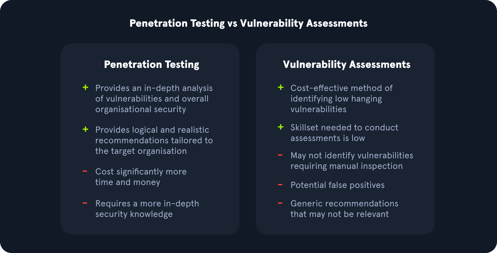

# Vulnerability Assessment

## Evaluaciones de Seguridad

Todas las organizaciones deben realizar diferentes tipos de evaluaciones de seguridad en sus redes, computadoras y aplicaciones al menos de vez en cuando. El propósito principal de la mayoría de las evaluaciones de seguridad es encontrar y confirmar la presencia de vulnerabilidades, para que podamos trabajar en parchearlas, mitigarlas o eliminarlas. Existen diferentes formas y metodologías para probar cuán segura es un sistema informático. Algunos tipos de evaluaciones de seguridad son más apropiados para ciertas redes que otros. Pero todos sirven para mejorar la ciberseguridad. Todas las organizaciones tienen diferentes requisitos de cumplimiento y tolerancia al riesgo, enfrentan diferentes amenazas y tienen diferentes modelos de negocio que determinan los tipos de sistemas que ejecutan externamente e internamente. Algunas organizaciones tienen una postura de seguridad mucho más madura que sus pares y pueden enfocarse en simulaciones avanzadas de red realizadas por terceros, mientras que otras aún están trabajando para establecer una seguridad básica. Sin embargo, todas las organizaciones deben mantenerse al tanto de las vulnerabilidades tanto heredadas como recientes y tener un sistema para detectar y mitigar los riesgos para sus sistemas y datos.

## Evaluación de Vulnerabilidades

Las evaluaciones de vulnerabilidades son apropiadas para todas las organizaciones y redes. Una evaluación de vulnerabilidades se basa en un estándar de seguridad particular, y se analiza el cumplimiento con estos estándares (por ejemplo, pasando por una lista de verificación).

Una evaluación de vulnerabilidades puede basarse en varios estándares de seguridad. Qué estándares aplican a una red particular dependerá de muchos factores. Estos factores pueden incluir regulaciones de seguridad de datos específicas de la industria y regionales, el tamaño y la forma de la red de la empresa, qué tipos de aplicaciones utilizan o desarrollan y su nivel de madurez en seguridad.

Las evaluaciones de vulnerabilidades pueden realizarse de manera independiente o junto con otras evaluaciones de seguridad dependiendo de la situación de la organización.

## Prueba de Penetración

Aquí en Hack The Box, nos encantan las pruebas de penetración, también conocidas como pentests. Nuestros laboratorios y muchos de nuestros otros cursos de la Academia se enfocan en el pentesting.

Se les llama pruebas de penetración porque los evaluadores las realizan para determinar si y cómo pueden penetrar una red. Un pentest es un tipo de ataque cibernético simulado, y los pentesters realizan acciones que un atacante podría llevar a cabo para ver si ciertos tipos de exploits son posibles. La principal diferencia entre un pentest y un ataque cibernético real es que el primero se realiza con el pleno consentimiento legal de la entidad que está siendo sometida a prueba. Ya sea que el pentester sea un empleado o un contratista externo, necesitará firmar un extenso documento legal con la empresa objetivo que describe lo que está permitido hacer y lo que no.

Al igual que en una evaluación de vulnerabilidades, un pentest efectivo dará lugar a un informe detallado lleno de información que puede usarse para mejorar la seguridad de una red. Se pueden realizar todo tipo de pentests de acuerdo con las necesidades específicas de una organización.

* **Pentesting de caja negra:** Se realiza sin conocimiento de la configuración de la red o aplicaciones. Normalmente, un evaluador recibirá acceso a la red (o un puerto Ethernet y tendrá que sortear el Control de Acceso a la Red NAC) y nada más (lo que requiere que realice su propio descubrimiento de direcciones IP) si el pentest es interno, o nada más que el nombre de la empresa si el pentest es desde una perspectiva externa. Este tipo de pentesting generalmente lo realiza un tercero desde la perspectiva de un atacante externo. A menudo, el cliente pedirá al pentester que les muestre las direcciones IP internas/externas o rangos de red descubiertos para que puedan confirmar la propiedad y anotar cualquier host que deba considerarse fuera de alcance.
* **Pentesting de caja gris:** Se realiza con un poco de conocimiento de la red que están evaluando, desde una perspectiva equivalente a un empleado que no trabaja en el departamento de TI, como un recepcionista o un agente de atención al cliente. El cliente normalmente proporcionará al evaluador rangos de red o direcciones IP en el caso de un pentest de caja gris.
* **Pentesting de caja blanca:** Se realiza normalmente dando al evaluador de penetración acceso total a todos los sistemas, configuraciones, documentos de construcción, etc., y código fuente si las aplicaciones web están en alcance. El objetivo aquí es descubrir tantas fallas como sea posible que serían difíciles o imposibles de descubrir a ciegas en un tiempo razonable.

A menudo, los pentesters se especializan en un área particular. Los testers de penetración deben tener conocimientos en muchas tecnologías diferentes pero generalmente tendrán una especialidad.

* **Pentesters de aplicaciones**: Evalúan aplicaciones web, aplicaciones de cliente grueso, APIs y aplicaciones móviles. A menudo estarán bien versados en la revisión de código fuente y podrán evaluar una aplicación web desde una perspectiva de caja negra o caja blanca (generalmente una revisión de código seguro).
* **Pentesters de red o infraestructura**: Evalúan todos los aspectos de una red de computadoras, incluyendo sus dispositivos de red como routers y firewalls, estaciones de trabajo, servidores y aplicaciones. Estos tipos de testers de penetración generalmente deben tener un sólido entendimiento de redes, Windows, Linux, Active Directory y al menos un lenguaje de scripting. Los escáneres de vulnerabilidades de red, como Nessus, pueden usarse junto con otras herramientas durante el pentesting de red, pero el escaneo de vulnerabilidades de red es solo una parte de un verdadero pentest. Es importante notar que existen diferentes tipos de pentests (evasivos, no evasivos, híbridos evasivos). Un escáner como Nessus solo se usaría durante un pentest no evasivo cuyo objetivo es encontrar tantas fallas en la red como sea posible. Además, el escaneo de vulnerabilidades solo sería una pequeña parte de este tipo de prueba de penetración. Los escáneres de vulnerabilidades son útiles pero limitados y no pueden reemplazar el toque humano y otras herramientas y técnicas.
* **Pentesters físicos**: Intentan aprovechar debilidades en la seguridad física y fallos en los procesos para ganar acceso a una instalación como un centro de datos o un edificio de oficinas.
  * ¿Puedes abrir una puerta de una manera no prevista?
  * ¿Puedes seguir a alguien para entrar al centro de datos?
  * ¿Puedes arrastrarte a través de un conducto de ventilación?
* **Pentesters de ingeniería social**: Prueban a los seres humanos.
  * ¿Pueden los empleados ser engañados por phishing, vishing (phishing por teléfono) u otras estafas?
  * ¿Puede un pentester de ingeniería social acercarse a un recepcionista y decir, "sí, trabajo aquí"?

El pentesting es más apropiado para organizaciones con un nivel de madurez en seguridad medio o alto. La madurez en seguridad mide cuán desarrollada está el programa de ciberseguridad de una empresa, y la madurez en seguridad lleva años en construirse. Implica contratar profesionales de ciberseguridad competentes, tener políticas de seguridad bien diseñadas y en vigor (como la gestión de configuraciones, parches y vulnerabilidades), estándares de endurecimiento base para todos los tipos de dispositivos en la red, un sólido cumplimiento regulatorio, planes de respuesta a incidentes cibernéticos bien ejecutados, un CSIRT (equipo de respuesta a incidentes de seguridad informática) experimentado, un proceso de control de cambios establecido, un CISO (director de seguridad de la información), un CTO (director técnico), pruebas de seguridad frecuentes realizadas a lo largo de los años y una cultura de seguridad sólida. La cultura de seguridad tiene que ver con la actitud y los hábitos que los empleados tienen hacia la ciberseguridad. Parte de esto se puede enseñar a través de programas de formación en seguridad y parte construyendo la seguridad en la cultura de la empresa. Todos, desde secretarios hasta administradores de sistemas y personal de nivel ejecutivo, deben estar conscientes de la seguridad, entender cómo evitar prácticas riesgosas y estar educados sobre cómo reconocer actividad sospechosa que debe ser reportada al personal de seguridad.

Las organizaciones con un nivel de madurez en seguridad más bajo pueden querer enfocarse en evaluaciones de vulnerabilidades porque un pentest podría encontrar demasiadas vulnerabilidades para ser útil y podría abrumar al personal encargado de la remediación. Antes de considerar pruebas de penetración, debería haber un historial de evaluaciones de vulnerabilidades y acciones tomadas en respuesta a las evaluaciones de vulnerabilidades.

## Evaluaciones de Vulnerabilidades vs. Pruebas de Penetración

Las evaluaciones de vulnerabilidades y las pruebas de penetración son dos evaluaciones completamente diferentes. Las evaluaciones de vulnerabilidades buscan vulnerabilidades en redes sin simular ataques cibernéticos. Todas las empresas deben realizar evaluaciones de vulnerabilidades de vez en cuando. Se puede usar una amplia variedad de estándares de seguridad para una evaluación de vulnerabilidades, como el cumplimiento de GDPR o los estándares de seguridad de aplicaciones web de OWASP. Una evaluación de vulnerabilidades pasa por una lista de verificación.

* ¿Cumplimos con este estándar?
* ¿Tenemos esta configuración?

<figure><figcaption></figcaption></figure>

Durante una evaluación de vulnerabilidades, el evaluador normalmente ejecutará un escaneo de vulnerabilidades y luego realizará una validación de las vulnerabilidades críticas, altas y medias. Esto significa que demostrarán evidencia de que la vulnerabilidad existe y no es un falso positivo, a menudo usando otras herramientas, pero no buscarán realizar escalación de privilegios, movimiento lateral, post-explotación, etc., si validan, por ejemplo, una vulnerabilidad de ejecución remota de código.

Las pruebas de penetración, dependiendo de su tipo, evalúan la seguridad de diferentes activos y el impacto de los problemas presentes en el entorno. Las pruebas de penetración pueden incluir tácticas manuales y automatizadas para evaluar la postura de seguridad de una organización. También a menudo brindan una mejor idea de cuán seguros están los activos de una empresa desde una perspectiva de prueba. Un pentest es un ataque cibernético simulado para ver si y cómo se puede penetrar la red. Independientemente del tamaño, la industria o el diseño de la red de una empresa, los pentests solo deben realizarse después de que se hayan llevado a cabo con éxito algunas evaluaciones de vulnerabilidades y se hayan implementado las soluciones. Un negocio puede realizar evaluaciones de vulnerabilidades y pruebas de penetración en el mismo año. Pueden complementarse entre sí. Pero son pruebas de seguridad muy diferentes usadas en diferentes situaciones, y una no es "mejor" que la otra.

Una organización puede beneficiarse más de una evaluación de vulnerabilidades sobre una prueba de penetración si desea recibir una vista de problemas conocidos comúnmente mensual o trimestralmente de un proveedor externo. Sin embargo, una organización se beneficiaría más de una prueba de penetración si está buscando un enfoque que utilice técnicas manuales y automatizadas para identificar problemas fuera de lo que un escáner de vulnerabilidades identificaría durante una evaluación de vulnerabilidades. Una prueba de penetración también podría ilustrar una cadena de ataque en la vida real que un atacante podría utilizar para acceder al entorno de una organización. Las personas que realizan pruebas de penetración tienen una experiencia especializada en pruebas de red, pruebas inalámbricas, ingeniería social, aplicaciones web y otras áreas.

Para las organizaciones que reciben evaluaciones de pruebas de penetración de forma anual o semi-anual, sigue siendo crucial que esas organizaciones evalúen regularmente su entorno con escaneos internos de vulnerabilidades para identificar nuevas vulnerabilidades a medida que se publican desde los proveedores.

## Otros Tipos de Evaluaciones de Seguridad

Las evaluaciones de vulnerabilidades y las pruebas de penetración no son los únicos tipos de evaluaciones de seguridad que una organización puede realizar para proteger sus activos. Otros tipos de evaluaciones también pueden ser necesarios, dependiendo del tipo de la organización.

### Auditorías de Seguridad

Las evaluaciones de vulnerabilidades se realizan porque una organización elige llevarlas a cabo, y puede controlar cómo y cuándo se evalúan. Las auditorías de seguridad son diferentes. Las auditorías de seguridad son típicamente requisitos de fuera de la organización, y generalmente son exigidas por agencias gubernamentales o asociaciones de la industria para asegurar que una organización cumpla con regulaciones de seguridad específicas.

Por ejemplo, todos los minoristas en línea y fuera de línea, restaurantes y proveedores de servicios que aceptan tarjetas de crédito importantes (Visa, MasterCard, AMEX, etc.) deben cumplir con el estándar de seguridad de datos de la industria de tarjetas de pago (PCI-DSS). PCI DSS es una regulación aplicada por el Consejo de Normas de Seguridad de la Industria de Tarjetas de Pago, una organización dirigida por compañías de tarjetas de crédito y entidades de servicios financieros. Una empresa que acepta pagos con tarjeta de crédito y débito puede ser auditada para cumplir con PCI DSS, y el incumplimiento podría resultar en multas y en no poder aceptar esos métodos de pago.

Independientemente de qué regulaciones pueda ser auditada una organización, es su responsabilidad realizar evaluaciones de vulnerabilidades para asegurar que cumplan antes de estar sujetas a una auditoría de seguridad sorpresa.

### Programas de Recompensas por Errores

Los programas de recompensas por errores son implementados por todo tipo de organizaciones. Invitan a miembros del público general, con algunas restricciones (generalmente sin escaneo automatizado), a encontrar vulnerabilidades de seguridad en sus aplicaciones. Los cazadores de errores pueden recibir desde unos pocos cientos de dólares hasta cientos de miles de dólares por sus hallazgos, lo que es un pequeño precio a pagar para una empresa para evitar que una vulnerabilidad crítica de ejecución remota de código caiga en manos equivocadas.

Las empresas más grandes con grandes bases de clientes y alta madurez en seguridad son apropiadas para programas de recompensas por errores. Necesitan tener un equipo dedicado a triage y análisis de informes de errores y estar en una situación en la que puedan soportar a terceros buscando vulnerabilidades en sus productos.

Empresas como Microsoft y Apple son ideales para tener programas de recompensas por errores debido a sus millones de clientes y alta madurez en seguridad.

### Evaluación de Red Team

Las empresas con presupuestos más grandes y más recursos pueden contratar su propio equipo de red o usar los servicios de empresas de consultoría externas para realizar evaluaciones de red team. Un equipo de red está compuesto por profesionales de seguridad ofensiva que tienen una considerable experiencia en pruebas de penetración. Un equipo de red juega un papel vital en la postura de seguridad de una organización.

Un equipo de red es un tipo de pentesting evasivo de caja negra, simulando todo tipo de ataques cibernéticos desde la perspectiva de un actor de amenaza externo. Estas evaluaciones generalmente tienen un objetivo final (es decir, alcanzar un servidor crítico o base de datos, etc.). Los evaluadores solo informan las vulnerabilidades que condujeron a la finalización del objetivo, no tantas vulnerabilidades como sea posible como en una prueba de penetración.

Si una empresa tiene su propio equipo interno de red, su trabajo es realizar pruebas de penetración más específicas con un conocimiento interno de su red. Un equipo de red debería estar constantemente involucrado en campañas de red teaming. Las campañas podrían basarse en nuevos exploits cibernéticos descubiertos a través de las acciones de grupos de amenazas persistentes avanzadas (APT), por ejemplo. Otras campañas podrían apuntar a tipos específicos de vulnerabilidades para explorarlas en gran detalle una vez que una organización haya sido consciente de ellas.

Idealmente, si una empresa puede permitírselo y ha estado construyendo su madurez en seguridad, debería realizar regularmente evaluaciones de vulnerabilidades por su cuenta, contratar terceros para realizar pruebas de penetración o evaluaciones de red team, y, si es apropiado, construir un equipo interno de red para realizar pentesting de caja gris y blanca con parámetros y alcances más específicos.

### Evaluación de Purple Team

Un equipo azul está compuesto por especialistas en seguridad defensiva. Estos son a menudo personas que trabajan en un SOC (centro de operaciones de seguridad) o un CSIRT (equipo de respuesta a incidentes de seguridad informática). A menudo tienen experiencia también con forenses digitales. Entonces, si los equipos azules son defensivos y los equipos rojos son ofensivos, el rojo mezclado con el azul es el equipo morado.

¿Qué es un equipo morado?

Los equipos morados se forman cuando especialistas en seguridad ofensiva y defensiva trabajan juntos con un objetivo común, mejorar la seguridad de su red. Los equipos rojos encuentran problemas de seguridad, y los equipos azules aprenden sobre esos problemas de sus equipos rojos y trabajan para solucionarlos. Una evaluación de equipo morado es como una evaluación de equipo rojo, pero el equipo azul también está involucrado en cada paso. El equipo azul puede incluso desempeñar un papel en el diseño de campañas. "Necesitamos mejorar nuestro cumplimiento con PCI DSS. Así que veamos cómo el equipo rojo realiza una prueba de penetración en nuestros sistemas de punto de venta y proporcionemos retroalimentación activa durante su trabajo."
