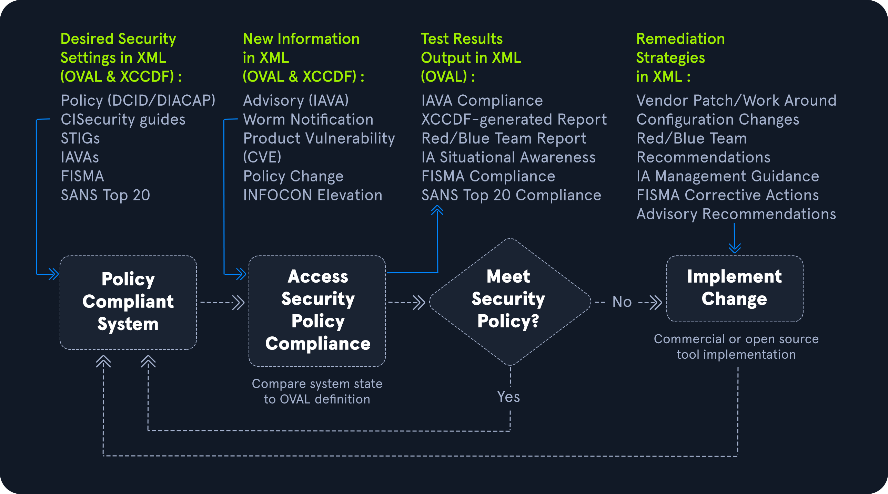
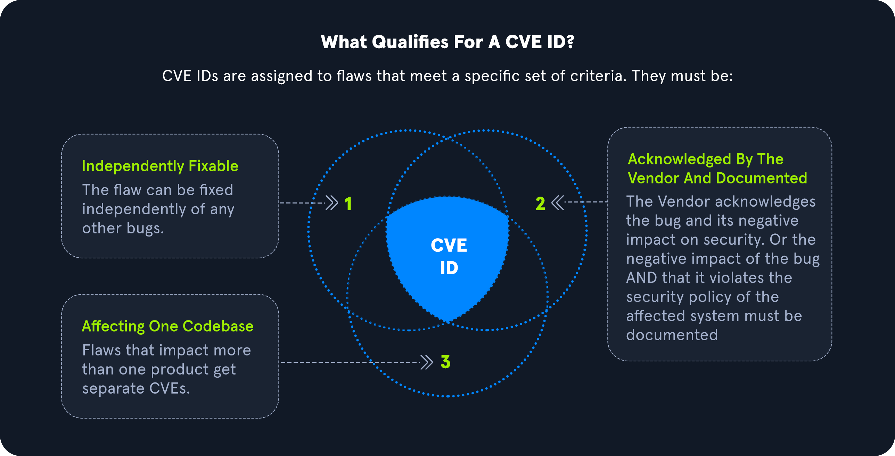

# Common Vulnerabilities and Exposures (CVE)

## Open Vulnerability Assessment Language (OVAL)

**Open Vulnerability Assessment Language (OVAL)** es un estándar internacional de seguridad de la información de acceso público, utilizado para evaluar y detallar el estado y problemas actuales de un sistema. OVAL es co-apoyado por la Oficina de Ciberseguridad y Comunicaciones del Departamento de Seguridad Nacional de los EE.UU. OVAL proporciona un lenguaje para comprender la codificación de los atributos del sistema y diversos repositorios de contenido compartidos dentro de la comunidad de seguridad. El repositorio de OVAL contiene más de 7,000 definiciones para uso público. Además, OVAL también es utilizado por el Protocolo de Automatización de Contenidos de Seguridad (SCAP) del Instituto Nacional de Estándares y Tecnología (NIST), que reúne ideas de la comunidad para automatizar la gestión de vulnerabilidades, medir y asegurar el cumplimiento de políticas de los sistemas.

**Proceso OVAL**

El objetivo del lenguaje OVAL es tener una estructura de tres pasos durante el proceso de evaluación, que consiste en:

1. Identificar las configuraciones de un sistema para su prueba.
2. Evaluar el estado actual del sistema.
3. Divulgar la información en un informe.

La información puede describirse en varios tipos de estados, incluyendo: Vulnerable, No conforme, Activo Instalado y Parcheado.

<figure><figcaption></figcaption></figure>

### **Definiciones OVAL**

Las definiciones OVAL se registran en formato XML para descubrir vulnerabilidades de software, configuraciones incorrectas, programas y otra información del sistema, eliminando la necesidad de explotar un sistema. Al poder identificar problemas sin explotar directamente el problema, una organización puede correlacionar qué sistemas necesitan ser parcheados en una red.

Las cuatro principales clases de definiciones OVAL son:

1. **Definiciones de Vulnerabilidades OVAL**: Identifican vulnerabilidades del sistema.
2. **Definiciones de Cumplimiento OVAL**: Identifican si las configuraciones actuales del sistema cumplen con los requisitos de políticas del sistema.
3. **Definiciones de Inventario OVAL**: Evalúan un sistema para verificar si un software específico está presente.
4. **Definiciones de Parche OVAL**: Identifican si un sistema tiene el parche adecuado.

Además, el formato de ID de OVAL consiste en un formato único que contiene "oval

de dominio de la organizaciónde IDde ID". El tipo de ID puede caer en varias categorías, incluidas: definición (def), objeto (obj), estado (ste) y variable (var). Un ejemplo de un identificador único sería `oval:org.mitre.oval:obj:1116`.

Escáneres como Nessus tienen la capacidad de utilizar OVAL para configurar plantillas de escaneo de cumplimiento de seguridad.

## Common Vulnerabilities and Exposures (CVE)

**Common Vulnerabilities and Exposures (CVE)** es un catálogo público de problemas de seguridad patrocinado por el Departamento de Seguridad Nacional de los Estados Unidos (DHS). Cada problema de seguridad tiene un número de identificación único de CVE asignado por la Autoridad de Numeración de CVE (CNA). El propósito de crear un número de CVE único es estandarizar una vulnerabilidad o exposición cuando un investigador la identifica. Un CVE consta de información crítica sobre una vulnerabilidad o exposición, incluyendo una descripción y referencias sobre el problema. La información en un CVE permite al equipo de TI de una organización comprender qué tan perjudicial podría ser un problema para su entorno.

<figure><figcaption></figcaption></figure>

## **Etapas para Obtener un CVE**

**Etapa 1**: Identificar si se requiere un CVE y si es relevante.

**Etapa 2**: Contactar al proveedor del producto afectado.

**Etapa 3**: Identificar si la solicitud debe ser para el CNA del proveedor o un CNA de terceros.

**Etapa 4**: Solicitud de CVE a través del formulario web de CVE.

**Etapa 5**: Confirmación del formulario de CVE.

**Etapa 6**: Recepción del ID de CVE.

**Etapa 7**: Divulgación pública del ID de CVE.

**Etapa 8**: Anuncio del CVE.

**Etapa 9**: Proporcionar información al equipo de CVE para la lista oficial.

## **Divulgación Responsable**

La divulgación responsable es esencial en la comunidad de seguridad, ya que permite que una organización o investigador trabaje directamente con un proveedor proporcionándole los detalles del problema para garantizar que un parche esté disponible antes del anuncio de la vulnerabilidad al mundo. Si un problema no se divulga de manera responsable a un proveedor, actores maliciosos pueden aprovechar los problemas para usos criminales, lo que también se conoce como día cero o "0-day".

## **Ejemplos**

* **CVE-2020-5902**: Vulnerabilidad de ejecución remota de código en la interfaz de usuario de gestión de tráfico BIG-IP (TMUI).
* **CVE-2021-34527**: Vulnerabilidad de ejecución remota de código en el servicio Windows Print Spooler, también conocida como PrintNightmare.
