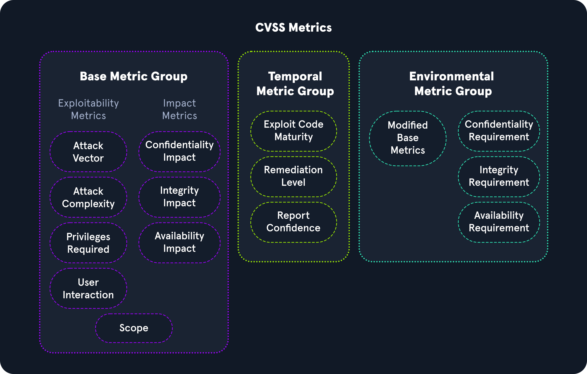
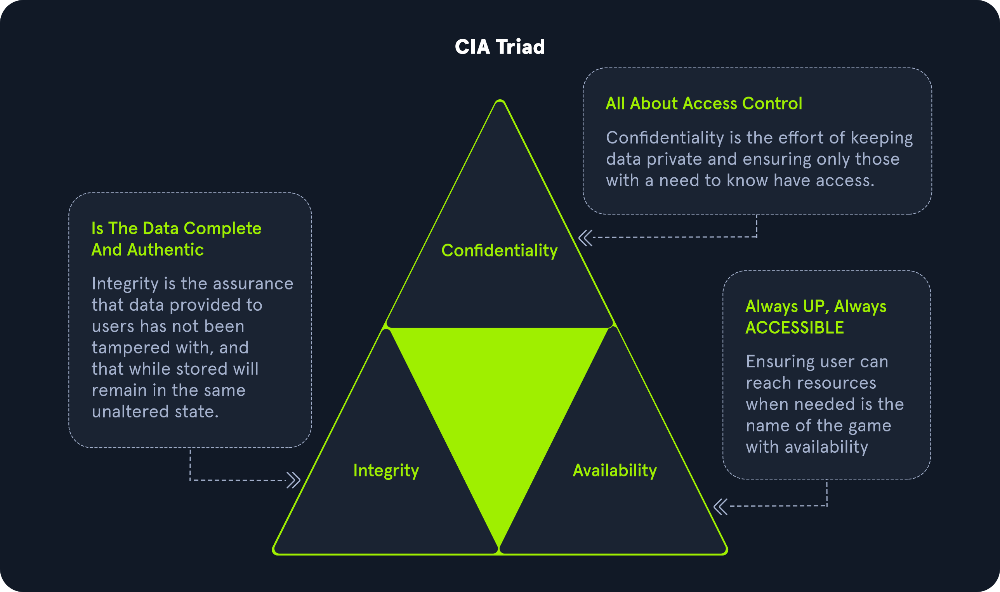

# Common Vulnerability Scoring System (CVSS)

Existen diversas formas de puntuar o calcular la gravedad de las vulnerabilidades. El **Sistema de Puntuación de Vulnerabilidades Común** (CVSS, por sus siglas en inglés) es un estándar de la industria para realizar estos cálculos. Muchas herramientas de escaneo aplican estos puntajes a cada hallazgo como parte de los resultados del escaneo, pero es importante entender cómo se derivan estos puntajes en caso de que sea necesario calcular uno manualmente o justificar el puntaje asignado a una vulnerabilidad dada. El CVSS se utiliza a menudo junto con el denominado **Microsoft DREAD**.

**DREAD** es un sistema de evaluación de riesgos desarrollado por Microsoft para ayudar a los profesionales de seguridad de TI a evaluar la gravedad de amenazas y vulnerabilidades de seguridad. Se utiliza para realizar un análisis de riesgos usando una escala de 10 puntos para evaluar la gravedad de amenazas y vulnerabilidades de seguridad, basándose en cinco factores principales:

* **Potencial de Daño**
* **Reproducibilidad**
* **Explotabilidad**
* **Usuarios Afectados**
* **Descubribilidad**

Este modelo es esencial en la estrategia de seguridad de Microsoft y se utiliza para monitorear, evaluar y responder a amenazas y vulnerabilidades en productos de Microsoft. También sirve como referencia para que los profesionales de seguridad de TI y los gerentes realicen su evaluación de riesgos y priorización de amenazas y vulnerabilidades.

## Puntuación de Riesgo

El sistema **CVSS** ayuda a categorizar el riesgo asociado con un problema y permite a las organizaciones priorizar los problemas según la calificación. La puntuación CVSS consiste en la **explotabilidad** y el **impacto** de un problema. Las mediciones de explotabilidad consisten en vector de acceso, complejidad de acceso y autenticación. Las métricas de impacto consisten en la **tríada CIA**, que incluye la **confidencialidad**, **integridad** y **disponibilidad**.

<figure><figcaption></figcaption></figure>

## **Grupo de Métricas Base**

El **grupo de métricas base** del CVSS representa las características de la vulnerabilidad y consta de métricas de explotabilidad y métricas de impacto.

### **Métricas de Explotabilidad**

Las métricas de explotabilidad son una forma de evaluar los medios técnicos necesarios para explotar el problema utilizando las siguientes métricas:

* **Vector de Ataque**
* **Complejidad del Ataque**
* **Privilegios Requeridos**
* **Interacción del Usuario**

### **Métricas de Impacto**

Las métricas de impacto representan las repercusiones de explotar con éxito un problema y lo que se ve afectado en un entorno, y se basan en la **tríada CIA** (Confidencialidad, Integridad y Disponibilidad).

<figure><figcaption></figcaption></figure>

**Tríada CIA**

* **Impacto en la Confidencialidad** se refiere a asegurar la información y garantizar que solo las personas autorizadas tengan acceso. Un valor de alta severidad sería el caso de que un atacante robe contraseñas o claves de cifrado. Un valor de baja severidad se refiere a que un atacante obtenga información que no sea un activo vital para una organización.
* **Impacto en la Integridad** se refiere a que la información no sea alterada o manipulada para mantener su exactitud. Un valor alto sería si un atacante modifica archivos de negocios cruciales en el entorno de una organización. Un valor bajo sería si un atacante no pudiera controlar específicamente el número de archivos modificados.
* **Impacto en la Disponibilidad** se refiere a que la información esté disponible cuando se requiera para los negocios. Un valor alto sería si un atacante provoca que un entorno sea completamente inaccesible. Un valor bajo sería si el atacante no pudiera negar totalmente el acceso a los activos empresariales.

## **Grupo de Métricas Temporales**

El **grupo de métricas temporales** detalla la disponibilidad de exploits o parches relacionados con el problema.

### **Madurez del Código de Explotación**

La madurez del código de explotación representa la probabilidad de que un problema sea explotado según la facilidad de las técnicas de explotación. Los valores de métrica asociados incluyen **No Definido**, **Alto**, **Funcional**, **Prueba de Concepto** y **No Probado**.

* **No Definido** indica que se omite esta métrica en particular.
* **Alto** significa que el exploit funciona consistentemente y es fácilmente identificable con herramientas automatizadas.
* **Funcional** indica que hay código de explotación disponible para el público.
* **Prueba de Concepto (PoC)** significa que existe código de explotación disponible, pero necesitaría modificaciones para que un atacante lo use con éxito.

### **Nivel de Remediación**

El nivel de remediación se utiliza para identificar la prioridad de una vulnerabilidad. Los valores incluyen **No Definido**, **No Disponible**, **Solución Alternativa**, **Solución Temporal** y **Solución Oficial**.

* **No Definido** omite esta métrica.
* **No Disponible** indica que no existe parche para la vulnerabilidad.
* **Solución Alternativa** se refiere a una solución no oficial liberada hasta que el proveedor publique un parche oficial.
* **Solución Temporal** significa que un proveedor ha proporcionado una solución temporal oficial pero aún no ha lanzado un parche.
* **Solución Oficial** indica que el proveedor ha lanzado un parche oficial para el público.

### **Confianza del Informe**

La confianza del informe representa la validación de la vulnerabilidad y qué tan precisos son los detalles técnicos del problema. Los valores incluyen **No Definido**, **Confirmado**, **Razonable** y **Desconocido**.

**Grupo de Métricas Ambientales**

El **grupo de métricas ambientales** representa la importancia de la vulnerabilidad para una organización, teniendo en cuenta la tríada CIA.

### **Métricas Base Modificadas**

Las **métricas base modificadas** permiten ajustar las métricas si la organización afectada percibe un riesgo mayor en Confidencialidad, Integridad o Disponibilidad.

**Cálculo de Severidad CVSS**

El cálculo de una puntuación CVSS v3.1 tiene en cuenta todas las métricas mencionadas. La **Base Nacional de Datos de Vulnerabilidades** tiene una calculadora pública disponible [aquí](https://nvd.nist.gov/vuln-metrics/cvss/v3-calculator).
