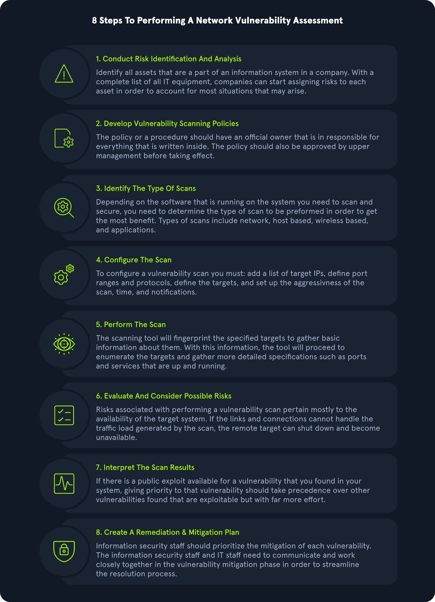
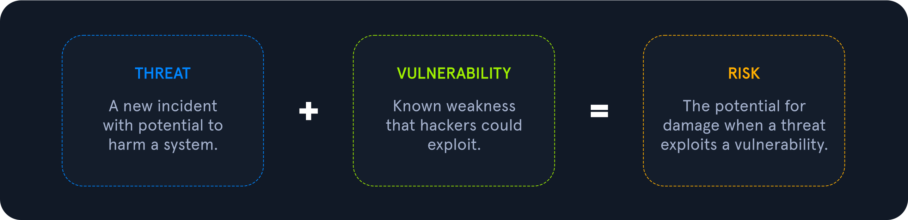
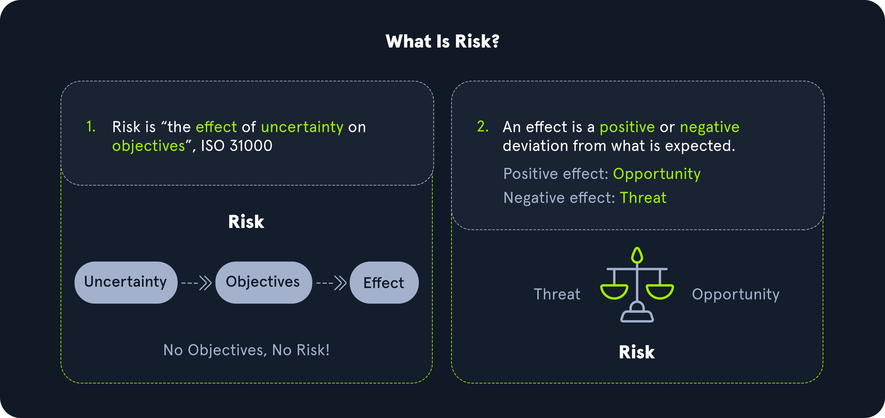
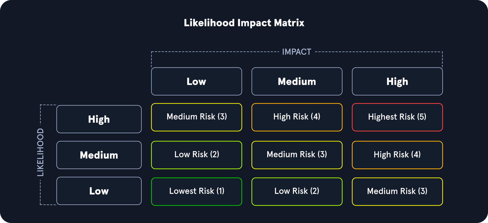

# Vulnerability Assessment

## Evaluación de Vulnerabilidades

Una Evaluación de Vulnerabilidades tiene como objetivo identificar y categorizar riesgos relacionados con debilidades de seguridad en los activos dentro de un entorno. Es importante destacar que durante una evaluación de vulnerabilidades hay poca o ninguna explotación manual. Una evaluación de vulnerabilidades también proporciona pasos de remediación para solucionar los problemas.

El propósito de una Evaluación de Vulnerabilidades es entender, identificar y categorizar el riesgo de los problemas más evidentes presentes en un entorno sin explotarlos realmente para obtener acceso adicional. Dependiendo del alcance de la evaluación, algunos clientes pueden pedirnos que validemos tantas vulnerabilidades como sea posible realizando una explotación mínimamente invasiva para confirmar los hallazgos del escáner y descartar falsos positivos. Otros clientes pedirán un informe de todos los hallazgos identificados por el escáner. Al igual que con cualquier evaluación, es esencial aclarar el alcance y la intención de la evaluación de vulnerabilidades antes de comenzar. La gestión de vulnerabilidades es vital para ayudar a las organizaciones a identificar los puntos débiles en sus activos, comprender el nivel de riesgo y calcular y priorizar los esfuerzos de remediación.

También es importante señalar que las organizaciones siempre deben probar parches importantes antes de implementarlos en su entorno para prevenir interrupciones.

## Metodología

A continuación se presenta una metodología de evaluación de vulnerabilidades que la mayoría de las organizaciones podría seguir y encontrar exitosa. Las metodologías pueden variar ligeramente de una organización a otra, pero este gráfico cubre los pasos principales, desde la identificación de activos hasta la creación de un plan de remediación.

<figure><figcaption></figcaption></figure>

## Entendiendo Términos Clave

Antes de continuar, identifiquemos algunos términos clave que cualquier profesional de TI o de ciberseguridad debe entender y poder explicar claramente.

### Vulnerabilidad

Una **Vulnerabilidad** es una debilidad o error en el entorno de una organización, incluidos aplicaciones, redes e infraestructura, que abre la posibilidad de amenazas de actores externos. Las vulnerabilidades pueden registrarse a través de la base de datos Common Vulnerability Exposure (CVE) de MITRE y recibir una puntuación del Common Vulnerability Scoring System (CVSS) para determinar su severidad. Este sistema de puntuación se utiliza frecuentemente como un estándar para empresas y gobiernos que buscan calcular puntuaciones de severidad precisas y consistentes para las vulnerabilidades de sus sistemas. Puntuar las vulnerabilidades de esta manera ayuda a priorizar recursos y determinar cómo responder a una amenaza determinada. Las puntuaciones se calculan utilizando métricas como el tipo de vector de ataque (red, adyacente, local, físico), la complejidad del ataque, los privilegios requeridos, si el ataque requiere o no interacción del usuario y el impacto de la explotación exitosa en la confidencialidad, integridad y disponibilidad de los datos de una organización. Las puntuaciones pueden variar de 0 a 10, dependiendo de estas métricas.

<figure><figcaption></figcaption></figure>

### Amenaza + Vulnerabilidad = Riesgo

Por ejemplo, una inyección de SQL se considera una vulnerabilidad ya que un atacante podría utilizar consultas para extraer datos de la base de datos de una organización. Este ataque tendría una puntuación CVSS más alta si se pudiera realizar sin autenticación a través de Internet que si un atacante necesitara acceso autenticado a la red interna y una autenticación separada para la aplicación objetivo. Estos factores deben ser considerados para todas las vulnerabilidades que encontramos.

#### Amenaza

Una **Amenaza** es un proceso que amplifica la posibilidad de un evento adverso, como un actor de amenazas explotando una vulnerabilidad. Algunas vulnerabilidades plantean más preocupaciones de amenazas que otras debido a la probabilidad de que la vulnerabilidad sea explotada. Por ejemplo, cuanto mayor sea la recompensa del resultado y la facilidad de explotación, más probable es que el problema sea explotado por los actores de amenazas.

#### Explotación

Una **Explotación** es cualquier código o recurso que puede ser utilizado para aprovechar una debilidad en un activo. Muchas explotaciones están disponibles a través de plataformas de código abierto como Exploit-db o la Base de Datos de Vulnerabilidades y Explotaciones de Rapid7. A menudo también veremos código de explotación alojado en sitios como GitHub y GitLab.

#### Riesgo

El **Riesgo** es la posibilidad de que los activos o datos sean dañados o destruidos por actores de amenazas.

<figure><figcaption></figcaption></figure>

Para diferenciar los tres, podemos pensarlo de la siguiente manera:

* **Riesgo:** algo malo que podría pasar
* **Amenaza:** algo malo que está sucediendo
* **Vulnerabilidades:** debilidades que podrían llevar a una amenaza

Las Vulnerabilidades, Amenazas y Explotaciones juegan un papel en medir el nivel de riesgo en las debilidades al determinar la probabilidad y el impacto. Por ejemplo, las vulnerabilidades que tienen código de explotación confiable y son propensas a ser utilizadas para obtener acceso a la red de una organización elevarían significativamente el riesgo de un problema debido al impacto. Si un atacante tuviera acceso a la red interna, podría potencialmente ver, editar o eliminar documentos sensibles cruciales para las operaciones comerciales. Podemos usar una matriz de riesgo cualitativa para medir el riesgo en función de la probabilidad y el impacto con la tabla que se muestra a continuación.

En este ejemplo, podemos ver que una vulnerabilidad con una baja probabilidad de ocurrir y un impacto bajo sería el nivel de riesgo más bajo, mientras que una vulnerabilidad con alta probabilidad de ser explotada y el mayor impacto en una organización representaría el mayor riesgo y debería ser priorizada para remediación.

<figure><figcaption></figcaption></figure>

## Gestión de Activos

Cuando una organización de cualquier tipo, en cualquier industria y de cualquier tamaño necesita planificar su estrategia de ciberseguridad, debe comenzar creando un inventario de sus activos de datos. ¡Si quieres proteger algo, primero debes saber qué estás protegiendo! Una vez que se han inventariado los activos, se puede comenzar el proceso de gestión de activos. Este es un concepto clave en la seguridad defensiva.

### Inventario de Activos

El inventario de activos es un componente crítico de la gestión de vulnerabilidades. Una organización necesita entender qué activos están en su red para proporcionar la protección adecuada y establecer defensas apropiadas. El inventario de activos debe incluir activos de tecnología de la información, tecnología operativa, físicos, software, móviles y de desarrollo. Las organizaciones pueden utilizar herramientas de gestión de activos para realizar un seguimiento de los activos. Los activos deben tener clasificaciones de datos para garantizar una seguridad adecuada y controles de acceso.

### Inventario de Aplicaciones y Sistemas

Una organización debe crear un inventario completo y detallado de los activos de datos para una adecuada gestión de activos en la seguridad defensiva. Los activos de datos incluyen:

* **Todos los datos almacenados en las instalaciones:** HDDs y SSDs en endpoints (PCs y dispositivos móviles), HDDs y SSDs en servidores, unidades externas en la red local, medios ópticos (DVDs, discos Blu-ray, CDs), medios flash (memorias USB, tarjetas SD). La tecnología heredada puede incluir disquetes, unidades ZIP (un relicario de los años 90) y unidades de cinta.
* **Todos los datos almacenados por su proveedor de servicios en la nube:** Amazon Web Services (AWS), Google Cloud Platform (GCP) y Microsoft Azure son algunos de los proveedores de nube más populares, pero hay muchos más. A veces, las redes corporativas son "multi-nube", lo que significa que tienen más de un proveedor de nube. El proveedor de nube de una empresa proporcionará herramientas que se pueden usar para inventariar todos los datos almacenados por ese proveedor de nube en particular.
* **Todos los datos almacenados dentro de diversas aplicaciones Software-as-a-Service (SaaS):** Estos datos también están "en la nube" pero podrían no estar todos dentro del alcance de una cuenta de proveedor de nube corporativo. Estos son a menudo servicios para consumidores o la versión "empresarial" de esos servicios. Piensa en servicios en línea como Google Drive, Dropbox, Microsoft Teams, Apple iCloud, Adobe Creative Suite, Microsoft Office 365, Google Docs, y la lista sigue.
* **Todas las aplicaciones que una empresa necesita usar para llevar a cabo su operación y negocio:** Incluyendo aplicaciones que se despliegan localmente y aplicaciones que se despliegan a través de la nube o son de otro modo Software-as-a-Service.
* **Todos los dispositivos de red de computadoras en las instalaciones de una empresa:** Estos incluyen, pero no se limitan a, routers, firewalls, hubs, switches, sistemas de detección y prevención de intrusiones (IDS/IPS), sistemas de prevención de pérdida de datos (DLP), etc.

Todos estos activos son muy importantes. Un actor de amenazas o cualquier otro tipo de riesgo para cualquiera de estos activos puede causar un daño significativo a la seguridad de la información de una empresa y su capacidad para operar día a día. Una organización necesita tomarse el tiempo para evaluar todo y tener cuidado de no perderse ni un solo activo de datos, o no podrá protegerlo.

Las organizaciones frecuentemente agregan o eliminan computadoras, almacenamiento de datos, capacidad de servidores en la nube u otros activos de datos. Siempre que se agreguen o eliminen activos de datos, esto debe ser anotado exhaustivamente en el inventario de activos de datos.
