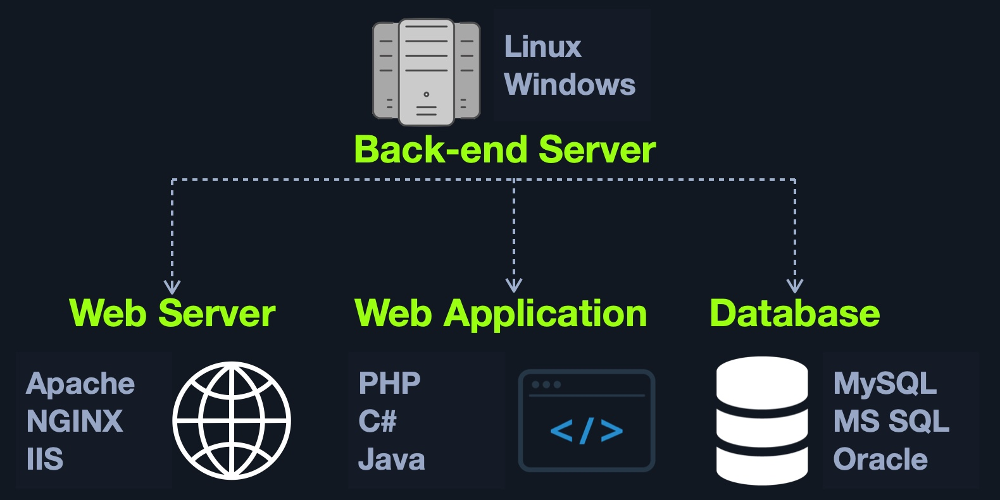
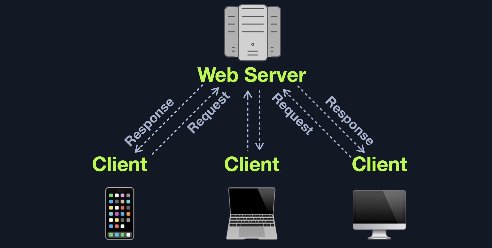

# Introduction to Web Applications

<figure><figcaption></figcaption></figure>

Primero se comienza revisando la parte frontal como HTML, CSS y JavaScript por si hay exposición de datos sensibles o XSS. Tras esto, se revisa la funcionalidad de la aplicación web y la interacción entre el navegador y el servidor web.&#x20;

#### Preguntas (HTML)

What is the HTML tag used to show an image?

```

```

#### Preguntas (CSS)

**What is the CSS "property: value" used to make an HTML element's text aligned to the left?**

```
text-align: left;
```

## Vulnerabilidades en el Front End

* Sensistive Data Exposure
* HTML Injection
* Cross-Site Scripting (XSS)
* Cross-Site Request Forgery&#x20;

#### Preguntas (Sensitive Data Exposure)

**Check the above login form for exposed passwords. Submit the password as the answer.**

Al ver el código fuente nos encontramos las credenciales.

<figure><figcaption></figcaption></figure>

#### Preguntas (HTML Injection)

**What text would be displayed on the page if we use the following payload as our input:** [**Click Me**](http://www.hackthebox.com)

Hay que poner el input que nos dicen y ese es el resultado.

### XSS

| Tipo            | Descripción                                                                                                                                                                     |
| --------------- | ------------------------------------------------------------------------------------------------------------------------------------------------------------------------------- |
| `Reflected XSS` | Ocurre cuando la entrada del usuario se muestra en la página después del procesamiento (por ejemplo, resultado de búsqueda o mensaje de error).                                 |
| `Stored XSS`    | Ocurre cuando la entrada del usuario se almacena en la base de datos trasera y luego se muestra en recuperación (por ejemplo, publicaciones o comentarios).                     |
| `DOM XSS`       | Ocurre cuando la entrada del usuario se muestra directamente en el navegador y se escribe a un `HTML`Objeto DOM (por ejemplo, nombre de usuario vulnerable o título de página). |

#### Preguntas (XSS)

Try to use XSS to get the cookie value in the above page

En el input ponemos esto:&#x20;

```
#">
```

## Backend

<figure><figcaption></figcaption></figure>

#### Preguntas

**What operating system is 'WAMP' used with?**

Windows

### Web Servers

<figure><figcaption></figcaption></figure>

| Código                               | Descripción                                                                                                                                           |
| ------------------------------------ | ----------------------------------------------------------------------------------------------------------------------------------------------------- |
| **Respuestas exitosas**              |                                                                                                                                                       |
| `200 OK`                             | La petición ha tenido éxito                                                                                                                           |
| **Mensajes de redireccionar**        |                                                                                                                                                       |
| `301 Moved Permanently`              | La URL del recurso solicitado ha sido cambiada permanentemente                                                                                        |
| `302 Found`                          | La URL del recurso solicitado se ha modificado temporalmente                                                                                          |
| **Respuestas de error del cliente**  |                                                                                                                                                       |
| `400 Bad Request`                    | El servidor no pudo entender la solicitud debido a la sintaxis inválida                                                                               |
| `401 Unauthorized`                   | Intento de acceso a página noautizado                                                                                                                 |
| `403 Forbidden`                      | El cliente no tiene derechos de acceso al contenido                                                                                                   |
| `404 Not Found`                      | El servidor no puede encontrar el recurso solicitado                                                                                                  |
| `405 Method Not Allowed`             | El método de solicitud es conocido por el servidor, pero ha sido desactivado y no se puede utilizar                                                   |
| `408 Request Timeout`                | Esta respuesta es enviada en una conexión ociosa por algunos servidores, incluso sin ninguna solicitud previa del cliente                             |
| **Respuestas de error del servidor** |                                                                                                                                                       |
| `500 Internal Server Error`          | El servidor se ha encontrado con una situación que no sabe cómo manejar                                                                               |
| `502 Bad Gateway`                    | El servidor, mientras trabajaba como puerta de entrada para obtener una respuesta necesaria para manejar la solicitud, recibió una respuesta inválida |
| `504 Gateway Timeout`                | El servidor está actuando como una puerta de entrada y no puede obtener una respuesta a tiempo                                                        |

#### Preguntas

**If a web server returns an HTTP code 201, what does it stand for?**

Created

### Database

#### Preguntas

**What type of database is Google's Firebase Database?**

NoSQL

### Development Frameworks & APIs

#### Preguntas

**Use GET request '/index.php?id=0' to search for the name of the user with id number 1?**

```
curl -X GET http://94.237.49.23:57656/index.php?id=1 -i
```

## Vulnerabilidades en el Back End

* Broken Authentication/ Access Control
* Malicious File Upload
* Command Injection
* SQL Injection

#### Preguntas

**To which of the above categories does public vulnerability 'CVE-2014-6271' belongs to?**

Command Injection

### Vulnerabilidades públicas

* Publicar CVE
* CVSS

#### Preguntas

**What is the CVSS v2.0 score of the public vulnerability CVE-2017-0144?**


