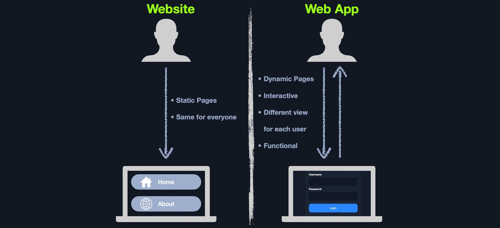

# Introduction to Web Applications

<figure><figcaption></figcaption></figure>

Primero se comienza revisando la parte frontal como HTML, CSS y JavaScript por si hay exposición de datos sensibles o XSS. Tras esto, se revisa la funcionalidad de la aplicación web y la interacción entre el navegador y el servidor web.&#x20;
